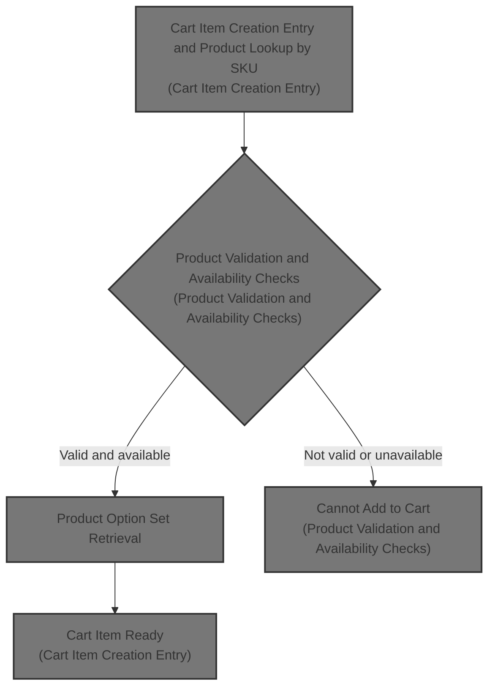
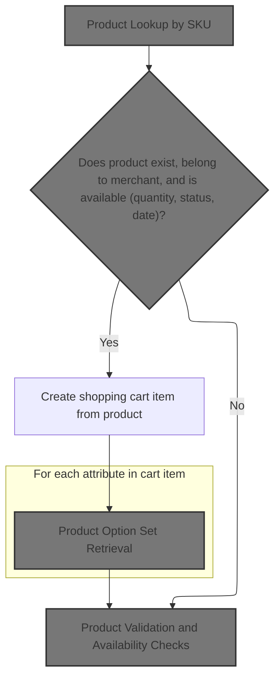
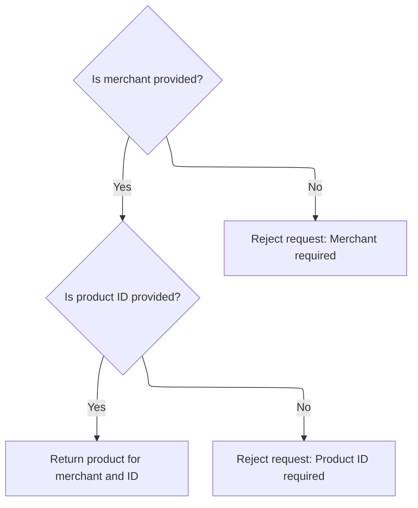
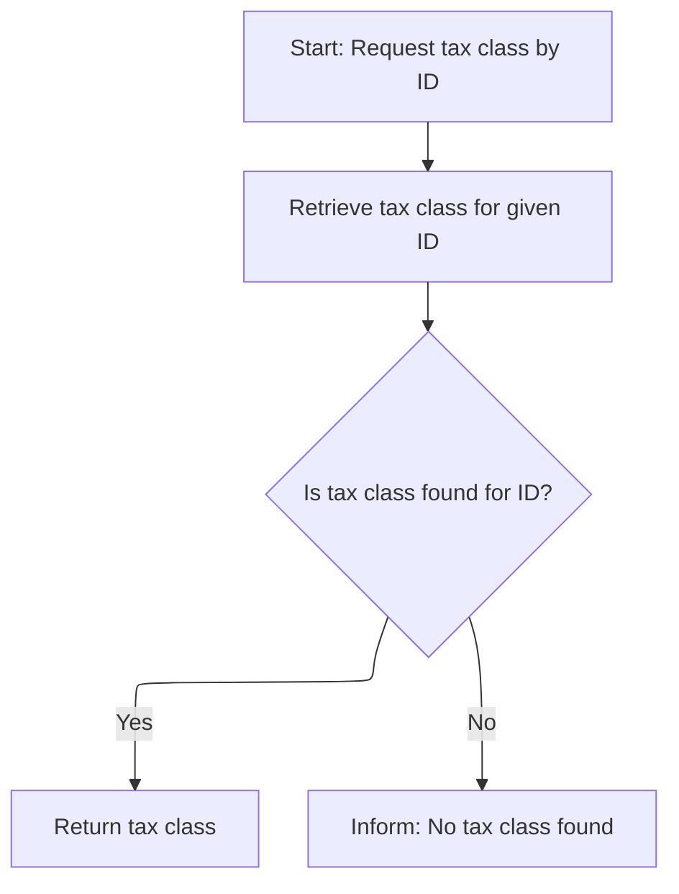
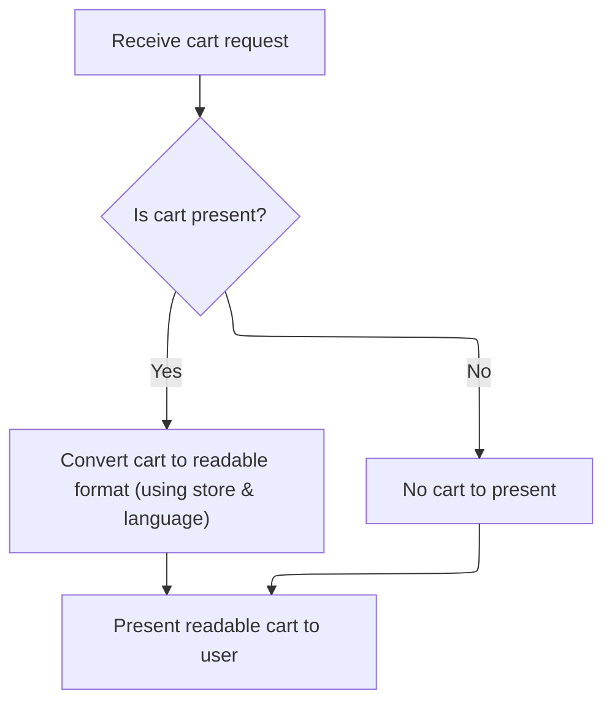
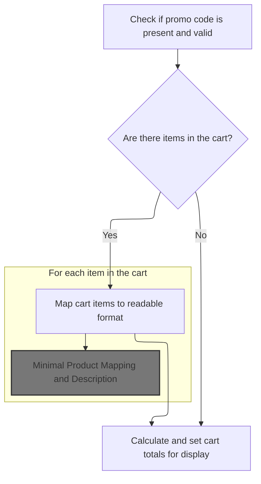

This document describes how a user adds a product with selected options to their shopping cart. The process ensures that only valid and available products, with the correct merchant association and selected options, are added to the cart. The resulting cart item is prepared for further actions such as checkout or display.



# Where is this flow used?

This flow is used multiple times in the codebase as represented in the following diagram:

```mermaid
graph TD;
      8b2433ba72f6c9151ac72e8e6a08de4b5d1f45db9231820e7c4d97a57dc44e71(sm-shop/…/facade/ShoppingCartFacadeImpl.java::ShoppingCartFacadeImpl.addItemsToShoppingCart) --> bb1522f0cd6488157b5935c7c53d3b64026a6ecde2bcac8a594d8e19e4297eae(sm-shop/…/facade/ShoppingCartFacadeImpl.java::ShoppingCartFacadeImpl.createCartItem)

06ae2a99b0020c30954193c35090c5e1dce5ed783e06e1cf4f2b650cbc8bfb90(sm-shop/…/facade/ShoppingCartFacadeImpl.java::ShoppingCartFacadeImpl.readableShoppingCart) --> bb1522f0cd6488157b5935c7c53d3b64026a6ecde2bcac8a594d8e19e4297eae(sm-shop/…/facade/ShoppingCartFacadeImpl.java::ShoppingCartFacadeImpl.createCartItem)

c0a99e606e09d952469eec1b4d687e4a7ab5eb8c82c335146cb683c826867f53(sm-shop/…/facade/ShoppingCartFacadeImpl.java::ShoppingCartFacadeImpl.addToCart) --> 06ae2a99b0020c30954193c35090c5e1dce5ed783e06e1cf4f2b650cbc8bfb90(sm-shop/…/facade/ShoppingCartFacadeImpl.java::ShoppingCartFacadeImpl.readableShoppingCart)

c0a99e606e09d952469eec1b4d687e4a7ab5eb8c82c335146cb683c826867f53(sm-shop/…/facade/ShoppingCartFacadeImpl.java::ShoppingCartFacadeImpl.addToCart) --> 06ae2a99b0020c30954193c35090c5e1dce5ed783e06e1cf4f2b650cbc8bfb90(sm-shop/…/facade/ShoppingCartFacadeImpl.java::ShoppingCartFacadeImpl.readableShoppingCart)

e32503b6e7c693595a936f26672548efd7a047a2cd6d0b0bf89a8e43eada6e15(sm-shop/…/facade/ShoppingCartFacadeImpl.java::ShoppingCartFacadeImpl.modifyCart) --> bb1522f0cd6488157b5935c7c53d3b64026a6ecde2bcac8a594d8e19e4297eae(sm-shop/…/facade/ShoppingCartFacadeImpl.java::ShoppingCartFacadeImpl.createCartItem)


classDef mainFlowStyle color:#000000,fill:#7CB9F4
classDef rootsStyle color:#000000,fill:#00FFF4
classDef Style1 color:#000000,fill:#00FFAA
classDef Style2 color:#000000,fill:#FFFF00
classDef Style3 color:#000000,fill:#AA7CB9

%% Swimm:
%% graph TD;
%%       8b2433ba72f6c9151ac72e8e6a08de4b5d1f45db9231820e7c4d97a57dc44e71(<SwmPath>[sm-shop/…/facade/ShoppingCartFacadeImpl.java](sm-shop/src/main/java/com/salesmanager/shop/store/controller/shoppingCart/facade/ShoppingCartFacadeImpl.java)</SwmPath>::ShoppingCartFacadeImpl.addItemsToShoppingCart) --> bb1522f0cd6488157b5935c7c53d3b64026a6ecde2bcac8a594d8e19e4297eae(<SwmPath>[sm-shop/…/facade/ShoppingCartFacadeImpl.java](sm-shop/src/main/java/com/salesmanager/shop/store/controller/shoppingCart/facade/ShoppingCartFacadeImpl.java)</SwmPath>::ShoppingCartFacadeImpl.createCartItem)
%% 
%% 06ae2a99b0020c30954193c35090c5e1dce5ed783e06e1cf4f2b650cbc8bfb90(<SwmPath>[sm-shop/…/facade/ShoppingCartFacadeImpl.java](sm-shop/src/main/java/com/salesmanager/shop/store/controller/shoppingCart/facade/ShoppingCartFacadeImpl.java)</SwmPath>::ShoppingCartFacadeImpl.readableShoppingCart) --> bb1522f0cd6488157b5935c7c53d3b64026a6ecde2bcac8a594d8e19e4297eae(<SwmPath>[sm-shop/…/facade/ShoppingCartFacadeImpl.java](sm-shop/src/main/java/com/salesmanager/shop/store/controller/shoppingCart/facade/ShoppingCartFacadeImpl.java)</SwmPath>::ShoppingCartFacadeImpl.createCartItem)
%% 
%% c0a99e606e09d952469eec1b4d687e4a7ab5eb8c82c335146cb683c826867f53(<SwmPath>[sm-shop/…/facade/ShoppingCartFacadeImpl.java](sm-shop/src/main/java/com/salesmanager/shop/store/controller/shoppingCart/facade/ShoppingCartFacadeImpl.java)</SwmPath>::ShoppingCartFacadeImpl.addToCart) --> 06ae2a99b0020c30954193c35090c5e1dce5ed783e06e1cf4f2b650cbc8bfb90(<SwmPath>[sm-shop/…/facade/ShoppingCartFacadeImpl.java](sm-shop/src/main/java/com/salesmanager/shop/store/controller/shoppingCart/facade/ShoppingCartFacadeImpl.java)</SwmPath>::ShoppingCartFacadeImpl.readableShoppingCart)
%% 
%% c0a99e606e09d952469eec1b4d687e4a7ab5eb8c82c335146cb683c826867f53(<SwmPath>[sm-shop/…/facade/ShoppingCartFacadeImpl.java](sm-shop/src/main/java/com/salesmanager/shop/store/controller/shoppingCart/facade/ShoppingCartFacadeImpl.java)</SwmPath>::ShoppingCartFacadeImpl.addToCart) --> 06ae2a99b0020c30954193c35090c5e1dce5ed783e06e1cf4f2b650cbc8bfb90(<SwmPath>[sm-shop/…/facade/ShoppingCartFacadeImpl.java](sm-shop/src/main/java/com/salesmanager/shop/store/controller/shoppingCart/facade/ShoppingCartFacadeImpl.java)</SwmPath>::ShoppingCartFacadeImpl.readableShoppingCart)
%% 
%% e32503b6e7c693595a936f26672548efd7a047a2cd6d0b0bf89a8e43eada6e15(<SwmPath>[sm-shop/…/facade/ShoppingCartFacadeImpl.java](sm-shop/src/main/java/com/salesmanager/shop/store/controller/shoppingCart/facade/ShoppingCartFacadeImpl.java)</SwmPath>::ShoppingCartFacadeImpl.modifyCart) --> bb1522f0cd6488157b5935c7c53d3b64026a6ecde2bcac8a594d8e19e4297eae(<SwmPath>[sm-shop/…/facade/ShoppingCartFacadeImpl.java](sm-shop/src/main/java/com/salesmanager/shop/store/controller/shoppingCart/facade/ShoppingCartFacadeImpl.java)</SwmPath>::ShoppingCartFacadeImpl.createCartItem)
%% 
%% 
%% classDef mainFlowStyle color:#000000,fill:#7CB9F4
%% classDef rootsStyle color:#000000,fill:#00FFF4
%% classDef Style1 color:#000000,fill:#00FFAA
%% classDef Style2 color:#000000,fill:#FFFF00
%% classDef Style3 color:#000000,fill:#AA7CB9
```



# Cart Item Creation Entry



This section governs the business rules for creating a cart item when a user attempts to add a product to their shopping cart. It ensures that only valid, available products associated with the correct merchant can be added, and that all necessary product details are retrieved for the cart item.

| Category        | Rule Name                          | Description                                                                                                                                                                                                |
| --------------- | ---------------------------------- | ---------------------------------------------------------------------------------------------------------------------------------------------------------------------------------------------------------- |
| Data validation | Product Existence and Availability | A product can only be added to the cart if it exists in the catalog, is associated with the requesting merchant, and is currently available for sale (based on quantity, status, and date).                |
| Business logic  | Cart Item Creation from Product    | When a valid product is found, a shopping cart item must be created using the product's details, ensuring that all relevant product information is included in the cart item.                              |
| Business logic  | Product Option Set Association     | For each attribute or option set associated with the product (such as size or color), the system must retrieve and associate these options with the cart item to ensure correct configuration and pricing. |

<SwmSnippet path="/sm-shop/src/main/java/com/salesmanager/shop/store/controller/shoppingCart/facade/ShoppingCartFacadeImpl.java" line="189">

---

In <SwmToken path="sm-shop/src/main/java/com/salesmanager/shop/store/controller/shoppingCart/facade/ShoppingCartFacadeImpl.java" pos="189:15:15" line-data="	private com.salesmanager.core.model.shoppingcart.ShoppingCartItem createCartItem(final ShoppingCart cartModel,">`createCartItem`</SwmToken>, we start by fetching the product using its SKU, merchant, and language. This is the entry point for adding an item to the cart, and we need the product details to proceed. That's why the next step is calling <SwmToken path="sm-core/src/main/java/com/salesmanager/core/business/services/catalog/product/ProductServiceImpl.java" pos="53:4:4" line-data="public class ProductServiceImpl extends SalesManagerEntityServiceImpl&lt;Long, Product&gt; implements ProductService {">`ProductServiceImpl`</SwmToken> to get the full product object, which everything else depends on.

```java
	private com.salesmanager.core.model.shoppingcart.ShoppingCartItem createCartItem(final ShoppingCart cartModel,
			final ShoppingCartItem shoppingCartItem, final MerchantStore store) throws Exception {

		Product product = productService.getBySku(shoppingCartItem.getSku(), store, store.getDefaultLanguage());

```

---

</SwmSnippet>

## Product Lookup by SKU

This section governs the business rules for looking up a product by its SKU for a specific merchant and language. The main product role is to ensure that a valid product is returned for a given SKU, or to provide a clear error if the product does not exist.

| Category       | Rule Name                           | Description                                                                                                                                                        |
| -------------- | ----------------------------------- | ------------------------------------------------------------------------------------------------------------------------------------------------------------------ |
| Business logic | Merchant-specific SKU lookup        | A product lookup by SKU must only return a product that belongs to the specified merchant. If the SKU exists for another merchant, it must not be returned.        |
| Business logic | Language-specific product retrieval | The product returned for a SKU lookup must be localized to the specified language, ensuring that product information is presented in the correct language context. |
| Business logic | First-match SKU resolution          | If multiple products are found for the same SKU and merchant, only the first product found is returned.                                                            |

<SwmSnippet path="/sm-core/src/main/java/com/salesmanager/core/business/services/catalog/product/ProductServiceImpl.java" line="374">

---

<SwmToken path="sm-core/src/main/java/com/salesmanager/core/business/services/catalog/product/ProductServiceImpl.java" pos="374:5:5" line-data="	public Product getBySku(String productCode, MerchantStore merchant, Language language) throws ServiceException {">`getBySku`</SwmToken> does a two-step fetch: first it gets product IDs by SKU and merchant, then fetches the actual Product object using the first ID. This is because the repository doesn't return the product directly. After this, we need to get product option sets for attribute handling, so we call <SwmToken path="sm-core/src/main/java/com/salesmanager/core/business/services/catalog/product/attribute/ProductOptionSetServiceImpl.java" pos="17:4:4" line-data="public class ProductOptionSetServiceImpl extends">`ProductOptionSetServiceImpl`</SwmToken> next.

```java
	public Product getBySku(String productCode, MerchantStore merchant, Language language) throws ServiceException {

		try {
			List<Object> products = productRepository.findBySku(productCode, merchant.getId());
			if(products.isEmpty()) {
				throw new ServiceException("Cannot get product with sku [" + productCode + "]");
			}
			BigInteger id = (BigInteger) products.get(0);
			return productRepository.getById(id.longValue(), merchant, language);
		} catch (Exception e) {
			throw new ServiceException("Cannot get product with sku [" + productCode + "]", e);
		}
		


	}
```

---

</SwmSnippet>

## Product Option Set Retrieval

This section governs the retrieval of a product option set for a specific store and language, ensuring that the correct attribute options are available for cart items and subsequent product validation steps. The main product role is to provide accurate and localized product option data for downstream processes such as cart population and validation.

| Category        | Rule Name                   | Description                                                                                                                             |
| --------------- | --------------------------- | --------------------------------------------------------------------------------------------------------------------------------------- |
| Data validation | Valid Option Set Retrieval  | A product option set must be retrieved only if the provided store ID, option set ID, and language ID are valid and exist in the system. |
| Business logic  | Localized Attribute Options | The retrieved product option set must contain attribute options that are localized according to the specified language.                 |
| Business logic  | Option Set Compatibility    | The product option set retrieved must be compatible with the product details required for cart item population and validation.          |

<SwmSnippet path="/sm-core/src/main/java/com/salesmanager/core/business/services/catalog/product/attribute/ProductOptionSetServiceImpl.java" line="39">

---

<SwmToken path="sm-core/src/main/java/com/salesmanager/core/business/services/catalog/product/attribute/ProductOptionSetServiceImpl.java" pos="39:5:5" line-data="	public ProductOptionSet getById(MerchantStore store, Long optionSetId, Language lang) {">`getById`</SwmToken> fetches the product option set for the given store, option set ID, and language. This is needed to get the correct attribute options for the cart item. Next, we call <SwmToken path="sm-core/src/main/java/com/salesmanager/core/business/services/catalog/product/ProductServiceImpl.java" pos="53:4:4" line-data="public class ProductServiceImpl extends SalesManagerEntityServiceImpl&lt;Long, Product&gt; implements ProductService {">`ProductServiceImpl`</SwmToken> again to fetch product details for further validation or population steps that depend on both product and option set data.

```java
	public ProductOptionSet getById(MerchantStore store, Long optionSetId, Language lang) {
		return productOptionSetRepository.findOne(store.getId(), optionSetId, lang.getId());
	}
```

---

</SwmSnippet>

## Product and Option Value Fetch



This section governs how products and their option values are fetched for a given merchant, ensuring that all necessary identifiers are provided and valid before returning product data for further use in cart and display operations.

| Category        | Rule Name                  | Description                                                                                                                                                                                     |
| --------------- | -------------------------- | ----------------------------------------------------------------------------------------------------------------------------------------------------------------------------------------------- |
| Data validation | Merchant Required          | A merchant must be provided in every product fetch request. If not provided, the request is rejected with a message indicating that the merchant is required.                                   |
| Data validation | Product ID Required        | A product ID must be provided in every product fetch request. If not provided, the request is rejected with a message indicating that the product ID is required.                               |
| Data validation | Option Value ID Required   | An option value ID must be provided to fetch a product option value for a given store. If not provided, the request is rejected with a message indicating that the option value ID is required. |
| Business logic  | Product Fetch Success      | If both merchant and product ID are provided, the system returns the product associated with the given merchant and product ID.                                                                 |
| Business logic  | Option Value Fetch Success | If both store and option value ID are provided, the system returns the product option value associated with the given store and option value ID.                                                |

<SwmSnippet path="/sm-core/src/main/java/com/salesmanager/core/business/services/catalog/product/ProductServiceImpl.java" line="339">

---

<SwmToken path="sm-core/src/main/java/com/salesmanager/core/business/services/catalog/product/ProductServiceImpl.java" pos="339:5:5" line-data="	public Product findOne(Long id, MerchantStore merchant) {">`findOne`</SwmToken> checks the merchant and product ID, then fetches the product. Next, we call <SwmToken path="sm-core/src/main/java/com/salesmanager/core/business/services/catalog/product/attribute/ProductOptionValueServiceImpl.java" pos="24:4:4" line-data="public class ProductOptionValueServiceImpl extends">`ProductOptionValueServiceImpl`</SwmToken> to get the option value, which is needed for cart item attribute mapping and display.

```java
	public Product findOne(Long id, MerchantStore merchant) {
		Validate.notNull(merchant, "MerchantStore must not be null");
		Validate.notNull(id, "id must not be null");
		return productRepository.getById(id, merchant);
	}
```

---

</SwmSnippet>

<SwmSnippet path="/sm-core/src/main/java/com/salesmanager/core/business/services/catalog/product/attribute/ProductOptionValueServiceImpl.java" line="109">

---

<SwmToken path="sm-core/src/main/java/com/salesmanager/core/business/services/catalog/product/attribute/ProductOptionValueServiceImpl.java" pos="109:5:5" line-data="	public ProductOptionValue getById(MerchantStore store, Long optionValueId) {">`getById`</SwmToken> fetches the option value for the store and option value ID. This is needed to map product attributes correctly. Next, we may need to call <SwmToken path="sm-core/src/main/java/com/salesmanager/core/business/services/catalog/product/ProductServiceImpl.java" pos="53:4:4" line-data="public class ProductServiceImpl extends SalesManagerEntityServiceImpl&lt;Long, Product&gt; implements ProductService {">`ProductServiceImpl`</SwmToken> again for additional product data if required for cart item population or validation steps.

```java
	public ProductOptionValue getById(MerchantStore store, Long optionValueId) {
		return productOptionValueRepository.findOne(store.getId(), optionValueId);
	}
```

---

</SwmSnippet>

## Product Validation and Availability Checks

```mermaid
%%{init: {"flowchart": {"defaultRenderer": "elk"}} }%%
flowchart TD
  node1{"Is product found?"}
  click node1 openCode "sm-shop/src/main/java/com/salesmanager/shop/store/controller/shoppingCart/facade/ShoppingCartFacadeImpl.java:194:196"
  node1 -->|"Yes"| node2{"Does product belong to merchant store?"}
  click node2 openCode "sm-shop/src/main/java/com/salesmanager/shop/store/controller/shoppingCart/facade/ShoppingCartFacadeImpl.java:198:201"
  node2 -->|"Yes"| node3{"Does product have availabilities?"}
  click node3 openCode "sm-shop/src/main/java/com/salesmanager/shop/store/controller/shoppingCart/facade/ShoppingCartFacadeImpl.java:208:213"
  node3 -->|"Yes"| loop1
  subgraph loop1["For each product availability"]
    node4{"Is quantity > 0?"}
    click node4 openCode "sm-shop/src/main/java/com/salesmanager/shop/store/controller/shoppingCart/facade/ShoppingCartFacadeImpl.java:215:219"
    node4 -->|"Yes"| node5["Check next availability"]
    node4 -->|"No"| node12["Stop: Not available"]
    click node12 openCode "sm-shop/src/main/java/com/salesmanager/shop/store/controller/shoppingCart/facade/ShoppingCartFacadeImpl.java:217:218"
    node5 --> node4
  end
  loop1 --> node6{"Is product marked as available?"}
  click node6 openCode "sm-shop/src/main/java/com/salesmanager/shop/store/controller/shoppingCart/facade/ShoppingCartFacadeImpl.java:221:223"
  node6 -->|"Yes"| node7{"Is available date today or earlier?"}
  click node7 openCode "sm-shop/src/main/java/com/salesmanager/shop/store/controller/shoppingCart/facade/ShoppingCartFacadeImpl.java:225:227"
  node7 -->|"Yes"| node8["Create shopping cart item"]
  click node8 openCode "sm-shop/src/main/java/com/salesmanager/shop/store/controller/shoppingCart/facade/ShoppingCartFacadeImpl.java:229:234"
  node8 --> node9{"Does cart item have attributes?"}
  click node9 openCode "sm-shop/src/main/java/com/salesmanager/shop/store/controller/shoppingCart/facade/ShoppingCartFacadeImpl.java:236:237"
  node9 -->|"Yes"| loop2
  subgraph loop2["For each cart attribute"]
    node10{"Is attribute valid for product?"}
    click node10 openCode "sm-shop/src/main/java/com/salesmanager/shop/store/controller/shoppingCart/facade/ShoppingCartFacadeImpl.java:239:246"
    node10 -->|"Yes"| node11["Add attribute to cart item"]
    click node11 openCode "sm-shop/src/main/java/com/salesmanager/shop/store/controller/shoppingCart/facade/ShoppingCartFacadeImpl.java:245:245"
    node10 -->|"No"| node13["Skip attribute"]
    click node13 openCode "sm-shop/src/main/java/com/salesmanager/shop/store/controller/shoppingCart/facade/ShoppingCartFacadeImpl.java:247:247"
    node11 --> node10
    node13 --> node10
  end
  loop2 --> node14["Return cart item"]
  click node14 openCode "sm-shop/src/main/java/com/salesmanager/shop/store/controller/shoppingCart/facade/ShoppingCartFacadeImpl.java:249:250"
  node9 -->|"No"| node14
  node3 -->|"No"| node15["Stop: Product not properly configured"]
  click node15 openCode "sm-shop/src/main/java/com/salesmanager/shop/store/controller/shoppingCart/facade/ShoppingCartFacadeImpl.java:211:212"
  node2 -->|"No"| node16["Stop: Product does not belong to store"]
  click node16 openCode "sm-shop/src/main/java/com/salesmanager/shop/store/controller/shoppingCart/facade/ShoppingCartFacadeImpl.java:199:200"
  node1 -->|"No"| node17["Stop: Product not found"]
  click node17 openCode "sm-shop/src/main/java/com/salesmanager/shop/store/controller/shoppingCart/facade/ShoppingCartFacadeImpl.java:195:195"

classDef HeadingStyle fill:#777777,stroke:#333,stroke-width:2px;

%% Swimm:
%% %%{init: {"flowchart": {"defaultRenderer": "elk"}} }%%
%% flowchart TD
%%   node1{"Is product found?"}
%%   click node1 openCode "<SwmPath>[sm-shop/…/facade/ShoppingCartFacadeImpl.java](sm-shop/src/main/java/com/salesmanager/shop/store/controller/shoppingCart/facade/ShoppingCartFacadeImpl.java)</SwmPath>:194:196"
%%   node1 -->|"Yes"| node2{"Does product belong to merchant store?"}
%%   click node2 openCode "<SwmPath>[sm-shop/…/facade/ShoppingCartFacadeImpl.java](sm-shop/src/main/java/com/salesmanager/shop/store/controller/shoppingCart/facade/ShoppingCartFacadeImpl.java)</SwmPath>:198:201"
%%   node2 -->|"Yes"| node3{"Does product have availabilities?"}
%%   click node3 openCode "<SwmPath>[sm-shop/…/facade/ShoppingCartFacadeImpl.java](sm-shop/src/main/java/com/salesmanager/shop/store/controller/shoppingCart/facade/ShoppingCartFacadeImpl.java)</SwmPath>:208:213"
%%   node3 -->|"Yes"| loop1
%%   subgraph loop1["For each product availability"]
%%     node4{"Is quantity > 0?"}
%%     click node4 openCode "<SwmPath>[sm-shop/…/facade/ShoppingCartFacadeImpl.java](sm-shop/src/main/java/com/salesmanager/shop/store/controller/shoppingCart/facade/ShoppingCartFacadeImpl.java)</SwmPath>:215:219"
%%     node4 -->|"Yes"| node5["Check next availability"]
%%     node4 -->|"No"| node12["Stop: Not available"]
%%     click node12 openCode "<SwmPath>[sm-shop/…/facade/ShoppingCartFacadeImpl.java](sm-shop/src/main/java/com/salesmanager/shop/store/controller/shoppingCart/facade/ShoppingCartFacadeImpl.java)</SwmPath>:217:218"
%%     node5 --> node4
%%   end
%%   loop1 --> node6{"Is product marked as available?"}
%%   click node6 openCode "<SwmPath>[sm-shop/…/facade/ShoppingCartFacadeImpl.java](sm-shop/src/main/java/com/salesmanager/shop/store/controller/shoppingCart/facade/ShoppingCartFacadeImpl.java)</SwmPath>:221:223"
%%   node6 -->|"Yes"| node7{"Is available date today or earlier?"}
%%   click node7 openCode "<SwmPath>[sm-shop/…/facade/ShoppingCartFacadeImpl.java](sm-shop/src/main/java/com/salesmanager/shop/store/controller/shoppingCart/facade/ShoppingCartFacadeImpl.java)</SwmPath>:225:227"
%%   node7 -->|"Yes"| node8["Create shopping cart item"]
%%   click node8 openCode "<SwmPath>[sm-shop/…/facade/ShoppingCartFacadeImpl.java](sm-shop/src/main/java/com/salesmanager/shop/store/controller/shoppingCart/facade/ShoppingCartFacadeImpl.java)</SwmPath>:229:234"
%%   node8 --> node9{"Does cart item have attributes?"}
%%   click node9 openCode "<SwmPath>[sm-shop/…/facade/ShoppingCartFacadeImpl.java](sm-shop/src/main/java/com/salesmanager/shop/store/controller/shoppingCart/facade/ShoppingCartFacadeImpl.java)</SwmPath>:236:237"
%%   node9 -->|"Yes"| loop2
%%   subgraph loop2["For each cart attribute"]
%%     node10{"Is attribute valid for product?"}
%%     click node10 openCode "<SwmPath>[sm-shop/…/facade/ShoppingCartFacadeImpl.java](sm-shop/src/main/java/com/salesmanager/shop/store/controller/shoppingCart/facade/ShoppingCartFacadeImpl.java)</SwmPath>:239:246"
%%     node10 -->|"Yes"| node11["Add attribute to cart item"]
%%     click node11 openCode "<SwmPath>[sm-shop/…/facade/ShoppingCartFacadeImpl.java](sm-shop/src/main/java/com/salesmanager/shop/store/controller/shoppingCart/facade/ShoppingCartFacadeImpl.java)</SwmPath>:245:245"
%%     node10 -->|"No"| node13["Skip attribute"]
%%     click node13 openCode "<SwmPath>[sm-shop/…/facade/ShoppingCartFacadeImpl.java](sm-shop/src/main/java/com/salesmanager/shop/store/controller/shoppingCart/facade/ShoppingCartFacadeImpl.java)</SwmPath>:247:247"
%%     node11 --> node10
%%     node13 --> node10
%%   end
%%   loop2 --> node14["Return cart item"]
%%   click node14 openCode "<SwmPath>[sm-shop/…/facade/ShoppingCartFacadeImpl.java](sm-shop/src/main/java/com/salesmanager/shop/store/controller/shoppingCart/facade/ShoppingCartFacadeImpl.java)</SwmPath>:249:250"
%%   node9 -->|"No"| node14
%%   node3 -->|"No"| node15["Stop: Product not properly configured"]
%%   click node15 openCode "<SwmPath>[sm-shop/…/facade/ShoppingCartFacadeImpl.java](sm-shop/src/main/java/com/salesmanager/shop/store/controller/shoppingCart/facade/ShoppingCartFacadeImpl.java)</SwmPath>:211:212"
%%   node2 -->|"No"| node16["Stop: Product does not belong to store"]
%%   click node16 openCode "<SwmPath>[sm-shop/…/facade/ShoppingCartFacadeImpl.java](sm-shop/src/main/java/com/salesmanager/shop/store/controller/shoppingCart/facade/ShoppingCartFacadeImpl.java)</SwmPath>:199:200"
%%   node1 -->|"No"| node17["Stop: Product not found"]
%%   click node17 openCode "<SwmPath>[sm-shop/…/facade/ShoppingCartFacadeImpl.java](sm-shop/src/main/java/com/salesmanager/shop/store/controller/shoppingCart/facade/ShoppingCartFacadeImpl.java)</SwmPath>:195:195"
%% 
%% classDef HeadingStyle fill:#777777,stroke:#333,stroke-width:2px;
```



<SwmSnippet path="/sm-shop/src/main/java/com/salesmanager/shop/store/controller/shoppingCart/facade/ShoppingCartFacadeImpl.java" line="194">

---

After fetching the product, we check if it's valid and available before moving on with cart item creation.

```java
		if (product == null) {
			throw new Exception("Item with sku " + shoppingCartItem.getSku() + " does not exist");
		}

		if (product.getMerchantStore().getId().intValue() != store.getId().intValue()) {
			throw new Exception(
					"Item with sku " + shoppingCartItem.getSku() + " does not belong to merchant " + store.getId());
		}

		/**
		 * Check if product quantity is 0 Check if product is available Check if date
		 * available <= now
		 */

		Set<ProductAvailability> availabilities = product.getAvailabilities();
		if (availabilities == null) {

			throw new Exception("Item with id " + product.getId() + " is not properly configured");

		}

		for (ProductAvailability availability : availabilities) {
			if (availability.getProductQuantity() == null || availability.getProductQuantity().intValue() == 0) {
				throw new Exception("Item with id " + product.getId() + " is not available");
			}
		}
```

---

</SwmSnippet>

<SwmSnippet path="/sm-shop/src/main/java/com/salesmanager/shop/store/controller/shoppingCart/facade/ShoppingCartFacadeImpl.java" line="221">

---

Here we check if the product is marked as available and if its available date is not in the future. We use <SwmToken path="sm-shop/src/main/java/com/salesmanager/shop/store/controller/shoppingCart/facade/ShoppingCartFacadeImpl.java" pos="225:5:5" line-data="		if (!DateUtil.dateBeforeEqualsDate(product.getDateAvailable(), new Date())) {">`DateUtil`</SwmToken> to handle the date comparison, making sure the product can actually be sold right now.

```java
		if (!product.isAvailable()) {
			throw new Exception("Item with id " + product.getId() + " is not available");
		}

		if (!DateUtil.dateBeforeEqualsDate(product.getDateAvailable(), new Date())) {
			throw new Exception("Item with id " + product.getId() + " is not available");
		}

```

---

</SwmSnippet>

<SwmSnippet path="/sm-shop/src/main/java/com/salesmanager/shop/utils/DateUtil.java" line="131">

---

<SwmToken path="sm-shop/src/main/java/com/salesmanager/shop/utils/DateUtil.java" pos="131:7:7" line-data="	public static boolean dateBeforeEqualsDate(Date firstDate, Date compareDate) {">`dateBeforeEqualsDate`</SwmToken> checks if the first date is before or equal to the comparison date, returning true if either date is null. This is a hidden assumption that could affect logic elsewhere. The function uses explicit if-else checks instead of a simple comparison, which is more verbose than needed.

```java
	public static boolean dateBeforeEqualsDate(Date firstDate, Date compareDate) {
		
        
		if(firstDate==null || compareDate==null) {
			return true;
		}
		
		if (firstDate.compareTo(compareDate) > 0) {
            return false;
        } else if (firstDate.compareTo(compareDate) < 0) {
            return true;
        } else if (firstDate.compareTo(compareDate) == 0) {
            return true;
        } else {
            return false;
        }
		
	}
```

---

</SwmSnippet>

<SwmSnippet path="/sm-shop/src/main/java/com/salesmanager/shop/store/controller/shoppingCart/facade/ShoppingCartFacadeImpl.java" line="229">

---

We populate the cart item, set its quantity and attributes, then move on to get the cart by ID for the next step.

```java
		com.salesmanager.core.model.shoppingcart.ShoppingCartItem item = shoppingCartService
				.populateShoppingCartItem(product, store);

		item.setQuantity(shoppingCartItem.getQuantity());
		item.setShoppingCart(cartModel);

		// attributes
		List<ShoppingCartAttribute> cartAttributes = shoppingCartItem.getShoppingCartAttributes();
		if (!CollectionUtils.isEmpty(cartAttributes)) {
			for (ShoppingCartAttribute attribute : cartAttributes) {
				ProductAttribute productAttribute = productAttributeService.getById(attribute.getAttributeId());
				if (productAttribute != null
						&& productAttribute.getProduct().getId().longValue() == product.getId().longValue()) {
					com.salesmanager.core.model.shoppingcart.ShoppingCartAttributeItem attributeItem = new com.salesmanager.core.model.shoppingcart.ShoppingCartAttributeItem(
							item, productAttribute);

					item.addAttributes(attributeItem);
				}
			}
		}
		return item;

	}
```

---

</SwmSnippet>

# Cart Retrieval by ID

This section enables users to retrieve a specific shopping cart by its ID, ensuring that the cart details are accurate and include all necessary tax calculations for each item.

| Category        | Rule Name                | Description                                                                                                                               |
| --------------- | ------------------------ | ----------------------------------------------------------------------------------------------------------------------------------------- |
| Data validation | Valid Cart ID Required   | A shopping cart must be retrieved using a valid and existing cart ID. If the cart ID does not exist, no cart details should be returned.  |
| Business logic  | Tax Calculation Per Item | Tax information for each cart item must be calculated using the tax class associated with the item, as provided by the tax class service. |
| Business logic  | Localized Cart Output    | The retrieved cart details must be presented in the language specified by the user, ensuring localization of all cart information.        |

<SwmSnippet path="/sm-shop/src/main/java/com/salesmanager/shop/store/controller/shoppingCart/facade/ShoppingCartFacadeImpl.java" line="1085">

---

In <SwmToken path="sm-shop/src/main/java/com/salesmanager/shop/store/controller/shoppingCart/facade/ShoppingCartFacadeImpl.java" pos="1085:5:5" line-data="	public ReadableShoppingCart getById(Long shoppingCartId, MerchantStore store, Language language) throws Exception {">`getById`</SwmToken>, we fetch the cart using its ID. Next, we need to call <SwmToken path="sm-core/src/main/java/com/salesmanager/core/business/services/tax/TaxClassServiceImpl.java" pos="17:4:4" line-data="public class TaxClassServiceImpl extends SalesManagerEntityServiceImpl&lt;Long, TaxClass&gt;">`TaxClassServiceImpl`</SwmToken> to get tax class info, which is required for tax calculations on the cart items.

```java
	public ReadableShoppingCart getById(Long shoppingCartId, MerchantStore store, Language language) throws Exception {

		ShoppingCart cart = shoppingCartService.getById(shoppingCartId);

```

---

</SwmSnippet>

## Tax Class and Category Lookup



This section governs how tax class and category information is retrieved and validated for use in product classification and tax calculation. It ensures that only valid tax classes and categories are used, and provides clear error messaging when requested data is not found.

| Category       | Rule Name                         | Description                                                                                                                           |
| -------------- | --------------------------------- | ------------------------------------------------------------------------------------------------------------------------------------- |
| Business logic | Tax class retrieval by ID         | If a tax class is requested by ID, the system must return the tax class details if the ID exists.                                     |
| Business logic | Category dependency for tax logic | Category information must be retrieved and available for any product classification or tax calculation that depends on category data. |

<SwmSnippet path="/sm-core/src/main/java/com/salesmanager/core/business/services/tax/TaxClassServiceImpl.java" line="53">

---

<SwmToken path="sm-core/src/main/java/com/salesmanager/core/business/services/tax/TaxClassServiceImpl.java" pos="53:5:5" line-data="	public TaxClass getById(Long id) {">`getById`</SwmToken> fetches the tax class by ID. Next, we call <SwmToken path="sm-shop/src/main/java/com/salesmanager/shop/store/facade/category/CategoryFacadeImpl.java" pos="50:4:4" line-data="public class CategoryFacadeImpl implements CategoryFacade {">`CategoryFacadeImpl`</SwmToken> to get category info, which is needed for product classification and may affect tax or display logic.

```java
	public TaxClass getById(Long id) {
		return taxClassRepository.getOne(id);
	}
```

---

</SwmSnippet>

<SwmSnippet path="/sm-shop/src/main/java/com/salesmanager/shop/store/facade/category/CategoryFacadeImpl.java" line="365">

---

<SwmToken path="sm-shop/src/main/java/com/salesmanager/shop/store/facade/category/CategoryFacadeImpl.java" pos="365:5:5" line-data="	private Category getOne(Long categoryId, int storeId) {">`getOne`</SwmToken> fetches the category by ID, throwing if not found. After this, we may need to go back to tax class logic for further tax calculations or validation steps.

```java
	private Category getOne(Long categoryId, int storeId) {
		return Optional.ofNullable(categoryService.getById(categoryId)).orElseThrow(
				() -> new ResourceNotFoundException(String.format("No Category found for ID : %s", categoryId)));
	}
```

---

</SwmSnippet>

## Cart Mapping and Conversion



<SwmSnippet path="/sm-shop/src/main/java/com/salesmanager/shop/store/controller/shoppingCart/facade/ShoppingCartFacadeImpl.java" line="1089">

---

After returning from <SwmToken path="sm-core/src/main/java/com/salesmanager/core/business/services/tax/TaxClassServiceImpl.java" pos="17:4:4" line-data="public class TaxClassServiceImpl extends SalesManagerEntityServiceImpl&lt;Long, TaxClass&gt;">`TaxClassServiceImpl`</SwmToken>, ShoppingCartFacadeImpl.getById uses <SwmToken path="sm-shop/src/main/java/com/salesmanager/shop/store/controller/shoppingCart/facade/ShoppingCartFacadeImpl.java" pos="51:12:12" line-data="import com.salesmanager.shop.mapper.cart.ReadableShoppingCartMapper;">`ReadableShoppingCartMapper`</SwmToken> to convert the internal cart model to a readable format for API or UI use. This is the final step before returning the cart data to the client.

```java
		ReadableShoppingCart readableCart = null;

		if (cart != null) {

			readableCart = readableShoppingCartMapper.convert(cart, store, language);

		}

		return readableCart;
	}
```

---

</SwmSnippet>

# Readable Cart Conversion Entry

This section is responsible for converting a <SwmToken path="sm-shop/src/main/java/com/salesmanager/shop/store/controller/shoppingCart/facade/ShoppingCartFacadeImpl.java" pos="189:19:19" line-data="	private com.salesmanager.core.model.shoppingcart.ShoppingCartItem createCartItem(final ShoppingCart cartModel,">`ShoppingCart`</SwmToken> object into a <SwmToken path="sm-shop/src/main/java/com/salesmanager/shop/store/controller/shoppingCart/facade/ShoppingCartFacadeImpl.java" pos="1085:3:3" line-data="	public ReadableShoppingCart getById(Long shoppingCartId, MerchantStore store, Language language) throws Exception {">`ReadableShoppingCart`</SwmToken>, which is a format suitable for client consumption. The conversion process ensures that all relevant cart data is accurately transferred and presented in a user-friendly manner.

| Category       | Rule Name                         | Description                                                                                                                                                                                                                                                                                                                                                                                                                                                                                                                                                                                                                                                                                                                     |
| -------------- | --------------------------------- | ------------------------------------------------------------------------------------------------------------------------------------------------------------------------------------------------------------------------------------------------------------------------------------------------------------------------------------------------------------------------------------------------------------------------------------------------------------------------------------------------------------------------------------------------------------------------------------------------------------------------------------------------------------------------------------------------------------------------------- |
| Business logic | Cart Item Preservation            | All items present in the source <SwmToken path="sm-shop/src/main/java/com/salesmanager/shop/store/controller/shoppingCart/facade/ShoppingCartFacadeImpl.java" pos="189:19:19" line-data="	private com.salesmanager.core.model.shoppingcart.ShoppingCartItem createCartItem(final ShoppingCart cartModel,">`ShoppingCart`</SwmToken> must be included in the <SwmToken path="sm-shop/src/main/java/com/salesmanager/shop/store/controller/shoppingCart/facade/ShoppingCartFacadeImpl.java" pos="1085:3:3" line-data="	public ReadableShoppingCart getById(Long shoppingCartId, MerchantStore store, Language language) throws Exception {">`ReadableShoppingCart`</SwmToken>, preserving their quantities and product details.     |
| Business logic | Store Currency Formatting         | The <SwmToken path="sm-shop/src/main/java/com/salesmanager/shop/store/controller/shoppingCart/facade/ShoppingCartFacadeImpl.java" pos="1085:3:3" line-data="	public ReadableShoppingCart getById(Long shoppingCartId, MerchantStore store, Language language) throws Exception {">`ReadableShoppingCart`</SwmToken> must display prices and totals using the currency and formatting rules of the associated <SwmToken path="sm-shop/src/main/java/com/salesmanager/shop/store/controller/shoppingCart/facade/ShoppingCartFacadeImpl.java" pos="190:10:10" line-data="			final ShoppingCartItem shoppingCartItem, final MerchantStore store) throws Exception {">`MerchantStore`</SwmToken>.                                        |
| Business logic | Language Localization             | Product names, descriptions, and other text fields in the <SwmToken path="sm-shop/src/main/java/com/salesmanager/shop/store/controller/shoppingCart/facade/ShoppingCartFacadeImpl.java" pos="1085:3:3" line-data="	public ReadableShoppingCart getById(Long shoppingCartId, MerchantStore store, Language language) throws Exception {">`ReadableShoppingCart`</SwmToken> must be presented in the language specified by the Language parameter.                                                                                                                                                                                                                                                                                 |
| Business logic | Discount and Promotion Reflection | Any discounts, promotions, or special pricing applied in the <SwmToken path="sm-shop/src/main/java/com/salesmanager/shop/store/controller/shoppingCart/facade/ShoppingCartFacadeImpl.java" pos="189:19:19" line-data="	private com.salesmanager.core.model.shoppingcart.ShoppingCartItem createCartItem(final ShoppingCart cartModel,">`ShoppingCart`</SwmToken> must be reflected in the <SwmToken path="sm-shop/src/main/java/com/salesmanager/shop/store/controller/shoppingCart/facade/ShoppingCartFacadeImpl.java" pos="1085:3:3" line-data="	public ReadableShoppingCart getById(Long shoppingCartId, MerchantStore store, Language language) throws Exception {">`ReadableShoppingCart`</SwmToken> totals and item prices. |

<SwmSnippet path="/sm-shop/src/main/java/com/salesmanager/shop/mapper/cart/ReadableShoppingCartMapper.java" line="84">

---

<SwmToken path="sm-shop/src/main/java/com/salesmanager/shop/mapper/cart/ReadableShoppingCartMapper.java" pos="84:5:5" line-data="	public ReadableShoppingCart convert(ShoppingCart source, MerchantStore store, Language language) {">`convert`</SwmToken> creates a new <SwmToken path="sm-shop/src/main/java/com/salesmanager/shop/mapper/cart/ReadableShoppingCartMapper.java" pos="84:3:3" line-data="	public ReadableShoppingCart convert(ShoppingCart source, MerchantStore store, Language language) {">`ReadableShoppingCart`</SwmToken> and merges data from the source cart. Next, we call merge to copy all relevant fields and prepare the cart for client use.

```java
	public ReadableShoppingCart convert(ShoppingCart source, MerchantStore store, Language language) {
		ReadableShoppingCart destination = new ReadableShoppingCart();
		return this.merge(source, destination, store, language);
	}
```

---

</SwmSnippet>

# Cart Data Merge and Item Mapping



This section governs how cart data is merged and mapped for display, including promo code validation, item mapping, and calculation of cart totals. It ensures that only valid promo codes are shown, cart items are mapped to a readable format, and totals are calculated for display.

| Category        | Rule Name                    | Description                                                                                   |
| --------------- | ---------------------------- | --------------------------------------------------------------------------------------------- |
| Data validation | Promo Code Validity Window   | A promo code is only displayed if it is present and was added within the last day.            |
| Business logic  | Cart Item Mapping            | If the cart contains items, each item must be mapped to a readable format for client display. |
| Business logic  | Empty Cart Totals Display    | If the cart is empty, cart totals must still be calculated and displayed to the user.         |
| Business logic  | Minimal Product Info Mapping | Each cart item must include minimal product information and description for display.          |

<SwmSnippet path="/sm-shop/src/main/java/com/salesmanager/shop/mapper/cart/ReadableShoppingCartMapper.java" line="99">

---

In <SwmToken path="sm-shop/src/main/java/com/salesmanager/shop/mapper/cart/ReadableShoppingCartMapper.java" pos="99:5:5" line-data="	public ReadableShoppingCart merge(ShoppingCart source, ReadableShoppingCart destination, MerchantStore store,">`merge`</SwmToken>, we validate inputs and start mapping cart items to readable objects. For each item, we call <SwmToken path="sm-shop/src/main/java/com/salesmanager/shop/mapper/cart/ReadableShoppingCartMapper.java" pos="44:12:12" line-data="import com.salesmanager.shop.mapper.catalog.ReadableMinimalProductMapper;">`ReadableMinimalProductMapper`</SwmToken> to convert product details for client display.

```java
	public ReadableShoppingCart merge(ShoppingCart source, ReadableShoppingCart destination, MerchantStore store,
			Language language) {
		Validate.notNull(source, "ShoppingCart cannot be null");
		Validate.notNull(destination, "ReadableShoppingCart cannot be null");
		Validate.notNull(store, "MerchantStore cannot be null");
		Validate.notNull(language, "Language cannot be null");

		destination.setCode(source.getShoppingCartCode());
		int cartQuantity = 0;

		destination.setCustomer(source.getCustomerId());

		try {

			if (!StringUtils.isBlank(source.getPromoCode())) {
				Date promoDateAdded = source.getPromoAdded();// promo valid 1 day
				if (promoDateAdded == null) {
					promoDateAdded = new Date();
				}
				Instant instant = promoDateAdded.toInstant();
				ZonedDateTime zdt = instant.atZone(ZoneId.systemDefault());
				LocalDate date = zdt.toLocalDate();
				// date added < date + 1 day
				LocalDate tomorrow = LocalDate.now().plusDays(1);
				if (date.isBefore(tomorrow)) {
					destination.setPromoCode(source.getPromoCode());
				}
			}

			Set<com.salesmanager.core.model.shoppingcart.ShoppingCartItem> items = source.getLineItems();

			if (items != null) {

				for (com.salesmanager.core.model.shoppingcart.ShoppingCartItem item : items) {
					ReadableShoppingCartItem shoppingCartItem = new ReadableShoppingCartItem();
					readableMinimalProductMapper.merge(item.getProduct(), shoppingCartItem, store, language);
					
```

---

</SwmSnippet>

## Minimal Product Mapping and Description

```mermaid
%%{init: {"flowchart": {"defaultRenderer": "elk"}} }%%
flowchart TD
    node1["Start merging product data"]
    click node1 openCode "sm-shop/src/main/java/com/salesmanager/shop/mapper/catalog/ReadableMinimalProductMapper.java:48:54"
    subgraph loop1["For each product description"]
        node1 --> node2{"Does description match requested language?"}
        click node2 openCode "sm-shop/src/main/java/com/salesmanager/shop/mapper/catalog/ReadableMinimalProductMapper.java:55:56"
        node2 -->|"Yes"| node3["Set localized description"]
        click node3 openCode "sm-shop/src/main/java/com/salesmanager/shop/mapper/catalog/ReadableMinimalProductMapper.java:57:58"
        node3 --> node4["Break loop"]
        node2 -->|"No"| node2
    end
    node4 --> node5["Set product specifications, availability, virtual status, preorder, reference SKU, sort order, and basic info"]
    click node5 openCode "sm-shop/src/main/java/com/salesmanager/shop/mapper/catalog/ReadableMinimalProductMapper.java:62:77"
    node5 --> node6{"Is date available?"}
    click node6 openCode "sm-shop/src/main/java/com/salesmanager/shop/mapper/catalog/ReadableMinimalProductMapper.java:78:80"
    node6 -->|"Yes"| node7["Set date available"]
    click node7 openCode "sm-shop/src/main/java/com/salesmanager/shop/mapper/catalog/ReadableMinimalProductMapper.java:79:80"
    node6 -->|"No"| node8["Skip date available"]
    node7 --> node9{"Is product review average available?"}
    node8 --> node9
    click node9 openCode "sm-shop/src/main/java/com/salesmanager/shop/mapper/catalog/ReadableMinimalProductMapper.java:82:86"
    node9 -->|"Yes"| node10["Set product rating"]
    click node10 openCode "sm-shop/src/main/java/com/salesmanager/shop/mapper/catalog/ReadableMinimalProductMapper.java:84:85"
    node9 -->|"No"| node11["Skip rating"]
    node10 --> node12{"Is product review count available?"}
    node11 --> node12
    click node12 openCode "sm-shop/src/main/java/com/salesmanager/shop/mapper/catalog/ReadableMinimalProductMapper.java:89:91"
    node12 -->|"Yes"| node13["Set review count"]
    click node13 openCode "sm-shop/src/main/java/com/salesmanager/shop/mapper/catalog/ReadableMinimalProductMapper.java:90:91"
    node12 -->|"No"| node14["Skip review count"]
    node13 --> node15["Calculate and set product price"]
    node14 --> node15
    click node15 openCode "sm-shop/src/main/java/com/salesmanager/shop/mapper/catalog/ReadableMinimalProductMapper.java:95:103"
    node15 --> node16{"Are there product images?"}
    click node16 openCode "sm-shop/src/main/java/com/salesmanager/shop/mapper/catalog/ReadableMinimalProductMapper.java:111:112"
    node16 -->|"Yes"| node17["Process images"]
    node16 -->|"No"| node18["Skip images"]
    subgraph loop2["For each product image"]
        node17 --> node19["Build readable image"]
        click node19 openCode "sm-shop/src/main/java/com/salesmanager/shop/mapper/catalog/ReadableMinimalProductMapper.java:117:127"
        node19 --> node20{"Is image default?"}
        click node20 openCode "sm-shop/src/main/java/com/salesmanager/shop/mapper/catalog/ReadableMinimalProductMapper.java:135:137"
        node20 -->|"Yes"| node21["Set as default image"]
        click node21 openCode "sm-shop/src/main/java/com/salesmanager/shop/mapper/catalog/ReadableMinimalProductMapper.java:136:137"
        node20 -->|"No"| node22["Continue"]
        node21 --> node23{"Is image a video?"}
        node22 --> node23
        click node23 openCode "sm-shop/src/main/java/com/salesmanager/shop/mapper/catalog/ReadableMinimalProductMapper.java:131:133"
        node23 -->|"Yes"| node24["Set video URL"]
        click node24 openCode "sm-shop/src/main/java/com/salesmanager/shop/mapper/catalog/ReadableMinimalProductMapper.java:132:133"
        node23 -->|"No"| node25["Continue"]
        node24 --> node26["Add image to list"]
        node25 --> node26
        click node26 openCode "sm-shop/src/main/java/com/salesmanager/shop/mapper/catalog/ReadableMinimalProductMapper.java:139:140"
        node26 --> node17
    end
    node18 --> node27["Finish merging product data (returns null)"]
    click node27 openCode "sm-shop/src/main/java/com/salesmanager/shop/mapper/catalog/ReadableMinimalProductMapper.java:146:147"

classDef HeadingStyle fill:#777777,stroke:#333,stroke-width:2px;

%% Swimm:
%% %%{init: {"flowchart": {"defaultRenderer": "elk"}} }%%
%% flowchart TD
%%     node1["Start merging product data"]
%%     click node1 openCode "<SwmPath>[sm-shop/…/catalog/ReadableMinimalProductMapper.java](sm-shop/src/main/java/com/salesmanager/shop/mapper/catalog/ReadableMinimalProductMapper.java)</SwmPath>:48:54"
%%     subgraph loop1["For each product description"]
%%         node1 --> node2{"Does description match requested language?"}
%%         click node2 openCode "<SwmPath>[sm-shop/…/catalog/ReadableMinimalProductMapper.java](sm-shop/src/main/java/com/salesmanager/shop/mapper/catalog/ReadableMinimalProductMapper.java)</SwmPath>:55:56"
%%         node2 -->|"Yes"| node3["Set localized description"]
%%         click node3 openCode "<SwmPath>[sm-shop/…/catalog/ReadableMinimalProductMapper.java](sm-shop/src/main/java/com/salesmanager/shop/mapper/catalog/ReadableMinimalProductMapper.java)</SwmPath>:57:58"
%%         node3 --> node4["Break loop"]
%%         node2 -->|"No"| node2
%%     end
%%     node4 --> node5["Set product specifications, availability, virtual status, preorder, reference SKU, sort order, and basic info"]
%%     click node5 openCode "<SwmPath>[sm-shop/…/catalog/ReadableMinimalProductMapper.java](sm-shop/src/main/java/com/salesmanager/shop/mapper/catalog/ReadableMinimalProductMapper.java)</SwmPath>:62:77"
%%     node5 --> node6{"Is date available?"}
%%     click node6 openCode "<SwmPath>[sm-shop/…/catalog/ReadableMinimalProductMapper.java](sm-shop/src/main/java/com/salesmanager/shop/mapper/catalog/ReadableMinimalProductMapper.java)</SwmPath>:78:80"
%%     node6 -->|"Yes"| node7["Set date available"]
%%     click node7 openCode "<SwmPath>[sm-shop/…/catalog/ReadableMinimalProductMapper.java](sm-shop/src/main/java/com/salesmanager/shop/mapper/catalog/ReadableMinimalProductMapper.java)</SwmPath>:79:80"
%%     node6 -->|"No"| node8["Skip date available"]
%%     node7 --> node9{"Is product review average available?"}
%%     node8 --> node9
%%     click node9 openCode "<SwmPath>[sm-shop/…/catalog/ReadableMinimalProductMapper.java](sm-shop/src/main/java/com/salesmanager/shop/mapper/catalog/ReadableMinimalProductMapper.java)</SwmPath>:82:86"
%%     node9 -->|"Yes"| node10["Set product rating"]
%%     click node10 openCode "<SwmPath>[sm-shop/…/catalog/ReadableMinimalProductMapper.java](sm-shop/src/main/java/com/salesmanager/shop/mapper/catalog/ReadableMinimalProductMapper.java)</SwmPath>:84:85"
%%     node9 -->|"No"| node11["Skip rating"]
%%     node10 --> node12{"Is product review count available?"}
%%     node11 --> node12
%%     click node12 openCode "<SwmPath>[sm-shop/…/catalog/ReadableMinimalProductMapper.java](sm-shop/src/main/java/com/salesmanager/shop/mapper/catalog/ReadableMinimalProductMapper.java)</SwmPath>:89:91"
%%     node12 -->|"Yes"| node13["Set review count"]
%%     click node13 openCode "<SwmPath>[sm-shop/…/catalog/ReadableMinimalProductMapper.java](sm-shop/src/main/java/com/salesmanager/shop/mapper/catalog/ReadableMinimalProductMapper.java)</SwmPath>:90:91"
%%     node12 -->|"No"| node14["Skip review count"]
%%     node13 --> node15["Calculate and set product price"]
%%     node14 --> node15
%%     click node15 openCode "<SwmPath>[sm-shop/…/catalog/ReadableMinimalProductMapper.java](sm-shop/src/main/java/com/salesmanager/shop/mapper/catalog/ReadableMinimalProductMapper.java)</SwmPath>:95:103"
%%     node15 --> node16{"Are there product images?"}
%%     click node16 openCode "<SwmPath>[sm-shop/…/catalog/ReadableMinimalProductMapper.java](sm-shop/src/main/java/com/salesmanager/shop/mapper/catalog/ReadableMinimalProductMapper.java)</SwmPath>:111:112"
%%     node16 -->|"Yes"| node17["Process images"]
%%     node16 -->|"No"| node18["Skip images"]
%%     subgraph loop2["For each product image"]
%%         node17 --> node19["Build readable image"]
%%         click node19 openCode "<SwmPath>[sm-shop/…/catalog/ReadableMinimalProductMapper.java](sm-shop/src/main/java/com/salesmanager/shop/mapper/catalog/ReadableMinimalProductMapper.java)</SwmPath>:117:127"
%%         node19 --> node20{"Is image default?"}
%%         click node20 openCode "<SwmPath>[sm-shop/…/catalog/ReadableMinimalProductMapper.java](sm-shop/src/main/java/com/salesmanager/shop/mapper/catalog/ReadableMinimalProductMapper.java)</SwmPath>:135:137"
%%         node20 -->|"Yes"| node21["Set as default image"]
%%         click node21 openCode "<SwmPath>[sm-shop/…/catalog/ReadableMinimalProductMapper.java](sm-shop/src/main/java/com/salesmanager/shop/mapper/catalog/ReadableMinimalProductMapper.java)</SwmPath>:136:137"
%%         node20 -->|"No"| node22["Continue"]
%%         node21 --> node23{"Is image a video?"}
%%         node22 --> node23
%%         click node23 openCode "<SwmPath>[sm-shop/…/catalog/ReadableMinimalProductMapper.java](sm-shop/src/main/java/com/salesmanager/shop/mapper/catalog/ReadableMinimalProductMapper.java)</SwmPath>:131:133"
%%         node23 -->|"Yes"| node24["Set video URL"]
%%         click node24 openCode "<SwmPath>[sm-shop/…/catalog/ReadableMinimalProductMapper.java](sm-shop/src/main/java/com/salesmanager/shop/mapper/catalog/ReadableMinimalProductMapper.java)</SwmPath>:132:133"
%%         node23 -->|"No"| node25["Continue"]
%%         node24 --> node26["Add image to list"]
%%         node25 --> node26
%%         click node26 openCode "<SwmPath>[sm-shop/…/catalog/ReadableMinimalProductMapper.java](sm-shop/src/main/java/com/salesmanager/shop/mapper/catalog/ReadableMinimalProductMapper.java)</SwmPath>:139:140"
%%         node26 --> node17
%%     end
%%     node18 --> node27["Finish merging product data (returns null)"]
%%     click node27 openCode "<SwmPath>[sm-shop/…/catalog/ReadableMinimalProductMapper.java](sm-shop/src/main/java/com/salesmanager/shop/mapper/catalog/ReadableMinimalProductMapper.java)</SwmPath>:146:147"
%% 
%% classDef HeadingStyle fill:#777777,stroke:#333,stroke-width:2px;
```



This section governs how minimal product information is mapped for display or API output, ensuring that only relevant, localized, and essential product data is included for consumers or downstream systems.

| Category       | Rule Name                       | Description                                                                                                                                                                |
| -------------- | ------------------------------- | -------------------------------------------------------------------------------------------------------------------------------------------------------------------------- |
| Business logic | Localized Description Selection | If a product description matches the requested language, set the localized description in the output and stop searching further descriptions.                              |
| Business logic | Available Date Inclusion        | If the product's available date is present, format and include it in the output; otherwise, omit this field.                                                               |
| Business logic | Review Rating Calculation       | If the product's average review score is present, round it to the nearest 0.5 and include as the product rating; otherwise, omit the rating.                               |
| Business logic | Review Count Inclusion          | If the product's review count is present, include it as the rating count; otherwise, omit this field.                                                                      |
| Business logic | Image and Video Processing      | For each product image, build a readable image object with URLs, set the default image if flagged, and include video URLs for video-type images.                           |
| Business logic | Basic Product Info Mapping      | Always set product specifications (height, length, weight, width), availability, virtual status, preorder status, reference SKU, sort order, and basic info in the output. |

<SwmSnippet path="/sm-shop/src/main/java/com/salesmanager/shop/mapper/catalog/ReadableMinimalProductMapper.java" line="48">

---

In <SwmToken path="sm-shop/src/main/java/com/salesmanager/shop/mapper/catalog/ReadableMinimalProductMapper.java" pos="48:5:5" line-data="	public ReadableMinimalProduct merge(Product source, ReadableMinimalProduct destination, MerchantStore store,">`merge`</SwmToken>, we loop through product descriptions and set the localized description in the destination if the language matches. Oddly, the function returns null instead of the destination, which is not standard for merge methods. Next, we call description to build the readable description object.

```java
	public ReadableMinimalProduct merge(Product source, ReadableMinimalProduct destination, MerchantStore store,
			Language language) {
		Validate.notNull(source, "Product cannot be null");
		Validate.notNull(destination, "ReadableMinimalProduct cannot be null");


		for (ProductDescription desc : source.getDescriptions()) {
			if (language != null && desc.getLanguage() != null
					&& desc.getLanguage().getId().intValue() == language.getId().intValue()) {
				destination.setDescription(this.description(desc));
				break;
			}
		}
		
```

---

</SwmSnippet>

<SwmSnippet path="/sm-shop/src/main/java/com/salesmanager/shop/mapper/catalog/ReadableMinimalProductMapper.java" line="149">

---

We build the readable description, assuming language is always present, which could be risky.

```java
	private ReadableDescription description(ProductDescription description) {
		ReadableDescription desc = new ReadableDescription();
		desc.setDescription(description.getDescription());
		desc.setName(description.getName());
		desc.setId(description.getId());
		desc.setLanguage(description.getLanguage().getCode());
		return desc;
	}
```

---

</SwmSnippet>

<SwmSnippet path="/sm-shop/src/main/java/com/salesmanager/shop/mapper/catalog/ReadableMinimalProductMapper.java" line="62">

---

After returning from the description method, ReadableMinimalProductMapper.merge calculates product prices using the pricing service and sets display amounts. It also processes product images, building URLs and handling video/external cases, then sets the default image and image list in the destination.

```java
		destination.setId(source.getId());
		destination.setAvailable(source.isAvailable());
		destination.setProductShipeable(source.isProductShipeable());
		
		ProductSpecification specifications = new ProductSpecification();
		specifications.setHeight(source.getProductHeight());
		specifications.setLength(source.getProductLength());
		specifications.setWeight(source.getProductWeight());
		specifications.setWidth(source.getProductWidth());
		destination.setProductSpecifications(specifications);
		
		destination.setPreOrder(source.isPreOrder());
		destination.setRefSku(source.getRefSku());
		destination.setSortOrder(source.getSortOrder());
		destination.setSku(source.getSku());
		
		if(source.getDateAvailable() != null) {
			destination.setDateAvailable(DateUtil.formatDate(source.getDateAvailable()));
		}
		
		if(source.getProductReviewAvg()!=null) {
			double avg = source.getProductReviewAvg().doubleValue();
			double rating = Math.round(avg * 2) / 2.0f;
			destination.setRating(rating);
		}
		
		destination.setProductVirtual(source.getProductVirtual());
		if(source.getProductReviewCount()!=null) {
			destination.setRatingCount(source.getProductReviewCount().intValue());
		}

		//price

		try {
			FinalPrice price = pricingService.calculateProductPrice(source);
			if(price != null) {

				destination.setFinalPrice(pricingService.getDisplayAmount(price.getFinalPrice(), store));
				destination.setPrice(price.getFinalPrice());
				destination.setOriginalPrice(pricingService.getDisplayAmount(price.getOriginalPrice(), store));
						
			}
		} catch (ServiceException e) {
			throw new ConversionRuntimeException("An error occured during price calculation", e);
		}
		

		
		//image
		Set<ProductImage> images = source.getImages();
		if(images!=null && images.size()>0) {
			List<ReadableImage> imageList = new ArrayList<ReadableImage>();
			
			String contextPath = imageUtils.getContextPath();
			
			for(ProductImage img : images) {
				ReadableImage prdImage = new ReadableImage();
				prdImage.setImageName(img.getProductImage());
				prdImage.setDefaultImage(img.isDefaultImage());

				StringBuilder imgPath = new StringBuilder();
				imgPath.append(contextPath).append(imageUtils.buildProductImageUtils(store, source.getSku(), img.getProductImage()));

				prdImage.setImageUrl(imgPath.toString());
				prdImage.setId(img.getId());
				prdImage.setImageType(img.getImageType());
				if(img.getProductImageUrl()!=null){
					prdImage.setExternalUrl(img.getProductImageUrl());
				}
				if(img.getImageType()==1 && img.getProductImageUrl()!=null) {//video
					prdImage.setVideoUrl(img.getProductImageUrl());
				}
				
				if(prdImage.isDefaultImage()) {
					destination.setImage(prdImage);
				}
				
				imageList.add(prdImage);
			}
```

---

</SwmSnippet>

<SwmSnippet path="/sm-shop/src/main/java/com/salesmanager/shop/mapper/catalog/ReadableMinimalProductMapper.java" line="141">

---

The merge function finishes by setting the image list and other fields, but returns null instead of the destination object. This is unusual and may be a bug or incomplete code. Image URLs and video handling are done before this return.

```java
			destination
			.setImages(imageList);
		}
		

		return null;
	}
```

---

</SwmSnippet>

## Cart Item Variation and Attribute Mapping

```mermaid
%%{init: {"flowchart": {"defaultRenderer": "elk"}} }%%
flowchart TD
    node1["Start merging shopping cart"] --> node2{"Does cart item have a product variant?"}
    click node1 openCode "sm-shop/src/main/java/com/salesmanager/shop/mapper/cart/ReadableShoppingCartMapper.java:136:137"
    node2 -->|"Yes"| node3{"Is product variant found?"}
    click node2 openCode "sm-shop/src/main/java/com/salesmanager/shop/mapper/cart/ReadableShoppingCartMapper.java:137:139"
    node3 -->|"Yes"| node4["Enrich cart item with variant details"]
    click node3 openCode "sm-shop/src/main/java/com/salesmanager/shop/mapper/cart/ReadableShoppingCartMapper.java:139:147"
    node3 -->|"No"| node5["Cannot display cart item: Variant not found"]
    click node5 openCode "sm-shop/src/main/java/com/salesmanager/shop/mapper/cart/ReadableShoppingCartMapper.java:140:141"
    node2 -->|"No"| node6["Continue without variant"]
    click node6 openCode "sm-shop/src/main/java/com/salesmanager/shop/mapper/cart/ReadableShoppingCartMapper.java:155:160"
    node4 --> node7["Set price, final price, quantity, subtotal"]
    click node7 openCode "sm-shop/src/main/java/com/salesmanager/shop/mapper/cart/ReadableShoppingCartMapper.java:160:173"
    node6 --> node7
    node7 --> node8{"Does cart item have attribute items?"}
    click node8 openCode "sm-shop/src/main/java/com/salesmanager/shop/mapper/cart/ReadableShoppingCartMapper.java:175:177"
    node8 -->|"Yes"| loop1
    node8 -->|"No"| node10["Add cart item to destination"]
    click node10 openCode "sm-shop/src/main/java/com/salesmanager/shop/mapper/cart/ReadableShoppingCartMapper.java:245:246"
    subgraph loop1["For each attribute item in cart"]
      node9["Enrich cart item with readable attribute (select option/option value in user's language)"]
      click node9 openCode "sm-shop/src/main/java/com/salesmanager/shop/mapper/cart/ReadableShoppingCartMapper.java:178:242"
    end
    loop1 --> node10
    node10 --> node11["Calculate order totals"]
    click node11 openCode "sm-shop/src/main/java/com/salesmanager/shop/mapper/cart/ReadableShoppingCartMapper.java:252:259"
    node11 --> node12{"Are order totals present?"}
    click node12 openCode "sm-shop/src/main/java/com/salesmanager/shop/mapper/cart/ReadableShoppingCartMapper.java:261:279"
    node12 -->|"Yes"| loop2
    node12 -->|"No"| node15["Set subtotal, total, quantity, cart ID"]
    click node15 openCode "sm-shop/src/main/java/com/salesmanager/shop/mapper/cart/ReadableShoppingCartMapper.java:281:288"
    subgraph loop2["For each order total"]
      node13["Convert order total to readable format (apply promo code if present)"]
      click node13 openCode "sm-shop/src/main/java/com/salesmanager/shop/mapper/cart/ReadableShoppingCartMapper.java:271:277"
    end
    loop2 --> node14["Set totals in destination"]
    click node14 openCode "sm-shop/src/main/java/com/salesmanager/shop/mapper/cart/ReadableShoppingCartMapper.java:278:279"
    node14 --> node15
    node15 --> node16{"Is there an order ID?"}
    click node16 openCode "sm-shop/src/main/java/com/salesmanager/shop/mapper/cart/ReadableShoppingCartMapper.java:290:292"
    node16 -->|"Yes"| node17["Set order ID"]
    click node17 openCode "sm-shop/src/main/java/com/salesmanager/shop/mapper/cart/ReadableShoppingCartMapper.java:291:292"
    node16 -->|"No"| node18["Skip order ID"]
    click node18 openCode "sm-shop/src/main/java/com/salesmanager/shop/mapper/cart/ReadableShoppingCartMapper.java:293:294"
    node17 --> node19["Return readable shopping cart"]
    click node19 openCode "sm-shop/src/main/java/com/salesmanager/shop/mapper/cart/ReadableShoppingCartMapper.java:298:299"
    node18 --> node19["Return readable shopping cart"]
    click node19 openCode "sm-shop/src/main/java/com/salesmanager/shop/mapper/cart/ReadableShoppingCartMapper.java:298:299"

classDef HeadingStyle fill:#777777,stroke:#333,stroke-width:2px;

%% Swimm:
%% %%{init: {"flowchart": {"defaultRenderer": "elk"}} }%%
%% flowchart TD
%%     node1["Start merging shopping cart"] --> node2{"Does cart item have a product variant?"}
%%     click node1 openCode "<SwmPath>[sm-shop/…/cart/ReadableShoppingCartMapper.java](sm-shop/src/main/java/com/salesmanager/shop/mapper/cart/ReadableShoppingCartMapper.java)</SwmPath>:136:137"
%%     node2 -->|"Yes"| node3{"Is product variant found?"}
%%     click node2 openCode "<SwmPath>[sm-shop/…/cart/ReadableShoppingCartMapper.java](sm-shop/src/main/java/com/salesmanager/shop/mapper/cart/ReadableShoppingCartMapper.java)</SwmPath>:137:139"
%%     node3 -->|"Yes"| node4["Enrich cart item with variant details"]
%%     click node3 openCode "<SwmPath>[sm-shop/…/cart/ReadableShoppingCartMapper.java](sm-shop/src/main/java/com/salesmanager/shop/mapper/cart/ReadableShoppingCartMapper.java)</SwmPath>:139:147"
%%     node3 -->|"No"| node5["Cannot display cart item: Variant not found"]
%%     click node5 openCode "<SwmPath>[sm-shop/…/cart/ReadableShoppingCartMapper.java](sm-shop/src/main/java/com/salesmanager/shop/mapper/cart/ReadableShoppingCartMapper.java)</SwmPath>:140:141"
%%     node2 -->|"No"| node6["Continue without variant"]
%%     click node6 openCode "<SwmPath>[sm-shop/…/cart/ReadableShoppingCartMapper.java](sm-shop/src/main/java/com/salesmanager/shop/mapper/cart/ReadableShoppingCartMapper.java)</SwmPath>:155:160"
%%     node4 --> node7["Set price, final price, quantity, subtotal"]
%%     click node7 openCode "<SwmPath>[sm-shop/…/cart/ReadableShoppingCartMapper.java](sm-shop/src/main/java/com/salesmanager/shop/mapper/cart/ReadableShoppingCartMapper.java)</SwmPath>:160:173"
%%     node6 --> node7
%%     node7 --> node8{"Does cart item have attribute items?"}
%%     click node8 openCode "<SwmPath>[sm-shop/…/cart/ReadableShoppingCartMapper.java](sm-shop/src/main/java/com/salesmanager/shop/mapper/cart/ReadableShoppingCartMapper.java)</SwmPath>:175:177"
%%     node8 -->|"Yes"| loop1
%%     node8 -->|"No"| node10["Add cart item to destination"]
%%     click node10 openCode "<SwmPath>[sm-shop/…/cart/ReadableShoppingCartMapper.java](sm-shop/src/main/java/com/salesmanager/shop/mapper/cart/ReadableShoppingCartMapper.java)</SwmPath>:245:246"
%%     subgraph loop1["For each attribute item in cart"]
%%       node9["Enrich cart item with readable attribute (select option/option value in user's language)"]
%%       click node9 openCode "<SwmPath>[sm-shop/…/cart/ReadableShoppingCartMapper.java](sm-shop/src/main/java/com/salesmanager/shop/mapper/cart/ReadableShoppingCartMapper.java)</SwmPath>:178:242"
%%     end
%%     loop1 --> node10
%%     node10 --> node11["Calculate order totals"]
%%     click node11 openCode "<SwmPath>[sm-shop/…/cart/ReadableShoppingCartMapper.java](sm-shop/src/main/java/com/salesmanager/shop/mapper/cart/ReadableShoppingCartMapper.java)</SwmPath>:252:259"
%%     node11 --> node12{"Are order totals present?"}
%%     click node12 openCode "<SwmPath>[sm-shop/…/cart/ReadableShoppingCartMapper.java](sm-shop/src/main/java/com/salesmanager/shop/mapper/cart/ReadableShoppingCartMapper.java)</SwmPath>:261:279"
%%     node12 -->|"Yes"| loop2
%%     node12 -->|"No"| node15["Set subtotal, total, quantity, cart ID"]
%%     click node15 openCode "<SwmPath>[sm-shop/…/cart/ReadableShoppingCartMapper.java](sm-shop/src/main/java/com/salesmanager/shop/mapper/cart/ReadableShoppingCartMapper.java)</SwmPath>:281:288"
%%     subgraph loop2["For each order total"]
%%       node13["Convert order total to readable format (apply promo code if present)"]
%%       click node13 openCode "<SwmPath>[sm-shop/…/cart/ReadableShoppingCartMapper.java](sm-shop/src/main/java/com/salesmanager/shop/mapper/cart/ReadableShoppingCartMapper.java)</SwmPath>:271:277"
%%     end
%%     loop2 --> node14["Set totals in destination"]
%%     click node14 openCode "<SwmPath>[sm-shop/…/cart/ReadableShoppingCartMapper.java](sm-shop/src/main/java/com/salesmanager/shop/mapper/cart/ReadableShoppingCartMapper.java)</SwmPath>:278:279"
%%     node14 --> node15
%%     node15 --> node16{"Is there an order ID?"}
%%     click node16 openCode "<SwmPath>[sm-shop/…/cart/ReadableShoppingCartMapper.java](sm-shop/src/main/java/com/salesmanager/shop/mapper/cart/ReadableShoppingCartMapper.java)</SwmPath>:290:292"
%%     node16 -->|"Yes"| node17["Set order ID"]
%%     click node17 openCode "<SwmPath>[sm-shop/…/cart/ReadableShoppingCartMapper.java](sm-shop/src/main/java/com/salesmanager/shop/mapper/cart/ReadableShoppingCartMapper.java)</SwmPath>:291:292"
%%     node16 -->|"No"| node18["Skip order ID"]
%%     click node18 openCode "<SwmPath>[sm-shop/…/cart/ReadableShoppingCartMapper.java](sm-shop/src/main/java/com/salesmanager/shop/mapper/cart/ReadableShoppingCartMapper.java)</SwmPath>:293:294"
%%     node17 --> node19["Return readable shopping cart"]
%%     click node19 openCode "<SwmPath>[sm-shop/…/cart/ReadableShoppingCartMapper.java](sm-shop/src/main/java/com/salesmanager/shop/mapper/cart/ReadableShoppingCartMapper.java)</SwmPath>:298:299"
%%     node18 --> node19["Return readable shopping cart"]
%%     click node19 openCode "<SwmPath>[sm-shop/…/cart/ReadableShoppingCartMapper.java](sm-shop/src/main/java/com/salesmanager/shop/mapper/cart/ReadableShoppingCartMapper.java)</SwmPath>:298:299"
%% 
%% classDef HeadingStyle fill:#777777,stroke:#333,stroke-width:2px;
```



<SwmSnippet path="/sm-shop/src/main/java/com/salesmanager/shop/mapper/cart/ReadableShoppingCartMapper.java" line="136">

---

We map product variants and images for each cart item, handling errors if variants aren't found.

```java
					//variation
					if(item.getVariant() != null) {
						Optional<ProductVariant> productVariant = productVariantService.getById(item.getVariant(), store);
						if(productVariant.isEmpty()) {
							throw new ConversionRuntimeException("An error occured during shopping cart [" + source.getShoppingCartCode() + "] conversion, productVariant [" + item.getVariant() + "] not found");
						}
						shoppingCartItem.setVariant(readableProductVariationMapper.convert(productVariant.get().getVariation(), store, language));
						if(productVariant.get().getVariationValue() != null) {
							shoppingCartItem.setVariantValue(readableProductVariationMapper.convert(productVariant.get().getVariationValue(), store, language));
						}
						
```

---

</SwmSnippet>

<SwmSnippet path="/sm-shop/src/main/java/com/salesmanager/shop/mapper/cart/ReadableShoppingCartMapper.java" line="147">

---

Back in ReadableShoppingCartMapper.merge, we set prices, quantities, and subtotals for each cart item. We also map attribute options and values, localizing them by language and handling missing attributes with warnings.

```java
						if(productVariant.get().getProductVariantGroup() != null) {
							Set<String> nameSet = new HashSet<>();
							List<ReadableImage> instanceImages = productVariant.get().getProductVariantGroup().getImages()
									.stream().map(i -> this.image(i, store, language))
									.filter(e -> nameSet.add(e.getImageUrl()))
									.collect(Collectors.toList());
							shoppingCartItem.setImages(instanceImages);
						}
					}
					
					
					

					shoppingCartItem.setPrice(item.getItemPrice());
					shoppingCartItem.setFinalPrice(pricingService.getDisplayAmount(item.getItemPrice(), store));

					shoppingCartItem.setQuantity(item.getQuantity());

					cartQuantity = cartQuantity + item.getQuantity();

					BigDecimal subTotal = pricingService.calculatePriceQuantity(item.getItemPrice(),
							item.getQuantity());

					// calculate sub total (price * quantity)
					shoppingCartItem.setSubTotal(subTotal);

					shoppingCartItem.setDisplaySubTotal(pricingService.getDisplayAmount(subTotal, store));

					Set<com.salesmanager.core.model.shoppingcart.ShoppingCartAttributeItem> attributes = item
							.getAttributes();
					if (attributes != null) {
						for (com.salesmanager.core.model.shoppingcart.ShoppingCartAttributeItem attribute : attributes) {

							ProductAttribute productAttribute = productAttributeService
									.getById(attribute.getProductAttributeId());

							if (productAttribute == null) {
								LOG.warn("Product attribute with ID " + attribute.getId()
										+ " not found, skipping cart attribute " + attribute.getId());
								continue;
							}

							ReadableShoppingCartAttribute cartAttribute = new ReadableShoppingCartAttribute();

							cartAttribute.setId(attribute.getId());

							ProductOption option = productAttribute.getProductOption();
							ProductOptionValue optionValue = productAttribute.getProductOptionValue();

							List<ProductOptionDescription> optionDescriptions = option.getDescriptionsSettoList();
							List<ProductOptionValueDescription> optionValueDescriptions = optionValue
									.getDescriptionsSettoList();

							String optName = null;
							String optValue = null;
							if (!CollectionUtils.isEmpty(optionDescriptions)
									&& !CollectionUtils.isEmpty(optionValueDescriptions)) {

								optName = optionDescriptions.get(0).getName();
								optValue = optionValueDescriptions.get(0).getName();

								for (ProductOptionDescription optionDescription : optionDescriptions) {
									if (optionDescription.getLanguage() != null && optionDescription.getLanguage()
											.getId().intValue() == language.getId().intValue()) {
										optName = optionDescription.getName();
										break;
									}
								}

								for (ProductOptionValueDescription optionValueDescription : optionValueDescriptions) {
									if (optionValueDescription.getLanguage() != null && optionValueDescription
											.getLanguage().getId().intValue() == language.getId().intValue()) {
										optValue = optionValueDescription.getName();
										break;
									}
								}

							}

							if (optName != null) {
								ReadableShoppingCartAttributeOption attributeOption = new ReadableShoppingCartAttributeOption();
								attributeOption.setCode(option.getCode());
								attributeOption.setId(option.getId());
								attributeOption.setName(optName);
								cartAttribute.setOption(attributeOption);
							}

							if (optValue != null) {
								ReadableShoppingCartAttributeOptionValue attributeOptionValue = new ReadableShoppingCartAttributeOptionValue();
								attributeOptionValue.setCode(optionValue.getCode());
								attributeOptionValue.setId(optionValue.getId());
								attributeOptionValue.setName(optValue);
								cartAttribute.setOptionValue(attributeOptionValue);
							}
							shoppingCartItem.getCartItemattributes().add(cartAttribute);
						}
```

---

</SwmSnippet>

<SwmSnippet path="/sm-shop/src/main/java/com/salesmanager/shop/mapper/cart/ReadableShoppingCartMapper.java" line="245">

---

Here we add the mapped cart items to the readable cart, check for promo codes, and calculate order totals using <SwmToken path="sm-shop/src/main/java/com/salesmanager/shop/mapper/cart/ReadableShoppingCartMapper.java" pos="259:7:7" line-data="			OrderTotalSummary orderSummary = shoppingCartCalculationService.calculate(source, store, language);">`shoppingCartCalculationService`</SwmToken>. The results are mapped to readable objects for client display.

```java
					destination.getProducts().add(shoppingCartItem);
				}
			}

			// Calculate totals using shoppingCartService
			// OrderSummary contains ShoppingCart items

			OrderSummary summary = new OrderSummary();
			List<com.salesmanager.core.model.shoppingcart.ShoppingCartItem> productsList = new ArrayList<com.salesmanager.core.model.shoppingcart.ShoppingCartItem>();
			productsList.addAll(source.getLineItems());
			summary.setProducts(productsList);

			// OrdetTotalSummary contains all calculations

			OrderTotalSummary orderSummary = shoppingCartCalculationService.calculate(source, store, language);

			if (CollectionUtils.isNotEmpty(orderSummary.getTotals())) {

				if (orderSummary.getTotals().stream()
						.filter(t -> Constants.OT_DISCOUNT_TITLE.equals(t.getOrderTotalCode())).count() == 0) {
					// no promo coupon applied
					destination.setPromoCode(null);

				}

				List<ReadableOrderTotal> totals = new ArrayList<ReadableOrderTotal>();
				for (com.salesmanager.core.model.order.OrderTotal t : orderSummary.getTotals()) {
					ReadableOrderTotal total = new ReadableOrderTotal();
					total.setCode(t.getOrderTotalCode());
					total.setValue(t.getValue());
					total.setText(t.getText());
					totals.add(total);
				}
```

---

</SwmSnippet>

<SwmSnippet path="/sm-shop/src/main/java/com/salesmanager/shop/mapper/cart/ReadableShoppingCartMapper.java" line="278">

---

Finally, we return the fully mapped <SwmToken path="sm-shop/src/main/java/com/salesmanager/shop/mapper/cart/ReadableShoppingCartMapper.java" pos="295:18:18" line-data="			throw new ConversionRuntimeException(&quot;An error occured while converting ReadableShoppingCart&quot;, e);">`ReadableShoppingCart`</SwmToken> object, which includes all cart items, totals, subtotals, display amounts, and order info. Errors during conversion throw a runtime exception.

```java
				destination.setTotals(totals);
			}

			destination.setSubtotal(orderSummary.getSubTotal());
			destination.setDisplaySubTotal(pricingService.getDisplayAmount(orderSummary.getSubTotal(), store));

			destination.setTotal(orderSummary.getTotal());
			destination.setDisplayTotal(pricingService.getDisplayAmount(orderSummary.getTotal(), store));

			destination.setQuantity(cartQuantity);
			destination.setId(source.getId());

			if (source.getOrderId() != null) {
				destination.setOrder(source.getOrderId());
			}

		} catch (Exception e) {
			throw new ConversionRuntimeException("An error occured while converting ReadableShoppingCart", e);
		}

		return destination;
	}
```

---

</SwmSnippet>

&nbsp;

*This is an auto-generated document by Swimm 🌊 and has not yet been verified by a human*

<SwmMeta version="3.0.0" repo-id="Z2l0aHViJTNBJTNBc2hvcGl6ZXIlM0ElM0FTd2ltbS1EZW1v" repo-name="shopizer"><sup>Powered by [Swimm](https://app.swimm.io/)</sup></SwmMeta>
