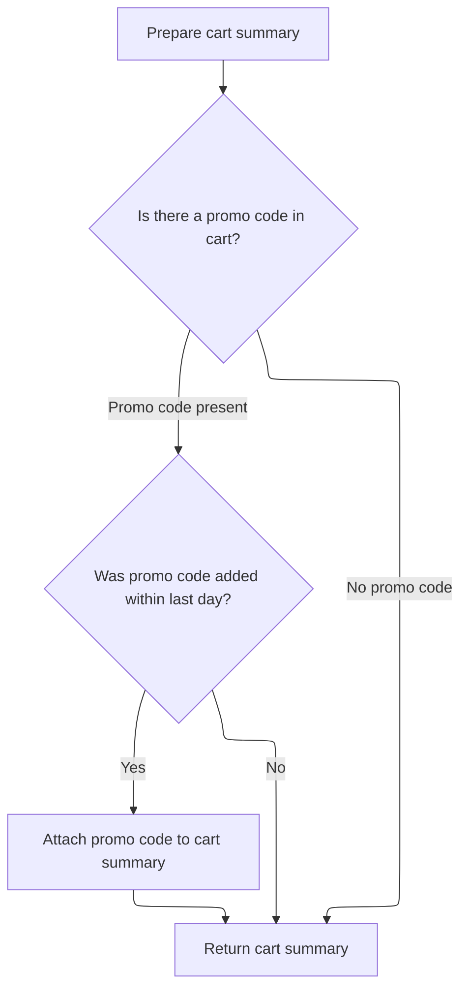

This document describes how a shopping cart summary is delivered to API clients. Given a cart code, store context, and language preference, the system retrieves the cart, prepares a localized and formatted summary, and returns it for frontend display and checkout.

# Where is this flow used?

This flow is used multiple times in the codebase as represented in the following diagram:

(Note - these are only some of the entry points of this flow)

```mermaid
graph TD;
      8b2433ba72f6c9151ac72e8e6a08de4b5d1f45db9231820e7c4d97a57dc44e71(sm-shop/…/facade/ShoppingCartFacadeImpl.java::ShoppingCartFacadeImpl.addItemsToShoppingCart) --> 46af5731cc6efc1dc51512ce003ac2e4268e1857ec6ef9efa946c77b567e06af(sm-shop/…/facade/ShoppingCartFacadeImpl.java::ShoppingCartFacadeImpl.getShoppingCartModel)

46af5731cc6efc1dc51512ce003ac2e4268e1857ec6ef9efa946c77b567e06af(sm-shop/…/facade/ShoppingCartFacadeImpl.java::ShoppingCartFacadeImpl.getShoppingCartModel) --> 90a97d472a1a43c4b712323090e7226dac1dd72e90df950811b9726080f955bf(sm-shop/…/facade/ShoppingCartFacadeImpl.java::ShoppingCartFacadeImpl.getByCode)

c1607783f62db71c2ac947a7c18be5c574798b0e2e2a1a5a011a41b5296f6325(sm-shop/…/shoppingCart/ShoppingCartApi.java::ShoppingCartApi.deleteCartItem) --> fc49fb4485316c76753bfe9ed806f5d681f87650959c6d06243ede96abf154d7(sm-shop/…/facade/ShoppingCartFacadeImpl.java::ShoppingCartFacadeImpl.removeShoppingCartItem)

fc49fb4485316c76753bfe9ed806f5d681f87650959c6d06243ede96abf154d7(sm-shop/…/facade/ShoppingCartFacadeImpl.java::ShoppingCartFacadeImpl.removeShoppingCartItem) --> 55c9c85e0db3ca8afe5f52f5960a720f68e51842702131e72a91581e1c0e36a7(sm-shop/…/facade/ShoppingCartFacadeImpl.java::ShoppingCartFacadeImpl.getCartModel)

fc49fb4485316c76753bfe9ed806f5d681f87650959c6d06243ede96abf154d7(sm-shop/…/facade/ShoppingCartFacadeImpl.java::ShoppingCartFacadeImpl.removeShoppingCartItem) --> 90a97d472a1a43c4b712323090e7226dac1dd72e90df950811b9726080f955bf(sm-shop/…/facade/ShoppingCartFacadeImpl.java::ShoppingCartFacadeImpl.getByCode)

55c9c85e0db3ca8afe5f52f5960a720f68e51842702131e72a91581e1c0e36a7(sm-shop/…/facade/ShoppingCartFacadeImpl.java::ShoppingCartFacadeImpl.getCartModel) --> 90a97d472a1a43c4b712323090e7226dac1dd72e90df950811b9726080f955bf(sm-shop/…/facade/ShoppingCartFacadeImpl.java::ShoppingCartFacadeImpl.getByCode)

636e7002e9474508fa1947d31e270ce925f22c3025a6b7fb0ab030b10090a1e9(sm-shop/…/facade/ShoppingCartFacadeImpl.java::ShoppingCartFacadeImpl.getShoppingCartData) --> 90a97d472a1a43c4b712323090e7226dac1dd72e90df950811b9726080f955bf(sm-shop/…/facade/ShoppingCartFacadeImpl.java::ShoppingCartFacadeImpl.getByCode)

e32503b6e7c693595a936f26672548efd7a047a2cd6d0b0bf89a8e43eada6e15(sm-shop/…/facade/ShoppingCartFacadeImpl.java::ShoppingCartFacadeImpl.modifyCart) --> 90a97d472a1a43c4b712323090e7226dac1dd72e90df950811b9726080f955bf(sm-shop/…/facade/ShoppingCartFacadeImpl.java::ShoppingCartFacadeImpl.getByCode)

2345a44427310486707e986b0679ba1e9d9fed5b97924ee42e2036e4c5903324(sm-shop/…/facade/OrderFacadeImpl.java::OrderFacadeImpl.calculateOrderTotal) --> 2345a44427310486707e986b0679ba1e9d9fed5b97924ee42e2036e4c5903324(sm-shop/…/facade/OrderFacadeImpl.java::OrderFacadeImpl.calculateOrderTotal)

2345a44427310486707e986b0679ba1e9d9fed5b97924ee42e2036e4c5903324(sm-shop/…/facade/OrderFacadeImpl.java::OrderFacadeImpl.calculateOrderTotal) --> 46af5731cc6efc1dc51512ce003ac2e4268e1857ec6ef9efa946c77b567e06af(sm-shop/…/facade/ShoppingCartFacadeImpl.java::ShoppingCartFacadeImpl.getShoppingCartModel)


classDef mainFlowStyle color:#000000,fill:#7CB9F4
classDef rootsStyle color:#000000,fill:#00FFF4
classDef Style1 color:#000000,fill:#00FFAA
classDef Style2 color:#000000,fill:#FFFF00
classDef Style3 color:#000000,fill:#AA7CB9

%% Swimm:
%% graph TD;
%%       8b2433ba72f6c9151ac72e8e6a08de4b5d1f45db9231820e7c4d97a57dc44e71(<SwmPath>[sm-shop/…/facade/ShoppingCartFacadeImpl.java](sm-shop/src/main/java/com/salesmanager/shop/store/controller/shoppingCart/facade/ShoppingCartFacadeImpl.java)</SwmPath>::ShoppingCartFacadeImpl.addItemsToShoppingCart) --> 46af5731cc6efc1dc51512ce003ac2e4268e1857ec6ef9efa946c77b567e06af(<SwmPath>[sm-shop/…/facade/ShoppingCartFacadeImpl.java](sm-shop/src/main/java/com/salesmanager/shop/store/controller/shoppingCart/facade/ShoppingCartFacadeImpl.java)</SwmPath>::ShoppingCartFacadeImpl.getShoppingCartModel)
%% 
%% 46af5731cc6efc1dc51512ce003ac2e4268e1857ec6ef9efa946c77b567e06af(<SwmPath>[sm-shop/…/facade/ShoppingCartFacadeImpl.java](sm-shop/src/main/java/com/salesmanager/shop/store/controller/shoppingCart/facade/ShoppingCartFacadeImpl.java)</SwmPath>::ShoppingCartFacadeImpl.getShoppingCartModel) --> 90a97d472a1a43c4b712323090e7226dac1dd72e90df950811b9726080f955bf(<SwmPath>[sm-shop/…/facade/ShoppingCartFacadeImpl.java](sm-shop/src/main/java/com/salesmanager/shop/store/controller/shoppingCart/facade/ShoppingCartFacadeImpl.java)</SwmPath>::ShoppingCartFacadeImpl.getByCode)
%% 
%% c1607783f62db71c2ac947a7c18be5c574798b0e2e2a1a5a011a41b5296f6325(<SwmPath>[sm-shop/…/shoppingCart/ShoppingCartApi.java](sm-shop/src/main/java/com/salesmanager/shop/store/api/v1/shoppingCart/ShoppingCartApi.java)</SwmPath>::ShoppingCartApi.deleteCartItem) --> fc49fb4485316c76753bfe9ed806f5d681f87650959c6d06243ede96abf154d7(<SwmPath>[sm-shop/…/facade/ShoppingCartFacadeImpl.java](sm-shop/src/main/java/com/salesmanager/shop/store/controller/shoppingCart/facade/ShoppingCartFacadeImpl.java)</SwmPath>::ShoppingCartFacadeImpl.removeShoppingCartItem)
%% 
%% fc49fb4485316c76753bfe9ed806f5d681f87650959c6d06243ede96abf154d7(<SwmPath>[sm-shop/…/facade/ShoppingCartFacadeImpl.java](sm-shop/src/main/java/com/salesmanager/shop/store/controller/shoppingCart/facade/ShoppingCartFacadeImpl.java)</SwmPath>::ShoppingCartFacadeImpl.removeShoppingCartItem) --> 55c9c85e0db3ca8afe5f52f5960a720f68e51842702131e72a91581e1c0e36a7(<SwmPath>[sm-shop/…/facade/ShoppingCartFacadeImpl.java](sm-shop/src/main/java/com/salesmanager/shop/store/controller/shoppingCart/facade/ShoppingCartFacadeImpl.java)</SwmPath>::ShoppingCartFacadeImpl.getCartModel)
%% 
%% fc49fb4485316c76753bfe9ed806f5d681f87650959c6d06243ede96abf154d7(<SwmPath>[sm-shop/…/facade/ShoppingCartFacadeImpl.java](sm-shop/src/main/java/com/salesmanager/shop/store/controller/shoppingCart/facade/ShoppingCartFacadeImpl.java)</SwmPath>::ShoppingCartFacadeImpl.removeShoppingCartItem) --> 90a97d472a1a43c4b712323090e7226dac1dd72e90df950811b9726080f955bf(<SwmPath>[sm-shop/…/facade/ShoppingCartFacadeImpl.java](sm-shop/src/main/java/com/salesmanager/shop/store/controller/shoppingCart/facade/ShoppingCartFacadeImpl.java)</SwmPath>::ShoppingCartFacadeImpl.getByCode)
%% 
%% 55c9c85e0db3ca8afe5f52f5960a720f68e51842702131e72a91581e1c0e36a7(<SwmPath>[sm-shop/…/facade/ShoppingCartFacadeImpl.java](sm-shop/src/main/java/com/salesmanager/shop/store/controller/shoppingCart/facade/ShoppingCartFacadeImpl.java)</SwmPath>::ShoppingCartFacadeImpl.getCartModel) --> 90a97d472a1a43c4b712323090e7226dac1dd72e90df950811b9726080f955bf(<SwmPath>[sm-shop/…/facade/ShoppingCartFacadeImpl.java](sm-shop/src/main/java/com/salesmanager/shop/store/controller/shoppingCart/facade/ShoppingCartFacadeImpl.java)</SwmPath>::ShoppingCartFacadeImpl.getByCode)
%% 
%% 636e7002e9474508fa1947d31e270ce925f22c3025a6b7fb0ab030b10090a1e9(<SwmPath>[sm-shop/…/facade/ShoppingCartFacadeImpl.java](sm-shop/src/main/java/com/salesmanager/shop/store/controller/shoppingCart/facade/ShoppingCartFacadeImpl.java)</SwmPath>::ShoppingCartFacadeImpl.getShoppingCartData) --> 90a97d472a1a43c4b712323090e7226dac1dd72e90df950811b9726080f955bf(<SwmPath>[sm-shop/…/facade/ShoppingCartFacadeImpl.java](sm-shop/src/main/java/com/salesmanager/shop/store/controller/shoppingCart/facade/ShoppingCartFacadeImpl.java)</SwmPath>::ShoppingCartFacadeImpl.getByCode)
%% 
%% e32503b6e7c693595a936f26672548efd7a047a2cd6d0b0bf89a8e43eada6e15(<SwmPath>[sm-shop/…/facade/ShoppingCartFacadeImpl.java](sm-shop/src/main/java/com/salesmanager/shop/store/controller/shoppingCart/facade/ShoppingCartFacadeImpl.java)</SwmPath>::ShoppingCartFacadeImpl.modifyCart) --> 90a97d472a1a43c4b712323090e7226dac1dd72e90df950811b9726080f955bf(<SwmPath>[sm-shop/…/facade/ShoppingCartFacadeImpl.java](sm-shop/src/main/java/com/salesmanager/shop/store/controller/shoppingCart/facade/ShoppingCartFacadeImpl.java)</SwmPath>::ShoppingCartFacadeImpl.getByCode)
%% 
%% 2345a44427310486707e986b0679ba1e9d9fed5b97924ee42e2036e4c5903324(<SwmPath>[sm-shop/…/facade/OrderFacadeImpl.java](sm-shop/src/main/java/com/salesmanager/shop/store/controller/order/facade/OrderFacadeImpl.java)</SwmPath>::OrderFacadeImpl.calculateOrderTotal) --> 2345a44427310486707e986b0679ba1e9d9fed5b97924ee42e2036e4c5903324(<SwmPath>[sm-shop/…/facade/OrderFacadeImpl.java](sm-shop/src/main/java/com/salesmanager/shop/store/controller/order/facade/OrderFacadeImpl.java)</SwmPath>::OrderFacadeImpl.calculateOrderTotal)
%% 
%% 2345a44427310486707e986b0679ba1e9d9fed5b97924ee42e2036e4c5903324(<SwmPath>[sm-shop/…/facade/OrderFacadeImpl.java](sm-shop/src/main/java/com/salesmanager/shop/store/controller/order/facade/OrderFacadeImpl.java)</SwmPath>::OrderFacadeImpl.calculateOrderTotal) --> 46af5731cc6efc1dc51512ce003ac2e4268e1857ec6ef9efa946c77b567e06af(<SwmPath>[sm-shop/…/facade/ShoppingCartFacadeImpl.java](sm-shop/src/main/java/com/salesmanager/shop/store/controller/shoppingCart/facade/ShoppingCartFacadeImpl.java)</SwmPath>::ShoppingCartFacadeImpl.getShoppingCartModel)
%% 
%% 
%% classDef mainFlowStyle color:#000000,fill:#7CB9F4
%% classDef rootsStyle color:#000000,fill:#00FFF4
%% classDef Style1 color:#000000,fill:#00FFAA
%% classDef Style2 color:#000000,fill:#FFFF00
%% classDef Style3 color:#000000,fill:#AA7CB9
```



# Fetching and Preparing the Cart

This section ensures that when a cart is requested by its code, the system retrieves the correct cart for the given store, and prepares it in a format that is ready for API consumption, including localization and formatting for the end user.

| Category        | Rule Name                            | Description                                                                                                                                         |
| --------------- | ------------------------------------ | --------------------------------------------------------------------------------------------------------------------------------------------------- |
| Data validation | Cart code and store context matching | A shopping cart must be fetched using a unique cart code and the current store context to ensure the correct cart is retrieved for the right store. |
| Business logic  | Cart localization and formatting     | If a cart is found, it must be converted into a readable, localized, and formatted object before being returned to the API client.                  |

<SwmSnippet path="/sm-shop/src/main/java/com/salesmanager/shop/store/controller/shoppingCart/facade/ShoppingCartFacadeImpl.java" line="1107">

---

In <SwmToken path="sm-shop/src/main/java/com/salesmanager/shop/store/controller/shoppingCart/facade/ShoppingCartFacadeImpl.java" pos="1107:5:5" line-data="	public ReadableShoppingCart getByCode(String code, MerchantStore store, Language language) throws Exception {">`getByCode`</SwmToken>, we start by fetching the <SwmToken path="sm-shop/src/main/java/com/salesmanager/shop/store/controller/shoppingCart/facade/ShoppingCartFacadeImpl.java" pos="1109:1:1" line-data="		ShoppingCart cart = shoppingCartService.getByCode(code, store);">`ShoppingCart`</SwmToken> using its code and store context. If the cart exists, we immediately pass it to the mapper to convert it into a <SwmToken path="sm-shop/src/main/java/com/salesmanager/shop/store/controller/shoppingCart/facade/ShoppingCartFacadeImpl.java" pos="1107:3:3" line-data="	public ReadableShoppingCart getByCode(String code, MerchantStore store, Language language) throws Exception {">`ReadableShoppingCart`</SwmToken>. This conversion is needed so we can return a cart object that's ready for the API, with localized and formatted fields. The next step is calling the mapper, which handles this transformation.

```java
	public ReadableShoppingCart getByCode(String code, MerchantStore store, Language language) throws Exception {

		ShoppingCart cart = shoppingCartService.getByCode(code, store);
		ReadableShoppingCart readableCart = null;

		if (cart != null) {

			readableCart = readableShoppingCartMapper.convert(cart, store, language);

```

---

</SwmSnippet>

## Starting Cart Conversion

This section initiates the conversion of a <SwmToken path="sm-shop/src/main/java/com/salesmanager/shop/store/controller/shoppingCart/facade/ShoppingCartFacadeImpl.java" pos="1109:1:1" line-data="		ShoppingCart cart = shoppingCartService.getByCode(code, store);">`ShoppingCart`</SwmToken> entity into a <SwmToken path="sm-shop/src/main/java/com/salesmanager/shop/store/controller/shoppingCart/facade/ShoppingCartFacadeImpl.java" pos="1107:3:3" line-data="	public ReadableShoppingCart getByCode(String code, MerchantStore store, Language language) throws Exception {">`ReadableShoppingCart`</SwmToken> DTO, preparing the data for presentation or API output. The conversion process is started by the 'convert' method, which creates a new <SwmToken path="sm-shop/src/main/java/com/salesmanager/shop/store/controller/shoppingCart/facade/ShoppingCartFacadeImpl.java" pos="1107:3:3" line-data="	public ReadableShoppingCart getByCode(String code, MerchantStore store, Language language) throws Exception {">`ReadableShoppingCart`</SwmToken> and delegates the actual mapping to the 'merge' method.

| Category       | Rule Name             | Description                                                                                                                                                                                                                                                                                                                                                                                                                                                                                                                                                                                                                                                                             |
| -------------- | --------------------- | --------------------------------------------------------------------------------------------------------------------------------------------------------------------------------------------------------------------------------------------------------------------------------------------------------------------------------------------------------------------------------------------------------------------------------------------------------------------------------------------------------------------------------------------------------------------------------------------------------------------------------------------------------------------------------------- |
| Business logic | Fresh DTO Creation    | A new <SwmToken path="sm-shop/src/main/java/com/salesmanager/shop/store/controller/shoppingCart/facade/ShoppingCartFacadeImpl.java" pos="1107:3:3" line-data="	public ReadableShoppingCart getByCode(String code, MerchantStore store, Language language) throws Exception {">`ReadableShoppingCart`</SwmToken> must be created for each conversion request, ensuring that the output DTO does not contain residual data from previous conversions.                                                                                                                                                                                                                                      |
| Business logic | Contextual Conversion | The conversion process must use the provided <SwmToken path="sm-shop/src/main/java/com/salesmanager/shop/store/controller/shoppingCart/facade/ShoppingCartFacadeImpl.java" pos="1107:12:12" line-data="	public ReadableShoppingCart getByCode(String code, MerchantStore store, Language language) throws Exception {">`MerchantStore`</SwmToken> and Language context to ensure that cart data is localized and store-specific.                                                                                                                                                                                                                                                         |
| Business logic | Complete Cart Mapping | All relevant cart information (items, totals, discounts, etc.) must be mapped from the <SwmToken path="sm-shop/src/main/java/com/salesmanager/shop/store/controller/shoppingCart/facade/ShoppingCartFacadeImpl.java" pos="1109:1:1" line-data="		ShoppingCart cart = shoppingCartService.getByCode(code, store);">`ShoppingCart`</SwmToken> entity to the <SwmToken path="sm-shop/src/main/java/com/salesmanager/shop/store/controller/shoppingCart/facade/ShoppingCartFacadeImpl.java" pos="1107:3:3" line-data="	public ReadableShoppingCart getByCode(String code, MerchantStore store, Language language) throws Exception {">`ReadableShoppingCart`</SwmToken> DTO during conversion. |

<SwmSnippet path="/sm-shop/src/main/java/com/salesmanager/shop/mapper/cart/ReadableShoppingCartMapper.java" line="84">

---

<SwmToken path="sm-shop/src/main/java/com/salesmanager/shop/mapper/cart/ReadableShoppingCartMapper.java" pos="84:5:5" line-data="	public ReadableShoppingCart convert(ShoppingCart source, MerchantStore store, Language language) {">`convert`</SwmToken> just sets up a new <SwmToken path="sm-shop/src/main/java/com/salesmanager/shop/mapper/cart/ReadableShoppingCartMapper.java" pos="84:3:3" line-data="	public ReadableShoppingCart convert(ShoppingCart source, MerchantStore store, Language language) {">`ReadableShoppingCart`</SwmToken> and hands off all the mapping work to <SwmToken path="sm-shop/src/main/java/com/salesmanager/shop/mapper/cart/ReadableShoppingCartMapper.java" pos="86:5:5" line-data="		return this.merge(source, destination, store, language);">`merge`</SwmToken>. We need to call merge next because that's where the actual transformation from entity to DTO happens.

```java
	public ReadableShoppingCart convert(ShoppingCart source, MerchantStore store, Language language) {
		ReadableShoppingCart destination = new ReadableShoppingCart();
		return this.merge(source, destination, store, language);
	}
```

---

</SwmSnippet>

## Mapping Cart Details and Validating Promo

```mermaid
%%{init: {"flowchart": {"defaultRenderer": "elk"}} }%%
flowchart TD
    node1["Start merging ShoppingCart to ReadableShoppingCart"]
    click node1 openCode "sm-shop/src/main/java/com/salesmanager/shop/mapper/cart/ReadableShoppingCartMapper.java:99:113"
    node1 --> node2{"Promo code present and valid?"}
    click node2 openCode "sm-shop/src/main/java/com/salesmanager/shop/mapper/cart/ReadableShoppingCartMapper.java:113:126"
    node2 -->|"Yes"| node3["Set promo code in readable cart"]
    click node3 openCode "sm-shop/src/main/java/com/salesmanager/shop/mapper/cart/ReadableShoppingCartMapper.java:124:125"
    node2 -->|"No"| node4["Continue without promo code"]
    click node4 openCode "sm-shop/src/main/java/com/salesmanager/shop/mapper/cart/ReadableShoppingCartMapper.java:126:127"
    node3 --> node5
    node4 --> node5
    node5["Set customer and cart code"]
    click node5 openCode "sm-shop/src/main/java/com/salesmanager/shop/mapper/cart/ReadableShoppingCartMapper.java:106:110"
    node5 --> node6
    
    subgraph loop1["For each item in the cart"]
      node6["Process cart items"] --> node7["Create readable cart item"]
      click node6 openCode "sm-shop/src/main/java/com/salesmanager/shop/mapper/cart/ReadableShoppingCartMapper.java:132:246"
      click node7 openCode "sm-shop/src/main/java/com/salesmanager/shop/mapper/cart/ReadableShoppingCartMapper.java:133:134"
      node7 --> node8{"Product variant present?"}
      click node8 openCode "sm-shop/src/main/java/com/salesmanager/shop/mapper/cart/ReadableShoppingCartMapper.java:137:155"
      node8 -->|"Yes"| node9{"Product variant valid?"}
      click node9 openCode "sm-shop/src/main/java/com/salesmanager/shop/mapper/cart/ReadableShoppingCartMapper.java:138:145"
      node8 -->|"No"| node12["Skip variant"]
      node9 -->|"Yes"| node10["Set variant info in cart item"]
      click node10 openCode "sm-shop/src/main/java/com/salesmanager/shop/mapper/cart/ReadableShoppingCartMapper.java:142:154"
      node9 -->|"No"| node11["Throw conversion error"]
      click node11 openCode "sm-shop/src/main/java/com/salesmanager/shop/mapper/cart/ReadableShoppingCartMapper.java:140:141"
      node10 --> node12
      node11 --> node12
      node12["Set price, quantity, subtotal"]
      click node12 openCode "sm-shop/src/main/java/com/salesmanager/shop/mapper/cart/ReadableShoppingCartMapper.java:160:173"
      node12 --> node13{"Attributes present?"}
      click node13 openCode "sm-shop/src/main/java/com/salesmanager/shop/mapper/cart/ReadableShoppingCartMapper.java:177:244"
      node13 -->|"Yes"| node14
      node13 -->|"No"| node17
      
      subgraph loop2["For each attribute of the item"]
        node14["Process attribute"] --> node15{"Product attribute valid?"}
        click node14 openCode "sm-shop/src/main/java/com/salesmanager/shop/mapper/cart/ReadableShoppingCartMapper.java:178:242"
        click node15 openCode "sm-shop/src/main/java/com/salesmanager/shop/mapper/cart/ReadableShoppingCartMapper.java:183:187"
        node15 -->|"Yes"| node16["Add attribute info to cart item"]
        click node16 openCode "sm-shop/src/main/java/com/salesmanager/shop/mapper/cart/ReadableShoppingCartMapper.java:189:241"
        node15 -->|"No"| node17["Skip attribute"]
      end
      node17["Add cart item to readable cart"]
      click node17 openCode "sm-shop/src/main/java/com/salesmanager/shop/mapper/cart/ReadableShoppingCartMapper.java:245:246"
    end
    node6 --> node18["Calculate totals and discounts"]
    click node18 openCode "sm-shop/src/main/java/com/salesmanager/shop/mapper/cart/ReadableShoppingCartMapper.java:249:259"
    
    subgraph loop3["For each order total"]
      node18 --> node19["Create readable order total"]
      click node19 openCode "sm-shop/src/main/java/com/salesmanager/shop/mapper/cart/ReadableShoppingCartMapper.java:271:277"
    end
    node18 --> node20{"Discount applied?"}
    click node20 openCode "sm-shop/src/main/java/com/salesmanager/shop/mapper/cart/ReadableShoppingCartMapper.java:263:267"
    node20 -->|"No"| node21["Remove promo code from readable cart"]
    click node21 openCode "sm-shop/src/main/java/com/salesmanager/shop/mapper/cart/ReadableShoppingCartMapper.java:266:267"
    node20 -->|"Yes"| node22["Keep promo code"]
    click node22 openCode "sm-shop/src/main/java/com/salesmanager/shop/mapper/cart/ReadableShoppingCartMapper.java:267:268"
    node21 --> node23["Set subtotal, total, display values, quantity, id"]
    node22 --> node23
    click node23 openCode "sm-shop/src/main/java/com/salesmanager/shop/mapper/cart/ReadableShoppingCartMapper.java:278:288"
    node23 --> node24{"Order ID present?"}
    click node24 openCode "sm-shop/src/main/java/com/salesmanager/shop/mapper/cart/ReadableShoppingCartMapper.java:290:292"
    node24 -->|"Yes"| node25["Set order ID in readable cart"]
    click node25 openCode "sm-shop/src/main/java/com/salesmanager/shop/mapper/cart/ReadableShoppingCartMapper.java:291:292"
    node24 -->|"No"| node26["Skip order ID"]
    click node26 openCode "sm-shop/src/main/java/com/salesmanager/shop/mapper/cart/ReadableShoppingCartMapper.java:292:293"
    node25 --> node27["Return readable cart"]
    node26 --> node27["Return readable cart"]
    click node27 openCode "sm-shop/src/main/java/com/salesmanager/shop/mapper/cart/ReadableShoppingCartMapper.java:298:299"
classDef HeadingStyle fill:#777777,stroke:#333,stroke-width:2px;

%% Swimm:
%% %%{init: {"flowchart": {"defaultRenderer": "elk"}} }%%
%% flowchart TD
%%     node1["Start merging <SwmToken path="sm-shop/src/main/java/com/salesmanager/shop/store/controller/shoppingCart/facade/ShoppingCartFacadeImpl.java" pos="1109:1:1" line-data="		ShoppingCart cart = shoppingCartService.getByCode(code, store);">`ShoppingCart`</SwmToken> to <SwmToken path="sm-shop/src/main/java/com/salesmanager/shop/store/controller/shoppingCart/facade/ShoppingCartFacadeImpl.java" pos="1107:3:3" line-data="	public ReadableShoppingCart getByCode(String code, MerchantStore store, Language language) throws Exception {">`ReadableShoppingCart`</SwmToken>"]
%%     click node1 openCode "<SwmPath>[sm-shop/…/cart/ReadableShoppingCartMapper.java](sm-shop/src/main/java/com/salesmanager/shop/mapper/cart/ReadableShoppingCartMapper.java)</SwmPath>:99:113"
%%     node1 --> node2{"Promo code present and valid?"}
%%     click node2 openCode "<SwmPath>[sm-shop/…/cart/ReadableShoppingCartMapper.java](sm-shop/src/main/java/com/salesmanager/shop/mapper/cart/ReadableShoppingCartMapper.java)</SwmPath>:113:126"
%%     node2 -->|"Yes"| node3["Set promo code in readable cart"]
%%     click node3 openCode "<SwmPath>[sm-shop/…/cart/ReadableShoppingCartMapper.java](sm-shop/src/main/java/com/salesmanager/shop/mapper/cart/ReadableShoppingCartMapper.java)</SwmPath>:124:125"
%%     node2 -->|"No"| node4["Continue without promo code"]
%%     click node4 openCode "<SwmPath>[sm-shop/…/cart/ReadableShoppingCartMapper.java](sm-shop/src/main/java/com/salesmanager/shop/mapper/cart/ReadableShoppingCartMapper.java)</SwmPath>:126:127"
%%     node3 --> node5
%%     node4 --> node5
%%     node5["Set customer and cart code"]
%%     click node5 openCode "<SwmPath>[sm-shop/…/cart/ReadableShoppingCartMapper.java](sm-shop/src/main/java/com/salesmanager/shop/mapper/cart/ReadableShoppingCartMapper.java)</SwmPath>:106:110"
%%     node5 --> node6
%%     
%%     subgraph loop1["For each item in the cart"]
%%       node6["Process cart items"] --> node7["Create readable cart item"]
%%       click node6 openCode "<SwmPath>[sm-shop/…/cart/ReadableShoppingCartMapper.java](sm-shop/src/main/java/com/salesmanager/shop/mapper/cart/ReadableShoppingCartMapper.java)</SwmPath>:132:246"
%%       click node7 openCode "<SwmPath>[sm-shop/…/cart/ReadableShoppingCartMapper.java](sm-shop/src/main/java/com/salesmanager/shop/mapper/cart/ReadableShoppingCartMapper.java)</SwmPath>:133:134"
%%       node7 --> node8{"Product variant present?"}
%%       click node8 openCode "<SwmPath>[sm-shop/…/cart/ReadableShoppingCartMapper.java](sm-shop/src/main/java/com/salesmanager/shop/mapper/cart/ReadableShoppingCartMapper.java)</SwmPath>:137:155"
%%       node8 -->|"Yes"| node9{"Product variant valid?"}
%%       click node9 openCode "<SwmPath>[sm-shop/…/cart/ReadableShoppingCartMapper.java](sm-shop/src/main/java/com/salesmanager/shop/mapper/cart/ReadableShoppingCartMapper.java)</SwmPath>:138:145"
%%       node8 -->|"No"| node12["Skip variant"]
%%       node9 -->|"Yes"| node10["Set variant info in cart item"]
%%       click node10 openCode "<SwmPath>[sm-shop/…/cart/ReadableShoppingCartMapper.java](sm-shop/src/main/java/com/salesmanager/shop/mapper/cart/ReadableShoppingCartMapper.java)</SwmPath>:142:154"
%%       node9 -->|"No"| node11["Throw conversion error"]
%%       click node11 openCode "<SwmPath>[sm-shop/…/cart/ReadableShoppingCartMapper.java](sm-shop/src/main/java/com/salesmanager/shop/mapper/cart/ReadableShoppingCartMapper.java)</SwmPath>:140:141"
%%       node10 --> node12
%%       node11 --> node12
%%       node12["Set price, quantity, subtotal"]
%%       click node12 openCode "<SwmPath>[sm-shop/…/cart/ReadableShoppingCartMapper.java](sm-shop/src/main/java/com/salesmanager/shop/mapper/cart/ReadableShoppingCartMapper.java)</SwmPath>:160:173"
%%       node12 --> node13{"Attributes present?"}
%%       click node13 openCode "<SwmPath>[sm-shop/…/cart/ReadableShoppingCartMapper.java](sm-shop/src/main/java/com/salesmanager/shop/mapper/cart/ReadableShoppingCartMapper.java)</SwmPath>:177:244"
%%       node13 -->|"Yes"| node14
%%       node13 -->|"No"| node17
%%       
%%       subgraph loop2["For each attribute of the item"]
%%         node14["Process attribute"] --> node15{"Product attribute valid?"}
%%         click node14 openCode "<SwmPath>[sm-shop/…/cart/ReadableShoppingCartMapper.java](sm-shop/src/main/java/com/salesmanager/shop/mapper/cart/ReadableShoppingCartMapper.java)</SwmPath>:178:242"
%%         click node15 openCode "<SwmPath>[sm-shop/…/cart/ReadableShoppingCartMapper.java](sm-shop/src/main/java/com/salesmanager/shop/mapper/cart/ReadableShoppingCartMapper.java)</SwmPath>:183:187"
%%         node15 -->|"Yes"| node16["Add attribute info to cart item"]
%%         click node16 openCode "<SwmPath>[sm-shop/…/cart/ReadableShoppingCartMapper.java](sm-shop/src/main/java/com/salesmanager/shop/mapper/cart/ReadableShoppingCartMapper.java)</SwmPath>:189:241"
%%         node15 -->|"No"| node17["Skip attribute"]
%%       end
%%       node17["Add cart item to readable cart"]
%%       click node17 openCode "<SwmPath>[sm-shop/…/cart/ReadableShoppingCartMapper.java](sm-shop/src/main/java/com/salesmanager/shop/mapper/cart/ReadableShoppingCartMapper.java)</SwmPath>:245:246"
%%     end
%%     node6 --> node18["Calculate totals and discounts"]
%%     click node18 openCode "<SwmPath>[sm-shop/…/cart/ReadableShoppingCartMapper.java](sm-shop/src/main/java/com/salesmanager/shop/mapper/cart/ReadableShoppingCartMapper.java)</SwmPath>:249:259"
%%     
%%     subgraph loop3["For each order total"]
%%       node18 --> node19["Create readable order total"]
%%       click node19 openCode "<SwmPath>[sm-shop/…/cart/ReadableShoppingCartMapper.java](sm-shop/src/main/java/com/salesmanager/shop/mapper/cart/ReadableShoppingCartMapper.java)</SwmPath>:271:277"
%%     end
%%     node18 --> node20{"Discount applied?"}
%%     click node20 openCode "<SwmPath>[sm-shop/…/cart/ReadableShoppingCartMapper.java](sm-shop/src/main/java/com/salesmanager/shop/mapper/cart/ReadableShoppingCartMapper.java)</SwmPath>:263:267"
%%     node20 -->|"No"| node21["Remove promo code from readable cart"]
%%     click node21 openCode "<SwmPath>[sm-shop/…/cart/ReadableShoppingCartMapper.java](sm-shop/src/main/java/com/salesmanager/shop/mapper/cart/ReadableShoppingCartMapper.java)</SwmPath>:266:267"
%%     node20 -->|"Yes"| node22["Keep promo code"]
%%     click node22 openCode "<SwmPath>[sm-shop/…/cart/ReadableShoppingCartMapper.java](sm-shop/src/main/java/com/salesmanager/shop/mapper/cart/ReadableShoppingCartMapper.java)</SwmPath>:267:268"
%%     node21 --> node23["Set subtotal, total, display values, quantity, id"]
%%     node22 --> node23
%%     click node23 openCode "<SwmPath>[sm-shop/…/cart/ReadableShoppingCartMapper.java](sm-shop/src/main/java/com/salesmanager/shop/mapper/cart/ReadableShoppingCartMapper.java)</SwmPath>:278:288"
%%     node23 --> node24{"Order ID present?"}
%%     click node24 openCode "<SwmPath>[sm-shop/…/cart/ReadableShoppingCartMapper.java](sm-shop/src/main/java/com/salesmanager/shop/mapper/cart/ReadableShoppingCartMapper.java)</SwmPath>:290:292"
%%     node24 -->|"Yes"| node25["Set order ID in readable cart"]
%%     click node25 openCode "<SwmPath>[sm-shop/…/cart/ReadableShoppingCartMapper.java](sm-shop/src/main/java/com/salesmanager/shop/mapper/cart/ReadableShoppingCartMapper.java)</SwmPath>:291:292"
%%     node24 -->|"No"| node26["Skip order ID"]
%%     click node26 openCode "<SwmPath>[sm-shop/…/cart/ReadableShoppingCartMapper.java](sm-shop/src/main/java/com/salesmanager/shop/mapper/cart/ReadableShoppingCartMapper.java)</SwmPath>:292:293"
%%     node25 --> node27["Return readable cart"]
%%     node26 --> node27["Return readable cart"]
%%     click node27 openCode "<SwmPath>[sm-shop/…/cart/ReadableShoppingCartMapper.java](sm-shop/src/main/java/com/salesmanager/shop/mapper/cart/ReadableShoppingCartMapper.java)</SwmPath>:298:299"
%% classDef HeadingStyle fill:#777777,stroke:#333,stroke-width:2px;
```



This section governs the mapping of <SwmToken path="sm-shop/src/main/java/com/salesmanager/shop/store/controller/shoppingCart/facade/ShoppingCartFacadeImpl.java" pos="1109:1:1" line-data="		ShoppingCart cart = shoppingCartService.getByCode(code, store);">`ShoppingCart`</SwmToken> data to a <SwmToken path="sm-shop/src/main/java/com/salesmanager/shop/store/controller/shoppingCart/facade/ShoppingCartFacadeImpl.java" pos="1107:3:3" line-data="	public ReadableShoppingCart getByCode(String code, MerchantStore store, Language language) throws Exception {">`ReadableShoppingCart`</SwmToken> DTO, ensuring that cart details, product customizations, and promo codes are validated and correctly represented for frontend consumption. It ensures that only valid promo codes are applied, product variants and attributes are accurately mapped, and cart totals reflect current discounts and pricing.

| Category        | Rule Name                              | Description                                                                                                                                             |
| --------------- | -------------------------------------- | ------------------------------------------------------------------------------------------------------------------------------------------------------- |
| Data validation | Promo code validity window             | A promo code is only considered valid if it was added within the last day. If valid, it is set on the readable cart; otherwise, it is ignored.          |
| Data validation | Product variant existence and validity | If a cart item references a product variant, the variant must exist and be valid; otherwise, a conversion error is thrown and the process is halted.    |
| Data validation | Product attribute validation           | Product attributes for each cart item are only added if the attribute exists and is valid; otherwise, the attribute is skipped and a warning is logged. |
| Business logic  | Promo code removal on no discount      | If no discount is applied to the cart totals, any promo code previously set on the readable cart is removed.                                            |
| Business logic  | Cart item detail mapping               | Each cart item must have its product details, price, quantity, and subtotal accurately mapped to the readable cart item.                                |
| Business logic  | Cart totals calculation and formatting | All cart totals, including subtotal and total, must be calculated using the current cart items and any applicable discounts, and formatted for display. |
| Business logic  | Order ID association                   | If the cart is associated with an order, the order ID is set on the readable cart; otherwise, it is omitted.                                            |

<SwmSnippet path="/sm-shop/src/main/java/com/salesmanager/shop/mapper/cart/ReadableShoppingCartMapper.java" line="99">

---

In <SwmToken path="sm-shop/src/main/java/com/salesmanager/shop/mapper/cart/ReadableShoppingCartMapper.java" pos="99:5:5" line-data="	public ReadableShoppingCart merge(ShoppingCart source, ReadableShoppingCart destination, MerchantStore store,">`merge`</SwmToken>, we check if the cart's promo code is still valid (added within the last day) and set it on the DTO if it is. Then we loop through each cart item, map product details, handle variants and images, and localize product attributes. This builds up the <SwmToken path="sm-shop/src/main/java/com/salesmanager/shop/mapper/cart/ReadableShoppingCartMapper.java" pos="99:3:3" line-data="	public ReadableShoppingCart merge(ShoppingCart source, ReadableShoppingCart destination, MerchantStore store,">`ReadableShoppingCart`</SwmToken> with all the product customizations and options for the frontend.

```java
	public ReadableShoppingCart merge(ShoppingCart source, ReadableShoppingCart destination, MerchantStore store,
			Language language) {
		Validate.notNull(source, "ShoppingCart cannot be null");
		Validate.notNull(destination, "ReadableShoppingCart cannot be null");
		Validate.notNull(store, "MerchantStore cannot be null");
		Validate.notNull(language, "Language cannot be null");

		destination.setCode(source.getShoppingCartCode());
		int cartQuantity = 0;

		destination.setCustomer(source.getCustomerId());

		try {

			if (!StringUtils.isBlank(source.getPromoCode())) {
				Date promoDateAdded = source.getPromoAdded();// promo valid 1 day
				if (promoDateAdded == null) {
					promoDateAdded = new Date();
				}
				Instant instant = promoDateAdded.toInstant();
				ZonedDateTime zdt = instant.atZone(ZoneId.systemDefault());
				LocalDate date = zdt.toLocalDate();
				// date added < date + 1 day
				LocalDate tomorrow = LocalDate.now().plusDays(1);
				if (date.isBefore(tomorrow)) {
					destination.setPromoCode(source.getPromoCode());
				}
			}

			Set<com.salesmanager.core.model.shoppingcart.ShoppingCartItem> items = source.getLineItems();

			if (items != null) {

				for (com.salesmanager.core.model.shoppingcart.ShoppingCartItem item : items) {
					ReadableShoppingCartItem shoppingCartItem = new ReadableShoppingCartItem();
					readableMinimalProductMapper.merge(item.getProduct(), shoppingCartItem, store, language);
					
					//variation
					if(item.getVariant() != null) {
						Optional<ProductVariant> productVariant = productVariantService.getById(item.getVariant(), store);
						if(productVariant.isEmpty()) {
							throw new ConversionRuntimeException("An error occured during shopping cart [" + source.getShoppingCartCode() + "] conversion, productVariant [" + item.getVariant() + "] not found");
						}
						shoppingCartItem.setVariant(readableProductVariationMapper.convert(productVariant.get().getVariation(), store, language));
						if(productVariant.get().getVariationValue() != null) {
							shoppingCartItem.setVariantValue(readableProductVariationMapper.convert(productVariant.get().getVariationValue(), store, language));
						}
						
						if(productVariant.get().getProductVariantGroup() != null) {
							Set<String> nameSet = new HashSet<>();
							List<ReadableImage> instanceImages = productVariant.get().getProductVariantGroup().getImages()
									.stream().map(i -> this.image(i, store, language))
									.filter(e -> nameSet.add(e.getImageUrl()))
									.collect(Collectors.toList());
							shoppingCartItem.setImages(instanceImages);
						}
					}
					
					
					

					shoppingCartItem.setPrice(item.getItemPrice());
					shoppingCartItem.setFinalPrice(pricingService.getDisplayAmount(item.getItemPrice(), store));

					shoppingCartItem.setQuantity(item.getQuantity());

					cartQuantity = cartQuantity + item.getQuantity();

					BigDecimal subTotal = pricingService.calculatePriceQuantity(item.getItemPrice(),
							item.getQuantity());

					// calculate sub total (price * quantity)
					shoppingCartItem.setSubTotal(subTotal);

					shoppingCartItem.setDisplaySubTotal(pricingService.getDisplayAmount(subTotal, store));

					Set<com.salesmanager.core.model.shoppingcart.ShoppingCartAttributeItem> attributes = item
							.getAttributes();
					if (attributes != null) {
						for (com.salesmanager.core.model.shoppingcart.ShoppingCartAttributeItem attribute : attributes) {

							ProductAttribute productAttribute = productAttributeService
									.getById(attribute.getProductAttributeId());

							if (productAttribute == null) {
								LOG.warn("Product attribute with ID " + attribute.getId()
										+ " not found, skipping cart attribute " + attribute.getId());
								continue;
							}

							ReadableShoppingCartAttribute cartAttribute = new ReadableShoppingCartAttribute();

							cartAttribute.setId(attribute.getId());

							ProductOption option = productAttribute.getProductOption();
							ProductOptionValue optionValue = productAttribute.getProductOptionValue();

							List<ProductOptionDescription> optionDescriptions = option.getDescriptionsSettoList();
							List<ProductOptionValueDescription> optionValueDescriptions = optionValue
									.getDescriptionsSettoList();

							String optName = null;
							String optValue = null;
							if (!CollectionUtils.isEmpty(optionDescriptions)
									&& !CollectionUtils.isEmpty(optionValueDescriptions)) {

								optName = optionDescriptions.get(0).getName();
								optValue = optionValueDescriptions.get(0).getName();

								for (ProductOptionDescription optionDescription : optionDescriptions) {
									if (optionDescription.getLanguage() != null && optionDescription.getLanguage()
											.getId().intValue() == language.getId().intValue()) {
										optName = optionDescription.getName();
										break;
									}
								}

								for (ProductOptionValueDescription optionValueDescription : optionValueDescriptions) {
									if (optionValueDescription.getLanguage() != null && optionValueDescription
											.getLanguage().getId().intValue() == language.getId().intValue()) {
										optValue = optionValueDescription.getName();
										break;
									}
								}

							}

							if (optName != null) {
								ReadableShoppingCartAttributeOption attributeOption = new ReadableShoppingCartAttributeOption();
								attributeOption.setCode(option.getCode());
								attributeOption.setId(option.getId());
								attributeOption.setName(optName);
								cartAttribute.setOption(attributeOption);
							}

							if (optValue != null) {
								ReadableShoppingCartAttributeOptionValue attributeOptionValue = new ReadableShoppingCartAttributeOptionValue();
								attributeOptionValue.setCode(optionValue.getCode());
								attributeOptionValue.setId(optionValue.getId());
								attributeOptionValue.setName(optValue);
								cartAttribute.setOptionValue(attributeOptionValue);
							}
							shoppingCartItem.getCartItemattributes().add(cartAttribute);
						}

					}
					destination.getProducts().add(shoppingCartItem);
				}
```

---

</SwmSnippet>

<SwmSnippet path="/sm-shop/src/main/java/com/salesmanager/shop/mapper/cart/ReadableShoppingCartMapper.java" line="249">

---

After mapping the items, we use the calculation service to get the cart's totals. If there's no discount, we clear the promo code. Then we convert all totals to the readable format and attach them to the DTO, so the frontend gets up-to-date pricing.

```java
			// Calculate totals using shoppingCartService
			// OrderSummary contains ShoppingCart items

			OrderSummary summary = new OrderSummary();
			List<com.salesmanager.core.model.shoppingcart.ShoppingCartItem> productsList = new ArrayList<com.salesmanager.core.model.shoppingcart.ShoppingCartItem>();
			productsList.addAll(source.getLineItems());
			summary.setProducts(productsList);

			// OrdetTotalSummary contains all calculations

			OrderTotalSummary orderSummary = shoppingCartCalculationService.calculate(source, store, language);

			if (CollectionUtils.isNotEmpty(orderSummary.getTotals())) {

				if (orderSummary.getTotals().stream()
						.filter(t -> Constants.OT_DISCOUNT_TITLE.equals(t.getOrderTotalCode())).count() == 0) {
					// no promo coupon applied
					destination.setPromoCode(null);

				}

				List<ReadableOrderTotal> totals = new ArrayList<ReadableOrderTotal>();
				for (com.salesmanager.core.model.order.OrderTotal t : orderSummary.getTotals()) {
					ReadableOrderTotal total = new ReadableOrderTotal();
					total.setCode(t.getOrderTotalCode());
					total.setValue(t.getValue());
					total.setText(t.getText());
					totals.add(total);
				}
```

---

</SwmSnippet>

<SwmSnippet path="/sm-shop/src/main/java/com/salesmanager/shop/mapper/cart/ReadableShoppingCartMapper.java" line="278">

---

Finally, we return the fully mapped <SwmToken path="sm-shop/src/main/java/com/salesmanager/shop/mapper/cart/ReadableShoppingCartMapper.java" pos="295:18:18" line-data="			throw new ConversionRuntimeException(&quot;An error occured while converting ReadableShoppingCart&quot;, e);">`ReadableShoppingCart`</SwmToken>, which now has all items, attributes, promo code (if valid), totals, and formatted prices set for the client.

```java
				destination.setTotals(totals);
			}

			destination.setSubtotal(orderSummary.getSubTotal());
			destination.setDisplaySubTotal(pricingService.getDisplayAmount(orderSummary.getSubTotal(), store));

			destination.setTotal(orderSummary.getTotal());
			destination.setDisplayTotal(pricingService.getDisplayAmount(orderSummary.getTotal(), store));

			destination.setQuantity(cartQuantity);
			destination.setId(source.getId());

			if (source.getOrderId() != null) {
				destination.setOrder(source.getOrderId());
			}

		} catch (Exception e) {
			throw new ConversionRuntimeException("An error occured while converting ReadableShoppingCart", e);
		}

		return destination;
	}
```

---

</SwmSnippet>

## Finalizing and Returning the Cart



<SwmSnippet path="/sm-shop/src/main/java/com/salesmanager/shop/store/controller/shoppingCart/facade/ShoppingCartFacadeImpl.java" line="1116">

---

After mapping, we validate the promo code date again and return the DTO.

```java
			if (!StringUtils.isBlank(cart.getPromoCode())) {
				Date promoDateAdded = cart.getPromoAdded();// promo valid 1 day
				if (promoDateAdded == null) {
					promoDateAdded = new Date();
				}
				Instant instant = promoDateAdded.toInstant();
				ZonedDateTime zdt = instant.atZone(ZoneId.systemDefault());
				LocalDate date = zdt.toLocalDate();
				// date added < date + 1 day
				LocalDate tomorrow = LocalDate.now().plusDays(1);
				if (date.isBefore(tomorrow)) {
					readableCart.setPromoCode(cart.getPromoCode());
				}
			}
		}

		return readableCart;

	}
```

---

</SwmSnippet>

&nbsp;

*This is an auto-generated document by Swimm 🌊 and has not yet been verified by a human*

<SwmMeta version="3.0.0" repo-id="Z2l0aHViJTNBJTNBc2hvcGl6ZXIlM0ElM0FTd2ltbS1EZW1v" repo-name="shopizer"><sup>Powered by [Swimm](https://app.swimm.io/)</sup></SwmMeta>
