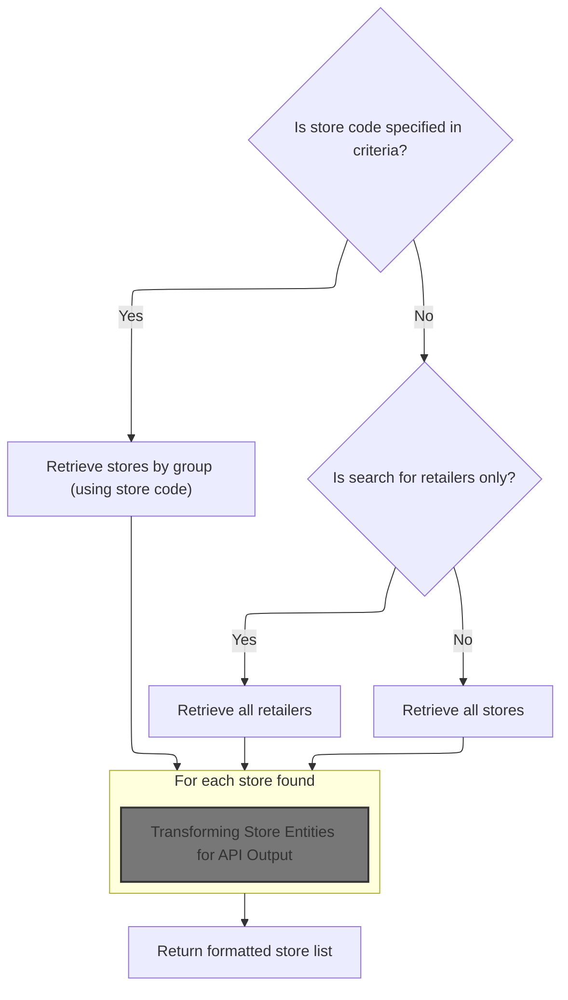
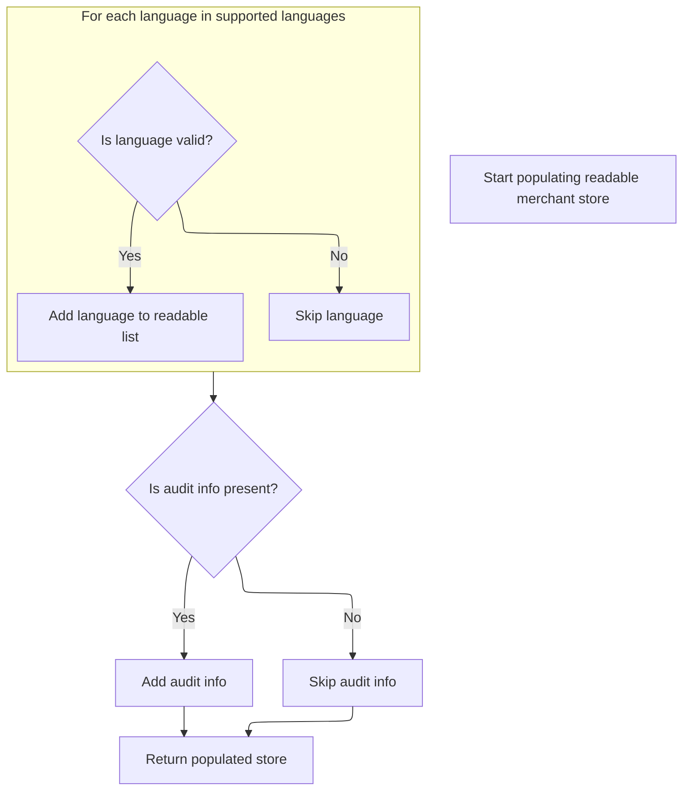

This document describes how merchant stores are filtered and formatted into a paginated list for API clients. The flow receives criteria such as store code, retailer flag, name, language, and pagination, and returns a list of stores with related information, supporting catalog browsing and administration.

# Fetching and Filtering Merchant Stores



This section governs how merchant stores are selected and presented to API clients, ensuring that the correct stores are retrieved and formatted based on user-supplied criteria.

| Category       | Rule Name                   | Description                                                                                                                                    |
| -------------- | --------------------------- | ---------------------------------------------------------------------------------------------------------------------------------------------- |
| Business logic | Group-based store filtering | If a store code is specified in the criteria, only stores belonging to the same group as the store with that code are included in the results. |
| Business logic | Retailer-only filtering     | If the criteria indicate a search for retailers only, the results must include only stores marked as retailers.                                |
| Business logic | General store listing       | If no store code is specified and the retailer flag is not set, all stores matching the optional name filter are included in the results.      |
| Business logic | Pagination enforcement      | The results must be paginated according to the page and count parameters provided in the criteria.                                             |
| Business logic | API output formatting       | Each store in the result set must be transformed into a readable format suitable for API consumers.                                            |

<SwmSnippet path="/sm-shop/src/main/java/com/salesmanager/shop/store/controller/store/facade/StoreFacadeImpl.java" line="481">

---

In `findAll`, we check for a store code and, if present, prepare to fetch stores by group, which means we need to call `merchantStoreService.listByGroup` next to get the filtered results.

```java
	public ReadableMerchantStoreList findAll(MerchantStoreCriteria criteria, Language language, int page, int count) {
		
		try {
			Page<MerchantStore> stores = null;
			List<ReadableMerchantStore> readableStores = new ArrayList<ReadableMerchantStore>();
			ReadableMerchantStoreList readableList = new ReadableMerchantStoreList();
			
			Optional<String> code = Optional.ofNullable(criteria.getStoreCode());
			Optional<String> name = Optional.ofNullable(criteria.getName());
			if(code.isPresent()) {
				
				stores = merchantStoreService.listByGroup(name, code.get(), page, count);
```

---

</SwmSnippet>

<SwmSnippet path="/sm-shop/src/main/java/com/salesmanager/shop/store/controller/store/facade/StoreFacadeImpl.java" line="492">

---

In `findAll`, after checking the input, we decide which backend method to call to fetch the right set of stores, and that's why we call `merchantStoreService.listByGroup` next if a code is present.

```java
				stores = merchantStoreService.listByGroup(name, code.get(), page, count);

			} else {
				if(criteria.isRetailers()) {
					stores = merchantStoreService.listAllRetailers(name, page, count);
				} else {
					stores = merchantStoreService.listAll(name, page, count);
				}
			}


```

---

</SwmSnippet>

<SwmSnippet path="/sm-core/src/main/java/com/salesmanager/core/business/services/merchant/MerchantStoreServiceImpl.java" line="143">

---

`listByGroup` grabs the store by code, uses its ID to filter stores in the group, and applies pagination and optional name filtering. No null checks on the store, so invalid codes will break.

```java
	public Page<MerchantStore> listByGroup(Optional<String> storeName, String code, int page, int count) throws ServiceException {
		
		String name = null;
		if (storeName != null && storeName.isPresent()) {
			name = storeName.get();
		}

		
		MerchantStore store = getByCode(code);//if exist
		Optional<Integer> id = Optional.ofNullable(store.getId());

		
		Pageable pageRequest = PageRequest.of(page, count);


		return pageableMerchantRepository.listByGroup(code, id.get(), name, pageRequest);
		
		
	}
```

---

</SwmSnippet>

<SwmSnippet path="/sm-shop/src/main/java/com/salesmanager/shop/store/controller/store/facade/StoreFacadeImpl.java" line="503">

---

After fetching stores, we convert each one to a ReadableMerchantStore for the API response in `findAll`.

```java
			if (!CollectionUtils.isEmpty(stores.getContent())) {
				for (MerchantStore store : stores)
					readableStores.add(convertMerchantStoreToReadableMerchantStore(language, store));
			}
```

---

</SwmSnippet>

## Transforming Store Entities for API Output

This section is responsible for transforming internal store entities into a format suitable for API output, ensuring that the data is accurate, readable, and appropriate for external consumption.

| Category       | Rule Name                  | Description                                                                                                                                                         |
| -------------- | -------------------------- | ------------------------------------------------------------------------------------------------------------------------------------------------------------------- |
| Business logic | Complete Store Data Output | All relevant data from the MerchantStore entity must be included in the ReadableMerchantStore output, ensuring completeness of store information for API consumers. |
| Business logic | Default Language Fallback  | The language parameter provided for the transformation should default to the store's default language if the specified language is not relevant for the conversion. |

<SwmSnippet path="/sm-shop/src/main/java/com/salesmanager/shop/store/controller/store/facade/StoreFacadeImpl.java" line="139">

---

`convertMerchantStoreToReadableMerchantStore` just hands off the mapping work to the populator.

```java
	private ReadableMerchantStore convertMerchantStoreToReadableMerchantStore(Language language, MerchantStore store) {
		ReadableMerchantStore readable = new ReadableMerchantStore();

		/**
		 * Language is not important for this conversion using default language
		 */
		try {			
			readableMerchantStorePopulator.populate(store, readable, store, language);
		} catch (Exception e) {
			throw new ConversionRuntimeException("Error while populating MerchantStore " + e.getMessage());
		}
		return readable;
	}
```

---

</SwmSnippet>

## Populating Store DTOs with Related Data

This section describes the business rules for populating Store DTOs with related data, ensuring that all necessary store information, including address, parent store, supported languages, and branding, is accurately represented in the output DTO.

| Category        | Rule Name                      | Description                                                                                                                                                                    |
| --------------- | ------------------------------ | ------------------------------------------------------------------------------------------------------------------------------------------------------------------------------ |
| Data validation | Country code requirement       | Every store must have a valid country code associated with its address. If the country is missing or cannot be resolved, the country field in the address should remain unset. |
| Data validation | Supported language enforcement | The store must support at least one language. If no languages are found, an error is raised and the operation fails.                                                           |
| Data validation | Zone code mapping              | If the store's zone is present, the state/province field in the address must be set using the zone code. If the zone cannot be resolved, the field remains unset.              |
| Business logic  | Parent store inclusion         | If a store has a parent, the parent store's details must be recursively populated and included in the DTO. If no parent exists, the store is marked as a retailer.             |
| Business logic  | Logo inclusion                 | The store logo must be included in the DTO if present, with its name and file path set. If no logo is provided, the logo field remains unset.                                  |
| Business logic  | Currency representation        | The store's currency and currency format must be set according to the source entity, ensuring correct financial representation.                                                |
| Business logic  | Data accuracy enforcement      | All fields in the DTO must be populated with the most accurate and up-to-date information available from the source entity and related services.                               |

<SwmSnippet path="/sm-shop/src/main/java/com/salesmanager/shop/populator/store/ReadableMerchantStorePopulator.java" line="60">

---

`populate` sets up the DTO and copies over the simple fields, getting ready for more complex mapping.

```java
	public ReadableMerchantStore populate(MerchantStore source,
			ReadableMerchantStore target, MerchantStore store, Language language)
			throws ConversionException {
		Validate.notNull(countryService,"Must use setter for countryService");
		Validate.notNull(zoneService,"Must use setter for zoneService");
		
		if(target == null) {
			target = new ReadableMerchantStore();
		}
		
		target.setId(source.getId());
		target.setCode(source.getCode());
		if(source.getDefaultLanguage() != null) {
			target.setDefaultLanguage(source.getDefaultLanguage().getCode());
		}

		target.setCurrency(source.getCurrency().getCode());
```

---

</SwmSnippet>

<SwmSnippet path="/sm-shop/src/main/java/com/salesmanager/shop/populator/store/ReadableMerchantStorePopulator.java" line="77">

---

After filling in address and parent info, `populate` moves on to fetch supported languages for the store.

```java
		target.setPhone(source.getStorephone());
		
		ReadableAddress address = new ReadableAddress();
		address.setAddress(source.getStoreaddress());
		address.setCity(source.getStorecity());
		if(source.getCountry()!=null) {
			try {
				address.setCountry(source.getCountry().getIsoCode());
				Country c =countryService.getCountriesMap(language).get(source.getCountry().getIsoCode());
				if(c!=null) {
					address.setCountry(c.getIsoCode());
				}
			} catch (ServiceException e) {
				logger.error("Cannot get Country", e);
			}
		}
		
		if(source.getParent() != null) {
		  ReadableMerchantStore parent = populate(source.getParent(),
            new ReadableMerchantStore(), source, language);
		  target.setParent(parent);
		}
		
		if(target.getParent() == null) {
			target.setRetailer(true);
		} else {
			target.setRetailer(source.isRetailer()!=null?source.isRetailer().booleanValue():false);	
		}
		
		
		target.setDimension(MeasureUnit.valueOf(source.getSeizeunitcode()));
		target.setWeight(WeightUnit.valueOf(source.getWeightunitcode()));
		
		if(source.getZone()!=null) {
			address.setStateProvince(source.getZone().getCode());
			try {
				Zone z = zoneService.getZones(language).get(source.getZone().getCode());
				address.setStateProvince(z.getCode());
			} catch (ServiceException e) {
				logger.error("Cannot get Zone", e);
			}
		}
		
		
		if(!StringUtils.isBlank(source.getStorestateprovince())) {
			address.setStateProvince(source.getStorestateprovince());
		}
		
		if(!StringUtils.isBlank(source.getStoreLogo())) {
			ReadableImage image = new ReadableImage();
			image.setName(source.getStoreLogo());
			if(filePath!=null) {
				image.setPath(filePath.buildStoreLogoFilePath(source));
			}
			target.setLogo(image);
		}
		
		address.setPostalCode(source.getStorepostalcode());

		target.setAddress(address);
		
		target.setCurrencyFormatNational(source.isCurrencyFormatNational());
		target.setEmail(source.getStoreEmailAddress());
		target.setName(source.getStorename());
		target.setId(source.getId());
		target.setInBusinessSince(DateUtil.formatDate(source.getInBusinessSince()));
		target.setUseCache(source.isUseCache());

		if(!CollectionUtils.isEmpty(source.getLanguages())) {
			List<ReadableLanguage> supported = new ArrayList<ReadableLanguage>();
			for(Language lang : source.getLanguages()) {
```

---

</SwmSnippet>

<SwmSnippet path="/sm-shop/src/main/java/com/salesmanager/shop/store/controller/language/facade/LanguageFacadeImpl.java" line="19">

---

`getLanguages` enforces that there must be at least one language, otherwise it throws.

```java
  public List<Language> getLanguages() {
    try{
      List<Language> languages = languageService.getLanguages();
      if (languages.isEmpty()) {
        throw new ResourceNotFoundException("No languages found");
      }
      return languages;
    } catch (ServiceException e){
      throw new ServiceRuntimeException(e);
    }

  }
```

---

</SwmSnippet>

<SwmSnippet path="/sm-shop/src/main/java/com/salesmanager/shop/populator/store/ReadableMerchantStorePopulator.java" line="148">

---

After getting languages, `populate` grabs a map for fast code-based lookups.

```java
				try {
					Language langObject = languageService.getLanguagesMap().get(lang.getCode());
```

---

</SwmSnippet>

### Building Language Lookup Maps

This section is responsible for building a lookup map of supported languages, allowing other parts of the system to quickly access language details by their code. It ensures that the language list is up-to-date and efficiently accessible.

| Category        | Rule Name                | Description                                                                           |
| --------------- | ------------------------ | ------------------------------------------------------------------------------------- |
| Data validation | Supported languages only | Only languages present in the system's language list are included in the lookup map.  |
| Data validation | Unique language codes    | Each language code must be unique in the lookup map; duplicate codes are not allowed. |

<SwmSnippet path="/sm-core/src/main/java/com/salesmanager/core/business/services/reference/language/LanguageServiceImpl.java" line="84">

---

`getLanguagesMap` gets the language list and gets ready to build a lookup map.

```java
	public Map<String,Language> getLanguagesMap() throws ServiceException {
		
		List<Language> langs = this.getLanguages();
```

---

</SwmSnippet>

<SwmSnippet path="/sm-core/src/main/java/com/salesmanager/core/business/services/reference/language/LanguageServiceImpl.java" line="99">

---

`getLanguages` pulls from cache or DB, then caches the result.

```java
	public List<Language> getLanguages() throws ServiceException {
		

		List<Language> langs = null;
		try {

			langs = (List<Language>) cache.getFromCache("LANGUAGES");
			if(langs==null) {
				langs = this.list();

				
				cache.putInCache(langs, "LANGUAGES");
			}

		} catch (Exception e) {
			LOGGER.error("getCountries()", e);
			throw new ServiceException(e);
		}
		
		return langs;
		
	}
```

---

</SwmSnippet>

<SwmSnippet path="/sm-core/src/main/java/com/salesmanager/core/business/services/reference/language/LanguageServiceImpl.java" line="87">

---

`getLanguagesMap` builds a code-to-language map for fast lookups.

```java
		Map<String,Language> returnMap = new LinkedHashMap<String,Language>();
		
		for(Language lang : langs) {
			returnMap.put(lang.getCode(), lang);
		}
```

---

</SwmSnippet>

### Finalizing Store DTO with Supported Languages and Audit Data



<SwmSnippet path="/sm-shop/src/main/java/com/salesmanager/shop/populator/store/ReadableMerchantStorePopulator.java" line="150">

---

After language lookups, `populate` adds supported languages and audit info to the DTO.

```java
					if(langObject != null) {
						ReadableLanguage l = new ReadableLanguage();
						l.setId(langObject.getId());
						l.setCode(langObject.getCode());
						supported.add(l);
					}
					
				} catch (ServiceException e) {
					logger.error("Cannot get Language [" + lang.getId() + "]");
				}
				
			}
			target.setSupportedLanguages(supported);
		}
		
		if(source.getAuditSection()!=null) {
			ReadableAudit audit = new ReadableAudit();
			if(source.getAuditSection().getDateCreated()!=null) {
				audit.setCreated(DateUtil.formatDate(source.getAuditSection().getDateCreated()));
			}
			if(source.getAuditSection().getDateModified()!=null) {
				audit.setModified(DateUtil.formatDate(source.getAuditSection().getDateCreated()));
			}
			audit.setUser(source.getAuditSection().getModifiedBy());
			target.setReadableAudit(audit);
		}

		return target;
	}
```

---

</SwmSnippet>

## Packaging and Returning the Store List

<SwmSnippet path="/sm-shop/src/main/java/com/salesmanager/shop/store/controller/store/facade/StoreFacadeImpl.java" line="507">

---

After conversion, `findAll` packages the results and pagination info for the client.

```java
			readableList.setData(readableStores);
			readableList.setRecordsTotal(stores.getTotalElements());
			readableList.setTotalPages(stores.getTotalPages());
			readableList.setNumber(stores.getSize());
			readableList.setRecordsFiltered(stores.getSize());
						return readableList;

		} catch (ServiceException e) {
			throw new ServiceRuntimeException("Error while finding all merchant", e);
		}


	}
```

---

</SwmSnippet>

&nbsp;

*This is an auto-generated document by Swimm 🌊 and has not yet been verified by a human*

<SwmMeta version="3.0.0" repo-id="Z2l0aHViJTNBJTNBc2hvcGl6ZXIlM0ElM0FTd2ltbS1EZW1v" repo-name="shopizer"><sup>Powered by [Swimm](https://app.swimm.io/)</sup></SwmMeta>
