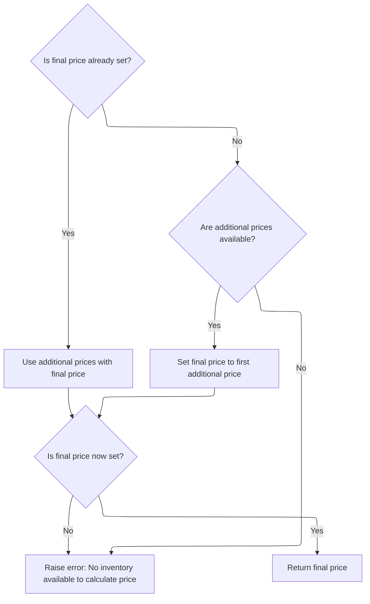

This document describes how the system determines and returns the final price for a product. The process involves selecting eligible availabilities and prices, applying discounts, and collecting alternative prices. The output is a finalized price object used for catalog, cart, and checkout operations.

# Where is this flow used?

This flow is used multiple times in the codebase as represented in the following diagram:

(Note - these are only some of the entry points of this flow)

```mermaid
graph TD;
      c2596593f2b3713703d0a35ed003052002103861522cadb878f73a9d30f476d5(sm-core/…/pricing/PricingServiceImpl.java::PricingServiceImpl.calculateProductPrice) --> 8e645ab4af7a6963e3e034d063bcddb63b39d165c7d9ac8a22fe7d1ad598618f(sm-core/…/utils/ProductPriceUtils.java::ProductPriceUtils.getFinalPrice)

8e645ab4af7a6963e3e034d063bcddb63b39d165c7d9ac8a22fe7d1ad598618f(sm-core/…/utils/ProductPriceUtils.java::ProductPriceUtils.getFinalPrice) --> f384d5bd21dbe01f306b8250de0b5d611ff92fdae6df9ea26526e77880d6b44c(sm-core/…/utils/ProductPriceUtils.java::ProductPriceUtils.calculateFinalPrice)

c2596593f2b3713703d0a35ed003052002103861522cadb878f73a9d30f476d5(sm-core/…/pricing/PricingServiceImpl.java::PricingServiceImpl.calculateProductPrice) --> 8e645ab4af7a6963e3e034d063bcddb63b39d165c7d9ac8a22fe7d1ad598618f(sm-core/…/utils/ProductPriceUtils.java::ProductPriceUtils.getFinalPrice)

c2596593f2b3713703d0a35ed003052002103861522cadb878f73a9d30f476d5(sm-core/…/pricing/PricingServiceImpl.java::PricingServiceImpl.calculateProductPrice) --> 8e645ab4af7a6963e3e034d063bcddb63b39d165c7d9ac8a22fe7d1ad598618f(sm-core/…/utils/ProductPriceUtils.java::ProductPriceUtils.getFinalPrice)

c2596593f2b3713703d0a35ed003052002103861522cadb878f73a9d30f476d5(sm-core/…/pricing/PricingServiceImpl.java::PricingServiceImpl.calculateProductPrice) --> 8e645ab4af7a6963e3e034d063bcddb63b39d165c7d9ac8a22fe7d1ad598618f(sm-core/…/utils/ProductPriceUtils.java::ProductPriceUtils.getFinalPrice)

8e645ab4af7a6963e3e034d063bcddb63b39d165c7d9ac8a22fe7d1ad598618f(sm-core/…/utils/ProductPriceUtils.java::ProductPriceUtils.getFinalPrice) --> f384d5bd21dbe01f306b8250de0b5d611ff92fdae6df9ea26526e77880d6b44c(sm-core/…/utils/ProductPriceUtils.java::ProductPriceUtils.calculateFinalPrice)

c2596593f2b3713703d0a35ed003052002103861522cadb878f73a9d30f476d5(sm-core/…/pricing/PricingServiceImpl.java::PricingServiceImpl.calculateProductPrice) --> 8e645ab4af7a6963e3e034d063bcddb63b39d165c7d9ac8a22fe7d1ad598618f(sm-core/…/utils/ProductPriceUtils.java::ProductPriceUtils.getFinalPrice)


classDef mainFlowStyle color:#000000,fill:#7CB9F4
classDef rootsStyle color:#000000,fill:#00FFF4
classDef Style1 color:#000000,fill:#00FFAA
classDef Style2 color:#000000,fill:#FFFF00
classDef Style3 color:#000000,fill:#AA7CB9

%% Swimm:
%% graph TD;
%%       c2596593f2b3713703d0a35ed003052002103861522cadb878f73a9d30f476d5(<SwmPath>[sm-core/…/pricing/PricingServiceImpl.java](sm-core/src/main/java/com/salesmanager/core/business/services/catalog/pricing/PricingServiceImpl.java)</SwmPath>::PricingServiceImpl.calculateProductPrice) --> 8e645ab4af7a6963e3e034d063bcddb63b39d165c7d9ac8a22fe7d1ad598618f(<SwmPath>[sm-core/…/utils/ProductPriceUtils.java](sm-core/src/main/java/com/salesmanager/core/business/utils/ProductPriceUtils.java)</SwmPath>::ProductPriceUtils.getFinalPrice)
%% 
%% 8e645ab4af7a6963e3e034d063bcddb63b39d165c7d9ac8a22fe7d1ad598618f(<SwmPath>[sm-core/…/utils/ProductPriceUtils.java](sm-core/src/main/java/com/salesmanager/core/business/utils/ProductPriceUtils.java)</SwmPath>::ProductPriceUtils.getFinalPrice) --> f384d5bd21dbe01f306b8250de0b5d611ff92fdae6df9ea26526e77880d6b44c(<SwmPath>[sm-core/…/utils/ProductPriceUtils.java](sm-core/src/main/java/com/salesmanager/core/business/utils/ProductPriceUtils.java)</SwmPath>::ProductPriceUtils.calculateFinalPrice)
%% 
%% c2596593f2b3713703d0a35ed003052002103861522cadb878f73a9d30f476d5(<SwmPath>[sm-core/…/pricing/PricingServiceImpl.java](sm-core/src/main/java/com/salesmanager/core/business/services/catalog/pricing/PricingServiceImpl.java)</SwmPath>::PricingServiceImpl.calculateProductPrice) --> 8e645ab4af7a6963e3e034d063bcddb63b39d165c7d9ac8a22fe7d1ad598618f(<SwmPath>[sm-core/…/utils/ProductPriceUtils.java](sm-core/src/main/java/com/salesmanager/core/business/utils/ProductPriceUtils.java)</SwmPath>::ProductPriceUtils.getFinalPrice)
%% 
%% c2596593f2b3713703d0a35ed003052002103861522cadb878f73a9d30f476d5(<SwmPath>[sm-core/…/pricing/PricingServiceImpl.java](sm-core/src/main/java/com/salesmanager/core/business/services/catalog/pricing/PricingServiceImpl.java)</SwmPath>::PricingServiceImpl.calculateProductPrice) --> 8e645ab4af7a6963e3e034d063bcddb63b39d165c7d9ac8a22fe7d1ad598618f(<SwmPath>[sm-core/…/utils/ProductPriceUtils.java](sm-core/src/main/java/com/salesmanager/core/business/utils/ProductPriceUtils.java)</SwmPath>::ProductPriceUtils.getFinalPrice)
%% 
%% c2596593f2b3713703d0a35ed003052002103861522cadb878f73a9d30f476d5(<SwmPath>[sm-core/…/pricing/PricingServiceImpl.java](sm-core/src/main/java/com/salesmanager/core/business/services/catalog/pricing/PricingServiceImpl.java)</SwmPath>::PricingServiceImpl.calculateProductPrice) --> 8e645ab4af7a6963e3e034d063bcddb63b39d165c7d9ac8a22fe7d1ad598618f(<SwmPath>[sm-core/…/utils/ProductPriceUtils.java](sm-core/src/main/java/com/salesmanager/core/business/utils/ProductPriceUtils.java)</SwmPath>::ProductPriceUtils.getFinalPrice)
%% 
%% 8e645ab4af7a6963e3e034d063bcddb63b39d165c7d9ac8a22fe7d1ad598618f(<SwmPath>[sm-core/…/utils/ProductPriceUtils.java](sm-core/src/main/java/com/salesmanager/core/business/utils/ProductPriceUtils.java)</SwmPath>::ProductPriceUtils.getFinalPrice) --> f384d5bd21dbe01f306b8250de0b5d611ff92fdae6df9ea26526e77880d6b44c(<SwmPath>[sm-core/…/utils/ProductPriceUtils.java](sm-core/src/main/java/com/salesmanager/core/business/utils/ProductPriceUtils.java)</SwmPath>::ProductPriceUtils.calculateFinalPrice)
%% 
%% c2596593f2b3713703d0a35ed003052002103861522cadb878f73a9d30f476d5(<SwmPath>[sm-core/…/pricing/PricingServiceImpl.java](sm-core/src/main/java/com/salesmanager/core/business/services/catalog/pricing/PricingServiceImpl.java)</SwmPath>::PricingServiceImpl.calculateProductPrice) --> 8e645ab4af7a6963e3e034d063bcddb63b39d165c7d9ac8a22fe7d1ad598618f(<SwmPath>[sm-core/…/utils/ProductPriceUtils.java](sm-core/src/main/java/com/salesmanager/core/business/utils/ProductPriceUtils.java)</SwmPath>::ProductPriceUtils.getFinalPrice)
%% 
%% 
%% classDef mainFlowStyle color:#000000,fill:#7CB9F4
%% classDef rootsStyle color:#000000,fill:#00FFF4
%% classDef Style1 color:#000000,fill:#00FFAA
%% classDef Style2 color:#000000,fill:#FFFF00
%% classDef Style3 color:#000000,fill:#AA7CB9
```



# Selecting and Preparing Product Availabilities

This section governs how the system determines which product availabilities and prices are eligible for final price calculation, ensuring that the correct variant or product-level availabilities are used, and that only prices for the <SwmToken path="sm-core/src/main/java/com/salesmanager/core/business/utils/ProductPriceUtils.java" pos="580:13:13" line-data="					&amp;&amp; availability.getRegion().equals(Constants.ALL_REGIONS)) {// TODO REL 2.1 accept a region">`ALL_REGIONS`</SwmToken> region are considered. It also ensures that each price is processed to account for discounts and other adjustments before selecting the final price.

| Category        | Rule Name                             | Description                                                                                                                                                                                                                                                                                                                                |
| --------------- | ------------------------------------- | ------------------------------------------------------------------------------------------------------------------------------------------------------------------------------------------------------------------------------------------------------------------------------------------------------------------------------------------ |
| Data validation | Region Filtering for Availabilities   | Only availabilities with the region set to <SwmToken path="sm-core/src/main/java/com/salesmanager/core/business/utils/ProductPriceUtils.java" pos="580:13:13" line-data="					&amp;&amp; availability.getRegion().equals(Constants.ALL_REGIONS)) {// TODO REL 2.1 accept a region">`ALL_REGIONS`</SwmToken> are eligible for price calculation. |
| Business logic  | Default Variant Availability Priority | If a product has variants, and one of those variants is marked as the default selection, the system must use the availabilities from that default variant for price calculation.                                                                                                                                                           |
| Business logic  | Fallback to Product Availability      | If no default variant with availabilities exists, the system must use the product's own availabilities for price calculation.                                                                                                                                                                                                              |
| Business logic  | Price Processing Requirement          | For each eligible availability, all associated prices must be processed to determine the final price, including applying discounts and standardizing price data.                                                                                                                                                                           |
| Business logic  | Default Price Selection               | The price marked as the default price within the eligible availabilities must be selected as the product's final price.                                                                                                                                                                                                                    |
| Business logic  | Alternative Prices Collection         | Any additional prices found in the eligible availabilities that are not marked as the default price must be collected and made available as alternative prices.                                                                                                                                                                            |

<SwmSnippet path="/sm-core/src/main/java/com/salesmanager/core/business/utils/ProductPriceUtils.java" line="550">

---

In <SwmToken path="sm-core/src/main/java/com/salesmanager/core/business/utils/ProductPriceUtils.java" pos="550:5:5" line-data="	private FinalPrice calculateFinalPrice(Product product) throws ServiceException {">`calculateFinalPrice`</SwmToken>, we start by figuring out which availabilities to use—first checking for a default variant's availabilities, then falling back to the product's own if needed. We filter for region <SwmToken path="sm-core/src/main/java/com/salesmanager/core/business/utils/ProductPriceUtils.java" pos="580:13:13" line-data="					&amp;&amp; availability.getRegion().equals(Constants.ALL_REGIONS)) {// TODO REL 2.1 accept a region">`ALL_REGIONS`</SwmToken> and loop through the prices in those availabilities. For each price, we call <SwmToken path="sm-core/src/main/java/com/salesmanager/core/business/utils/ProductPriceUtils.java" pos="552:3:3" line-data="		FinalPrice finalPrice = null;">`finalPrice`</SwmToken> to process it further, which is necessary to handle things like discounts and to standardize the price data before deciding which one to use.

```java
	private FinalPrice calculateFinalPrice(Product product) throws ServiceException {

		FinalPrice finalPrice = null;
		List<FinalPrice> otherPrices = null;

		/**
		 * Since 3.2.0 The rule is
		 * 
		 * If product.variants contains exactly one variant If Variant has availability
		 * we use availability from variant Otherwise we use price
		 */

		Set<ProductAvailability> availabilities = null;
		if (!CollectionUtils.isEmpty(product.getVariants())) {
			Optional<ProductVariant> variants = product.getVariants().stream().filter(i -> i.isDefaultSelection())
					.findFirst();
			if (variants.isPresent()) {
				availabilities = variants.get().getAvailabilities();
				availabilities = this.applicableAvailabilities(availabilities);

			}
		}

		if (CollectionUtils.isEmpty(availabilities)) {
			availabilities = product.getAvailabilities();
			availabilities = this.applicableAvailabilities(availabilities);
		}

		for (ProductAvailability availability : availabilities) {
			if (!StringUtils.isEmpty(availability.getRegion())
					&& availability.getRegion().equals(Constants.ALL_REGIONS)) {// TODO REL 2.1 accept a region
				Set<ProductPrice> prices = availability.getPrices();
				for (ProductPrice price : prices) {

					FinalPrice p = finalPrice(price);
					if (price.isDefaultPrice()) {
						finalPrice = p;
					} else {
						if (otherPrices == null) {
							otherPrices = new ArrayList<FinalPrice>();
						}
						otherPrices.add(p);
					}
				}
			}
		}

```

---

</SwmSnippet>

## Calculating and Applying Discounts to Prices

```mermaid
%%{init: {"flowchart": {"defaultRenderer": "elk"}} }%%
flowchart TD
    node1["Start price calculation"] --> node2{"Is special price period defined?"}
    click node1 openCode "sm-core/src/main/java/com/salesmanager/core/business/utils/ProductPriceUtils.java:651:653"
    node2 -->|"Yes"| node3{"Is current date within special price period?"}
    click node2 openCode "sm-core/src/main/java/com/salesmanager/core/business/utils/ProductPriceUtils.java:660:661"
    node2 -->|"No"| node4{"Is special price amount valid (> 0)?"}
    click node4 openCode "sm-core/src/main/java/com/salesmanager/core/business/utils/ProductPriceUtils.java:684:685"
    node3 -->|"Yes"| node5["Apply special price and set discount"]
    click node3 openCode "sm-core/src/main/java/com/salesmanager/core/business/utils/ProductPriceUtils.java:664:669"
    node3 -->|"No"| node6{"Is only special price end date present and valid?"}
    click node6 openCode "sm-core/src/main/java/com/salesmanager/core/business/utils/ProductPriceUtils.java:675:681"
    node6 -->|"Yes"| node5
    node6 -->|"No"| node4
    node4 -->|"Yes"| node5
    node4 -->|"No"| node7["Use original price"]
    click node7 openCode "sm-core/src/main/java/com/salesmanager/core/business/utils/ProductPriceUtils.java:654:655"
    node5 --> node8["Set final price"]
    click node5 openCode "sm-core/src/main/java/com/salesmanager/core/business/utils/ProductPriceUtils.java:687:693"
    node7 --> node8
    node8 --> node9{"Is discount applied?"}
    click node8 openCode "sm-core/src/main/java/com/salesmanager/core/business/utils/ProductPriceUtils.java:699:701"
    node9 -->|"Yes"| node10["Apply discount details"]
    click node10 openCode "sm-core/src/main/java/com/salesmanager/core/business/utils/ProductPriceUtils.java:706:720"
    node9 -->|"No"| node11["Set default price flag if applicable"]
    click node11 openCode "sm-core/src/main/java/com/salesmanager/core/business/utils/ProductPriceUtils.java:696:698"
    node10 --> node11
    node11 --> node12["Return final price"]
    click node12 openCode "sm-core/src/main/java/com/salesmanager/core/business/utils/ProductPriceUtils.java:703:704"

classDef HeadingStyle fill:#777777,stroke:#333,stroke-width:2px;

%% Swimm:
%% %%{init: {"flowchart": {"defaultRenderer": "elk"}} }%%
%% flowchart TD
%%     node1["Start price calculation"] --> node2{"Is special price period defined?"}
%%     click node1 openCode "<SwmPath>[sm-core/…/utils/ProductPriceUtils.java](sm-core/src/main/java/com/salesmanager/core/business/utils/ProductPriceUtils.java)</SwmPath>:651:653"
%%     node2 -->|"Yes"| node3{"Is current date within special price period?"}
%%     click node2 openCode "<SwmPath>[sm-core/…/utils/ProductPriceUtils.java](sm-core/src/main/java/com/salesmanager/core/business/utils/ProductPriceUtils.java)</SwmPath>:660:661"
%%     node2 -->|"No"| node4{"Is special price amount valid (> 0)?"}
%%     click node4 openCode "<SwmPath>[sm-core/…/utils/ProductPriceUtils.java](sm-core/src/main/java/com/salesmanager/core/business/utils/ProductPriceUtils.java)</SwmPath>:684:685"
%%     node3 -->|"Yes"| node5["Apply special price and set discount"]
%%     click node3 openCode "<SwmPath>[sm-core/…/utils/ProductPriceUtils.java](sm-core/src/main/java/com/salesmanager/core/business/utils/ProductPriceUtils.java)</SwmPath>:664:669"
%%     node3 -->|"No"| node6{"Is only special price end date present and valid?"}
%%     click node6 openCode "<SwmPath>[sm-core/…/utils/ProductPriceUtils.java](sm-core/src/main/java/com/salesmanager/core/business/utils/ProductPriceUtils.java)</SwmPath>:675:681"
%%     node6 -->|"Yes"| node5
%%     node6 -->|"No"| node4
%%     node4 -->|"Yes"| node5
%%     node4 -->|"No"| node7["Use original price"]
%%     click node7 openCode "<SwmPath>[sm-core/…/utils/ProductPriceUtils.java](sm-core/src/main/java/com/salesmanager/core/business/utils/ProductPriceUtils.java)</SwmPath>:654:655"
%%     node5 --> node8["Set final price"]
%%     click node5 openCode "<SwmPath>[sm-core/…/utils/ProductPriceUtils.java](sm-core/src/main/java/com/salesmanager/core/business/utils/ProductPriceUtils.java)</SwmPath>:687:693"
%%     node7 --> node8
%%     node8 --> node9{"Is discount applied?"}
%%     click node8 openCode "<SwmPath>[sm-core/…/utils/ProductPriceUtils.java](sm-core/src/main/java/com/salesmanager/core/business/utils/ProductPriceUtils.java)</SwmPath>:699:701"
%%     node9 -->|"Yes"| node10["Apply discount details"]
%%     click node10 openCode "<SwmPath>[sm-core/…/utils/ProductPriceUtils.java](sm-core/src/main/java/com/salesmanager/core/business/utils/ProductPriceUtils.java)</SwmPath>:706:720"
%%     node9 -->|"No"| node11["Set default price flag if applicable"]
%%     click node11 openCode "<SwmPath>[sm-core/…/utils/ProductPriceUtils.java](sm-core/src/main/java/com/salesmanager/core/business/utils/ProductPriceUtils.java)</SwmPath>:696:698"
%%     node10 --> node11
%%     node11 --> node12["Return final price"]
%%     click node12 openCode "<SwmPath>[sm-core/…/utils/ProductPriceUtils.java](sm-core/src/main/java/com/salesmanager/core/business/utils/ProductPriceUtils.java)</SwmPath>:703:704"
%% 
%% classDef HeadingStyle fill:#777777,stroke:#333,stroke-width:2px;
```



This section determines whether a product price should be discounted based on special price amounts and date ranges, applies the discount if eligible, and returns a price object with all necessary information for display and further processing.

| Category        | Rule Name                       | Description                                                                                                                                                       |
| --------------- | ------------------------------- | ----------------------------------------------------------------------------------------------------------------------------------------------------------------- |
| Data validation | Special price amount only       | If no special price dates are defined, the discount is only applied if the special price amount is present and greater than zero.                                 |
| Data validation | Default price flag              | If the price is marked as the default price, this status is reflected in the final price object.                                                                  |
| Business logic  | Special price date window       | If both a special price start date and end date are defined, the discount is only applied if the current date is after the start date and before the end date.    |
| Business logic  | Special price end date only     | If only a special price end date is defined (no start date), the discount is applied if the current date is before the end date.                                  |
| Business logic  | No discount fallback            | If none of the discount conditions are met, the original product price is used as the final price.                                                                |
| Business logic  | Discount percentage calculation | When a discount is applied, the discount percentage is calculated as 100 minus the ratio of special price to original price, rounded down to the nearest integer. |
| Business logic  | Discount details population     | If a discount is applied, the final price object must include the discounted price, discount percent, and the discounted flag set to true.                        |

<SwmSnippet path="/sm-core/src/main/java/com/salesmanager/core/business/utils/ProductPriceUtils.java" line="651">

---

<SwmToken path="sm-core/src/main/java/com/salesmanager/core/business/utils/ProductPriceUtils.java" pos="651:5:5" line-data="	private FinalPrice finalPrice(ProductPrice price) {">`finalPrice`</SwmToken> figures out if a price should be discounted by checking special price dates and amounts. If a discount applies, it updates the price and calls <SwmToken path="sm-core/src/main/java/com/salesmanager/core/business/utils/ProductPriceUtils.java" pos="700:1:1" line-data="			discountPrice(finalPrice);">`discountPrice`</SwmToken> to calculate the discount percentage and set related fields, so the returned price object has all the info needed for display and further logic.

```java
	private FinalPrice finalPrice(ProductPrice price) {

		FinalPrice finalPrice = new FinalPrice();
		BigDecimal fPrice = price.getProductPriceAmount();
		BigDecimal oPrice = price.getProductPriceAmount();

		Date today = new Date();
		// calculate discount price
		boolean hasDiscount = false;
		if (price.getProductPriceSpecialStartDate() != null || price.getProductPriceSpecialEndDate() != null) {

			if (price.getProductPriceSpecialStartDate() != null) {
				if (price.getProductPriceSpecialStartDate().before(today)) {
					if (price.getProductPriceSpecialEndDate() != null) {
						if (price.getProductPriceSpecialEndDate().after(today)) {
							hasDiscount = true;
							fPrice = price.getProductPriceSpecialAmount();
							finalPrice.setDiscountEndDate(price.getProductPriceSpecialEndDate());
						}
					}

				}
			}

			if (!hasDiscount && price.getProductPriceSpecialStartDate() == null
					&& price.getProductPriceSpecialEndDate() != null) {
				if (price.getProductPriceSpecialEndDate().after(today)) {
					hasDiscount = true;
					fPrice = price.getProductPriceSpecialAmount();
					finalPrice.setDiscountEndDate(price.getProductPriceSpecialEndDate());
				}
			}
		} else {
			if (price.getProductPriceSpecialAmount() != null
					&& price.getProductPriceSpecialAmount().doubleValue() > 0) {
				hasDiscount = true;
				fPrice = price.getProductPriceSpecialAmount();
				finalPrice.setDiscountEndDate(price.getProductPriceSpecialEndDate());
			}
		}

		finalPrice.setProductPrice(price);
		finalPrice.setFinalPrice(fPrice);
		finalPrice.setOriginalPrice(oPrice);

		if (price.isDefaultPrice()) {
			finalPrice.setDefaultPrice(true);
		}
		if (hasDiscount) {
			discountPrice(finalPrice);
		}

		return finalPrice;
	}
```

---

</SwmSnippet>

<SwmSnippet path="/sm-core/src/main/java/com/salesmanager/core/business/utils/ProductPriceUtils.java" line="706">

---

<SwmToken path="sm-core/src/main/java/com/salesmanager/core/business/utils/ProductPriceUtils.java" pos="706:5:5" line-data="	private void discountPrice(FinalPrice finalPrice) {">`discountPrice`</SwmToken> sets the discounted flag, calculates the discount percent by comparing the special and original prices, and updates the discounted price field. It assumes all price values are present and valid.

```java
	private void discountPrice(FinalPrice finalPrice) {

		finalPrice.setDiscounted(true);

		double arith = finalPrice.getProductPrice().getProductPriceSpecialAmount().doubleValue()
				/ finalPrice.getProductPrice().getProductPriceAmount().doubleValue();
		double fsdiscount = 100 - (arith * 100);
		Float percentagediscount = new Float(fsdiscount);
		int percent = percentagediscount.intValue();
		finalPrice.setDiscountPercent(percent);

		// calculate percent
		BigDecimal price = finalPrice.getOriginalPrice();
		finalPrice.setDiscountedPrice(finalPrice.getProductPrice().getProductPriceSpecialAmount());
	}
```

---

</SwmSnippet>

## Finalizing and Returning the Computed Price



<SwmSnippet path="/sm-core/src/main/java/com/salesmanager/core/business/utils/ProductPriceUtils.java" line="597">

---

After returning from <SwmToken path="sm-core/src/main/java/com/salesmanager/core/business/utils/ProductPriceUtils.java" pos="597:4:4" line-data="		if (finalPrice != null) {">`finalPrice`</SwmToken>, <SwmToken path="sm-core/src/main/java/com/salesmanager/core/business/utils/ProductPriceUtils.java" pos="550:5:5" line-data="	private FinalPrice calculateFinalPrice(Product product) throws ServiceException {">`calculateFinalPrice`</SwmToken> attaches any additional prices to the main price object. If no default price was set, it uses the first alternative price. If there's still no price, it throws an error, making sure we always return a valid price or fail clearly.

```java
		if (finalPrice != null) {
			finalPrice.setAdditionalPrices(otherPrices);
		} else {
			if (otherPrices != null) {
				finalPrice = otherPrices.get(0);
			}
		}

		if (finalPrice == null) {
			throw new ServiceException(ServiceException.EXCEPTION_ERROR,
					"No inventory available to calculate the price. Availability should contain at least a region set to *");
		}

		return finalPrice;

	}
```

---

</SwmSnippet>

&nbsp;

*This is an auto-generated document by Swimm 🌊 and has not yet been verified by a human*

<SwmMeta version="3.0.0" repo-id="Z2l0aHViJTNBJTNBc2hvcGl6ZXIlM0ElM0FTd2ltbS1EZW1v" repo-name="shopizer"><sup>Powered by [Swimm](https://app.swimm.io/)</sup></SwmMeta>
