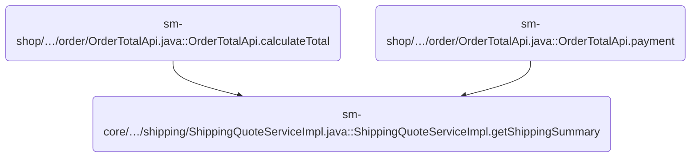
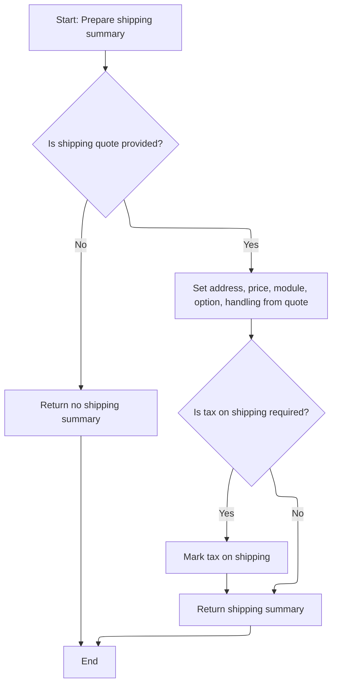
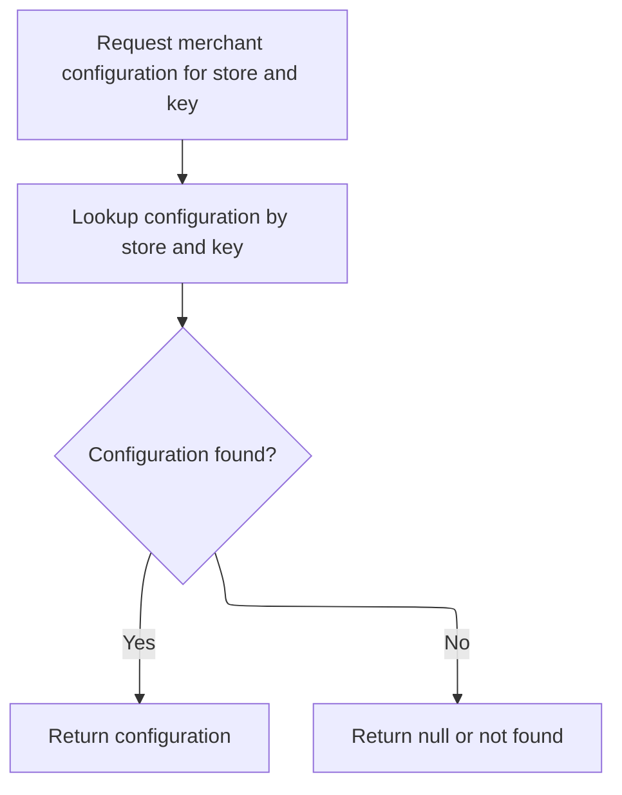

This document describes how a shipping summary is generated for an order. Given a shipping quote identifier and merchant store information, the process produces a summary with delivery address, shipping details, and tax applicability, supporting accurate checkout and order calculations.

# Where is this flow used?

This flow is used multiple times in the codebase as represented in the following diagram:



# Fetching and Transforming Shipping Quote

This section is responsible for fetching a shipping quote based on a provided <SwmToken path="sm-core/src/main/java/com/salesmanager/core/business/services/shipping/ShippingQuoteServiceImpl.java" pos="45:9:9" line-data="	public ShippingSummary getShippingSummary(Long quoteId, MerchantStore store) throws ServiceException {">`quoteId`</SwmToken>, validating its existence, and transforming it into a <SwmToken path="sm-core/src/main/java/com/salesmanager/core/business/services/shipping/ShippingQuoteServiceImpl.java" pos="45:3:3" line-data="	public ShippingSummary getShippingSummary(Long quoteId, MerchantStore store) throws ServiceException {">`ShippingSummary`</SwmToken> DTO. Category details may be fetched to enrich or validate the shipping data.

| Category        | Rule Name                 | Description                                                                                                                                                                                                                                                                                                                                                                                                                                                                                                                                                                                                                                                   |
| --------------- | ------------------------- | ------------------------------------------------------------------------------------------------------------------------------------------------------------------------------------------------------------------------------------------------------------------------------------------------------------------------------------------------------------------------------------------------------------------------------------------------------------------------------------------------------------------------------------------------------------------------------------------------------------------------------------------------------------- |
| Data validation | Valid Quote ID Required   | A shipping quote must be fetched using a valid, non-null <SwmToken path="sm-core/src/main/java/com/salesmanager/core/business/services/shipping/ShippingQuoteServiceImpl.java" pos="45:9:9" line-data="	public ShippingSummary getShippingSummary(Long quoteId, MerchantStore store) throws ServiceException {">`quoteId`</SwmToken>. If the <SwmToken path="sm-core/src/main/java/com/salesmanager/core/business/services/shipping/ShippingQuoteServiceImpl.java" pos="45:9:9" line-data="	public ShippingSummary getShippingSummary(Long quoteId, MerchantStore store) throws ServiceException {">`quoteId`</SwmToken> is null, the process must not proceed. |
| Business logic  | Accurate Shipping Summary | The <SwmToken path="sm-core/src/main/java/com/salesmanager/core/business/services/shipping/ShippingQuoteServiceImpl.java" pos="45:3:3" line-data="	public ShippingSummary getShippingSummary(Long quoteId, MerchantStore store) throws ServiceException {">`ShippingSummary`</SwmToken> DTO must accurately reflect the details of the fetched Quote entity, including all relevant shipping information.                                                                                                                                                                                                                                                      |
| Business logic  | Category-Based Enrichment | Category details may be fetched and used to enrich or validate the shipping data in the <SwmToken path="sm-core/src/main/java/com/salesmanager/core/business/services/shipping/ShippingQuoteServiceImpl.java" pos="45:3:3" line-data="	public ShippingSummary getShippingSummary(Long quoteId, MerchantStore store) throws ServiceException {">`ShippingSummary`</SwmToken> DTO, ensuring that shipping rules or restrictions based on product categories are respected.                                                                                                                                                                                       |

<SwmSnippet path="/sm-core/src/main/java/com/salesmanager/core/business/services/shipping/ShippingQuoteServiceImpl.java" line="45">

---

In <SwmToken path="sm-core/src/main/java/com/salesmanager/core/business/services/shipping/ShippingQuoteServiceImpl.java" pos="45:5:5" line-data="	public ShippingSummary getShippingSummary(Long quoteId, MerchantStore store) throws ServiceException {">`getShippingSummary`</SwmToken>, we start by making sure the <SwmToken path="sm-core/src/main/java/com/salesmanager/core/business/services/shipping/ShippingQuoteServiceImpl.java" pos="45:9:9" line-data="	public ShippingSummary getShippingSummary(Long quoteId, MerchantStore store) throws ServiceException {">`quoteId`</SwmToken> isn't null, then fetch the Quote entity from the repository. This sets up the data we need to build a <SwmToken path="sm-core/src/main/java/com/salesmanager/core/business/services/shipping/ShippingQuoteServiceImpl.java" pos="45:3:3" line-data="	public ShippingSummary getShippingSummary(Long quoteId, MerchantStore store) throws ServiceException {">`ShippingSummary`</SwmToken> DTO. Next, we need to call <SwmToken path="sm-shop/src/main/java/com/salesmanager/shop/store/facade/category/CategoryFacadeImpl.java" pos="50:4:4" line-data="public class CategoryFacadeImpl implements CategoryFacade {">`CategoryFacadeImpl`</SwmToken> to fetch category details, which might be needed for further enrichment or validation of the shipping data.

```java
	public ShippingSummary getShippingSummary(Long quoteId, MerchantStore store) throws ServiceException {
		
		Validate.notNull(quoteId,"quoteId must not be null");
		
		Quote q = shippingQuoteRepository.getOne(quoteId);

		
```

---

</SwmSnippet>

## Category and Tax Lookup

This section governs how categories are retrieved by ID and how their associated tax class information is fetched for use in tax calculations or category enrichment.

| Category        | Rule Name                                     | Description                                                                                                                                                  |
| --------------- | --------------------------------------------- | ------------------------------------------------------------------------------------------------------------------------------------------------------------ |
| Data validation | Category existence validation                 | If the category ID provided does not correspond to an existing category, an error is raised indicating that the category was not found.                      |
| Data validation | Tax class existence validation                | If the tax class ID associated with a category does not correspond to an existing tax class, an error is raised indicating that the tax class was not found. |
| Business logic  | Category and tax class retrieval prerequisite | The category and its tax class information must be retrieved before any tax calculation or category enrichment logic is performed.                           |

<SwmSnippet path="/sm-shop/src/main/java/com/salesmanager/shop/store/facade/category/CategoryFacadeImpl.java" line="365">

---

<SwmToken path="sm-shop/src/main/java/com/salesmanager/shop/store/facade/category/CategoryFacadeImpl.java" pos="365:5:5" line-data="	private Category getOne(Long categoryId, int storeId) {">`getOne`</SwmToken> just fetches the category by ID and throws if it's missing. Next, we call <SwmToken path="sm-core/src/main/java/com/salesmanager/core/business/services/tax/TaxClassServiceImpl.java" pos="17:4:4" line-data="public class TaxClassServiceImpl extends SalesManagerEntityServiceImpl&lt;Long, TaxClass&gt;">`TaxClassServiceImpl`</SwmToken> to get tax class info, which might be needed for tax calculations related to the category.

```java
	private Category getOne(Long categoryId, int storeId) {
		return Optional.ofNullable(categoryService.getById(categoryId)).orElseThrow(
				() -> new ResourceNotFoundException(String.format("No Category found for ID : %s", categoryId)));
	}
```

---

</SwmSnippet>

<SwmSnippet path="/sm-core/src/main/java/com/salesmanager/core/business/services/tax/TaxClassServiceImpl.java" line="53">

---

<SwmToken path="sm-core/src/main/java/com/salesmanager/core/business/services/tax/TaxClassServiceImpl.java" pos="53:5:5" line-data="	public TaxClass getById(Long id) {">`getById`</SwmToken> just fetches the <SwmToken path="sm-core/src/main/java/com/salesmanager/core/business/services/tax/TaxClassServiceImpl.java" pos="53:3:3" line-data="	public TaxClass getById(Long id) {">`TaxClass`</SwmToken> entity by its ID. After this, we go back to <SwmToken path="sm-shop/src/main/java/com/salesmanager/shop/store/facade/category/CategoryFacadeImpl.java" pos="50:4:4" line-data="public class CategoryFacadeImpl implements CategoryFacade {">`CategoryFacadeImpl`</SwmToken> to continue with category-related logic, possibly for further validation or enrichment.

```java
	public TaxClass getById(Long id) {
		return taxClassRepository.getOne(id);
	}
```

---

</SwmSnippet>

## Building Shipping Summary DTO



<SwmSnippet path="/sm-core/src/main/java/com/salesmanager/core/business/services/shipping/ShippingQuoteServiceImpl.java" line="52">

---

Back in ShippingQuoteServiceImpl.getShippingSummary, after getting category info, we check if the Quote exists and start building the <SwmToken path="sm-core/src/main/java/com/salesmanager/core/business/services/shipping/ShippingQuoteServiceImpl.java" pos="52:1:1" line-data="		ShippingSummary quote = null;">`ShippingSummary`</SwmToken>. Next, we call Quote.getDelivery to pull out the delivery address for the summary.

```java
		ShippingSummary quote = null;
		
		if(q != null) {
			
			quote = new ShippingSummary();
			quote.setDeliveryAddress(q.getDelivery());
```

---

</SwmSnippet>

<SwmSnippet path="/sm-core-model/src/main/java/com/salesmanager/core/model/shipping/Quote.java" line="170">

---

<SwmToken path="sm-core-model/src/main/java/com/salesmanager/core/model/shipping/Quote.java" pos="170:5:5" line-data="	public Delivery getDelivery() {">`getDelivery`</SwmToken> just returns the delivery address from the Quote. No extra logic, just a straight getter.

```java
	public Delivery getDelivery() {
		return delivery;
	}
```

---

</SwmSnippet>

<SwmSnippet path="/sm-core/src/main/java/com/salesmanager/core/business/services/shipping/ShippingQuoteServiceImpl.java" line="57">

---

After getting the delivery address from Quote, we set it in the <SwmToken path="sm-core/src/main/java/com/salesmanager/core/business/services/shipping/ShippingQuoteServiceImpl.java" pos="45:3:3" line-data="	public ShippingSummary getShippingSummary(Long quoteId, MerchantStore store) throws ServiceException {">`ShippingSummary`</SwmToken> DTO. Next, we call ShippingSummary.setDeliveryAddress to store this info in the summary object.

```java
			quote.setDeliveryAddress(q.getDelivery());
```

---

</SwmSnippet>

<SwmSnippet path="/sm-core-model/src/main/java/com/salesmanager/core/model/shipping/ShippingSummary.java" line="70">

---

<SwmToken path="sm-core-model/src/main/java/com/salesmanager/core/model/shipping/ShippingSummary.java" pos="70:5:5" line-data="	public void setDeliveryAddress(Delivery deliveryAddress) {">`setDeliveryAddress`</SwmToken> just assigns the delivery address to the summary object. No extra logic, just a plain setter.

```java
	public void setDeliveryAddress(Delivery deliveryAddress) {
		this.deliveryAddress = deliveryAddress;
	}
```

---

</SwmSnippet>

<SwmSnippet path="/sm-core/src/main/java/com/salesmanager/core/business/services/shipping/ShippingQuoteServiceImpl.java" line="58">

---

After setting the delivery address, we fill in the rest of the <SwmToken path="sm-core/src/main/java/com/salesmanager/core/business/services/shipping/ShippingQuoteServiceImpl.java" pos="45:3:3" line-data="	public ShippingSummary getShippingSummary(Long quoteId, MerchantStore store) throws ServiceException {">`ShippingSummary`</SwmToken> fields from the Quote. Then, we check if tax applies to shipping for this store by calling <SwmToken path="sm-core/src/main/java/com/salesmanager/core/business/services/shipping/ShippingQuoteServiceImpl.java" pos="64:3:5" line-data="			if(shippingService.hasTaxOnShipping(store)) {">`shippingService.hasTaxOnShipping`</SwmToken>. This sets the <SwmToken path="sm-core-model/src/main/java/com/salesmanager/core/model/shipping/ShippingConfiguration.java" pos="322:3:3" line-data="		return taxOnShipping;">`taxOnShipping`</SwmToken> flag if needed.

```java
			quote.setShipping(q.getPrice());
			quote.setShippingModule(q.getModule());
			quote.setShippingOption(q.getOptionName());
			quote.setShippingOptionCode(q.getOptionCode());
			quote.setHandling(q.getHandling());
			
			if(shippingService.hasTaxOnShipping(store)) {
				quote.setTaxOnShipping(true);
			}
			
			
			
		}
		
		
		return quote;
		
	}
```

---

</SwmSnippet>

# Checking Shipping Tax Applicability

This section determines whether shipping charges are subject to tax for a given merchant store. The decision is based on the store's shipping configuration settings.

| Category       | Rule Name                       | Description                                                                                                                                                                                                                                                                             |
| -------------- | ------------------------------- | --------------------------------------------------------------------------------------------------------------------------------------------------------------------------------------------------------------------------------------------------------------------------------------- |
| Business logic | Shipping Tax Flag Applicability | Shipping tax is applicable only if the store's shipping configuration has the <SwmToken path="sm-core-model/src/main/java/com/salesmanager/core/model/shipping/ShippingConfiguration.java" pos="322:3:3" line-data="		return taxOnShipping;">`taxOnShipping`</SwmToken> flag set to true. |

<SwmSnippet path="/sm-core/src/main/java/com/salesmanager/core/business/services/shipping/ShippingServiceImpl.java" line="958">

---

In <SwmToken path="sm-core/src/main/java/com/salesmanager/core/business/services/shipping/ShippingServiceImpl.java" pos="958:5:5" line-data="	public boolean hasTaxOnShipping(MerchantStore store) throws ServiceException {">`hasTaxOnShipping`</SwmToken>, we fetch the store's <SwmToken path="sm-core/src/main/java/com/salesmanager/core/business/services/shipping/ShippingServiceImpl.java" pos="959:1:1" line-data="		ShippingConfiguration shippingConfiguration = getShippingConfiguration(store);">`ShippingConfiguration`</SwmToken> and check its <SwmToken path="sm-core-model/src/main/java/com/salesmanager/core/model/shipping/ShippingConfiguration.java" pos="322:3:3" line-data="		return taxOnShipping;">`taxOnShipping`</SwmToken> flag. Next, we call <SwmToken path="sm-core/src/main/java/com/salesmanager/core/business/services/shipping/ShippingServiceImpl.java" pos="959:7:7" line-data="		ShippingConfiguration shippingConfiguration = getShippingConfiguration(store);">`getShippingConfiguration`</SwmToken> to get the actual config object.

```java
	public boolean hasTaxOnShipping(MerchantStore store) throws ServiceException {
		ShippingConfiguration shippingConfiguration = getShippingConfiguration(store);
```

---

</SwmSnippet>

## Fetching Store Shipping Configuration

This section is responsible for ensuring that the correct shipping configuration is retrieved for a merchant store, enabling the store to apply its specific shipping rules and options.

| Category        | Rule Name                           | Description                                                                                                                    |
| --------------- | ----------------------------------- | ------------------------------------------------------------------------------------------------------------------------------ |
| Data validation | Current Configuration Retrieval     | The shipping configuration retrieved must be the most current and accurate for the specified store at the time of the request. |
| Business logic  | Unique Store Shipping Configuration | Each merchant store must have a unique shipping configuration identified by a constant key.                                    |

<SwmSnippet path="/sm-core/src/main/java/com/salesmanager/core/business/services/shipping/ShippingServiceImpl.java" line="118">

---

In <SwmToken path="sm-core/src/main/java/com/salesmanager/core/business/services/shipping/ShippingServiceImpl.java" pos="118:5:5" line-data="	public ShippingConfiguration getShippingConfiguration(MerchantStore store) throws ServiceException {">`getShippingConfiguration`</SwmToken>, we use a constant key to fetch the shipping config for the store from <SwmToken path="sm-core/src/main/java/com/salesmanager/core/business/services/shipping/ShippingServiceImpl.java" pos="32:14:14" line-data="import com.salesmanager.core.business.services.system.MerchantConfigurationService;">`MerchantConfigurationService`</SwmToken>. Next, we call that service to get the actual config entity.

```java
	public ShippingConfiguration getShippingConfiguration(MerchantStore store) throws ServiceException {

		MerchantConfiguration configuration = merchantConfigurationService.getMerchantConfiguration(ShippingConstants.SHIPPING_CONFIGURATION, store);
		
```

---

</SwmSnippet>

### Retrieving Merchant Configuration Entity



This section enables business users and systems to retrieve specific configuration settings for a merchant store by providing the store and configuration key. It ensures that store-specific configurations are accessible for business logic and operational needs.

| Category        | Rule Name                              | Description                                                                                                            |
| --------------- | -------------------------------------- | ---------------------------------------------------------------------------------------------------------------------- |
| Data validation | Valid input required                   | A merchant configuration entity must be retrieved only if both the store and configuration key are provided and valid. |
| Business logic  | Return existing configuration          | If a configuration entity matching the store and key exists, it must be returned to the requester.                     |
| Business logic  | Unique configuration per store and key | Each configuration entity is uniquely identified by the combination of store ID and configuration key.                 |

<SwmSnippet path="/sm-core/src/main/java/com/salesmanager/core/business/services/system/MerchantConfigurationServiceImpl.java" line="31">

---

In <SwmToken path="sm-core/src/main/java/com/salesmanager/core/business/services/system/MerchantConfigurationServiceImpl.java" pos="31:5:5" line-data="	public MerchantConfiguration getMerchantConfiguration(String key, MerchantStore store) throws ServiceException {">`getMerchantConfiguration`</SwmToken>, we fetch the config entity for a store and key from the repository. Next, we call ReadableGroup.getId to get the store's ID for the query.

```java
	public MerchantConfiguration getMerchantConfiguration(String key, MerchantStore store) throws ServiceException {
		return merchantConfigurationRepository.findByMerchantStoreAndKey(store.getId(), key);
```

---

</SwmSnippet>

<SwmSnippet path="/sm-shop-model/src/main/java/com/salesmanager/shop/model/security/ReadableGroup.java" line="22">

---

<SwmToken path="sm-shop-model/src/main/java/com/salesmanager/shop/model/security/ReadableGroup.java" pos="22:5:5" line-data="  public Long getId() {">`getId`</SwmToken> just returns the store's ID. Nothing fancy, just a plain getter.

```java
  public Long getId() {
    return id;
  }
```

---

</SwmSnippet>

<SwmSnippet path="/sm-core/src/main/java/com/salesmanager/core/business/services/system/MerchantConfigurationServiceImpl.java" line="32">

---

After getting the store ID, we call the repository to fetch the config entity for that store and key. This is just a direct repo query.

```java
		return merchantConfigurationRepository.findByMerchantStoreAndKey(store.getId(), key);
	}
```

---

</SwmSnippet>

<SwmSnippet path="/sm-core/src/main/java/com/salesmanager/core/business/repositories/system/MerchantConfigurationRepository.java" line="21">

---

<SwmToken path="sm-core/src/main/java/com/salesmanager/core/business/repositories/system/MerchantConfigurationRepository.java" pos="21:3:3" line-data="	MerchantConfiguration findByMerchantStoreAndKey(Integer id, String key);">`findByMerchantStoreAndKey`</SwmToken> is just an interface method for fetching config entities by store ID and key. The real logic is in the repo implementation.

```java
	MerchantConfiguration findByMerchantStoreAndKey(Integer id, String key);
```

---

</SwmSnippet>

### Parsing Shipping Configuration Data

<SwmSnippet path="/sm-core/src/main/java/com/salesmanager/core/business/services/shipping/ShippingServiceImpl.java" line="122">

---

After getting the config entity, we grab its value (JSON string) and use <SwmToken path="sm-core/src/main/java/com/salesmanager/core/business/services/shipping/ShippingServiceImpl.java" pos="127:1:1" line-data="			ObjectMapper mapper = new ObjectMapper();">`ObjectMapper`</SwmToken> to parse it into a <SwmToken path="sm-core/src/main/java/com/salesmanager/core/business/services/shipping/ShippingServiceImpl.java" pos="122:1:1" line-data="		ShippingConfiguration shippingConfiguration = null;">`ShippingConfiguration`</SwmToken> object. Next, we call <SwmToken path="sm-core/src/main/java/com/salesmanager/core/business/services/shipping/ShippingServiceImpl.java" pos="125:9:9" line-data="			String value = configuration.getValue();">`getValue`</SwmToken> to fetch the raw JSON.

```java
		ShippingConfiguration shippingConfiguration = null;
		
		if(configuration!=null) {
			String value = configuration.getValue();
			
			ObjectMapper mapper = new ObjectMapper();
			try {
				shippingConfiguration = mapper.readValue(value, ShippingConfiguration.class);
			} catch(Exception e) {
				throw new ServiceException("Cannot parse json string " + value);
			}
		}
		return shippingConfiguration;
		
	}
```

---

</SwmSnippet>

<SwmSnippet path="/sm-shop-model/src/main/java/com/salesmanager/shop/model/configuration/ConfigurationEntity.java" line="38">

---

<SwmToken path="sm-shop-model/src/main/java/com/salesmanager/shop/model/configuration/ConfigurationEntity.java" pos="38:5:5" line-data="	public String getValue() {">`getValue`</SwmToken> just returns the config's value string. No extra logic, just a plain getter.

```java
	public String getValue() {
		return value;
	}
```

---

</SwmSnippet>

## Determining Tax Flag from Configuration

<SwmSnippet path="/sm-core/src/main/java/com/salesmanager/core/business/services/shipping/ShippingServiceImpl.java" line="960">

---

After parsing the config, we just return the <SwmToken path="sm-core-model/src/main/java/com/salesmanager/core/model/shipping/ShippingConfiguration.java" pos="322:3:3" line-data="		return taxOnShipping;">`taxOnShipping`</SwmToken> flag from the <SwmToken path="sm-core/src/main/java/com/salesmanager/core/business/services/shipping/ShippingServiceImpl.java" pos="118:3:3" line-data="	public ShippingConfiguration getShippingConfiguration(MerchantStore store) throws ServiceException {">`ShippingConfiguration`</SwmToken> object in <SwmToken path="sm-core/src/main/java/com/salesmanager/core/business/services/shipping/ShippingQuoteServiceImpl.java" pos="64:5:5" line-data="			if(shippingService.hasTaxOnShipping(store)) {">`hasTaxOnShipping`</SwmToken>.

```java
		return shippingConfiguration.isTaxOnShipping();
	}
```

---

</SwmSnippet>

<SwmSnippet path="/sm-core-model/src/main/java/com/salesmanager/core/model/shipping/ShippingConfiguration.java" line="321">

---

<SwmToken path="sm-core-model/src/main/java/com/salesmanager/core/model/shipping/ShippingConfiguration.java" pos="321:5:5" line-data="	public boolean isTaxOnShipping() {">`isTaxOnShipping`</SwmToken> just returns the tax flag from the config object. No extra logic, just a plain getter.

```java
	public boolean isTaxOnShipping() {
		return taxOnShipping;
	}
```

---

</SwmSnippet>

&nbsp;

*This is an auto-generated document by Swimm 🌊 and has not yet been verified by a human*

<SwmMeta version="3.0.0" repo-id="Z2l0aHViJTNBJTNBc2hvcGl6ZXIlM0ElM0FTd2ltbS1EZW1v" repo-name="shopizer"><sup>Powered by [Swimm](https://app.swimm.io/)</sup></SwmMeta>
