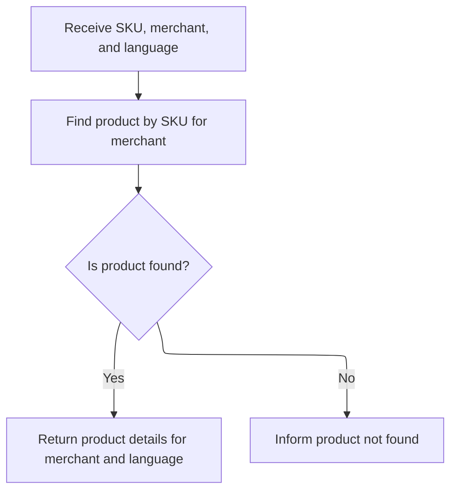
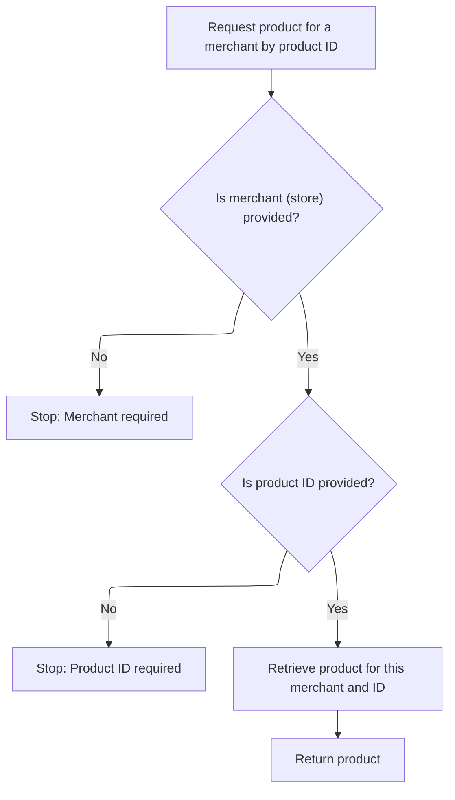
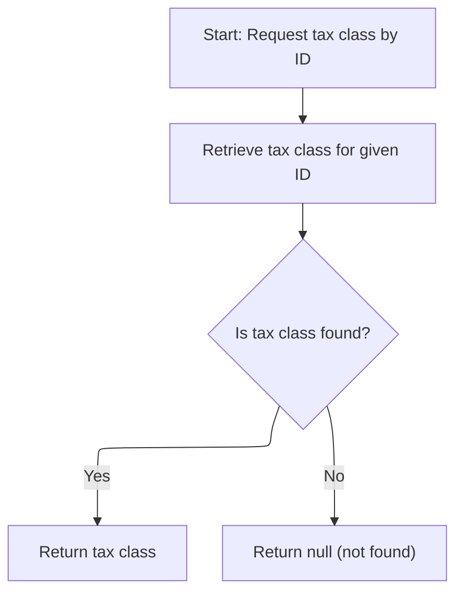
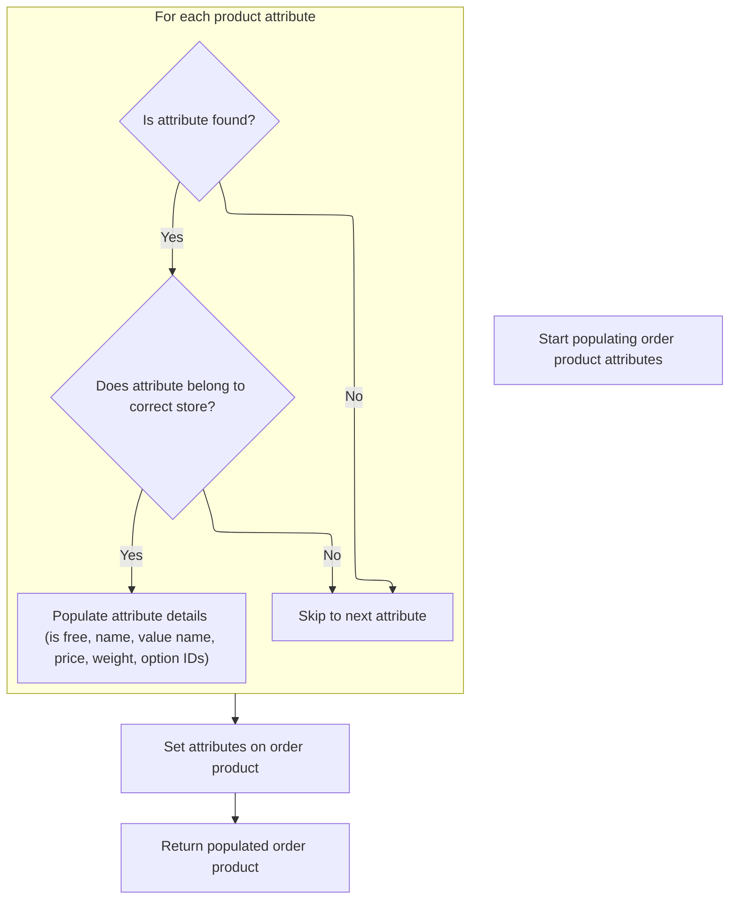

This document describes how a shopping cart item is mapped to an order product, ensuring all required business data is included for order processing. The process validates the cart item, resolves the product for the merchant and language, and enriches the order product with pricing, attributes, and tax information. The output is a complete order product, ready to be added to an order during checkout.

# Where is this flow used?

This flow is used multiple times in the codebase as represented in the following diagram:

(Note - these are only some of the entry points of this flow)

```mermaid
graph TD;
      f13f9c1bd40da50f78f6d6417465d42c18fd1e0ff3cc4f2c65e274fc136de66c(sm-shop/…/facade/OrderFacadeImpl.java::OrderFacadeImpl.processOrder) --> 61940a229c8fe344eb376309cf281c209334a6cc7dcdb5ced715d8a483d938ab(sm-shop/…/order/OrderProductPopulator.java::OrderProductPopulator.populate)

532034aab48f770c0f16bee32b3b05c67a9ba2c21b8e8002b409d1326df06ca5(sm-shop/…/order/OrderApi.java::OrderApi.updateOrderStatus) --> 740f6e3b93709a22ae4e88836a43b117c97c73fc69ed3a098303e3ae531d7703(sm-shop/…/order/OrderApi.java::OrderApi.getOrder)

740f6e3b93709a22ae4e88836a43b117c97c73fc69ed3a098303e3ae531d7703(sm-shop/…/order/OrderApi.java::OrderApi.getOrder) --> ea5792f4f4fd381286ec063a806a0210b6b2c993a8d527f7de4ddb0e67294f75(sm-shop/…/facade/OrderFacadeImpl.java::OrderFacadeImpl.getReadableOrder)

ea5792f4f4fd381286ec063a806a0210b6b2c993a8d527f7de4ddb0e67294f75(sm-shop/…/facade/OrderFacadeImpl.java::OrderFacadeImpl.getReadableOrder) --> 61940a229c8fe344eb376309cf281c209334a6cc7dcdb5ced715d8a483d938ab(sm-shop/…/order/OrderProductPopulator.java::OrderProductPopulator.populate)

ba358b4dedb05ac8d09d453b26d1bcf04e70bf19066988d7ff6d6bc33a0c7539(sm-shop/…/order/OrderApi.java::OrderApi.get) --> ea5792f4f4fd381286ec063a806a0210b6b2c993a8d527f7de4ddb0e67294f75(sm-shop/…/facade/OrderFacadeImpl.java::OrderFacadeImpl.getReadableOrder)

0c5aaa90c00fa763161f190122f44bae71864d9e2dc810b61191e4809e37c332(sm-shop/…/facade/OrderFacadeImpl.java::OrderFacadeImpl.getReadableOrderList) --> 0c5aaa90c00fa763161f190122f44bae71864d9e2dc810b61191e4809e37c332(sm-shop/…/facade/OrderFacadeImpl.java::OrderFacadeImpl.getReadableOrderList)

0c5aaa90c00fa763161f190122f44bae71864d9e2dc810b61191e4809e37c332(sm-shop/…/facade/OrderFacadeImpl.java::OrderFacadeImpl.getReadableOrderList) --> 084154b0f6e5e113a16ab3ee07acc8c0026459d769a306a6ab89489bd24def9e(sm-shop/…/facade/OrderFacadeImpl.java::OrderFacadeImpl.populateOrderList)

084154b0f6e5e113a16ab3ee07acc8c0026459d769a306a6ab89489bd24def9e(sm-shop/…/facade/OrderFacadeImpl.java::OrderFacadeImpl.populateOrderList) --> d94f2fa03414a56905927b36d17e820ea53d07f15a4f7161d1824d49782a5915(sm-shop/…/facade/OrderFacadeImpl.java::OrderFacadeImpl.setOrderProductList)

d94f2fa03414a56905927b36d17e820ea53d07f15a4f7161d1824d49782a5915(sm-shop/…/facade/OrderFacadeImpl.java::OrderFacadeImpl.setOrderProductList) --> 61940a229c8fe344eb376309cf281c209334a6cc7dcdb5ced715d8a483d938ab(sm-shop/…/order/OrderProductPopulator.java::OrderProductPopulator.populate)

4785c63b1f1ffd52d8d4bc1046fa149f841bb29f19d27878ec0d88d86a73bdca(sm-shop/…/order/OrderApi.java::OrderApi.checkout) --> f13f9c1bd40da50f78f6d6417465d42c18fd1e0ff3cc4f2c65e274fc136de66c(sm-shop/…/facade/OrderFacadeImpl.java::OrderFacadeImpl.processOrder)

f13f9c1bd40da50f78f6d6417465d42c18fd1e0ff3cc4f2c65e274fc136de66c(sm-shop/…/facade/OrderFacadeImpl.java::OrderFacadeImpl.processOrder) --> 5eef60b2f1f445f2d47028ca71dcf510b995388ec13162ec7caab5a8317ae7f6(sm-shop/…/facade/OrderFacadeImpl.java::OrderFacadeImpl.processOrderModel)

5eef60b2f1f445f2d47028ca71dcf510b995388ec13162ec7caab5a8317ae7f6(sm-shop/…/facade/OrderFacadeImpl.java::OrderFacadeImpl.processOrderModel) --> 61940a229c8fe344eb376309cf281c209334a6cc7dcdb5ced715d8a483d938ab(sm-shop/…/order/OrderProductPopulator.java::OrderProductPopulator.populate)


classDef mainFlowStyle color:#000000,fill:#7CB9F4
classDef rootsStyle color:#000000,fill:#00FFF4
classDef Style1 color:#000000,fill:#00FFAA
classDef Style2 color:#000000,fill:#FFFF00
classDef Style3 color:#000000,fill:#AA7CB9

%% Swimm:
%% graph TD;
%%       f13f9c1bd40da50f78f6d6417465d42c18fd1e0ff3cc4f2c65e274fc136de66c(<SwmPath>[sm-shop/…/facade/OrderFacadeImpl.java](sm-shop/src/main/java/com/salesmanager/shop/store/controller/order/facade/OrderFacadeImpl.java)</SwmPath>::OrderFacadeImpl.processOrder) --> 61940a229c8fe344eb376309cf281c209334a6cc7dcdb5ced715d8a483d938ab(<SwmPath>[sm-shop/…/order/OrderProductPopulator.java](sm-shop/src/main/java/com/salesmanager/shop/populator/order/OrderProductPopulator.java)</SwmPath>::OrderProductPopulator.populate)
%% 
%% 532034aab48f770c0f16bee32b3b05c67a9ba2c21b8e8002b409d1326df06ca5(<SwmPath>[sm-shop/…/order/OrderApi.java](sm-shop/src/main/java/com/salesmanager/shop/store/api/v1/order/OrderApi.java)</SwmPath>::OrderApi.updateOrderStatus) --> 740f6e3b93709a22ae4e88836a43b117c97c73fc69ed3a098303e3ae531d7703(<SwmPath>[sm-shop/…/order/OrderApi.java](sm-shop/src/main/java/com/salesmanager/shop/store/api/v1/order/OrderApi.java)</SwmPath>::OrderApi.getOrder)
%% 
%% 740f6e3b93709a22ae4e88836a43b117c97c73fc69ed3a098303e3ae531d7703(<SwmPath>[sm-shop/…/order/OrderApi.java](sm-shop/src/main/java/com/salesmanager/shop/store/api/v1/order/OrderApi.java)</SwmPath>::OrderApi.getOrder) --> ea5792f4f4fd381286ec063a806a0210b6b2c993a8d527f7de4ddb0e67294f75(<SwmPath>[sm-shop/…/facade/OrderFacadeImpl.java](sm-shop/src/main/java/com/salesmanager/shop/store/controller/order/facade/OrderFacadeImpl.java)</SwmPath>::OrderFacadeImpl.getReadableOrder)
%% 
%% ea5792f4f4fd381286ec063a806a0210b6b2c993a8d527f7de4ddb0e67294f75(<SwmPath>[sm-shop/…/facade/OrderFacadeImpl.java](sm-shop/src/main/java/com/salesmanager/shop/store/controller/order/facade/OrderFacadeImpl.java)</SwmPath>::OrderFacadeImpl.getReadableOrder) --> 61940a229c8fe344eb376309cf281c209334a6cc7dcdb5ced715d8a483d938ab(<SwmPath>[sm-shop/…/order/OrderProductPopulator.java](sm-shop/src/main/java/com/salesmanager/shop/populator/order/OrderProductPopulator.java)</SwmPath>::OrderProductPopulator.populate)
%% 
%% ba358b4dedb05ac8d09d453b26d1bcf04e70bf19066988d7ff6d6bc33a0c7539(<SwmPath>[sm-shop/…/order/OrderApi.java](sm-shop/src/main/java/com/salesmanager/shop/store/api/v1/order/OrderApi.java)</SwmPath>::OrderApi.get) --> ea5792f4f4fd381286ec063a806a0210b6b2c993a8d527f7de4ddb0e67294f75(<SwmPath>[sm-shop/…/facade/OrderFacadeImpl.java](sm-shop/src/main/java/com/salesmanager/shop/store/controller/order/facade/OrderFacadeImpl.java)</SwmPath>::OrderFacadeImpl.getReadableOrder)
%% 
%% 0c5aaa90c00fa763161f190122f44bae71864d9e2dc810b61191e4809e37c332(<SwmPath>[sm-shop/…/facade/OrderFacadeImpl.java](sm-shop/src/main/java/com/salesmanager/shop/store/controller/order/facade/OrderFacadeImpl.java)</SwmPath>::OrderFacadeImpl.getReadableOrderList) --> 0c5aaa90c00fa763161f190122f44bae71864d9e2dc810b61191e4809e37c332(<SwmPath>[sm-shop/…/facade/OrderFacadeImpl.java](sm-shop/src/main/java/com/salesmanager/shop/store/controller/order/facade/OrderFacadeImpl.java)</SwmPath>::OrderFacadeImpl.getReadableOrderList)
%% 
%% 0c5aaa90c00fa763161f190122f44bae71864d9e2dc810b61191e4809e37c332(<SwmPath>[sm-shop/…/facade/OrderFacadeImpl.java](sm-shop/src/main/java/com/salesmanager/shop/store/controller/order/facade/OrderFacadeImpl.java)</SwmPath>::OrderFacadeImpl.getReadableOrderList) --> 084154b0f6e5e113a16ab3ee07acc8c0026459d769a306a6ab89489bd24def9e(<SwmPath>[sm-shop/…/facade/OrderFacadeImpl.java](sm-shop/src/main/java/com/salesmanager/shop/store/controller/order/facade/OrderFacadeImpl.java)</SwmPath>::OrderFacadeImpl.populateOrderList)
%% 
%% 084154b0f6e5e113a16ab3ee07acc8c0026459d769a306a6ab89489bd24def9e(<SwmPath>[sm-shop/…/facade/OrderFacadeImpl.java](sm-shop/src/main/java/com/salesmanager/shop/store/controller/order/facade/OrderFacadeImpl.java)</SwmPath>::OrderFacadeImpl.populateOrderList) --> d94f2fa03414a56905927b36d17e820ea53d07f15a4f7161d1824d49782a5915(<SwmPath>[sm-shop/…/facade/OrderFacadeImpl.java](sm-shop/src/main/java/com/salesmanager/shop/store/controller/order/facade/OrderFacadeImpl.java)</SwmPath>::OrderFacadeImpl.setOrderProductList)
%% 
%% d94f2fa03414a56905927b36d17e820ea53d07f15a4f7161d1824d49782a5915(<SwmPath>[sm-shop/…/facade/OrderFacadeImpl.java](sm-shop/src/main/java/com/salesmanager/shop/store/controller/order/facade/OrderFacadeImpl.java)</SwmPath>::OrderFacadeImpl.setOrderProductList) --> 61940a229c8fe344eb376309cf281c209334a6cc7dcdb5ced715d8a483d938ab(<SwmPath>[sm-shop/…/order/OrderProductPopulator.java](sm-shop/src/main/java/com/salesmanager/shop/populator/order/OrderProductPopulator.java)</SwmPath>::OrderProductPopulator.populate)
%% 
%% 4785c63b1f1ffd52d8d4bc1046fa149f841bb29f19d27878ec0d88d86a73bdca(<SwmPath>[sm-shop/…/order/OrderApi.java](sm-shop/src/main/java/com/salesmanager/shop/store/api/v1/order/OrderApi.java)</SwmPath>::OrderApi.checkout) --> f13f9c1bd40da50f78f6d6417465d42c18fd1e0ff3cc4f2c65e274fc136de66c(<SwmPath>[sm-shop/…/facade/OrderFacadeImpl.java](sm-shop/src/main/java/com/salesmanager/shop/store/controller/order/facade/OrderFacadeImpl.java)</SwmPath>::OrderFacadeImpl.processOrder)
%% 
%% f13f9c1bd40da50f78f6d6417465d42c18fd1e0ff3cc4f2c65e274fc136de66c(<SwmPath>[sm-shop/…/facade/OrderFacadeImpl.java](sm-shop/src/main/java/com/salesmanager/shop/store/controller/order/facade/OrderFacadeImpl.java)</SwmPath>::OrderFacadeImpl.processOrder) --> 5eef60b2f1f445f2d47028ca71dcf510b995388ec13162ec7caab5a8317ae7f6(<SwmPath>[sm-shop/…/facade/OrderFacadeImpl.java](sm-shop/src/main/java/com/salesmanager/shop/store/controller/order/facade/OrderFacadeImpl.java)</SwmPath>::OrderFacadeImpl.processOrderModel)
%% 
%% 5eef60b2f1f445f2d47028ca71dcf510b995388ec13162ec7caab5a8317ae7f6(<SwmPath>[sm-shop/…/facade/OrderFacadeImpl.java](sm-shop/src/main/java/com/salesmanager/shop/store/controller/order/facade/OrderFacadeImpl.java)</SwmPath>::OrderFacadeImpl.processOrderModel) --> 61940a229c8fe344eb376309cf281c209334a6cc7dcdb5ced715d8a483d938ab(<SwmPath>[sm-shop/…/order/OrderProductPopulator.java](sm-shop/src/main/java/com/salesmanager/shop/populator/order/OrderProductPopulator.java)</SwmPath>::OrderProductPopulator.populate)
%% 
%% 
%% classDef mainFlowStyle color:#000000,fill:#7CB9F4
%% classDef rootsStyle color:#000000,fill:#00FFF4
%% classDef Style1 color:#000000,fill:#00FFAA
%% classDef Style2 color:#000000,fill:#FFFF00
%% classDef Style3 color:#000000,fill:#AA7CB9
```



# Starting the Order-to-Product Mapping

```mermaid
%%{init: {"flowchart": {"defaultRenderer": "elk"}} }%%
flowchart TD
  node1["Start: Prepare order product from cart item"]
  click node1 openCode "sm-shop/src/main/java/com/salesmanager/shop/populator/order/OrderProductPopulator.java:60:69"
  node1 --> node2["Resolving Product by SKU"]
  
  node2 --> node3{"Is product valid for store?"}
  click node3 openCode "sm-shop/src/main/java/com/salesmanager/shop/populator/order/OrderProductPopulator.java:70:76"
  node3 -->|"Yes"| node4["Map digital info, set price, and details"]
  click node4 openCode "sm-shop/src/main/java/com/salesmanager/shop/populator/order/OrderProductPopulator.java:78:115"
  node3 -->|"No"| node7["Return: Cannot process product"]
  click node7 openCode "sm-shop/src/main/java/com/salesmanager/shop/populator/order/OrderProductPopulator.java:71:76"
  subgraph loop1["For each additional price"]
    node4 --> node5["Add price to order product"]
    click node5 openCode "sm-shop/src/main/java/com/salesmanager/shop/populator/order/OrderProductPopulator.java:106:112"
    node5 --> node6["Continue"]
  end
  node4 --> node8{"Are there attributes?"}
  click node8 openCode "sm-shop/src/main/java/com/salesmanager/shop/populator/order/OrderProductPopulator.java:118:144"
  subgraph loop2["For each attribute"]
    node8 --> node9["Fetching Product Option Set"]
    
    node9 --> node10["Continue"]
  end
  node8 -->|"No"| node11["Return populated order product"]
  click node11 openCode "sm-shop/src/main/java/com/salesmanager/shop/populator/order/OrderProductPopulator.java:152:153"
  loop2 --> node11
classDef HeadingStyle fill:#777777,stroke:#333,stroke-width:2px;
click node2 goToHeading "Resolving Product by SKU"
node2:::HeadingStyle
click node9 goToHeading "Fetching Product Option Set"
node9:::HeadingStyle

%% Swimm:
%% %%{init: {"flowchart": {"defaultRenderer": "elk"}} }%%
%% flowchart TD
%%   node1["Start: Prepare order product from cart item"]
%%   click node1 openCode "<SwmPath>[sm-shop/…/order/OrderProductPopulator.java](sm-shop/src/main/java/com/salesmanager/shop/populator/order/OrderProductPopulator.java)</SwmPath>:60:69"
%%   node1 --> node2["Resolving Product by SKU"]
%%   
%%   node2 --> node3{"Is product valid for store?"}
%%   click node3 openCode "<SwmPath>[sm-shop/…/order/OrderProductPopulator.java](sm-shop/src/main/java/com/salesmanager/shop/populator/order/OrderProductPopulator.java)</SwmPath>:70:76"
%%   node3 -->|"Yes"| node4["Map digital info, set price, and details"]
%%   click node4 openCode "<SwmPath>[sm-shop/…/order/OrderProductPopulator.java](sm-shop/src/main/java/com/salesmanager/shop/populator/order/OrderProductPopulator.java)</SwmPath>:78:115"
%%   node3 -->|"No"| node7["Return: Cannot process product"]
%%   click node7 openCode "<SwmPath>[sm-shop/…/order/OrderProductPopulator.java](sm-shop/src/main/java/com/salesmanager/shop/populator/order/OrderProductPopulator.java)</SwmPath>:71:76"
%%   subgraph loop1["For each additional price"]
%%     node4 --> node5["Add price to order product"]
%%     click node5 openCode "<SwmPath>[sm-shop/…/order/OrderProductPopulator.java](sm-shop/src/main/java/com/salesmanager/shop/populator/order/OrderProductPopulator.java)</SwmPath>:106:112"
%%     node5 --> node6["Continue"]
%%   end
%%   node4 --> node8{"Are there attributes?"}
%%   click node8 openCode "<SwmPath>[sm-shop/…/order/OrderProductPopulator.java](sm-shop/src/main/java/com/salesmanager/shop/populator/order/OrderProductPopulator.java)</SwmPath>:118:144"
%%   subgraph loop2["For each attribute"]
%%     node8 --> node9["Fetching Product Option Set"]
%%     
%%     node9 --> node10["Continue"]
%%   end
%%   node8 -->|"No"| node11["Return populated order product"]
%%   click node11 openCode "<SwmPath>[sm-shop/…/order/OrderProductPopulator.java](sm-shop/src/main/java/com/salesmanager/shop/populator/order/OrderProductPopulator.java)</SwmPath>:152:153"
%%   loop2 --> node11
%% classDef HeadingStyle fill:#777777,stroke:#333,stroke-width:2px;
%% click node2 goToHeading "Resolving Product by SKU"
%% node2:::HeadingStyle
%% click node9 goToHeading "Fetching Product Option Set"
%% node9:::HeadingStyle
```



This section ensures that each shopping cart item is correctly mapped to an order product by validating prerequisites, resolving the product by SKU, and preparing product details for the order.

| Category        | Rule Name                            | Description                                                                                                                                |
| --------------- | ------------------------------------ | ------------------------------------------------------------------------------------------------------------------------------------------ |
| Data validation | Product existence and validity check | The product referenced by the cart item's SKU must exist and be valid for the merchant store before proceeding with order product mapping. |
| Data validation | Required services validation         | All required services (product, digital product, and product attribute services) must be available before starting the mapping process.    |
| Business logic  | Additional price mapping             | For each additional price associated with the product, the price must be added to the order product.                                       |
| Business logic  | Product attribute mapping            | If the product has attributes, each attribute must be mapped to the order product, including fetching related product option sets.         |
| Business logic  | No attributes shortcut               | If there are no attributes for the product, the populated order product should be returned immediately.                                    |

<SwmSnippet path="/sm-shop/src/main/java/com/salesmanager/shop/populator/order/OrderProductPopulator.java" line="60">

---

In `OrderProductPopulator.populate`, we kick off by making sure all required services are set, then immediately fetch the Product using the SKU from the cart item. This is needed because everything else (like pricing, digital product checks, and attributes) relies on having the actual Product. Next, we call <SwmToken path="sm-core/src/main/java/com/salesmanager/core/business/services/catalog/product/ProductServiceImpl.java" pos="53:4:4" line-data="public class ProductServiceImpl extends SalesManagerEntityServiceImpl&lt;Long, Product&gt; implements ProductService {">`ProductServiceImpl`</SwmToken> to resolve the SKU to a Product object.

```java
	public OrderProduct populate(ShoppingCartItem source, OrderProduct target,
			MerchantStore store, Language language) throws ConversionException {
		
		Validate.notNull(productService,"productService must be set");
		Validate.notNull(digitalProductService,"digitalProductService must be set");
		Validate.notNull(productAttributeService,"productAttributeService must be set");

		
		try {
			Product modelProduct = productService.getBySku(source.getSku(), store, language);
```

---

</SwmSnippet>

## Resolving Product by SKU



This section is responsible for resolving and returning product details based on a given SKU, merchant, and language. It ensures that only products belonging to the specified merchant are considered, and that the returned information is localized to the requested language. If the product cannot be found, an appropriate error is returned.

| Category        | Rule Name                       | Description                                                                                                                                                        |
| --------------- | ------------------------------- | ------------------------------------------------------------------------------------------------------------------------------------------------------------------ |
| Data validation | SKU and Merchant Match Required | A product can only be resolved if the SKU exists for the specified merchant. If no product matches both the SKU and merchant, the product is considered not found. |
| Business logic  | Localized Product Details       | When a product is found, the returned product details must be localized according to the requested language.                                                       |

<SwmSnippet path="/sm-core/src/main/java/com/salesmanager/core/business/services/catalog/product/ProductServiceImpl.java" line="374">

---

<SwmToken path="sm-core/src/main/java/com/salesmanager/core/business/services/catalog/product/ProductServiceImpl.java" pos="374:5:5" line-data="	public Product getBySku(String productCode, MerchantStore merchant, Language language) throws ServiceException {">`getBySku`</SwmToken> first looks up product IDs matching the SKU and merchant, then fetches the full Product by ID. This two-step is needed because the repository only gives us IDs at first. Next, we might need to resolve option sets for the product, so we call <SwmToken path="sm-core/src/main/java/com/salesmanager/core/business/services/catalog/product/attribute/ProductOptionSetServiceImpl.java" pos="17:4:4" line-data="public class ProductOptionSetServiceImpl extends">`ProductOptionSetServiceImpl`</SwmToken>.

```java
	public Product getBySku(String productCode, MerchantStore merchant, Language language) throws ServiceException {

		try {
			List<Object> products = productRepository.findBySku(productCode, merchant.getId());
			if(products.isEmpty()) {
				throw new ServiceException("Cannot get product with sku [" + productCode + "]");
			}
			BigInteger id = (BigInteger) products.get(0);
			return productRepository.getById(id.longValue(), merchant, language);
		} catch (Exception e) {
			throw new ServiceException("Cannot get product with sku [" + productCode + "]", e);
		}
		


	}
```

---

</SwmSnippet>

## Fetching Product Option Set

This section describes the business rules governing the retrieval of a Product Option Set for a given product, store, and language. The Product Option Set defines configurable options (such as size, color, etc.) that can be presented to customers for a specific product in a specific store and language context.

| Category        | Rule Name                | Description                                                                                                                                                                                                                                                                                                                                                                                                                              |
| --------------- | ------------------------ | ---------------------------------------------------------------------------------------------------------------------------------------------------------------------------------------------------------------------------------------------------------------------------------------------------------------------------------------------------------------------------------------------------------------------------------------- |
| Data validation | Valid Store Association  | A Product Option Set must be associated with a valid Merchant Store. If the store does not exist or is inactive, the option set cannot be fetched.                                                                                                                                                                                                                                                                                       |
| Data validation | Option Set Existence     | The Product Option Set must exist for the provided <SwmToken path="sm-core/src/main/java/com/salesmanager/core/business/services/catalog/product/attribute/ProductOptionSetServiceImpl.java" pos="39:14:14" line-data="	public ProductOptionSet getById(MerchantStore store, Long optionSetId, Language lang) {">`optionSetId`</SwmToken>. If no option set is found, an error must be returned indicating the option set does not exist. |
| Business logic  | Language Presentation    | The Product Option Set must be presented in the language specified by the Language input. If translations are missing, default language values should be used.                                                                                                                                                                                                                                                                           |
| Business logic  | Maintain Product Context | After fetching the Product Option Set, the system may require returning to the main Product details to ensure the product context is maintained for further operations.                                                                                                                                                                                                                                                                  |

<SwmSnippet path="/sm-core/src/main/java/com/salesmanager/core/business/services/catalog/product/attribute/ProductOptionSetServiceImpl.java" line="39">

---

<SwmToken path="sm-core/src/main/java/com/salesmanager/core/business/services/catalog/product/attribute/ProductOptionSetServiceImpl.java" pos="39:5:5" line-data="	public ProductOptionSet getById(MerchantStore store, Long optionSetId, Language lang) {">`getById`</SwmToken> on <SwmToken path="sm-core/src/main/java/com/salesmanager/core/business/services/catalog/product/attribute/ProductOptionSetServiceImpl.java" pos="17:4:4" line-data="public class ProductOptionSetServiceImpl extends">`ProductOptionSetServiceImpl`</SwmToken> fetches the option set for the <SwmPath>[sm-core-model/…/reference/language/](sm-core-model/src/main/java/com/salesmanager/core/model/reference/language/)</SwmPath>. After this, we might need to get back to the main Product details, so we call <SwmToken path="sm-core/src/main/java/com/salesmanager/core/business/services/catalog/product/ProductServiceImpl.java" pos="53:4:4" line-data="public class ProductServiceImpl extends SalesManagerEntityServiceImpl&lt;Long, Product&gt; implements ProductService {">`ProductServiceImpl`</SwmToken> again.

```java
	public ProductOptionSet getById(MerchantStore store, Long optionSetId, Language lang) {
		return productOptionSetRepository.findOne(store.getId(), optionSetId, lang.getId());
	}
```

---

</SwmSnippet>

## Getting Product and Option Value by ID



This section governs the retrieval of a product and its option values by their IDs for a specific merchant. It ensures that both the merchant and product ID are provided before any data is returned, and that the correct product and option values are fetched for the given merchant context.

| Category        | Rule Name                                 | Description                                                                                                                                                                    |
| --------------- | ----------------------------------------- | ------------------------------------------------------------------------------------------------------------------------------------------------------------------------------ |
| Data validation | Merchant Required                         | A merchant (store) must be specified in the request to retrieve a product or option value. If the merchant is not provided, the request must be stopped and an error returned. |
| Data validation | Product ID Required                       | A product ID must be specified in the request to retrieve a product. If the product ID is not provided, the request must be stopped and an error returned.                     |
| Business logic  | Product Retrieval by Merchant and ID      | When both merchant and product ID are provided, the system must retrieve the product that matches both the merchant and the product ID.                                        |
| Business logic  | Option Value Retrieval by Merchant and ID | When an option value ID is provided, the system must retrieve the option value that matches both the merchant and the option value ID.                                         |

<SwmSnippet path="/sm-core/src/main/java/com/salesmanager/core/business/services/catalog/product/ProductServiceImpl.java" line="339">

---

<SwmToken path="sm-core/src/main/java/com/salesmanager/core/business/services/catalog/product/ProductServiceImpl.java" pos="339:5:5" line-data="	public Product findOne(Long id, MerchantStore merchant) {">`findOne`</SwmToken> fetches the Product by its ID and merchant. After this, we need to resolve option values for the product, so we call <SwmToken path="sm-core/src/main/java/com/salesmanager/core/business/services/catalog/product/attribute/ProductOptionValueServiceImpl.java" pos="24:4:4" line-data="public class ProductOptionValueServiceImpl extends">`ProductOptionValueServiceImpl`</SwmToken>.

```java
	public Product findOne(Long id, MerchantStore merchant) {
		Validate.notNull(merchant, "MerchantStore must not be null");
		Validate.notNull(id, "id must not be null");
		return productRepository.getById(id, merchant);
	}
```

---

</SwmSnippet>

<SwmSnippet path="/sm-core/src/main/java/com/salesmanager/core/business/services/catalog/product/attribute/ProductOptionValueServiceImpl.java" line="109">

---

<SwmToken path="sm-core/src/main/java/com/salesmanager/core/business/services/catalog/product/attribute/ProductOptionValueServiceImpl.java" pos="109:5:5" line-data="	public ProductOptionValue getById(MerchantStore store, Long optionValueId) {">`getById`</SwmToken> on <SwmToken path="sm-core/src/main/java/com/salesmanager/core/business/services/catalog/product/attribute/ProductOptionValueServiceImpl.java" pos="24:4:4" line-data="public class ProductOptionValueServiceImpl extends">`ProductOptionValueServiceImpl`</SwmToken> fetches the option value for the store and ID. After this, we might need to get back to the main Product logic, so we call <SwmToken path="sm-core/src/main/java/com/salesmanager/core/business/services/catalog/product/ProductServiceImpl.java" pos="53:4:4" line-data="public class ProductServiceImpl extends SalesManagerEntityServiceImpl&lt;Long, Product&gt; implements ProductService {">`ProductServiceImpl`</SwmToken> again.

```java
	public ProductOptionValue getById(MerchantStore store, Long optionValueId) {
		return productOptionValueRepository.findOne(store.getId(), optionValueId);
	}
```

---

</SwmSnippet>

## Populating Order Product Details

```mermaid
%%{init: {"flowchart": {"defaultRenderer": "elk"}} }%%
flowchart TD
    node1["Start populating order product from cart item"]
    click node1 openCode "sm-shop/src/main/java/com/salesmanager/shop/populator/order/OrderProductPopulator.java:70:125"
    node1 --> node2{"Is product valid and belongs to store?"}
    click node2 openCode "sm-shop/src/main/java/com/salesmanager/shop/populator/order/OrderProductPopulator.java:70:76"
    node2 -->|"No"| node3["Stop: Invalid product"]
    click node3 openCode "sm-shop/src/main/java/com/salesmanager/shop/populator/order/OrderProductPopulator.java:71:76"
    node2 -->|"Yes"| node4{"Is product digital?"}
    click node4 openCode "sm-shop/src/main/java/com/salesmanager/shop/populator/order/OrderProductPopulator.java:78:87"
    node4 -->|"Yes"| node5["Add digital download info"]
    click node5 openCode "sm-shop/src/main/java/com/salesmanager/shop/populator/order/OrderProductPopulator.java:80:87"
    node4 -->|"No"| node6["Continue"]
    node5 --> node7["Set basic order product details"]
    click node7 openCode "sm-shop/src/main/java/com/salesmanager/shop/populator/order/OrderProductPopulator.java:89:93"
    node6 --> node7
    node7 --> node8{"Is final price present?"}
    click node8 openCode "sm-shop/src/main/java/com/salesmanager/shop/populator/order/OrderProductPopulator.java:94:97"
    node8 -->|"No"| node9["Stop: Missing final price"]
    click node9 openCode "sm-shop/src/main/java/com/salesmanager/shop/populator/order/OrderProductPopulator.java:96:97"
    node8 -->|"Yes"| node10["Add main price"]
    click node10 openCode "sm-shop/src/main/java/com/salesmanager/shop/populator/order/OrderProductPopulator.java:99:103"
    node10 --> node11{"Are there additional prices?"}
    click node11 openCode "sm-shop/src/main/java/com/salesmanager/shop/populator/order/OrderProductPopulator.java:106:107"
    node11 -->|"No"| node14["Set prices on order product"]
    click node14 openCode "sm-shop/src/main/java/com/salesmanager/shop/populator/order/OrderProductPopulator.java:115:115"
    node11 -->|"Yes"| loop1
    subgraph loop1["For each additional price"]
      node12["Add additional price to order product"]
      click node12 openCode "sm-shop/src/main/java/com/salesmanager/shop/populator/order/OrderProductPopulator.java:108:112"
      node12 --> node14
    end
    node14 --> node15{"Are there product attributes?"}
    click node15 openCode "sm-shop/src/main/java/com/salesmanager/shop/populator/order/OrderProductPopulator.java:119:119"
    node15 -->|"No"| node18["Finish"]
    node15 -->|"Yes"| loop2
    subgraph loop2["For each product attribute"]
      node16["Add attribute to order product"]
      click node16 openCode "sm-shop/src/main/java/com/salesmanager/shop/populator/order/OrderProductPopulator.java:121:125"
      node16 --> node18["Finish"]
    end
classDef HeadingStyle fill:#777777,stroke:#333,stroke-width:2px;

%% Swimm:
%% %%{init: {"flowchart": {"defaultRenderer": "elk"}} }%%
%% flowchart TD
%%     node1["Start populating order product from cart item"]
%%     click node1 openCode "<SwmPath>[sm-shop/…/order/OrderProductPopulator.java](sm-shop/src/main/java/com/salesmanager/shop/populator/order/OrderProductPopulator.java)</SwmPath>:70:125"
%%     node1 --> node2{"Is product valid and belongs to store?"}
%%     click node2 openCode "<SwmPath>[sm-shop/…/order/OrderProductPopulator.java](sm-shop/src/main/java/com/salesmanager/shop/populator/order/OrderProductPopulator.java)</SwmPath>:70:76"
%%     node2 -->|"No"| node3["Stop: Invalid product"]
%%     click node3 openCode "<SwmPath>[sm-shop/…/order/OrderProductPopulator.java](sm-shop/src/main/java/com/salesmanager/shop/populator/order/OrderProductPopulator.java)</SwmPath>:71:76"
%%     node2 -->|"Yes"| node4{"Is product digital?"}
%%     click node4 openCode "<SwmPath>[sm-shop/…/order/OrderProductPopulator.java](sm-shop/src/main/java/com/salesmanager/shop/populator/order/OrderProductPopulator.java)</SwmPath>:78:87"
%%     node4 -->|"Yes"| node5["Add digital download info"]
%%     click node5 openCode "<SwmPath>[sm-shop/…/order/OrderProductPopulator.java](sm-shop/src/main/java/com/salesmanager/shop/populator/order/OrderProductPopulator.java)</SwmPath>:80:87"
%%     node4 -->|"No"| node6["Continue"]
%%     node5 --> node7["Set basic order product details"]
%%     click node7 openCode "<SwmPath>[sm-shop/…/order/OrderProductPopulator.java](sm-shop/src/main/java/com/salesmanager/shop/populator/order/OrderProductPopulator.java)</SwmPath>:89:93"
%%     node6 --> node7
%%     node7 --> node8{"Is final price present?"}
%%     click node8 openCode "<SwmPath>[sm-shop/…/order/OrderProductPopulator.java](sm-shop/src/main/java/com/salesmanager/shop/populator/order/OrderProductPopulator.java)</SwmPath>:94:97"
%%     node8 -->|"No"| node9["Stop: Missing final price"]
%%     click node9 openCode "<SwmPath>[sm-shop/…/order/OrderProductPopulator.java](sm-shop/src/main/java/com/salesmanager/shop/populator/order/OrderProductPopulator.java)</SwmPath>:96:97"
%%     node8 -->|"Yes"| node10["Add main price"]
%%     click node10 openCode "<SwmPath>[sm-shop/…/order/OrderProductPopulator.java](sm-shop/src/main/java/com/salesmanager/shop/populator/order/OrderProductPopulator.java)</SwmPath>:99:103"
%%     node10 --> node11{"Are there additional prices?"}
%%     click node11 openCode "<SwmPath>[sm-shop/…/order/OrderProductPopulator.java](sm-shop/src/main/java/com/salesmanager/shop/populator/order/OrderProductPopulator.java)</SwmPath>:106:107"
%%     node11 -->|"No"| node14["Set prices on order product"]
%%     click node14 openCode "<SwmPath>[sm-shop/…/order/OrderProductPopulator.java](sm-shop/src/main/java/com/salesmanager/shop/populator/order/OrderProductPopulator.java)</SwmPath>:115:115"
%%     node11 -->|"Yes"| loop1
%%     subgraph loop1["For each additional price"]
%%       node12["Add additional price to order product"]
%%       click node12 openCode "<SwmPath>[sm-shop/…/order/OrderProductPopulator.java](sm-shop/src/main/java/com/salesmanager/shop/populator/order/OrderProductPopulator.java)</SwmPath>:108:112"
%%       node12 --> node14
%%     end
%%     node14 --> node15{"Are there product attributes?"}
%%     click node15 openCode "<SwmPath>[sm-shop/…/order/OrderProductPopulator.java](sm-shop/src/main/java/com/salesmanager/shop/populator/order/OrderProductPopulator.java)</SwmPath>:119:119"
%%     node15 -->|"No"| node18["Finish"]
%%     node15 -->|"Yes"| loop2
%%     subgraph loop2["For each product attribute"]
%%       node16["Add attribute to order product"]
%%       click node16 openCode "<SwmPath>[sm-shop/…/order/OrderProductPopulator.java](sm-shop/src/main/java/com/salesmanager/shop/populator/order/OrderProductPopulator.java)</SwmPath>:121:125"
%%       node16 --> node18["Finish"]
%%     end
%% classDef HeadingStyle fill:#777777,stroke:#333,stroke-width:2px;
```



<SwmSnippet path="/sm-shop/src/main/java/com/salesmanager/shop/populator/order/OrderProductPopulator.java" line="70">

---

Back in `OrderProductPopulator.populate`, after getting the Product, we check for validity, handle digital product downloads, and set all the main fields on the <SwmToken path="sm-shop/src/main/java/com/salesmanager/shop/populator/order/OrderProductPopulator.java" pos="60:3:3" line-data="	public OrderProduct populate(ShoppingCartItem source, OrderProduct target,">`OrderProduct`</SwmToken> (name, price, quantity, SKU). We also assume the <SwmToken path="sm-shop/src/main/java/com/salesmanager/shop/populator/order/OrderProductPopulator.java" pos="60:7:7" line-data="	public OrderProduct populate(ShoppingCartItem source, OrderProduct target,">`ShoppingCartItem`</SwmToken> has a valid product with at least one description, or this will break.

```java
			if(modelProduct==null) {
				throw new ConversionException("Cannot get product with sku " + source.getSku());
			}
			
			if(modelProduct.getMerchantStore().getId().intValue()!=store.getId().intValue()) {
				throw new ConversionException("Invalid product with sku " + source.getSku());
			}

			DigitalProduct digitalProduct = digitalProductService.getByProduct(store, modelProduct);
			
			if(digitalProduct!=null) {
				OrderProductDownload orderProductDownload = new OrderProductDownload();	
				orderProductDownload.setOrderProductFilename(digitalProduct.getProductFileName());
				orderProductDownload.setOrderProduct(target);
				orderProductDownload.setDownloadCount(0);
				orderProductDownload.setMaxdays(ApplicationConstants.MAX_DOWNLOAD_DAYS);
				target.getDownloads().add(orderProductDownload);
			}

			target.setOneTimeCharge(source.getItemPrice());	
			target.setProductName(source.getProduct().getDescriptions().iterator().next().getName());
			target.setProductQuantity(source.getQuantity());
			target.setSku(source.getProduct().getSku());
			
			FinalPrice finalPrice = source.getFinalPrice();
			if(finalPrice==null) {
				throw new ConversionException("Object final price not populated in shoppingCartItem (source)");
			}
			//Default price
			OrderProductPrice orderProductPrice = orderProductPrice(finalPrice);
			orderProductPrice.setOrderProduct(target);
			
			Set<OrderProductPrice> prices = new HashSet<OrderProductPrice>();
			prices.add(orderProductPrice);

			//Other prices
			List<FinalPrice> otherPrices = finalPrice.getAdditionalPrices();
			if(otherPrices!=null) {
				for(FinalPrice otherPrice : otherPrices) {
					OrderProductPrice other = orderProductPrice(otherPrice);
					other.setOrderProduct(target);
					prices.add(other);
				}
```

---

</SwmSnippet>

<SwmSnippet path="/sm-shop/src/main/java/com/salesmanager/shop/populator/order/OrderProductPopulator.java" line="115">

---

Here we process each attribute from the cart item, resolve its details from the database, and attach it to the <SwmToken path="sm-shop/src/main/java/com/salesmanager/shop/populator/order/OrderProductPopulator.java" pos="60:3:3" line-data="	public OrderProduct populate(ShoppingCartItem source, OrderProduct target,">`OrderProduct`</SwmToken>. Next, we need to fetch tax class info for the product, so we call the tax service.

```java
			target.setPrices(prices);
			
			//OrderProductAttribute
			Set<ShoppingCartAttributeItem> attributeItems = source.getAttributes();
			if(!CollectionUtils.isEmpty(attributeItems)) {
				Set<OrderProductAttribute> attributes = new HashSet<OrderProductAttribute>();
				for(ShoppingCartAttributeItem attribute : attributeItems) {
					OrderProductAttribute orderProductAttribute = new OrderProductAttribute();
					orderProductAttribute.setOrderProduct(target);
					Long id = attribute.getProductAttributeId();
					ProductAttribute attr = productAttributeService.getById(id);
```

---

</SwmSnippet>

## Resolving Tax Class and Category



This section governs how the system determines the applicable tax class and product category for a given product, ensuring that tax calculations and category-based logic are based on valid and existing data.

| Category        | Rule Name                      | Description                                                                                                                                                         |
| --------------- | ------------------------------ | ------------------------------------------------------------------------------------------------------------------------------------------------------------------- |
| Data validation | Tax class existence validation | A tax class must be retrieved using a valid tax class ID. If the tax class does not exist for the provided ID, the result must be null.                             |
| Data validation | Category existence enforcement | A category must be retrieved using a valid category ID and store ID. If the category does not exist, an error must be thrown indicating the category was not found. |
| Business logic  | Tax logic precondition         | If either the tax class or category cannot be resolved, the system must not proceed with further tax logic for the product.                                         |

<SwmSnippet path="/sm-core/src/main/java/com/salesmanager/core/business/services/tax/TaxClassServiceImpl.java" line="53">

---

<SwmToken path="sm-core/src/main/java/com/salesmanager/core/business/services/tax/TaxClassServiceImpl.java" pos="53:5:5" line-data="	public TaxClass getById(Long id) {">`getById`</SwmToken> on <SwmToken path="sm-core/src/main/java/com/salesmanager/core/business/services/tax/TaxClassServiceImpl.java" pos="17:4:4" line-data="public class TaxClassServiceImpl extends SalesManagerEntityServiceImpl&lt;Long, TaxClass&gt;">`TaxClassServiceImpl`</SwmToken> fetches the tax class for the product. Next, we may need to resolve the product's category, so we call <SwmToken path="sm-shop/src/main/java/com/salesmanager/shop/store/facade/category/CategoryFacadeImpl.java" pos="50:4:4" line-data="public class CategoryFacadeImpl implements CategoryFacade {">`CategoryFacadeImpl`</SwmToken>.

```java
	public TaxClass getById(Long id) {
		return taxClassRepository.getOne(id);
	}
```

---

</SwmSnippet>

<SwmSnippet path="/sm-shop/src/main/java/com/salesmanager/shop/store/facade/category/CategoryFacadeImpl.java" line="365">

---

<SwmToken path="sm-shop/src/main/java/com/salesmanager/shop/store/facade/category/CategoryFacadeImpl.java" pos="365:5:5" line-data="	private Category getOne(Long categoryId, int storeId) {">`getOne`</SwmToken> fetches the category for the given ID and store. After this, we may need to go back to tax logic, so we call <SwmToken path="sm-core/src/main/java/com/salesmanager/core/business/services/tax/TaxClassServiceImpl.java" pos="17:4:4" line-data="public class TaxClassServiceImpl extends SalesManagerEntityServiceImpl&lt;Long, TaxClass&gt;">`TaxClassServiceImpl`</SwmToken> again if needed.

```java
	private Category getOne(Long categoryId, int storeId) {
		return Optional.ofNullable(categoryService.getById(categoryId)).orElseThrow(
				() -> new ResourceNotFoundException(String.format("No Category found for ID : %s", categoryId)));
	}
```

---

</SwmSnippet>

## Finalizing Order Product Population



<SwmSnippet path="/sm-shop/src/main/java/com/salesmanager/shop/populator/order/OrderProductPopulator.java" line="126">

---

Back in `OrderProductPopulator.populate`, after resolving tax class, we validate each attribute, set all its fields, and attach it to the <SwmToken path="sm-shop/src/main/java/com/salesmanager/shop/populator/order/OrderProductPopulator.java" pos="60:3:3" line-data="	public OrderProduct populate(ShoppingCartItem source, OrderProduct target,">`OrderProduct`</SwmToken>. If anything's off (like wrong store or missing attribute), we throw an exception to prevent bad data.

```java
					if(attr==null) {
						throw new ConversionException("Attribute id " + id + " does not exists");
					}
					
					if(attr.getProduct().getMerchantStore().getId().intValue()!=store.getId().intValue()) {
						throw new ConversionException("Attribute id " + id + " invalid for this store");
					}
					
					orderProductAttribute.setProductAttributeIsFree(attr.getProductAttributeIsFree());
					orderProductAttribute.setProductAttributeName(attr.getProductOption().getDescriptionsSettoList().get(0).getName());
					orderProductAttribute.setProductAttributeValueName(attr.getProductOptionValue().getDescriptionsSettoList().get(0).getName());
					orderProductAttribute.setProductAttributePrice(attr.getProductAttributePrice());
					orderProductAttribute.setProductAttributeWeight(attr.getProductAttributeWeight());
					orderProductAttribute.setProductOptionId(attr.getProductOption().getId());
					orderProductAttribute.setProductOptionValueId(attr.getProductOptionValue().getId());
					attributes.add(orderProductAttribute);
				}
				target.setOrderAttributes(attributes);
			}

			
		} catch (Exception e) {
			throw new ConversionException(e);
		}
		
		
		return target;
	}
```

---

</SwmSnippet>

&nbsp;

*This is an auto-generated document by Swimm 🌊 and has not yet been verified by a human*

<SwmMeta version="3.0.0" repo-id="Z2l0aHViJTNBJTNBc2hvcGl6ZXIlM0ElM0FTd2ltbS1EZW1v" repo-name="shopizer"><sup>Powered by [Swimm](https://app.swimm.io/)</sup></SwmMeta>
