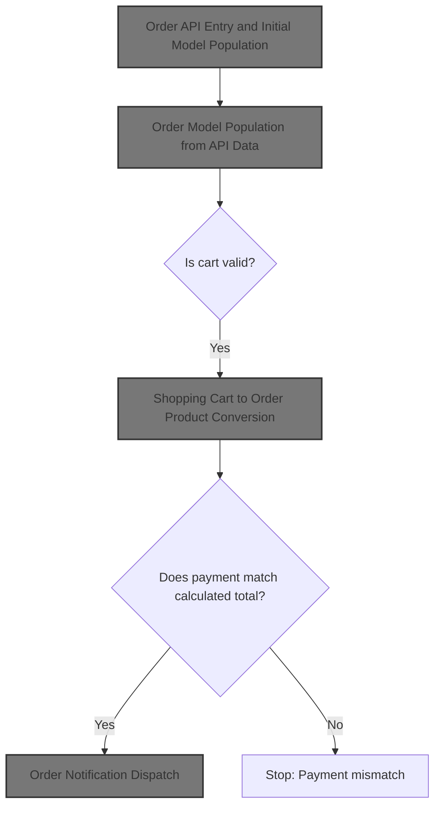
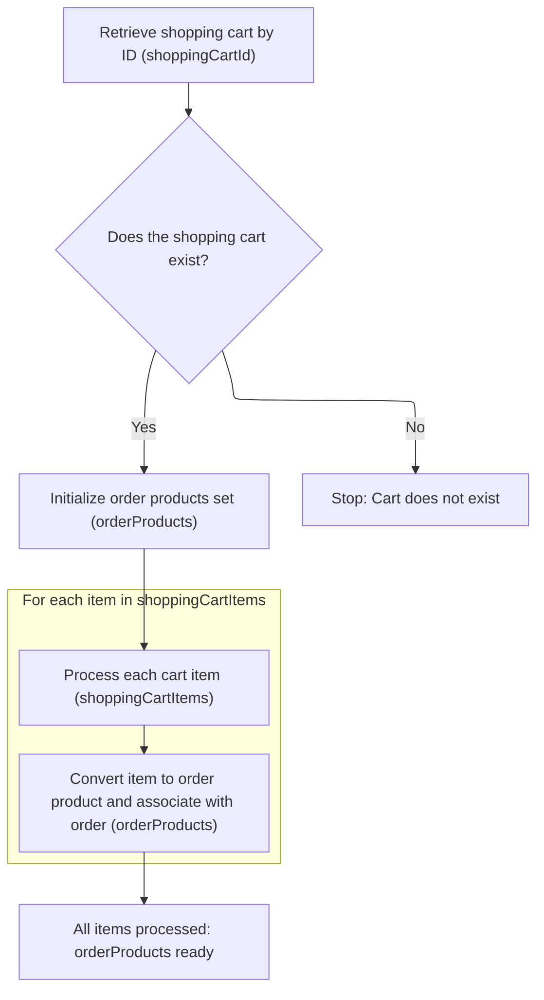

This document describes the flow for processing an order submitted via the API. When a customer places an order, the system validates and transforms the order data, converts cart items into order products, attaches custom attributes, and calculates the total. The payment amount is checked against the calculated total, and if valid, the order is processed and the cart is updated. Notification emails are sent to both the customer and merchant, including download information for digital products when applicable.



# Order API Entry and Initial Model Population

```mermaid
%%{init: {"flowchart": {"defaultRenderer": "elk"}} }%%
flowchart TD
  node1["Order Model Population from API Data"]
  
  node1 --> node2{"Does cart exist?"}
  click node2 openCode "sm-shop/src/main/java/com/salesmanager/shop/store/controller/order/facade/OrderFacadeImpl.java:1211:1216"
  node2 -->|"Yes"| node3["Transform cart items into order products"]
  click node3 openCode "sm-shop/src/main/java/com/salesmanager/shop/store/controller/order/facade/OrderFacadeImpl.java:1229:1234"
  node2 -->|"No"| node7["Stop: Cart not found"]
  click node7 openCode "sm-shop/src/main/java/com/salesmanager/shop/store/controller/order/facade/OrderFacadeImpl.java:1214:1216"

  subgraph loop1["For each item in cart"]
    node3 --> node4["Order Product Population from Cart Item"]
    
    node4 --> node3
  end

  node3 --> node5["Attach order attributes if present"]
  click node5 openCode "sm-shop/src/main/java/com/salesmanager/shop/store/controller/order/facade/OrderFacadeImpl.java:1238:1248"

  node5 --> node6{"Does payment amount match calculated total?"}
  click node6 openCode "sm-shop/src/main/java/com/salesmanager/shop/store/controller/order/facade/OrderFacadeImpl.java:1289:1294"
  node6 -->|"Yes"| node8["Process order and update cart"]
  click node8 openCode "sm-shop/src/main/java/com/salesmanager/shop/store/controller/order/facade/OrderFacadeImpl.java:1328:1334"
  node8 --> node9{"Send confirmation email?"}
  click node9 openCode "sm-shop/src/main/java/com/salesmanager/shop/store/controller/order/facade/OrderFacadeImpl.java:1339:1349"
  node9 -->|"Yes"| node10["Order Notification Dispatch"]
  
  node9 -->|"No"| node11["Finish"]
  click node11 openCode "sm-shop/src/main/java/com/salesmanager/shop/store/controller/order/facade/OrderFacadeImpl.java:1351:1359"
  node6 -->|"No"| node12["Stop: Payment mismatch"]
  click node12 openCode "sm-shop/src/main/java/com/salesmanager/shop/store/controller/order/facade/OrderFacadeImpl.java:1292:1294"

classDef HeadingStyle fill:#777777,stroke:#333,stroke-width:2px;
click node1 goToHeading "Order Model Population from API Data"
node1:::HeadingStyle
click node4 goToHeading "Order Product Population from Cart Item"
node4:::HeadingStyle
click node10 goToHeading "Order Notification Dispatch"
node10:::HeadingStyle

%% Swimm:
%% %%{init: {"flowchart": {"defaultRenderer": "elk"}} }%%
%% flowchart TD
%%   node1["Order Model Population from API Data"]
%%   
%%   node1 --> node2{"Does cart exist?"}
%%   click node2 openCode "<SwmPath>[sm-shop/…/facade/OrderFacadeImpl.java](sm-shop/src/main/java/com/salesmanager/shop/store/controller/order/facade/OrderFacadeImpl.java)</SwmPath>:1211:1216"
%%   node2 -->|"Yes"| node3["Transform cart items into order products"]
%%   click node3 openCode "<SwmPath>[sm-shop/…/facade/OrderFacadeImpl.java](sm-shop/src/main/java/com/salesmanager/shop/store/controller/order/facade/OrderFacadeImpl.java)</SwmPath>:1229:1234"
%%   node2 -->|"No"| node7["Stop: Cart not found"]
%%   click node7 openCode "<SwmPath>[sm-shop/…/facade/OrderFacadeImpl.java](sm-shop/src/main/java/com/salesmanager/shop/store/controller/order/facade/OrderFacadeImpl.java)</SwmPath>:1214:1216"
%% 
%%   subgraph loop1["For each item in cart"]
%%     node3 --> node4["Order Product Population from Cart Item"]
%%     
%%     node4 --> node3
%%   end
%% 
%%   node3 --> node5["Attach order attributes if present"]
%%   click node5 openCode "<SwmPath>[sm-shop/…/facade/OrderFacadeImpl.java](sm-shop/src/main/java/com/salesmanager/shop/store/controller/order/facade/OrderFacadeImpl.java)</SwmPath>:1238:1248"
%% 
%%   node5 --> node6{"Does payment amount match calculated total?"}
%%   click node6 openCode "<SwmPath>[sm-shop/…/facade/OrderFacadeImpl.java](sm-shop/src/main/java/com/salesmanager/shop/store/controller/order/facade/OrderFacadeImpl.java)</SwmPath>:1289:1294"
%%   node6 -->|"Yes"| node8["Process order and update cart"]
%%   click node8 openCode "<SwmPath>[sm-shop/…/facade/OrderFacadeImpl.java](sm-shop/src/main/java/com/salesmanager/shop/store/controller/order/facade/OrderFacadeImpl.java)</SwmPath>:1328:1334"
%%   node8 --> node9{"Send confirmation email?"}
%%   click node9 openCode "<SwmPath>[sm-shop/…/facade/OrderFacadeImpl.java](sm-shop/src/main/java/com/salesmanager/shop/store/controller/order/facade/OrderFacadeImpl.java)</SwmPath>:1339:1349"
%%   node9 -->|"Yes"| node10["Order Notification Dispatch"]
%%   
%%   node9 -->|"No"| node11["Finish"]
%%   click node11 openCode "<SwmPath>[sm-shop/…/facade/OrderFacadeImpl.java](sm-shop/src/main/java/com/salesmanager/shop/store/controller/order/facade/OrderFacadeImpl.java)</SwmPath>:1351:1359"
%%   node6 -->|"No"| node12["Stop: Payment mismatch"]
%%   click node12 openCode "<SwmPath>[sm-shop/…/facade/OrderFacadeImpl.java](sm-shop/src/main/java/com/salesmanager/shop/store/controller/order/facade/OrderFacadeImpl.java)</SwmPath>:1292:1294"
%% 
%% classDef HeadingStyle fill:#777777,stroke:#333,stroke-width:2px;
%% click node1 goToHeading "Order Model Population from API Data"
%% node1:::HeadingStyle
%% click node4 goToHeading "Order Product Population from Cart Item"
%% node4:::HeadingStyle
%% click node10 goToHeading "Order Notification Dispatch"
%% node10:::HeadingStyle
```



This section governs how incoming order data from the API is validated and transformed into the internal Order model, ensuring all required business conditions are met before proceeding with payment and fulfillment steps.

| Category        | Rule Name                          | Description                                                                                                                                                                                                          |
| --------------- | ---------------------------------- | -------------------------------------------------------------------------------------------------------------------------------------------------------------------------------------------------------------------- |
| Data validation | Cart Existence Requirement         | An order cannot be processed unless a valid cart exists for the customer. If the cart is not found, the order process must stop and an error is returned.                                                            |
| Data validation | Payment Amount Validation          | The payment amount provided by the customer must exactly match the total calculated from the cart contents and any additional charges. If there is a mismatch, the order process must stop and an error is returned. |
| Business logic  | Cart Item to Order Product Mapping | Each item in the customer's cart must be transformed into a corresponding order product entry in the order model.                                                                                                    |
| Business logic  | Order Attribute Attachment         | If the order includes additional attributes (such as customizations or notes), these must be attached to the order model.                                                                                            |
| Business logic  | Cart Update on Order Success       | If the order is successfully processed, the cart must be updated to reflect the order and prevent duplicate processing.                                                                                              |
| Business logic  | Order Confirmation Notification    | If configured, a confirmation email must be sent to the customer after the order is successfully processed.                                                                                                          |

<SwmSnippet path="/sm-shop/src/main/java/com/salesmanager/shop/store/controller/order/facade/OrderFacadeImpl.java" line="1196">

---

In <SwmToken path="sm-shop/src/main/java/com/salesmanager/shop/store/controller/order/facade/OrderFacadeImpl.java" pos="1196:5:5" line-data="	public Order processOrder(com.salesmanager.shop.model.order.v1.PersistableOrder order, Customer customer,">`processOrder`</SwmToken>, we validate inputs and create the Order model, then immediately call the populator to convert the API order into our internal format so we can work with it.

```java
	public Order processOrder(com.salesmanager.shop.model.order.v1.PersistableOrder order, Customer customer,
			MerchantStore store, Language language, Locale locale) throws ServiceException {

		Validate.notNull(order, "Order cannot be null");
		Validate.notNull(customer, "Customer cannot be null");
		Validate.notNull(store, "MerchantStore cannot be null");
		Validate.notNull(language, "Language cannot be null");
		Validate.notNull(locale, "Locale cannot be null");

		try {


			Order modelOrder = new Order();
			persistableOrderApiPopulator.populate(order, modelOrder, store, language);

```

---

</SwmSnippet>

## Order Model Population from API Data

```mermaid
%%{init: {"flowchart": {"defaultRenderer": "elk"}} }%%
flowchart TD
  node1["Start: Populate Order from API"]
  click node1 openCode "sm-shop/src/main/java/com/salesmanager/shop/populator/order/PersistableOrderApiPopulator.java:59:61"
  node1 --> node2{"Is target Order provided?"}
  click node2 openCode "sm-shop/src/main/java/com/salesmanager/shop/populator/order/PersistableOrderApiPopulator.java:73:75"
  node2 -->|"No"| node3["Create new Order"]
  click node3 openCode "sm-shop/src/main/java/com/salesmanager/shop/populator/order/PersistableOrderApiPopulator.java:74:75"
  node2 -->|"Yes"| node4["Use existing Order"]
  click node4 openCode "sm-shop/src/main/java/com/salesmanager/shop/populator/order/PersistableOrderApiPopulator.java:75:76"
  node3 --> node5["Validate currency"]
  node4 --> node5
  click node5 openCode "sm-shop/src/main/java/com/salesmanager/shop/populator/order/PersistableOrderApiPopulator.java:83:91"
  node5 --> node6{"Is currency valid?"}
  click node6 openCode "sm-shop/src/main/java/com/salesmanager/shop/populator/order/PersistableOrderApiPopulator.java:89:91"
  node6 -->|"No"| node7["Fail: Currency not found"]
  click node7 openCode "sm-shop/src/main/java/com/salesmanager/shop/populator/order/PersistableOrderApiPopulator.java:90:91"
  node6 -->|"Yes"| node8{"Is customerId present and valid?"}
  click node8 openCode "sm-shop/src/main/java/com/salesmanager/shop/populator/order/PersistableOrderApiPopulator.java:95:96"
  node8 -->|"Yes"| node9["Assign customer by ID"]
  click node9 openCode "sm-shop/src/main/java/com/salesmanager/shop/populator/order/PersistableOrderApiPopulator.java:96:102"
  node8 -->|"No"| node10{"Is this an anonymous order?"}
  click node10 openCode "sm-shop/src/main/java/com/salesmanager/shop/populator/order/PersistableOrderApiPopulator.java:105:111"
  node10 -->|"Yes"| node11["Create customer from API details"]
  click node11 openCode "sm-shop/src/main/java/com/salesmanager/shop/populator/order/PersistableOrderApiPopulator.java:106:108"
  node10 -->|"No"| node12["Fail: Customer info missing"]
  click node12 openCode "sm-shop/src/main/java/com/salesmanager/shop/populator/order/PersistableOrderApiPopulator.java:110:111"
  node9 --> node13["Assign customer and details to Order"]
  click node13 openCode "sm-shop/src/main/java/com/salesmanager/shop/populator/order/PersistableOrderApiPopulator.java:115:121"
  node11 --> node13
  node13 --> node14{"Are attributes present?"}
  click node14 openCode "sm-shop/src/main/java/com/salesmanager/shop/populator/order/PersistableOrderApiPopulator.java:123:133"
  node14 -->|"No"| node16["Set order details (date, payment, status, etc.)"]
  click node16 openCode "sm-shop/src/main/java/com/salesmanager/shop/populator/order/PersistableOrderApiPopulator.java:135:146"
  subgraph loop1["For each attribute in API request"]
    node14 -->|"Yes"| node15["Add attribute to Order"]
    click node15 openCode "sm-shop/src/main/java/com/salesmanager/shop/populator/order/PersistableOrderApiPopulator.java:125:131"
    node15 --> node16
  end
  node16 --> node17{"Are comments present?"}
  click node17 openCode "sm-shop/src/main/java/com/salesmanager/shop/populator/order/PersistableOrderApiPopulator.java:149:155"
  node17 -->|"Yes"| node18["Add comments to order history"]
  click node18 openCode "sm-shop/src/main/java/com/salesmanager/shop/populator/order/PersistableOrderApiPopulator.java:150:154"
  node17 -->|"No"| node19["Return populated Order"]
  click node19 openCode "sm-shop/src/main/java/com/salesmanager/shop/populator/order/PersistableOrderApiPopulator.java:157:157"
  node18 --> node19

classDef HeadingStyle fill:#777777,stroke:#333,stroke-width:2px;

%% Swimm:
%% %%{init: {"flowchart": {"defaultRenderer": "elk"}} }%%
%% flowchart TD
%%   node1["Start: Populate Order from API"]
%%   click node1 openCode "<SwmPath>[sm-shop/…/order/PersistableOrderApiPopulator.java](sm-shop/src/main/java/com/salesmanager/shop/populator/order/PersistableOrderApiPopulator.java)</SwmPath>:59:61"
%%   node1 --> node2{"Is target Order provided?"}
%%   click node2 openCode "<SwmPath>[sm-shop/…/order/PersistableOrderApiPopulator.java](sm-shop/src/main/java/com/salesmanager/shop/populator/order/PersistableOrderApiPopulator.java)</SwmPath>:73:75"
%%   node2 -->|"No"| node3["Create new Order"]
%%   click node3 openCode "<SwmPath>[sm-shop/…/order/PersistableOrderApiPopulator.java](sm-shop/src/main/java/com/salesmanager/shop/populator/order/PersistableOrderApiPopulator.java)</SwmPath>:74:75"
%%   node2 -->|"Yes"| node4["Use existing Order"]
%%   click node4 openCode "<SwmPath>[sm-shop/…/order/PersistableOrderApiPopulator.java](sm-shop/src/main/java/com/salesmanager/shop/populator/order/PersistableOrderApiPopulator.java)</SwmPath>:75:76"
%%   node3 --> node5["Validate currency"]
%%   node4 --> node5
%%   click node5 openCode "<SwmPath>[sm-shop/…/order/PersistableOrderApiPopulator.java](sm-shop/src/main/java/com/salesmanager/shop/populator/order/PersistableOrderApiPopulator.java)</SwmPath>:83:91"
%%   node5 --> node6{"Is currency valid?"}
%%   click node6 openCode "<SwmPath>[sm-shop/…/order/PersistableOrderApiPopulator.java](sm-shop/src/main/java/com/salesmanager/shop/populator/order/PersistableOrderApiPopulator.java)</SwmPath>:89:91"
%%   node6 -->|"No"| node7["Fail: Currency not found"]
%%   click node7 openCode "<SwmPath>[sm-shop/…/order/PersistableOrderApiPopulator.java](sm-shop/src/main/java/com/salesmanager/shop/populator/order/PersistableOrderApiPopulator.java)</SwmPath>:90:91"
%%   node6 -->|"Yes"| node8{"Is <SwmToken path="sm-shop/src/main/java/com/salesmanager/shop/populator/order/PersistableOrderApiPopulator.java" pos="96:3:3" line-data="			  Long customerId = source.getCustomerId();">`customerId`</SwmToken> present and valid?"}
%%   click node8 openCode "<SwmPath>[sm-shop/…/order/PersistableOrderApiPopulator.java](sm-shop/src/main/java/com/salesmanager/shop/populator/order/PersistableOrderApiPopulator.java)</SwmPath>:95:96"
%%   node8 -->|"Yes"| node9["Assign customer by ID"]
%%   click node9 openCode "<SwmPath>[sm-shop/…/order/PersistableOrderApiPopulator.java](sm-shop/src/main/java/com/salesmanager/shop/populator/order/PersistableOrderApiPopulator.java)</SwmPath>:96:102"
%%   node8 -->|"No"| node10{"Is this an anonymous order?"}
%%   click node10 openCode "<SwmPath>[sm-shop/…/order/PersistableOrderApiPopulator.java](sm-shop/src/main/java/com/salesmanager/shop/populator/order/PersistableOrderApiPopulator.java)</SwmPath>:105:111"
%%   node10 -->|"Yes"| node11["Create customer from API details"]
%%   click node11 openCode "<SwmPath>[sm-shop/…/order/PersistableOrderApiPopulator.java](sm-shop/src/main/java/com/salesmanager/shop/populator/order/PersistableOrderApiPopulator.java)</SwmPath>:106:108"
%%   node10 -->|"No"| node12["Fail: Customer info missing"]
%%   click node12 openCode "<SwmPath>[sm-shop/…/order/PersistableOrderApiPopulator.java](sm-shop/src/main/java/com/salesmanager/shop/populator/order/PersistableOrderApiPopulator.java)</SwmPath>:110:111"
%%   node9 --> node13["Assign customer and details to Order"]
%%   click node13 openCode "<SwmPath>[sm-shop/…/order/PersistableOrderApiPopulator.java](sm-shop/src/main/java/com/salesmanager/shop/populator/order/PersistableOrderApiPopulator.java)</SwmPath>:115:121"
%%   node11 --> node13
%%   node13 --> node14{"Are attributes present?"}
%%   click node14 openCode "<SwmPath>[sm-shop/…/order/PersistableOrderApiPopulator.java](sm-shop/src/main/java/com/salesmanager/shop/populator/order/PersistableOrderApiPopulator.java)</SwmPath>:123:133"
%%   node14 -->|"No"| node16["Set order details (date, payment, status, etc.)"]
%%   click node16 openCode "<SwmPath>[sm-shop/…/order/PersistableOrderApiPopulator.java](sm-shop/src/main/java/com/salesmanager/shop/populator/order/PersistableOrderApiPopulator.java)</SwmPath>:135:146"
%%   subgraph loop1["For each attribute in API request"]
%%     node14 -->|"Yes"| node15["Add attribute to Order"]
%%     click node15 openCode "<SwmPath>[sm-shop/…/order/PersistableOrderApiPopulator.java](sm-shop/src/main/java/com/salesmanager/shop/populator/order/PersistableOrderApiPopulator.java)</SwmPath>:125:131"
%%     node15 --> node16
%%   end
%%   node16 --> node17{"Are comments present?"}
%%   click node17 openCode "<SwmPath>[sm-shop/…/order/PersistableOrderApiPopulator.java](sm-shop/src/main/java/com/salesmanager/shop/populator/order/PersistableOrderApiPopulator.java)</SwmPath>:149:155"
%%   node17 -->|"Yes"| node18["Add comments to order history"]
%%   click node18 openCode "<SwmPath>[sm-shop/…/order/PersistableOrderApiPopulator.java](sm-shop/src/main/java/com/salesmanager/shop/populator/order/PersistableOrderApiPopulator.java)</SwmPath>:150:154"
%%   node17 -->|"No"| node19["Return populated Order"]
%%   click node19 openCode "<SwmPath>[sm-shop/…/order/PersistableOrderApiPopulator.java](sm-shop/src/main/java/com/salesmanager/shop/populator/order/PersistableOrderApiPopulator.java)</SwmPath>:157:157"
%%   node18 --> node19
%% 
%% classDef HeadingStyle fill:#777777,stroke:#333,stroke-width:2px;
```



This section ensures that an Order object is correctly and completely populated from API data, including validation of required fields (such as currency and customer), mapping of custom attributes, and setting of all core order fields. The goal is to guarantee that the resulting Order is valid and ready for downstream processing in the e-commerce workflow.

| Category        | Rule Name                   | Description                                                                                                                                                                                                                                                                                                                                                                                                                      |
| --------------- | --------------------------- | -------------------------------------------------------------------------------------------------------------------------------------------------------------------------------------------------------------------------------------------------------------------------------------------------------------------------------------------------------------------------------------------------------------------------------- |
| Data validation | Currency Validation         | The currency code provided in the API input must correspond to a valid currency in the system. If the currency is not found, the process must fail with an error.                                                                                                                                                                                                                                                                |
| Business logic  | Order Target Selection      | If a target Order is not provided, a new Order must be created for population. If a target Order is provided, it must be used for population.                                                                                                                                                                                                                                                                                    |
| Business logic  | Customer Assignment         | If a <SwmToken path="sm-shop/src/main/java/com/salesmanager/shop/populator/order/PersistableOrderApiPopulator.java" pos="96:3:3" line-data="			  Long customerId = source.getCustomerId();">`customerId`</SwmToken> is provided and valid, the customer must be fetched by ID. If not, and the order is anonymous, customer details must be created from the API data. If neither is possible, the process must fail with an error. |
| Business logic  | Custom Attribute Mapping    | If custom attributes are present in the API input, each attribute must be added to the Order as an <SwmToken path="sm-shop/src/main/java/com/salesmanager/shop/store/controller/order/facade/OrderFacadeImpl.java" pos="1239:3:3" line-data="				Set&lt;OrderAttribute&gt; attrs = new HashSet&lt;OrderAttribute&gt;();">`OrderAttribute`</SwmToken>. If no attributes are present, this step is skipped.                            |
| Business logic  | Core Order Field Population | The Order must be populated with all required core fields, including date purchased, currency, merchant, channel, status, payment module, payment type, customer agreement, and confirmed address. The status must be set to 'ORDERED' and the channel to 'API'.                                                                                                                                                                 |
| Business logic  | Order Comments Handling     | If comments are present in the API input, they must be added to the order's history as a new <SwmToken path="sm-shop/src/main/java/com/salesmanager/shop/populator/order/PersistableOrderApiPopulator.java" pos="150:1:1" line-data="				OrderStatusHistory statusHistory = new OrderStatusHistory();">`OrderStatusHistory`</SwmToken> entry.                                                                                        |

<SwmSnippet path="/sm-shop/src/main/java/com/salesmanager/shop/populator/order/PersistableOrderApiPopulator.java" line="59">

---

In <SwmToken path="sm-shop/src/main/java/com/salesmanager/shop/populator/order/PersistableOrderApiPopulator.java" pos="59:5:5" line-data="	public Order populate(PersistableOrder source, Order target, MerchantStore store, Language language)">`populate`</SwmToken>, we resolve the currency from the code, fetch the customer either by ID or from embedded data for anonymous orders, and map custom attributes from the API order to the internal Order model. This sets up all the core fields needed for the order to be processed.

```java
	public Order populate(PersistableOrder source, Order target, MerchantStore store, Language language)
			throws ConversionException {
		

/*		Validate.notNull(currencyService,"currencyService must be set");
		Validate.notNull(customerService,"customerService must be set");
		Validate.notNull(shoppingCartService,"shoppingCartService must be set");
		Validate.notNull(productService,"productService must be set");
		Validate.notNull(productAttributeService,"productAttributeService must be set");
		Validate.notNull(digitalProductService,"digitalProductService must be set");*/
		Validate.notNull(source.getPayment(),"Payment cannot be null");
		
		try {
			
			if(target == null) {
				target = new Order();
			}
		
			//target.setLocale(LocaleUtils.getLocale(store));

			target.setLocale(LocaleUtils.getLocale(store));
			
			
			Currency currency = null;
			try {
				currency = currencyService.getByCode(source.getCurrency());
			} catch(Exception e) {
				throw new ConversionException("Currency not found for code " + source.getCurrency());
			}
			
			if(currency==null) {
				throw new ConversionException("Currency not found for code " + source.getCurrency());
			}
			
			//Customer
			Customer customer = null;
			if(source.getCustomerId() != null && source.getCustomerId().longValue() >0) {
			  Long customerId = source.getCustomerId();
			  customer = customerService.getById(customerId);

			  if(customer == null) {
				throw new ConversionException("Curstomer with id " + source.getCustomerId() + " does not exist");
			  }
			  target.setCustomerId(customerId);
			
			} else {
			  if(source instanceof PersistableAnonymousOrder) {
			    PersistableCustomer persistableCustomer = ((PersistableAnonymousOrder)source).getCustomer();
			    customer = new Customer();
			    customer = customerPopulator.populate(persistableCustomer, customer, store, language);
			  } else {
			    throw new ConversionException("Curstomer details or id not set in request");
			  } 
			}
			
			
			target.setCustomerEmailAddress(customer.getEmailAddress());
			
			Delivery delivery = customer.getDelivery();
			target.setDelivery(delivery);
			
			Billing billing = customer.getBilling();
			target.setBilling(billing);
			
			if(source.getAttributes() != null && source.getAttributes().size() > 0) {
				Set<OrderAttribute> attrs = new HashSet<OrderAttribute>();
				for(com.salesmanager.shop.model.order.OrderAttribute attribute : source.getAttributes()) {
					OrderAttribute attr = new OrderAttribute();
					attr.setKey(attribute.getKey());
					attr.setValue(attribute.getValue());
					attr.setOrder(target);
					attrs.add(attr);
				}
```

---

</SwmSnippet>

<SwmSnippet path="/sm-shop/src/main/java/com/salesmanager/shop/populator/order/PersistableOrderApiPopulator.java" line="132">

---

We set fixed business rule fields, map custom attributes, and return the populated Order ready for the next step.

```java
				target.setOrderAttributes(attrs);
			}

			target.setDatePurchased(new Date());
			target.setCurrency(currency);
			target.setCurrencyValue(new BigDecimal(0));
			target.setMerchant(store);
			target.setChannel(OrderChannel.API);
			//need this
			target.setStatus(OrderStatus.ORDERED);
			target.setPaymentModuleCode(source.getPayment().getPaymentModule());
			target.setPaymentType(PaymentType.valueOf(source.getPayment().getPaymentType()));
			
			target.setCustomerAgreement(source.isCustomerAgreement());
			target.setConfirmedAddress(true);//force this to true, cannot perform this activity from the API

			
			if(!StringUtils.isBlank(source.getComments())) {
				OrderStatusHistory statusHistory = new OrderStatusHistory();
				statusHistory.setStatus(null);
				statusHistory.setOrder(target);
				statusHistory.setComments(source.getComments());
				target.getOrderHistory().add(statusHistory);
			}
			
			return target;
		
		} catch(Exception e) {
			throw new ConversionException(e);
		}
	}
```

---

</SwmSnippet>

## Shopping Cart to Order Product Conversion



<SwmSnippet path="/sm-shop/src/main/java/com/salesmanager/shop/store/controller/order/facade/OrderFacadeImpl.java" line="1211">

---

After populating the Order, we convert cart items to OrderProducts so the order has its product list set up.

```java
			Long shoppingCartId = order.getShoppingCartId();
			ShoppingCart cart = shoppingCartService.getById(shoppingCartId, store);

			if (cart == null) {
				throw new ServiceException("Shopping cart with id " + shoppingCartId + " does not exist");
			}

			Set<ShoppingCartItem> shoppingCartItems = cart.getLineItems();

			List<ShoppingCartItem> items = new ArrayList<ShoppingCartItem>(shoppingCartItems);

			Set<OrderProduct> orderProducts = new LinkedHashSet<OrderProduct>();

			OrderProductPopulator orderProductPopulator = new OrderProductPopulator();
			orderProductPopulator.setDigitalProductService(digitalProductService);
			orderProductPopulator.setProductAttributeService(productAttributeService);
			orderProductPopulator.setProductService(productService);

			for (ShoppingCartItem item : shoppingCartItems) {
				OrderProduct orderProduct = new OrderProduct();
				orderProduct = orderProductPopulator.populate(item, orderProduct, store, language);
				orderProduct.setOrder(modelOrder);
				orderProducts.add(orderProduct);
			}

```

---

</SwmSnippet>

## Order Product Population from Cart Item

```mermaid
%%{init: {"flowchart": {"defaultRenderer": "elk"}} }%%
flowchart TD
    node1["Start: Transform cart item to order product (SKU, Store ID)"]
    click node1 openCode "sm-shop/src/main/java/com/salesmanager/shop/populator/order/OrderProductPopulator.java:60:63"
    node1 --> node2{"Product found and belongs to store?"}
    click node2 openCode "sm-shop/src/main/java/com/salesmanager/shop/populator/order/OrderProductPopulator.java:69:76"
    node2 -->|"No"| nodeErr1["Stop: Invalid or missing product (SKU, Store ID)"]
    click nodeErr1 openCode "sm-shop/src/main/java/com/salesmanager/shop/populator/order/OrderProductPopulator.java:71:76"
    node2 -->|"Yes"| node3{"Is product digital?"}
    click node3 openCode "sm-shop/src/main/java/com/salesmanager/shop/populator/order/OrderProductPopulator.java:78:80"
    node3 -->|"Yes"| node4["Add digital download info (file name)"]
    click node4 openCode "sm-shop/src/main/java/com/salesmanager/shop/populator/order/OrderProductPopulator.java:81:87"
    node3 -->|"No"| node5["Proceed without digital download"]
    click node5 openCode "sm-shop/src/main/java/com/salesmanager/shop/populator/order/OrderProductPopulator.java:88:88"
    node4 --> node6["Set main order product fields (price, name, quantity, SKU)"]
    node5 --> node6
    click node6 openCode "sm-shop/src/main/java/com/salesmanager/shop/populator/order/OrderProductPopulator.java:89:93"
    node6 --> node7{"Final price present?"}
    click node7 openCode "sm-shop/src/main/java/com/salesmanager/shop/populator/order/OrderProductPopulator.java:94:97"
    node7 -->|"No"| nodeErr2["Stop: Missing final price"]
    click nodeErr2 openCode "sm-shop/src/main/java/com/salesmanager/shop/populator/order/OrderProductPopulator.java:96:97"
    node7 -->|"Yes"| node8["Add main price"]
    click node8 openCode "sm-shop/src/main/java/com/salesmanager/shop/populator/order/OrderProductPopulator.java:99:103"
    node8 --> node9{"Additional prices exist?"}
    click node9 openCode "sm-shop/src/main/java/com/salesmanager/shop/populator/order/OrderProductPopulator.java:106:107"
    node9 -->|"No"| node10["Continue"]
    node9 -->|"Yes"| loop1
    subgraph loop1["For each additional price"]
      node9a["Convert and add to prices"]
      click node9a openCode "sm-shop/src/main/java/com/salesmanager/shop/populator/order/OrderProductPopulator.java:108:112"
    end
    loop1 --> node10
    node10 --> node11{"Attributes exist?"}
    click node11 openCode "sm-shop/src/main/java/com/salesmanager/shop/populator/order/OrderProductPopulator.java:119:119"
    node11 -->|"No"| node12["Finish order product"]
    node11 -->|"Yes"| loop2
    subgraph loop2["For each attribute"]
      node11a["Validate attribute for store"]
      click node11a openCode "sm-shop/src/main/java/com/salesmanager/shop/populator/order/OrderProductPopulator.java:124:132"
      node11a -->|"Valid"| node11b["Add attribute to order product"]
      click node11b openCode "sm-shop/src/main/java/com/salesmanager/shop/populator/order/OrderProductPopulator.java:134:141"
      node11a -->|"Invalid"| nodeErr3["Stop: Invalid attribute for store"]
      click nodeErr3 openCode "sm-shop/src/main/java/com/salesmanager/shop/populator/order/OrderProductPopulator.java:127:132"
    end
    loop2 --> node12
    node12 --> nodeEnd["Return finalized order product"]
    click node12 openCode "sm-shop/src/main/java/com/salesmanager/shop/populator/order/OrderProductPopulator.java:143:152"
    click nodeEnd openCode "sm-shop/src/main/java/com/salesmanager/shop/populator/order/OrderProductPopulator.java:152:153"

classDef HeadingStyle fill:#777777,stroke:#333,stroke-width:2px;

%% Swimm:
%% %%{init: {"flowchart": {"defaultRenderer": "elk"}} }%%
%% flowchart TD
%%     node1["Start: Transform cart item to order product (SKU, Store ID)"]
%%     click node1 openCode "<SwmPath>[sm-shop/…/order/OrderProductPopulator.java](sm-shop/src/main/java/com/salesmanager/shop/populator/order/OrderProductPopulator.java)</SwmPath>:60:63"
%%     node1 --> node2{"Product found and belongs to store?"}
%%     click node2 openCode "<SwmPath>[sm-shop/…/order/OrderProductPopulator.java](sm-shop/src/main/java/com/salesmanager/shop/populator/order/OrderProductPopulator.java)</SwmPath>:69:76"
%%     node2 -->|"No"| nodeErr1["Stop: Invalid or missing product (SKU, Store ID)"]
%%     click nodeErr1 openCode "<SwmPath>[sm-shop/…/order/OrderProductPopulator.java](sm-shop/src/main/java/com/salesmanager/shop/populator/order/OrderProductPopulator.java)</SwmPath>:71:76"
%%     node2 -->|"Yes"| node3{"Is product digital?"}
%%     click node3 openCode "<SwmPath>[sm-shop/…/order/OrderProductPopulator.java](sm-shop/src/main/java/com/salesmanager/shop/populator/order/OrderProductPopulator.java)</SwmPath>:78:80"
%%     node3 -->|"Yes"| node4["Add digital download info (file name)"]
%%     click node4 openCode "<SwmPath>[sm-shop/…/order/OrderProductPopulator.java](sm-shop/src/main/java/com/salesmanager/shop/populator/order/OrderProductPopulator.java)</SwmPath>:81:87"
%%     node3 -->|"No"| node5["Proceed without digital download"]
%%     click node5 openCode "<SwmPath>[sm-shop/…/order/OrderProductPopulator.java](sm-shop/src/main/java/com/salesmanager/shop/populator/order/OrderProductPopulator.java)</SwmPath>:88:88"
%%     node4 --> node6["Set main order product fields (price, name, quantity, SKU)"]
%%     node5 --> node6
%%     click node6 openCode "<SwmPath>[sm-shop/…/order/OrderProductPopulator.java](sm-shop/src/main/java/com/salesmanager/shop/populator/order/OrderProductPopulator.java)</SwmPath>:89:93"
%%     node6 --> node7{"Final price present?"}
%%     click node7 openCode "<SwmPath>[sm-shop/…/order/OrderProductPopulator.java](sm-shop/src/main/java/com/salesmanager/shop/populator/order/OrderProductPopulator.java)</SwmPath>:94:97"
%%     node7 -->|"No"| nodeErr2["Stop: Missing final price"]
%%     click nodeErr2 openCode "<SwmPath>[sm-shop/…/order/OrderProductPopulator.java](sm-shop/src/main/java/com/salesmanager/shop/populator/order/OrderProductPopulator.java)</SwmPath>:96:97"
%%     node7 -->|"Yes"| node8["Add main price"]
%%     click node8 openCode "<SwmPath>[sm-shop/…/order/OrderProductPopulator.java](sm-shop/src/main/java/com/salesmanager/shop/populator/order/OrderProductPopulator.java)</SwmPath>:99:103"
%%     node8 --> node9{"Additional prices exist?"}
%%     click node9 openCode "<SwmPath>[sm-shop/…/order/OrderProductPopulator.java](sm-shop/src/main/java/com/salesmanager/shop/populator/order/OrderProductPopulator.java)</SwmPath>:106:107"
%%     node9 -->|"No"| node10["Continue"]
%%     node9 -->|"Yes"| loop1
%%     subgraph loop1["For each additional price"]
%%       node9a["Convert and add to prices"]
%%       click node9a openCode "<SwmPath>[sm-shop/…/order/OrderProductPopulator.java](sm-shop/src/main/java/com/salesmanager/shop/populator/order/OrderProductPopulator.java)</SwmPath>:108:112"
%%     end
%%     loop1 --> node10
%%     node10 --> node11{"Attributes exist?"}
%%     click node11 openCode "<SwmPath>[sm-shop/…/order/OrderProductPopulator.java](sm-shop/src/main/java/com/salesmanager/shop/populator/order/OrderProductPopulator.java)</SwmPath>:119:119"
%%     node11 -->|"No"| node12["Finish order product"]
%%     node11 -->|"Yes"| loop2
%%     subgraph loop2["For each attribute"]
%%       node11a["Validate attribute for store"]
%%       click node11a openCode "<SwmPath>[sm-shop/…/order/OrderProductPopulator.java](sm-shop/src/main/java/com/salesmanager/shop/populator/order/OrderProductPopulator.java)</SwmPath>:124:132"
%%       node11a -->|"Valid"| node11b["Add attribute to order product"]
%%       click node11b openCode "<SwmPath>[sm-shop/…/order/OrderProductPopulator.java](sm-shop/src/main/java/com/salesmanager/shop/populator/order/OrderProductPopulator.java)</SwmPath>:134:141"
%%       node11a -->|"Invalid"| nodeErr3["Stop: Invalid attribute for store"]
%%       click nodeErr3 openCode "<SwmPath>[sm-shop/…/order/OrderProductPopulator.java](sm-shop/src/main/java/com/salesmanager/shop/populator/order/OrderProductPopulator.java)</SwmPath>:127:132"
%%     end
%%     loop2 --> node12
%%     node12 --> nodeEnd["Return finalized order product"]
%%     click node12 openCode "<SwmPath>[sm-shop/…/order/OrderProductPopulator.java](sm-shop/src/main/java/com/salesmanager/shop/populator/order/OrderProductPopulator.java)</SwmPath>:143:152"
%%     click nodeEnd openCode "<SwmPath>[sm-shop/…/order/OrderProductPopulator.java](sm-shop/src/main/java/com/salesmanager/shop/populator/order/OrderProductPopulator.java)</SwmPath>:152:153"
%% 
%% classDef HeadingStyle fill:#777777,stroke:#333,stroke-width:2px;
```



This section ensures that each <SwmToken path="sm-shop/src/main/java/com/salesmanager/shop/store/controller/order/facade/OrderFacadeImpl.java" pos="1218:3:3" line-data="			Set&lt;ShoppingCartItem&gt; shoppingCartItems = cart.getLineItems();">`ShoppingCartItem`</SwmToken> is accurately and securely converted into an <SwmToken path="sm-shop/src/main/java/com/salesmanager/shop/store/controller/order/facade/OrderFacadeImpl.java" pos="1222:3:3" line-data="			Set&lt;OrderProduct&gt; orderProducts = new LinkedHashSet&lt;OrderProduct&gt;();">`OrderProduct`</SwmToken> for order processing, with all relevant product, pricing, and attribute information validated and included.

| Category        | Rule Name                                        | Description                                                                                                                                                                                                                                      |
| --------------- | ------------------------------------------------ | ------------------------------------------------------------------------------------------------------------------------------------------------------------------------------------------------------------------------------------------------ |
| Data validation | Product existence and store ownership validation | Only products that exist and belong to the specified store can be converted from a cart item to an order product. If the product is missing or does not belong to the store, the process must stop and an error must be raised.                  |
| Data validation | Final price requirement                          | The order product must include a final price. If the final price is missing, the process must stop and an error must be raised.                                                                                                                  |
| Data validation | Attribute validation and store ownership         | Each product attribute from the cart must be validated for existence and store ownership before being added to the order product. If an attribute is invalid or does not belong to the store, the process must stop and an error must be raised. |
| Business logic  | Digital product download info                    | If the product is digital, digital download information (such as file name and download limits) must be included in the order product.                                                                                                           |
| Business logic  | Additional prices inclusion                      | All additional prices associated with the product must be included in the order product, ensuring complete pricing information is captured.                                                                                                      |
| Business logic  | Attribute mapping to order product               | All validated product attributes must be mapped to the order product, including details such as name, value, price, weight, and option IDs.                                                                                                      |

<SwmSnippet path="/sm-shop/src/main/java/com/salesmanager/shop/populator/order/OrderProductPopulator.java" line="60">

---

In <SwmToken path="sm-shop/src/main/java/com/salesmanager/shop/populator/order/OrderProductPopulator.java" pos="60:5:5" line-data="	public OrderProduct populate(ShoppingCartItem source, OrderProduct target,">`populate`</SwmToken>, we fetch the product, check if it's digital, and if so, set up download info on the <SwmToken path="sm-shop/src/main/java/com/salesmanager/shop/populator/order/OrderProductPopulator.java" pos="60:3:3" line-data="	public OrderProduct populate(ShoppingCartItem source, OrderProduct target,">`OrderProduct`</SwmToken>. We also extract the final price and any additional prices, creating <SwmToken path="sm-shop/src/main/java/com/salesmanager/shop/populator/order/OrderProductPopulator.java" pos="99:1:1" line-data="			OrderProductPrice orderProductPrice = orderProductPrice(finalPrice);">`OrderProductPrice`</SwmToken> objects for each and assigning them to the <SwmToken path="sm-shop/src/main/java/com/salesmanager/shop/populator/order/OrderProductPopulator.java" pos="60:3:3" line-data="	public OrderProduct populate(ShoppingCartItem source, OrderProduct target,">`OrderProduct`</SwmToken>.

```java
	public OrderProduct populate(ShoppingCartItem source, OrderProduct target,
			MerchantStore store, Language language) throws ConversionException {
		
		Validate.notNull(productService,"productService must be set");
		Validate.notNull(digitalProductService,"digitalProductService must be set");
		Validate.notNull(productAttributeService,"productAttributeService must be set");

		
		try {
			Product modelProduct = productService.getBySku(source.getSku(), store, language);
			if(modelProduct==null) {
				throw new ConversionException("Cannot get product with sku " + source.getSku());
			}
			
			if(modelProduct.getMerchantStore().getId().intValue()!=store.getId().intValue()) {
				throw new ConversionException("Invalid product with sku " + source.getSku());
			}

			DigitalProduct digitalProduct = digitalProductService.getByProduct(store, modelProduct);
			
			if(digitalProduct!=null) {
				OrderProductDownload orderProductDownload = new OrderProductDownload();	
				orderProductDownload.setOrderProductFilename(digitalProduct.getProductFileName());
				orderProductDownload.setOrderProduct(target);
				orderProductDownload.setDownloadCount(0);
				orderProductDownload.setMaxdays(ApplicationConstants.MAX_DOWNLOAD_DAYS);
				target.getDownloads().add(orderProductDownload);
			}

			target.setOneTimeCharge(source.getItemPrice());	
			target.setProductName(source.getProduct().getDescriptions().iterator().next().getName());
			target.setProductQuantity(source.getQuantity());
			target.setSku(source.getProduct().getSku());
			
			FinalPrice finalPrice = source.getFinalPrice();
			if(finalPrice==null) {
				throw new ConversionException("Object final price not populated in shoppingCartItem (source)");
			}
			//Default price
			OrderProductPrice orderProductPrice = orderProductPrice(finalPrice);
			orderProductPrice.setOrderProduct(target);
			
			Set<OrderProductPrice> prices = new HashSet<OrderProductPrice>();
			prices.add(orderProductPrice);

			//Other prices
			List<FinalPrice> otherPrices = finalPrice.getAdditionalPrices();
			if(otherPrices!=null) {
				for(FinalPrice otherPrice : otherPrices) {
					OrderProductPrice other = orderProductPrice(otherPrice);
					other.setOrderProduct(target);
					prices.add(other);
				}
```

---

</SwmSnippet>

<SwmSnippet path="/sm-shop/src/main/java/com/salesmanager/shop/populator/order/OrderProductPopulator.java" line="115">

---

Here we assign all price objects to the <SwmToken path="sm-shop/src/main/java/com/salesmanager/shop/store/controller/order/facade/OrderFacadeImpl.java" pos="1222:3:3" line-data="			Set&lt;OrderProduct&gt; orderProducts = new LinkedHashSet&lt;OrderProduct&gt;();">`OrderProduct`</SwmToken>, then map each shopping cart attribute to an <SwmToken path="sm-shop/src/main/java/com/salesmanager/shop/populator/order/OrderProductPopulator.java" pos="117:2:2" line-data="			//OrderProductAttribute">`OrderProductAttribute`</SwmToken>, validating attribute IDs and store ownership before setting detailed info like name, value, price, and option IDs.

```java
			target.setPrices(prices);
			
			//OrderProductAttribute
			Set<ShoppingCartAttributeItem> attributeItems = source.getAttributes();
			if(!CollectionUtils.isEmpty(attributeItems)) {
				Set<OrderProductAttribute> attributes = new HashSet<OrderProductAttribute>();
				for(ShoppingCartAttributeItem attribute : attributeItems) {
					OrderProductAttribute orderProductAttribute = new OrderProductAttribute();
					orderProductAttribute.setOrderProduct(target);
					Long id = attribute.getProductAttributeId();
					ProductAttribute attr = productAttributeService.getById(id);
					if(attr==null) {
						throw new ConversionException("Attribute id " + id + " does not exists");
					}
					
					if(attr.getProduct().getMerchantStore().getId().intValue()!=store.getId().intValue()) {
						throw new ConversionException("Attribute id " + id + " invalid for this store");
					}
					
					orderProductAttribute.setProductAttributeIsFree(attr.getProductAttributeIsFree());
					orderProductAttribute.setProductAttributeName(attr.getProductOption().getDescriptionsSettoList().get(0).getName());
					orderProductAttribute.setProductAttributeValueName(attr.getProductOptionValue().getDescriptionsSettoList().get(0).getName());
					orderProductAttribute.setProductAttributePrice(attr.getProductAttributePrice());
					orderProductAttribute.setProductAttributeWeight(attr.getProductAttributeWeight());
					orderProductAttribute.setProductOptionId(attr.getProductOption().getId());
					orderProductAttribute.setProductOptionValueId(attr.getProductOptionValue().getId());
					attributes.add(orderProductAttribute);
				}
```

---

</SwmSnippet>

<SwmSnippet path="/sm-shop/src/main/java/com/salesmanager/shop/populator/order/OrderProductPopulator.java" line="143">

---

Here we finish mapping attributes and prices, then return the fully populated <SwmToken path="sm-shop/src/main/java/com/salesmanager/shop/store/controller/order/facade/OrderFacadeImpl.java" pos="1222:3:3" line-data="			Set&lt;OrderProduct&gt; orderProducts = new LinkedHashSet&lt;OrderProduct&gt;();">`OrderProduct`</SwmToken> with all details set for the order.

```java
				target.setOrderAttributes(attributes);
			}

			
		} catch (Exception e) {
			throw new ConversionException(e);
		}
		
		
		return target;
	}
```

---

</SwmSnippet>

## Order Attribute Mapping and Shipping Quote

```mermaid
%%{init: {"flowchart": {"defaultRenderer": "elk"}} }%%
flowchart TD
  node1["Set order products"]
  click node1 openCode "sm-shop/src/main/java/com/salesmanager/shop/store/controller/order/facade/OrderFacadeImpl.java:1236:1236"
  node1 --> node2{"Order has attributes?"}
  click node2 openCode "sm-shop/src/main/java/com/salesmanager/shop/store/controller/order/facade/OrderFacadeImpl.java:1238:1238"
  subgraph loop1["For each attribute"]
    node2 -->|"Yes"| node3["Add attribute to order"]
    click node3 openCode "sm-shop/src/main/java/com/salesmanager/shop/store/controller/order/facade/OrderFacadeImpl.java:1240:1246"
    node3 --> node4{"More attributes?"}
    click node4 openCode "sm-shop/src/main/java/com/salesmanager/shop/store/controller/order/facade/OrderFacadeImpl.java:1240:1246"
    node4 -->|"Yes"| node3
    node4 -->|"No"| node5
  end
  node2 -->|"No"| node5["Proceed"]
  node5{"Shipping quote provided?"}
  click node5 openCode "sm-shop/src/main/java/com/salesmanager/shop/store/controller/order/facade/OrderFacadeImpl.java:1254:1254"
  node5 -->|"Yes"| node6["Get shipping summary"]
  click node6 openCode "sm-shop/src/main/java/com/salesmanager/shop/store/controller/order/facade/OrderFacadeImpl.java:1255:1258"
  node5 -->|"No"| node7["Proceed"]
  node6 --> node7
  node7["Calculate order total"]
  click node7 openCode "sm-shop/src/main/java/com/salesmanager/shop/store/controller/order/facade/OrderFacadeImpl.java:1273:1273"
  node7 --> node8{"Payment matches calculated total?"}
  click node8 openCode "sm-shop/src/main/java/com/salesmanager/shop/store/controller/order/facade/OrderFacadeImpl.java:1289:1294"
  node8 -->|"Yes"| node9{"Order has totals?"}
  node8 -->|"No"| node10["Throw error: Payment mismatch"]
  click node10 openCode "sm-shop/src/main/java/com/salesmanager/shop/store/controller/order/facade/OrderFacadeImpl.java:1292:1294"
  subgraph loop2["For each order total"]
    node9 -->|"Yes"| node11["Add total to order"]
    click node11 openCode "sm-shop/src/main/java/com/salesmanager/shop/store/controller/order/facade/OrderFacadeImpl.java:1301:1304"
    node11 --> node12{"More totals?"}
    click node12 openCode "sm-shop/src/main/java/com/salesmanager/shop/store/controller/order/facade/OrderFacadeImpl.java:1301:1304"
    node12 -->|"Yes"| node11
    node12 -->|"No"| node13
  end
  node9 -->|"No"| node13["Proceed"]
  node13{"Customer is existing and not anonymous?"}
  click node13 openCode "sm-shop/src/main/java/com/salesmanager/shop/store/controller/order/facade/OrderFacadeImpl.java:1318:1324"
  node13 -->|"Yes"| node14["Check user existence and update customer"]
  click node14 openCode "sm-shop/src/main/java/com/salesmanager/shop/store/controller/order/facade/OrderFacadeImpl.java:1319:1323"
  node13 -->|"No"| node15["Proceed"]
  node14 --> node15
  node15["Process order"]
  click node15 openCode "sm-shop/src/main/java/com/salesmanager/shop/store/controller/order/facade/OrderFacadeImpl.java:1328:1328"
  node15 --> node16["Update shopping cart"]
  click node16 openCode "sm-shop/src/main/java/com/salesmanager/shop/store/controller/order/facade/OrderFacadeImpl.java:1332:1333"
  node16 --> node17{"Order confirmation email enabled?"}
  click node17 openCode "sm-shop/src/main/java/com/salesmanager/shop/store/controller/order/facade/OrderFacadeImpl.java:1339:1349"
  node17 -->|"Yes"| node18["Send confirmation email"]
  click node18 openCode "sm-shop/src/main/java/com/salesmanager/shop/store/controller/order/facade/OrderFacadeImpl.java:1343:1343"
  node17 -->|"No"| node19["Finish"]
  node18 --> node19
  node19["Return processed order"]
  click node19 openCode "sm-shop/src/main/java/com/salesmanager/shop/store/controller/order/facade/OrderFacadeImpl.java:1351:1351"
classDef HeadingStyle fill:#777777,stroke:#333,stroke-width:2px;

%% Swimm:
%% %%{init: {"flowchart": {"defaultRenderer": "elk"}} }%%
%% flowchart TD
%%   node1["Set order products"]
%%   click node1 openCode "<SwmPath>[sm-shop/…/facade/OrderFacadeImpl.java](sm-shop/src/main/java/com/salesmanager/shop/store/controller/order/facade/OrderFacadeImpl.java)</SwmPath>:1236:1236"
%%   node1 --> node2{"Order has attributes?"}
%%   click node2 openCode "<SwmPath>[sm-shop/…/facade/OrderFacadeImpl.java](sm-shop/src/main/java/com/salesmanager/shop/store/controller/order/facade/OrderFacadeImpl.java)</SwmPath>:1238:1238"
%%   subgraph loop1["For each attribute"]
%%     node2 -->|"Yes"| node3["Add attribute to order"]
%%     click node3 openCode "<SwmPath>[sm-shop/…/facade/OrderFacadeImpl.java](sm-shop/src/main/java/com/salesmanager/shop/store/controller/order/facade/OrderFacadeImpl.java)</SwmPath>:1240:1246"
%%     node3 --> node4{"More attributes?"}
%%     click node4 openCode "<SwmPath>[sm-shop/…/facade/OrderFacadeImpl.java](sm-shop/src/main/java/com/salesmanager/shop/store/controller/order/facade/OrderFacadeImpl.java)</SwmPath>:1240:1246"
%%     node4 -->|"Yes"| node3
%%     node4 -->|"No"| node5
%%   end
%%   node2 -->|"No"| node5["Proceed"]
%%   node5{"Shipping quote provided?"}
%%   click node5 openCode "<SwmPath>[sm-shop/…/facade/OrderFacadeImpl.java](sm-shop/src/main/java/com/salesmanager/shop/store/controller/order/facade/OrderFacadeImpl.java)</SwmPath>:1254:1254"
%%   node5 -->|"Yes"| node6["Get shipping summary"]
%%   click node6 openCode "<SwmPath>[sm-shop/…/facade/OrderFacadeImpl.java](sm-shop/src/main/java/com/salesmanager/shop/store/controller/order/facade/OrderFacadeImpl.java)</SwmPath>:1255:1258"
%%   node5 -->|"No"| node7["Proceed"]
%%   node6 --> node7
%%   node7["Calculate order total"]
%%   click node7 openCode "<SwmPath>[sm-shop/…/facade/OrderFacadeImpl.java](sm-shop/src/main/java/com/salesmanager/shop/store/controller/order/facade/OrderFacadeImpl.java)</SwmPath>:1273:1273"
%%   node7 --> node8{"Payment matches calculated total?"}
%%   click node8 openCode "<SwmPath>[sm-shop/…/facade/OrderFacadeImpl.java](sm-shop/src/main/java/com/salesmanager/shop/store/controller/order/facade/OrderFacadeImpl.java)</SwmPath>:1289:1294"
%%   node8 -->|"Yes"| node9{"Order has totals?"}
%%   node8 -->|"No"| node10["Throw error: Payment mismatch"]
%%   click node10 openCode "<SwmPath>[sm-shop/…/facade/OrderFacadeImpl.java](sm-shop/src/main/java/com/salesmanager/shop/store/controller/order/facade/OrderFacadeImpl.java)</SwmPath>:1292:1294"
%%   subgraph loop2["For each order total"]
%%     node9 -->|"Yes"| node11["Add total to order"]
%%     click node11 openCode "<SwmPath>[sm-shop/…/facade/OrderFacadeImpl.java](sm-shop/src/main/java/com/salesmanager/shop/store/controller/order/facade/OrderFacadeImpl.java)</SwmPath>:1301:1304"
%%     node11 --> node12{"More totals?"}
%%     click node12 openCode "<SwmPath>[sm-shop/…/facade/OrderFacadeImpl.java](sm-shop/src/main/java/com/salesmanager/shop/store/controller/order/facade/OrderFacadeImpl.java)</SwmPath>:1301:1304"
%%     node12 -->|"Yes"| node11
%%     node12 -->|"No"| node13
%%   end
%%   node9 -->|"No"| node13["Proceed"]
%%   node13{"Customer is existing and not anonymous?"}
%%   click node13 openCode "<SwmPath>[sm-shop/…/facade/OrderFacadeImpl.java](sm-shop/src/main/java/com/salesmanager/shop/store/controller/order/facade/OrderFacadeImpl.java)</SwmPath>:1318:1324"
%%   node13 -->|"Yes"| node14["Check user existence and update customer"]
%%   click node14 openCode "<SwmPath>[sm-shop/…/facade/OrderFacadeImpl.java](sm-shop/src/main/java/com/salesmanager/shop/store/controller/order/facade/OrderFacadeImpl.java)</SwmPath>:1319:1323"
%%   node13 -->|"No"| node15["Proceed"]
%%   node14 --> node15
%%   node15["Process order"]
%%   click node15 openCode "<SwmPath>[sm-shop/…/facade/OrderFacadeImpl.java](sm-shop/src/main/java/com/salesmanager/shop/store/controller/order/facade/OrderFacadeImpl.java)</SwmPath>:1328:1328"
%%   node15 --> node16["Update shopping cart"]
%%   click node16 openCode "<SwmPath>[sm-shop/…/facade/OrderFacadeImpl.java](sm-shop/src/main/java/com/salesmanager/shop/store/controller/order/facade/OrderFacadeImpl.java)</SwmPath>:1332:1333"
%%   node16 --> node17{"Order confirmation email enabled?"}
%%   click node17 openCode "<SwmPath>[sm-shop/…/facade/OrderFacadeImpl.java](sm-shop/src/main/java/com/salesmanager/shop/store/controller/order/facade/OrderFacadeImpl.java)</SwmPath>:1339:1349"
%%   node17 -->|"Yes"| node18["Send confirmation email"]
%%   click node18 openCode "<SwmPath>[sm-shop/…/facade/OrderFacadeImpl.java](sm-shop/src/main/java/com/salesmanager/shop/store/controller/order/facade/OrderFacadeImpl.java)</SwmPath>:1343:1343"
%%   node17 -->|"No"| node19["Finish"]
%%   node18 --> node19
%%   node19["Return processed order"]
%%   click node19 openCode "<SwmPath>[sm-shop/…/facade/OrderFacadeImpl.java](sm-shop/src/main/java/com/salesmanager/shop/store/controller/order/facade/OrderFacadeImpl.java)</SwmPath>:1351:1351"
%% classDef HeadingStyle fill:#777777,stroke:#333,stroke-width:2px;
```



<SwmSnippet path="/sm-shop/src/main/java/com/salesmanager/shop/store/controller/order/facade/OrderFacadeImpl.java" line="1236">

---

Just returned from <SwmToken path="sm-shop/src/main/java/com/salesmanager/shop/store/controller/order/facade/OrderFacadeImpl.java" pos="1224:1:1" line-data="			OrderProductPopulator orderProductPopulator = new OrderProductPopulator();">`OrderProductPopulator`</SwmToken>, now we set the order's product list and map any custom order attributes. Next, we handle shipping quotes and recalculate order totals, validating that the submitted payment matches the calculated amount.

```java
			modelOrder.setOrderProducts(orderProducts);

			if (order.getAttributes() != null && order.getAttributes().size() > 0) {
				Set<OrderAttribute> attrs = new HashSet<OrderAttribute>();
				for (com.salesmanager.shop.model.order.OrderAttribute attribute : order.getAttributes()) {
					OrderAttribute attr = new OrderAttribute();
					attr.setKey(attribute.getKey());
					attr.setValue(attribute.getValue());
					attr.setOrder(modelOrder);
					attrs.add(attr);
				}
```

---

</SwmSnippet>

<SwmSnippet path="/sm-shop/src/main/java/com/salesmanager/shop/store/controller/order/facade/OrderFacadeImpl.java" line="1247">

---

Here we attach custom attributes, fetch and set the shipping module code if a quote is present, recalculate order totals, and validate payment. If there's a mismatch, we throw an error to force the client to fix it.

```java
				modelOrder.setOrderAttributes(attrs);
			}

			// requires Shipping information (need a quote id calculated)
			ShippingSummary shippingSummary = null;

			// get shipping quote if asked for
			if (order.getShippingQuote() != null && order.getShippingQuote().longValue() > 0) {
				shippingSummary = shippingQuoteService.getShippingSummary(order.getShippingQuote(), store);
				if (shippingSummary != null) {
					modelOrder.setShippingModuleCode(shippingSummary.getShippingModule());
				}
			}

			// requires Order Totals, this needs recalculation and then compare
			// total with the amount sent as part
			// of process order request. If totals does not match, an error
			// should be thrown.

			OrderTotalSummary orderTotalSummary = null;

			OrderSummary orderSummary = new OrderSummary();
			orderSummary.setShippingSummary(shippingSummary);
			List<ShoppingCartItem> itemsSet = new ArrayList<ShoppingCartItem>(cart.getLineItems());
			orderSummary.setProducts(itemsSet);

			orderTotalSummary = orderService.caculateOrderTotal(orderSummary, customer, store, language);

			if (order.getPayment().getAmount() == null) {
				throw new ConversionException("Requires Payment.amount");
			}

			String submitedAmount = order.getPayment().getAmount();

			BigDecimal formattedSubmittedAmount = productPriceUtils.getAmount(submitedAmount);

			BigDecimal submitedAmountFormat = productPriceUtils.getAmount(submitedAmount);

			BigDecimal calculatedAmount = orderTotalSummary.getTotal();
			String strCalculatedTotal = calculatedAmount.toPlainString();

			// compare both prices
			if (calculatedAmount.compareTo(formattedSubmittedAmount) != 0) {


				throw new ConversionException("Payment.amount does not match what the system has calculated "
						+ strCalculatedTotal + " (received " + submitedAmount + ") please recalculate the order and submit again");
			}

			modelOrder.setTotal(calculatedAmount);
			List<com.salesmanager.core.model.order.OrderTotal> totals = orderTotalSummary.getTotals();
			Set<com.salesmanager.core.model.order.OrderTotal> set = new HashSet<com.salesmanager.core.model.order.OrderTotal>();

			if (!CollectionUtils.isEmpty(totals)) {
				for (com.salesmanager.core.model.order.OrderTotal total : totals) {
					total.setOrder(modelOrder);
					set.add(total);
				}
```

---

</SwmSnippet>

<SwmSnippet path="/sm-shop/src/main/java/com/salesmanager/shop/store/controller/order/facade/OrderFacadeImpl.java" line="1306">

---

Here we check for existing customers and set anonymous flags if needed, process the order, update the cart with the order ID, and send order confirmation emails if enabled. Next, we call notify to handle email notifications.

```java
			modelOrder.setOrderTotal(set);

			PersistablePaymentPopulator paymentPopulator = new PersistablePaymentPopulator();
			paymentPopulator.setPricingService(pricingService);
			Payment paymentModel = new Payment();
			paymentPopulator.populate(order.getPayment(), paymentModel, store, language);

			modelOrder.setShoppingCartCode(cart.getShoppingCartCode());

			//lookup existing customer
			//if customer exist then do not set authentication for this customer and send an instructions email
			/** **/
			if(!StringUtils.isBlank(customer.getNick()) && !customer.isAnonymous()) {
				if(order.getCustomerId() == null && (customerFacade.checkIfUserExists(customer.getNick(), store))) {
					customer.setAnonymous(true);
					customer.setNick(null);
					//send email instructions
				}
			}


			//order service
			modelOrder = orderService.processOrder(modelOrder, customer, items, orderTotalSummary, paymentModel, store);

			// update cart
			try {
				cart.setOrderId(modelOrder.getId());
				shoppingCartFacade.saveOrUpdateShoppingCart(cart);
			} catch (Exception e) {
				LOGGER.error("Cannot delete cart " + cart.getId(), e);
			}

			//email management
			if ("true".equals(coreConfiguration.getProperty("ORDER_EMAIL_API"))) {
				// send email
				try {

					notify(modelOrder, customer, store, language, locale);


				} catch (Exception e) {
					LOGGER.error("Cannot send order confirmation email", e);
				}
			}

			return modelOrder;

```

---

</SwmSnippet>

## Order Notification Dispatch

The Order Notification Dispatch section is responsible for ensuring that customers and merchants are promptly informed about order events, such as order confirmations and digital product downloads. This communication is essential for maintaining transparency, trust, and a smooth post-purchase experience.

| Category       | Rule Name                         | Description                                                                                                                                                                  |
| -------------- | --------------------------------- | ---------------------------------------------------------------------------------------------------------------------------------------------------------------------------- |
| Business logic | Order Confirmation Email Dispatch | An order confirmation email must be sent to the customer immediately after an order is placed, containing all relevant order details and links.                              |
| Business logic | Contextual Links in Notifications | Order confirmation emails must include contextual links that are valid for the specific store and locale, ensuring customers can access their order information and support. |
| Business logic | Merchant Download Notification    | If the order contains downloadable products, the merchant must be notified to facilitate fulfillment and support.                                                            |

<SwmSnippet path="/sm-shop/src/main/java/com/salesmanager/shop/store/controller/order/facade/OrderFacadeImpl.java" line="1362">

---

In <SwmToken path="sm-shop/src/main/java/com/salesmanager/shop/store/controller/order/facade/OrderFacadeImpl.java" pos="1362:5:5" line-data="	private void notify(Order order, Customer customer, MerchantStore store, Language language, Locale locale) throws Exception {">`notify`</SwmToken>, we start by sending the order confirmation email to the customer using <SwmToken path="sm-shop/src/main/java/com/salesmanager/shop/store/controller/order/facade/OrderFacadeImpl.java" pos="108:10:10" line-data="import com.salesmanager.shop.utils.EmailTemplatesUtils;">`EmailTemplatesUtils`</SwmToken>, passing all relevant info including <SwmToken path="sm-shop/src/main/java/com/salesmanager/shop/store/controller/order/facade/OrderFacadeImpl.java" pos="1366:12:12" line-data="				language, store, coreConfiguration.getProperty(&quot;CONTEXT_PATH&quot;));">`CONTEXT_PATH`</SwmToken> for proper links. Next, we check for downloads and notify the merchant.

```java
	private void notify(Order order, Customer customer, MerchantStore store, Language language, Locale locale) throws Exception {

		// send order confirmation email to customer
		emailTemplatesUtils.sendOrderEmail(customer.getEmailAddress(), customer, order, locale,
				language, store, coreConfiguration.getProperty("CONTEXT_PATH"));

```

---

</SwmSnippet>

### Order Confirmation Email Formatting

```mermaid
%%{init: {"flowchart": {"defaultRenderer": "elk"}} }%%
flowchart TD
    node1["Start: Prepare order confirmation email"]
    click node1 openCode "sm-shop/src/main/java/com/salesmanager/shop/utils/EmailTemplatesUtils.java:89:91"
    node1 --> node2{"Is billing for company?"}
    click node2 openCode "sm-shop/src/main/java/com/salesmanager/shop/utils/EmailTemplatesUtils.java:100:105"
    node2 -->|"Yes"| node3["Format billing address as company"]
    click node3 openCode "sm-shop/src/main/java/com/salesmanager/shop/utils/EmailTemplatesUtils.java:104:105"
    node2 -->|"No"| node4["Format billing address as individual"]
    click node4 openCode "sm-shop/src/main/java/com/salesmanager/shop/utils/EmailTemplatesUtils.java:101:102"
    node3 --> node5["Add billing address details"]
    click node5 openCode "sm-shop/src/main/java/com/salesmanager/shop/utils/EmailTemplatesUtils.java:106:122"
    node4 --> node5
    node5 --> node6{"Is shipping address present?"}
    click node6 openCode "sm-shop/src/main/java/com/salesmanager/shop/utils/EmailTemplatesUtils.java:127:152"
    node6 -->|"Yes"| node7{"Is shipping for company?"}
    click node7 openCode "sm-shop/src/main/java/com/salesmanager/shop/utils/EmailTemplatesUtils.java:129:134"
    node6 -->|"No"| node8["Use billing address as shipping address"]
    click node8 openCode "sm-shop/src/main/java/com/salesmanager/shop/utils/EmailTemplatesUtils.java:154:157"
    node7 -->|"Yes"| node9["Format shipping address as company"]
    click node9 openCode "sm-shop/src/main/java/com/salesmanager/shop/utils/EmailTemplatesUtils.java:133:134"
    node7 -->|"No"| node10["Format shipping address as individual"]
    click node10 openCode "sm-shop/src/main/java/com/salesmanager/shop/utils/EmailTemplatesUtils.java:131:132"
    node9 --> node11["Add shipping address details"]
    click node11 openCode "sm-shop/src/main/java/com/salesmanager/shop/utils/EmailTemplatesUtils.java:135:151"
    node10 --> node11
    node8 --> node11
    node11 --> node12["Build order summary table"]
    click node12 openCode "sm-shop/src/main/java/com/salesmanager/shop/utils/EmailTemplatesUtils.java:161:203"
    subgraph loop1["For each product in order"]
      node12 --> node13["Add product details"]
      click node13 openCode "sm-shop/src/main/java/com/salesmanager/shop/utils/EmailTemplatesUtils.java:163:170"
      node13 --> node12
    end
    subgraph loop2["For each total in order"]
      node12 --> node14["Add total details"]
      click node14 openCode "sm-shop/src/main/java/com/salesmanager/shop/utils/EmailTemplatesUtils.java:173:202"
      node14 --> node12
    end
    node12 --> node15{"Shipping module code present?"}
    click node15 openCode "sm-shop/src/main/java/com/salesmanager/shop/utils/EmailTemplatesUtils.java:223:236"
    node15 -->|"Yes"| node16["Include shipping details"]
    click node16 openCode "sm-shop/src/main/java/com/salesmanager/shop/utils/EmailTemplatesUtils.java:225:229"
    node15 -->|"No"| node17["Exclude shipping details"]
    click node17 openCode "sm-shop/src/main/java/com/salesmanager/shop/utils/EmailTemplatesUtils.java:231:235"
    node16 --> node18["Personalize email with localized messages and order status"]
    click node18 openCode "sm-shop/src/main/java/com/salesmanager/shop/utils/EmailTemplatesUtils.java:205:241"
    node17 --> node18
    node18 --> node19["Send personalized email to customer"]
    click node19 openCode "sm-shop/src/main/java/com/salesmanager/shop/utils/EmailTemplatesUtils.java:244:253"

classDef HeadingStyle fill:#777777,stroke:#333,stroke-width:2px;

%% Swimm:
%% %%{init: {"flowchart": {"defaultRenderer": "elk"}} }%%
%% flowchart TD
%%     node1["Start: Prepare order confirmation email"]
%%     click node1 openCode "<SwmPath>[sm-shop/…/utils/EmailTemplatesUtils.java](sm-shop/src/main/java/com/salesmanager/shop/utils/EmailTemplatesUtils.java)</SwmPath>:89:91"
%%     node1 --> node2{"Is billing for company?"}
%%     click node2 openCode "<SwmPath>[sm-shop/…/utils/EmailTemplatesUtils.java](sm-shop/src/main/java/com/salesmanager/shop/utils/EmailTemplatesUtils.java)</SwmPath>:100:105"
%%     node2 -->|"Yes"| node3["Format billing address as company"]
%%     click node3 openCode "<SwmPath>[sm-shop/…/utils/EmailTemplatesUtils.java](sm-shop/src/main/java/com/salesmanager/shop/utils/EmailTemplatesUtils.java)</SwmPath>:104:105"
%%     node2 -->|"No"| node4["Format billing address as individual"]
%%     click node4 openCode "<SwmPath>[sm-shop/…/utils/EmailTemplatesUtils.java](sm-shop/src/main/java/com/salesmanager/shop/utils/EmailTemplatesUtils.java)</SwmPath>:101:102"
%%     node3 --> node5["Add billing address details"]
%%     click node5 openCode "<SwmPath>[sm-shop/…/utils/EmailTemplatesUtils.java](sm-shop/src/main/java/com/salesmanager/shop/utils/EmailTemplatesUtils.java)</SwmPath>:106:122"
%%     node4 --> node5
%%     node5 --> node6{"Is shipping address present?"}
%%     click node6 openCode "<SwmPath>[sm-shop/…/utils/EmailTemplatesUtils.java](sm-shop/src/main/java/com/salesmanager/shop/utils/EmailTemplatesUtils.java)</SwmPath>:127:152"
%%     node6 -->|"Yes"| node7{"Is shipping for company?"}
%%     click node7 openCode "<SwmPath>[sm-shop/…/utils/EmailTemplatesUtils.java](sm-shop/src/main/java/com/salesmanager/shop/utils/EmailTemplatesUtils.java)</SwmPath>:129:134"
%%     node6 -->|"No"| node8["Use billing address as shipping address"]
%%     click node8 openCode "<SwmPath>[sm-shop/…/utils/EmailTemplatesUtils.java](sm-shop/src/main/java/com/salesmanager/shop/utils/EmailTemplatesUtils.java)</SwmPath>:154:157"
%%     node7 -->|"Yes"| node9["Format shipping address as company"]
%%     click node9 openCode "<SwmPath>[sm-shop/…/utils/EmailTemplatesUtils.java](sm-shop/src/main/java/com/salesmanager/shop/utils/EmailTemplatesUtils.java)</SwmPath>:133:134"
%%     node7 -->|"No"| node10["Format shipping address as individual"]
%%     click node10 openCode "<SwmPath>[sm-shop/…/utils/EmailTemplatesUtils.java](sm-shop/src/main/java/com/salesmanager/shop/utils/EmailTemplatesUtils.java)</SwmPath>:131:132"
%%     node9 --> node11["Add shipping address details"]
%%     click node11 openCode "<SwmPath>[sm-shop/…/utils/EmailTemplatesUtils.java](sm-shop/src/main/java/com/salesmanager/shop/utils/EmailTemplatesUtils.java)</SwmPath>:135:151"
%%     node10 --> node11
%%     node8 --> node11
%%     node11 --> node12["Build order summary table"]
%%     click node12 openCode "<SwmPath>[sm-shop/…/utils/EmailTemplatesUtils.java](sm-shop/src/main/java/com/salesmanager/shop/utils/EmailTemplatesUtils.java)</SwmPath>:161:203"
%%     subgraph loop1["For each product in order"]
%%       node12 --> node13["Add product details"]
%%       click node13 openCode "<SwmPath>[sm-shop/…/utils/EmailTemplatesUtils.java](sm-shop/src/main/java/com/salesmanager/shop/utils/EmailTemplatesUtils.java)</SwmPath>:163:170"
%%       node13 --> node12
%%     end
%%     subgraph loop2["For each total in order"]
%%       node12 --> node14["Add total details"]
%%       click node14 openCode "<SwmPath>[sm-shop/…/utils/EmailTemplatesUtils.java](sm-shop/src/main/java/com/salesmanager/shop/utils/EmailTemplatesUtils.java)</SwmPath>:173:202"
%%       node14 --> node12
%%     end
%%     node12 --> node15{"Shipping module code present?"}
%%     click node15 openCode "<SwmPath>[sm-shop/…/utils/EmailTemplatesUtils.java](sm-shop/src/main/java/com/salesmanager/shop/utils/EmailTemplatesUtils.java)</SwmPath>:223:236"
%%     node15 -->|"Yes"| node16["Include shipping details"]
%%     click node16 openCode "<SwmPath>[sm-shop/…/utils/EmailTemplatesUtils.java](sm-shop/src/main/java/com/salesmanager/shop/utils/EmailTemplatesUtils.java)</SwmPath>:225:229"
%%     node15 -->|"No"| node17["Exclude shipping details"]
%%     click node17 openCode "<SwmPath>[sm-shop/…/utils/EmailTemplatesUtils.java](sm-shop/src/main/java/com/salesmanager/shop/utils/EmailTemplatesUtils.java)</SwmPath>:231:235"
%%     node16 --> node18["Personalize email with localized messages and order status"]
%%     click node18 openCode "<SwmPath>[sm-shop/…/utils/EmailTemplatesUtils.java](sm-shop/src/main/java/com/salesmanager/shop/utils/EmailTemplatesUtils.java)</SwmPath>:205:241"
%%     node17 --> node18
%%     node18 --> node19["Send personalized email to customer"]
%%     click node19 openCode "<SwmPath>[sm-shop/…/utils/EmailTemplatesUtils.java](sm-shop/src/main/java/com/salesmanager/shop/utils/EmailTemplatesUtils.java)</SwmPath>:244:253"
%% 
%% classDef HeadingStyle fill:#777777,stroke:#333,stroke-width:2px;
```



This section governs the formatting and sending of order confirmation emails to customers after a purchase. The email includes personalized details such as billing and shipping addresses, order summary, product details, totals, and localized messages, ensuring clarity and relevance for each customer.

| Category        | Rule Name                  | Description                                                                                                                                                                       |
| --------------- | -------------------------- | --------------------------------------------------------------------------------------------------------------------------------------------------------------------------------- |
| Data validation | Localized Address Details  | All address fields must use localized zone and country names based on the customer's language preference.                                                                         |
| Data validation | Localized Messaging        | All email content, including greetings, order status, and section titles, must be localized according to the customer's language and locale.                                      |
| Business logic  | Billing Address Formatting | If the billing address includes a company name, format the billing address as a company; otherwise, format as an individual using first and last name.                            |
| Business logic  | Shipping Address Handling  | If a shipping address is present, format it using either company or individual details; if not present and shipping is required, use the billing address as the shipping address. |
| Business logic  | Order Summary Table        | The order summary table must include each product's name, SKU, quantity, and price, formatted for clarity.                                                                        |
| Business logic  | Order Totals Formatting    | Order totals must be displayed with localized labels and formatted amounts, including tax, subtotal, and total.                                                                   |
| Business logic  | Shipping Method Inclusion  | If a shipping module code is present, include shipping method details and titles in the email; otherwise, exclude shipping information.                                           |
| Business logic  | Order Metadata Inclusion   | The email must include the order number, order date, payment method, and merchant store details for reference.                                                                    |

<SwmSnippet path="/sm-shop/src/main/java/com/salesmanager/shop/utils/EmailTemplatesUtils.java" line="89">

---

In <SwmToken path="sm-shop/src/main/java/com/salesmanager/shop/utils/EmailTemplatesUtils.java" pos="89:5:5" line-data="	public void sendOrderEmail(String toEmail, Customer customer, Order order, Locale customerLocale, Language language, MerchantStore merchantStore, String contextPath) {">`sendOrderEmail`</SwmToken>, we format billing and shipping addresses using localized zone and country names, then build an HTML table for order products and totals to include in the email.

```java
	public void sendOrderEmail(String toEmail, Customer customer, Order order, Locale customerLocale, Language language, MerchantStore merchantStore, String contextPath) {
			   /** issue with putting that elsewhere **/ 
		       LOGGER.info( "Sending welcome email to customer" );
		       try {
		    	   
		    	   Map<String,Zone> zones = zoneService.getZones(language);
		    	   
		    	   Map<String,Country> countries = countryService.getCountriesMap(language);
		    	   
		    	   //format Billing address
		    	   StringBuilder billing = new StringBuilder();
		    	   if(StringUtils.isBlank(order.getBilling().getCompany())) {
		    		   billing.append(order.getBilling().getFirstName()).append(" ")
		    		   .append(order.getBilling().getLastName()).append(LINE_BREAK);
		    	   } else {
		    		   billing.append(order.getBilling().getCompany()).append(LINE_BREAK);
		    	   }
		    	   billing.append(order.getBilling().getAddress()).append(LINE_BREAK);
		    	   billing.append(order.getBilling().getCity()).append(", ");
		    	   
		    	   if(order.getBilling().getZone()!=null) {
		    		   Zone zone = zones.get(order.getBilling().getZone().getCode());
		    		   if(zone!=null) {
		    			   billing.append(zone.getName());
		    		   }
		    		   billing.append(LINE_BREAK);
		    	   } else if(!StringUtils.isBlank(order.getBilling().getState())) {
		    		   billing.append(order.getBilling().getState()).append(LINE_BREAK); 
		    	   }
		    	   Country country = countries.get(order.getBilling().getCountry().getIsoCode());
		    	   if(country!=null) {
		    		   billing.append(country.getName()).append(" ");
		    	   }
		    	   billing.append(order.getBilling().getPostalCode());
		    	   
		    	   
		    	   //format shipping address
		    	   StringBuilder shipping = null;
		    	   if(order.getDelivery()!=null && !StringUtils.isBlank(order.getDelivery().getFirstName())) {
		    		   shipping = new StringBuilder();
			    	   if(StringUtils.isBlank(order.getDelivery().getCompany())) {
			    		   shipping.append(order.getDelivery().getFirstName()).append(" ")
			    		   .append(order.getDelivery().getLastName()).append(LINE_BREAK);
			    	   } else {
			    		   shipping.append(order.getDelivery().getCompany()).append(LINE_BREAK);
			    	   }
			    	   shipping.append(order.getDelivery().getAddress()).append(LINE_BREAK);
			    	   shipping.append(order.getDelivery().getCity()).append(", ");
			    	   
			    	   if(order.getDelivery().getZone()!=null) {
			    		   Zone zone = zones.get(order.getDelivery().getZone().getCode());
			    		   if(zone!=null) {
			    			   shipping.append(zone.getName());
			    		   }
			    		   shipping.append(LINE_BREAK);
			    	   } else if(!StringUtils.isBlank(order.getDelivery().getState())) {
			    		   shipping.append(order.getDelivery().getState()).append(LINE_BREAK); 
			    	   }
			    	   Country deliveryCountry = countries.get(order.getDelivery().getCountry().getIsoCode());
			    	   if(country!=null) {
			    		   shipping.append(deliveryCountry.getName()).append(" ");
			    	   }
			    	   shipping.append(order.getDelivery().getPostalCode());
		    	   }
		    	   
		    	   if(shipping==null && StringUtils.isNotBlank(order.getShippingModuleCode())) {
		    		   //TODO IF HAS NO SHIPPING
		    		   shipping = billing;
		    	   }
		    	   
		    	   //format order
		    	   //String storeUri = FilePathUtils.buildStoreUri(merchantStore, contextPath);
		    	   StringBuilder orderTable = new StringBuilder();
		    	   orderTable.append(TABLE);
		    	   for(OrderProduct product : order.getOrderProducts()) {
		    		   //Product productModel = productService.getByCode(product.getSku(), language);
		    		   orderTable.append(TR);
			    		   orderTable.append(TD).append(product.getProductName()).append(" - ").append(product.getSku()).append(CLOSING_TD);
		    		   	   orderTable.append(TD).append(messages.getMessage("label.quantity", customerLocale)).append(": ").append(product.getProductQuantity()).append(CLOSING_TD);
	    		   		   orderTable.append(TD).append(pricingService.getDisplayAmount(product.getOneTimeCharge(), merchantStore)).append(CLOSING_TD);
    		   		   orderTable.append(CLOSING_TR);
		    	   }
```

---

</SwmSnippet>

<SwmSnippet path="/sm-shop/src/main/java/com/salesmanager/shop/utils/EmailTemplatesUtils.java" line="172">

---

Here we add order totals to the HTML table, using localized labels and formatting amounts for clarity in the email.

```java
		    	   //order totals
		    	   for(OrderTotal total : order.getOrderTotal()) {
		    		   orderTable.append(TR_BORDER);
		    		   		//orderTable.append(TD);
		    		   		//orderTable.append(CLOSING_TD);
		    		   		orderTable.append(TD);
		    		   		orderTable.append(CLOSING_TD);
		    		   		orderTable.append(TD);
		    		   		orderTable.append("<strong>");
		    		   			if(total.getModule().equals("tax")) {
		    		   				orderTable.append(total.getText()).append(": ");

		    		   			} else {
		    		   				//if(total.getModule().equals("total") || total.getModule().equals("subtotal")) {
		    		   				//}
		    		   				orderTable.append(messages.getMessage(total.getOrderTotalCode(), customerLocale)).append(": ");
		    		   				//if(total.getModule().equals("total") || total.getModule().equals("subtotal")) {
		    		   					
		    		   				//}
		    		   			}
		    		   		orderTable.append("</strong>");
		    		   		orderTable.append(CLOSING_TD);
		    		   		orderTable.append(TD);
		    		   			orderTable.append("<strong>");

		    		   			orderTable.append(pricingService.getDisplayAmount(total.getValue(), merchantStore));

	    		   				orderTable.append("</strong>");
		    		   		orderTable.append(CLOSING_TD);
		    		   orderTable.append(CLOSING_TR);
		    	   }
```

---

</SwmSnippet>

<SwmSnippet path="/sm-shop/src/main/java/com/salesmanager/shop/utils/EmailTemplatesUtils.java" line="203">

---

Here we finish building the template tokens, set up the email metadata, and send the HTML email to the customer with all order details included.

```java
		    	   orderTable.append(CLOSING_TABLE);

		           Map<String, String> templateTokens = emailUtils.createEmailObjectsMap(contextPath, merchantStore, messages, customerLocale);
		           templateTokens.put(EmailConstants.LABEL_HI, messages.getMessage("label.generic.hi", customerLocale));
		           templateTokens.put(EmailConstants.EMAIL_CUSTOMER_FIRSTNAME, order.getBilling().getFirstName());
		           templateTokens.put(EmailConstants.EMAIL_CUSTOMER_LASTNAME, order.getBilling().getLastName());
		           
		           String[] params = {String.valueOf(order.getId())};
		           String[] dt = {DateUtil.formatDate(order.getDatePurchased())};
		           templateTokens.put(EmailConstants.EMAIL_ORDER_NUMBER, messages.getMessage("email.order.confirmation", params, customerLocale));
		           templateTokens.put(EmailConstants.EMAIL_ORDER_DATE, messages.getMessage("email.order.ordered", dt, customerLocale));
		           templateTokens.put(EmailConstants.EMAIL_ORDER_THANKS, messages.getMessage("email.order.thanks",customerLocale));
		           templateTokens.put(EmailConstants.ADDRESS_BILLING, billing.toString());
		           
		           templateTokens.put(EmailConstants.ORDER_PRODUCTS_DETAILS, orderTable.toString());
		           templateTokens.put(EmailConstants.EMAIL_ORDER_DETAILS_TITLE, messages.getMessage("label.order.details",customerLocale));
		           templateTokens.put(EmailConstants.ADDRESS_BILLING_TITLE, messages.getMessage("label.customer.billinginformation",customerLocale));
		           templateTokens.put(EmailConstants.PAYMENT_METHOD_TITLE, messages.getMessage("label.order.paymentmode",customerLocale));
		           templateTokens.put(EmailConstants.PAYMENT_METHOD_DETAILS, messages.getMessage(new StringBuilder().append("payment.type.").append(order.getPaymentType().name()).toString(),customerLocale,order.getPaymentType().name()));
		           
		           if(StringUtils.isNotBlank(order.getShippingModuleCode())) {
		        	   //templateTokens.put(EmailConstants.SHIPPING_METHOD_DETAILS, messages.getMessage(new StringBuilder().append("module.shipping.").append(order.getShippingModuleCode()).toString(),customerLocale,order.getShippingModuleCode()));
		        	   templateTokens.put(EmailConstants.SHIPPING_METHOD_DETAILS, messages.getMessage(new StringBuilder().append("module.shipping.").append(order.getShippingModuleCode()).toString(),new String[]{merchantStore.getStorename()},customerLocale));
		        	   templateTokens.put(EmailConstants.ADDRESS_SHIPPING_TITLE, messages.getMessage("label.order.shippingmethod",customerLocale));
		        	   templateTokens.put(EmailConstants.ADDRESS_DELIVERY_TITLE, messages.getMessage("label.customer.shippinginformation",customerLocale));
		        	   templateTokens.put(EmailConstants.SHIPPING_METHOD_TITLE, messages.getMessage("label.customer.shippinginformation",customerLocale));
		        	   templateTokens.put(EmailConstants.ADDRESS_DELIVERY, shipping.toString());
		           } else {
		        	   templateTokens.put(EmailConstants.SHIPPING_METHOD_DETAILS, "");
		        	   templateTokens.put(EmailConstants.ADDRESS_SHIPPING_TITLE, "");
		        	   templateTokens.put(EmailConstants.ADDRESS_DELIVERY_TITLE, "");
		        	   templateTokens.put(EmailConstants.SHIPPING_METHOD_TITLE, "");
		        	   templateTokens.put(EmailConstants.ADDRESS_DELIVERY, "");
		           }
		           
			       String status = messages.getMessage("label.order." + order.getStatus().name(), customerLocale, order.getStatus().name());
			       String[] statusMessage = {DateUtil.formatDate(order.getDatePurchased()),status};
		           templateTokens.put(EmailConstants.ORDER_STATUS, messages.getMessage("email.order.status", statusMessage, customerLocale));
		           

		           String[] title = {merchantStore.getStorename(), String.valueOf(order.getId())};
		           Email email = new Email();
		           email.setFrom(merchantStore.getStorename());
		           email.setFromEmail(merchantStore.getStoreEmailAddress());
		           email.setSubject(messages.getMessage("email.order.title", title, customerLocale));
		           email.setTo(toEmail);
		           email.setTemplateName(EmailConstants.EMAIL_ORDER_TPL);
		           email.setTemplateTokens(templateTokens);

		           LOGGER.debug( "Sending email to {} for order id {} ",customer.getEmailAddress(), order.getId() );
		           emailService.sendHtmlEmail(merchantStore, email);

		       } catch (Exception e) {
		           LOGGER.error("Error occured while sending order confirmation email ",e);
		       }
			
		}
```

---

</SwmSnippet>

### Download Email Notification

<SwmSnippet path="/sm-shop/src/main/java/com/salesmanager/shop/store/controller/order/facade/OrderFacadeImpl.java" line="1368">

---

Just returned from sending the order confirmation email, now in <SwmToken path="sm-shop/src/main/java/com/salesmanager/shop/store/controller/order/facade/OrderFacadeImpl.java" pos="1343:1:1" line-data="					notify(modelOrder, customer, store, language, locale);">`notify`</SwmToken> we check if the order has downloads and, if so, trigger the download email using <SwmToken path="sm-shop/src/main/java/com/salesmanager/shop/store/controller/order/facade/OrderFacadeImpl.java" pos="108:10:10" line-data="import com.salesmanager.shop.utils.EmailTemplatesUtils;">`EmailTemplatesUtils`</SwmToken>.

```java
		if (orderService.hasDownloadFiles(order)) {
			emailTemplatesUtils.sendOrderDownloadEmail(customer, order, store, locale,
					coreConfiguration.getProperty("CONTEXT_PATH"));
		}

```

---

</SwmSnippet>

<SwmSnippet path="/sm-shop/src/main/java/com/salesmanager/shop/utils/EmailTemplatesUtils.java" line="415">

---

<SwmToken path="sm-shop/src/main/java/com/salesmanager/shop/utils/EmailTemplatesUtils.java" pos="415:5:5" line-data="	public void sendOrderDownloadEmail(">`sendOrderDownloadEmail`</SwmToken> builds the email using repository utilities for URLs and messages, includes the download validity period, and personalizes the content with the customer's billing info before sending.

```java
	public void sendOrderDownloadEmail(
			Customer customer, Order order, MerchantStore merchantStore,
			Locale customerLocale, String contextPath) {
		   /** issue with putting that elsewhere **/ 
	       LOGGER.info( "Sending download email to customer" );
	       try {

	           Map<String, String> templateTokens = emailUtils.createEmailObjectsMap(contextPath, merchantStore, messages, customerLocale);
	           templateTokens.put(EmailConstants.LABEL_HI, messages.getMessage("label.generic.hi", customerLocale));
	           templateTokens.put(EmailConstants.EMAIL_CUSTOMER_FIRSTNAME, customer.getBilling().getFirstName());
	           templateTokens.put(EmailConstants.EMAIL_CUSTOMER_LASTNAME, customer.getBilling().getLastName());
	           String[] downloadMessage = {String.valueOf(ApplicationConstants.MAX_DOWNLOAD_DAYS), String.valueOf(order.getId()), filePathUtils.buildCustomerUri(merchantStore, contextPath), merchantStore.getStoreEmailAddress()};
	           templateTokens.put(EmailConstants.EMAIL_ORDER_DOWNLOAD, messages.getMessage("email.order.download.text", downloadMessage, customerLocale));
	           templateTokens.put(EmailConstants.CUSTOMER_ACCESS_LABEL, messages.getMessage("label.customer.accessportal",customerLocale));
	           templateTokens.put(EmailConstants.ACCESS_NOW_LABEL, messages.getMessage("label.customer.accessnow",customerLocale));

	           //shop url
	           String customerUrl = filePathUtils.buildStoreUri(merchantStore, contextPath);
	           templateTokens.put(EmailConstants.CUSTOMER_ACCESS_URL, customerUrl);

	           String[] orderInfo = {String.valueOf(order.getId())};
	           
	           Email email = new Email();
	           email.setFrom(merchantStore.getStorename());
	           email.setFromEmail(merchantStore.getStoreEmailAddress());
	           email.setSubject(messages.getMessage("email.order.download.title", orderInfo, customerLocale));
	           email.setTo(customer.getEmailAddress());
	           email.setTemplateName(EmailConstants.EMAIL_ORDER_DOWNLOAD_TPL);
	           email.setTemplateTokens(templateTokens);

	           LOGGER.debug( "Sending email to {} with download info",customer.getEmailAddress() );
	           emailService.sendHtmlEmail(merchantStore, email);

	       } catch (Exception e) {
	           LOGGER.error("Error occured while sending order download email ",e);
	       }
		
	}
```

---

</SwmSnippet>

<SwmSnippet path="/sm-shop/src/main/java/com/salesmanager/shop/store/controller/order/facade/OrderFacadeImpl.java" line="1373">

---

Just returned from sending the download email, now in <SwmToken path="sm-shop/src/main/java/com/salesmanager/shop/store/controller/order/facade/OrderFacadeImpl.java" pos="1343:1:1" line-data="					notify(modelOrder, customer, store, language, locale);">`notify`</SwmToken> we send the order confirmation email to the merchant, passing all relevant info including <SwmToken path="sm-shop/src/main/java/com/salesmanager/shop/store/controller/order/facade/OrderFacadeImpl.java" pos="1377:12:12" line-data="				language, store, coreConfiguration.getProperty(&quot;CONTEXT_PATH&quot;));">`CONTEXT_PATH`</SwmToken> for proper links.

```java
		// send customer credentials

		// send order confirmation email to merchant
		emailTemplatesUtils.sendOrderEmail(store.getStoreEmailAddress(), customer, order, locale,
				language, store, coreConfiguration.getProperty("CONTEXT_PATH"));


	}
```

---

</SwmSnippet>

## Order Processing Completion

<SwmSnippet path="/sm-shop/src/main/java/com/salesmanager/shop/store/controller/order/facade/OrderFacadeImpl.java" line="1353">

---

Just returned from notify, here we catch any exceptions from the whole process and throw a <SwmToken path="sm-shop/src/main/java/com/salesmanager/shop/store/controller/order/facade/OrderFacadeImpl.java" pos="1355:5:5" line-data="			throw new ServiceException(e);">`ServiceException`</SwmToken>, making sure errors are reported back to the client cleanly.

```java
		} catch (Exception e) {

			throw new ServiceException(e);

		}

	}
```

---

</SwmSnippet>

&nbsp;

*This is an auto-generated document by Swimm 🌊 and has not yet been verified by a human*

<SwmMeta version="3.0.0" repo-id="Z2l0aHViJTNBJTNBc2hvcGl6ZXIlM0ElM0FTd2ltbS1EZW1v" repo-name="shopizer"><sup>Powered by [Swimm](https://app.swimm.io/)</sup></SwmMeta>
