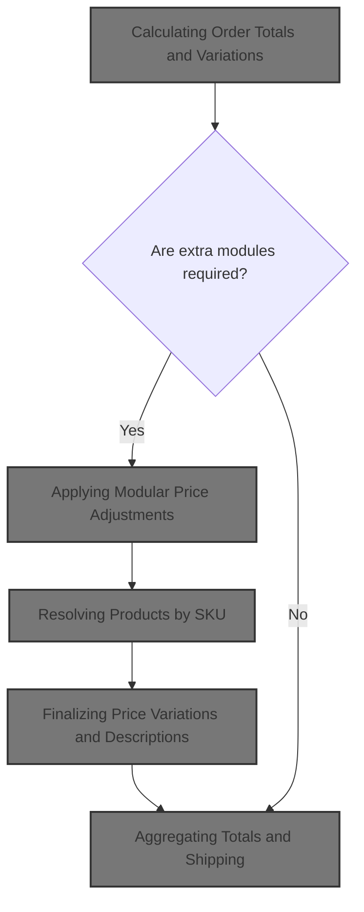
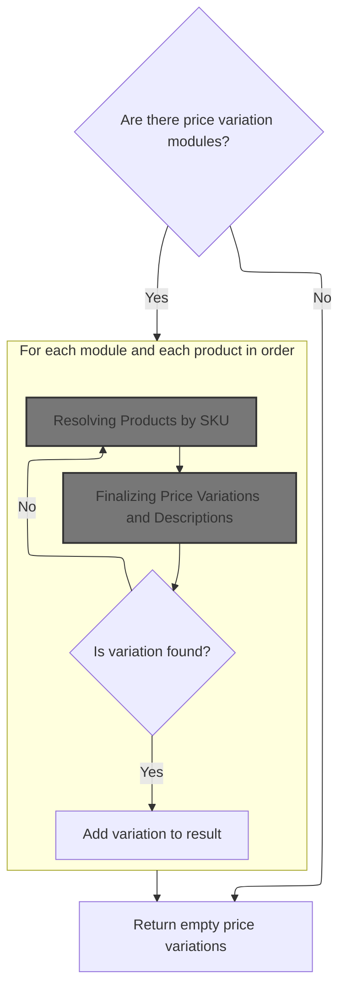
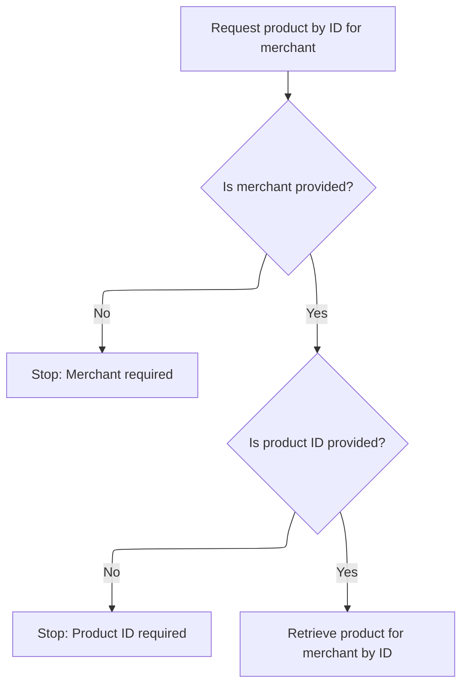

This document describes the process of calculating the total cost of an order, including all cart items, price adjustments, shipping, handling, and taxes. As part of the checkout and order processing features, this flow ensures customers receive a precise and transparent summary of all charges before completing their purchase.



# Where is this flow used?

This flow is used multiple times in the codebase as represented in the following diagram:

```mermaid
graph TD;
      3ccbb4e3a598b965aba12eb5baff9b784fc541568396d6f31c82ed0374a7ad58(sm-core/…/order/OrderServiceImpl.java::OrderServiceImpl.caculateOrderTotal) --> 9eeb2232eb2b51b420bc23b76e4f55223b40b13d2340e61ff34f7721a547449c(sm-core/…/order/OrderServiceImpl.java::OrderServiceImpl.caculateOrder)

3ccbb4e3a598b965aba12eb5baff9b784fc541568396d6f31c82ed0374a7ad58(sm-core/…/order/OrderServiceImpl.java::OrderServiceImpl.caculateOrderTotal) --> 9eeb2232eb2b51b420bc23b76e4f55223b40b13d2340e61ff34f7721a547449c(sm-core/…/order/OrderServiceImpl.java::OrderServiceImpl.caculateOrder)

ddc887b299f7e9c44d344d88b2b0bbfd4f2afb5cc9e3eb61b8bb2a7e4659088e(sm-core/…/order/OrderServiceImpl.java::OrderServiceImpl.caculateShoppingCart) --> 9eeb2232eb2b51b420bc23b76e4f55223b40b13d2340e61ff34f7721a547449c(sm-core/…/order/OrderServiceImpl.java::OrderServiceImpl.caculateOrder)

74fb03dda3973b3863f4157261362a51c00c9784c1e747b4b0b168972aa16907(sm-core/…/order/OrderServiceImpl.java::OrderServiceImpl.calculateShoppingCartTotal) --> ddc887b299f7e9c44d344d88b2b0bbfd4f2afb5cc9e3eb61b8bb2a7e4659088e(sm-core/…/order/OrderServiceImpl.java::OrderServiceImpl.caculateShoppingCart)

6334a5a0cbcdd387505220d4a219068cfbb930a30fd6c8889f3254492bb78e98(sm-core/…/shoppingcart/ShoppingCartCalculationServiceImpl.java::ShoppingCartCalculationServiceImpl.calculate) --> 74fb03dda3973b3863f4157261362a51c00c9784c1e747b4b0b168972aa16907(sm-core/…/order/OrderServiceImpl.java::OrderServiceImpl.calculateShoppingCartTotal)

74fb03dda3973b3863f4157261362a51c00c9784c1e747b4b0b168972aa16907(sm-core/…/order/OrderServiceImpl.java::OrderServiceImpl.calculateShoppingCartTotal) --> ddc887b299f7e9c44d344d88b2b0bbfd4f2afb5cc9e3eb61b8bb2a7e4659088e(sm-core/…/order/OrderServiceImpl.java::OrderServiceImpl.caculateShoppingCart)

6334a5a0cbcdd387505220d4a219068cfbb930a30fd6c8889f3254492bb78e98(sm-core/…/shoppingcart/ShoppingCartCalculationServiceImpl.java::ShoppingCartCalculationServiceImpl.calculate) --> 74fb03dda3973b3863f4157261362a51c00c9784c1e747b4b0b168972aa16907(sm-core/…/order/OrderServiceImpl.java::OrderServiceImpl.calculateShoppingCartTotal)


classDef mainFlowStyle color:#000000,fill:#7CB9F4
classDef rootsStyle color:#000000,fill:#00FFF4
classDef Style1 color:#000000,fill:#00FFAA
classDef Style2 color:#000000,fill:#FFFF00
classDef Style3 color:#000000,fill:#AA7CB9

%% Swimm:
%% graph TD;
%%       3ccbb4e3a598b965aba12eb5baff9b784fc541568396d6f31c82ed0374a7ad58(<SwmPath>[sm-core/…/order/OrderServiceImpl.java](sm-core/src/main/java/com/salesmanager/core/business/services/order/OrderServiceImpl.java)</SwmPath>::OrderServiceImpl.caculateOrderTotal) --> 9eeb2232eb2b51b420bc23b76e4f55223b40b13d2340e61ff34f7721a547449c(<SwmPath>[sm-core/…/order/OrderServiceImpl.java](sm-core/src/main/java/com/salesmanager/core/business/services/order/OrderServiceImpl.java)</SwmPath>::OrderServiceImpl.caculateOrder)
%% 
%% 3ccbb4e3a598b965aba12eb5baff9b784fc541568396d6f31c82ed0374a7ad58(<SwmPath>[sm-core/…/order/OrderServiceImpl.java](sm-core/src/main/java/com/salesmanager/core/business/services/order/OrderServiceImpl.java)</SwmPath>::OrderServiceImpl.caculateOrderTotal) --> 9eeb2232eb2b51b420bc23b76e4f55223b40b13d2340e61ff34f7721a547449c(<SwmPath>[sm-core/…/order/OrderServiceImpl.java](sm-core/src/main/java/com/salesmanager/core/business/services/order/OrderServiceImpl.java)</SwmPath>::OrderServiceImpl.caculateOrder)
%% 
%% ddc887b299f7e9c44d344d88b2b0bbfd4f2afb5cc9e3eb61b8bb2a7e4659088e(<SwmPath>[sm-core/…/order/OrderServiceImpl.java](sm-core/src/main/java/com/salesmanager/core/business/services/order/OrderServiceImpl.java)</SwmPath>::OrderServiceImpl.caculateShoppingCart) --> 9eeb2232eb2b51b420bc23b76e4f55223b40b13d2340e61ff34f7721a547449c(<SwmPath>[sm-core/…/order/OrderServiceImpl.java](sm-core/src/main/java/com/salesmanager/core/business/services/order/OrderServiceImpl.java)</SwmPath>::OrderServiceImpl.caculateOrder)
%% 
%% 74fb03dda3973b3863f4157261362a51c00c9784c1e747b4b0b168972aa16907(<SwmPath>[sm-core/…/order/OrderServiceImpl.java](sm-core/src/main/java/com/salesmanager/core/business/services/order/OrderServiceImpl.java)</SwmPath>::OrderServiceImpl.calculateShoppingCartTotal) --> ddc887b299f7e9c44d344d88b2b0bbfd4f2afb5cc9e3eb61b8bb2a7e4659088e(<SwmPath>[sm-core/…/order/OrderServiceImpl.java](sm-core/src/main/java/com/salesmanager/core/business/services/order/OrderServiceImpl.java)</SwmPath>::OrderServiceImpl.caculateShoppingCart)
%% 
%% 6334a5a0cbcdd387505220d4a219068cfbb930a30fd6c8889f3254492bb78e98(<SwmPath>[sm-core/…/shoppingcart/ShoppingCartCalculationServiceImpl.java](sm-core/src/main/java/com/salesmanager/core/business/services/shoppingcart/ShoppingCartCalculationServiceImpl.java)</SwmPath>::ShoppingCartCalculationServiceImpl.calculate) --> 74fb03dda3973b3863f4157261362a51c00c9784c1e747b4b0b168972aa16907(<SwmPath>[sm-core/…/order/OrderServiceImpl.java](sm-core/src/main/java/com/salesmanager/core/business/services/order/OrderServiceImpl.java)</SwmPath>::OrderServiceImpl.calculateShoppingCartTotal)
%% 
%% 74fb03dda3973b3863f4157261362a51c00c9784c1e747b4b0b168972aa16907(<SwmPath>[sm-core/…/order/OrderServiceImpl.java](sm-core/src/main/java/com/salesmanager/core/business/services/order/OrderServiceImpl.java)</SwmPath>::OrderServiceImpl.calculateShoppingCartTotal) --> ddc887b299f7e9c44d344d88b2b0bbfd4f2afb5cc9e3eb61b8bb2a7e4659088e(<SwmPath>[sm-core/…/order/OrderServiceImpl.java](sm-core/src/main/java/com/salesmanager/core/business/services/order/OrderServiceImpl.java)</SwmPath>::OrderServiceImpl.caculateShoppingCart)
%% 
%% 6334a5a0cbcdd387505220d4a219068cfbb930a30fd6c8889f3254492bb78e98(<SwmPath>[sm-core/…/shoppingcart/ShoppingCartCalculationServiceImpl.java](sm-core/src/main/java/com/salesmanager/core/business/services/shoppingcart/ShoppingCartCalculationServiceImpl.java)</SwmPath>::ShoppingCartCalculationServiceImpl.calculate) --> 74fb03dda3973b3863f4157261362a51c00c9784c1e747b4b0b168972aa16907(<SwmPath>[sm-core/…/order/OrderServiceImpl.java](sm-core/src/main/java/com/salesmanager/core/business/services/order/OrderServiceImpl.java)</SwmPath>::OrderServiceImpl.calculateShoppingCartTotal)
%% 
%% 
%% classDef mainFlowStyle color:#000000,fill:#7CB9F4
%% classDef rootsStyle color:#000000,fill:#00FFF4
%% classDef Style1 color:#000000,fill:#00FFAA
%% classDef Style2 color:#000000,fill:#FFFF00
%% classDef Style3 color:#000000,fill:#AA7CB9
```



# Calculating Order Totals and Variations

This section is responsible for calculating the total cost of an order by summing up the prices of all cart items, applying any additional price types, and invoking extra modules for further adjustments when required. It ensures that the final order total accurately reflects all applicable charges and discounts.

| Category        | Rule Name                        | Description                                                                                                                                                                    |
| --------------- | -------------------------------- | ------------------------------------------------------------------------------------------------------------------------------------------------------------------------------ |
| Data validation | Monetary Value Rounding          | All monetary values (such as subtotal and adjustments) must be rounded to two decimal places using standard rounding rules.                                                    |
| Business logic  | Item Subtotal Calculation        | The subtotal for the order must be calculated by multiplying the price of each item by its quantity and summing the results for all items in the cart.                         |
| Business logic  | Additional Price Types Inclusion | Any additional price types (such as surcharges or discounts) associated with cart items must be collected and included in the order total calculation.                         |
| Business logic  | Conditional Module Invocation    | If the order summary type is either 'ORDERTOTAL' or 'SHOPPINGCART', extra modules (such as discount engines or custom logic) must be invoked to adjust the subtotal as needed. |
| Business logic  | Apply Order Adjustments          | Adjustments from extra modules (such as discounts or custom logic) must be applied to the subtotal to produce the final order total.                                           |

<SwmSnippet path="/sm-core/src/main/java/com/salesmanager/core/business/services/order/OrderServiceImpl.java" line="217">

---

We loop through cart items to get the subtotal and collect any extra price types for later processing.

```java
    private OrderTotalSummary caculateOrder(OrderSummary summary, Customer customer, final MerchantStore store, final Language language) throws Exception {

        OrderTotalSummary totalSummary = new OrderTotalSummary();
        List<OrderTotal> orderTotals = new ArrayList<OrderTotal>();
        Map<String,OrderTotal> otherPricesTotals = new HashMap<String,OrderTotal>();

        ShippingConfiguration shippingConfiguration = null;

        BigDecimal grandTotal = new BigDecimal(0);
        grandTotal.setScale(2, RoundingMode.HALF_UP);

        //price by item
        /**
         * qty * price
         * subtotal
         */
        BigDecimal subTotal = new BigDecimal(0);
        subTotal.setScale(2, RoundingMode.HALF_UP);
        for(ShoppingCartItem item : summary.getProducts()) {

            BigDecimal st = item.getItemPrice().multiply(new BigDecimal(item.getQuantity()));
            item.setSubTotal(st);
            subTotal = subTotal.add(st);
            //Other prices
            FinalPrice finalPrice = item.getFinalPrice();
            if(finalPrice!=null) {
                List<FinalPrice> otherPrices = finalPrice.getAdditionalPrices();
                if(otherPrices!=null) {
                    for(FinalPrice price : otherPrices) {
                        if(!price.isDefaultPrice()) {
                            OrderTotal itemSubTotal = otherPricesTotals.get(price.getProductPrice().getCode());

                            if(itemSubTotal==null) {
                                itemSubTotal = new OrderTotal();
                                itemSubTotal.setModule(Constants.OT_ITEM_PRICE_MODULE_CODE);
                                itemSubTotal.setTitle(Constants.OT_ITEM_PRICE_MODULE_CODE);
                                itemSubTotal.setOrderTotalCode(price.getProductPrice().getCode());
                                itemSubTotal.setOrderTotalType(OrderTotalType.PRODUCT);
                                itemSubTotal.setSortOrder(0);
                                otherPricesTotals.put(price.getProductPrice().getCode(), itemSubTotal);
                            }

                            BigDecimal orderTotalValue = itemSubTotal.getValue();
                            if(orderTotalValue==null) {
                                orderTotalValue = new BigDecimal(0);
                                orderTotalValue.setScale(2, RoundingMode.HALF_UP);
                            }

                            orderTotalValue = orderTotalValue.add(price.getFinalPrice());
                            itemSubTotal.setValue(orderTotalValue);
                            if(price.getProductPrice().getProductPriceType().name().equals(OrderValueType.ONE_TIME)) {
                                subTotal = subTotal.add(price.getFinalPrice());
                            }
                        }
                    }
                }
            }
        }
```

---

</SwmSnippet>

<SwmSnippet path="/sm-core/src/main/java/com/salesmanager/core/business/services/order/OrderServiceImpl.java" line="276">

---

Here we check if the summary type warrants running extra modules that might adjust the subtotal (like discounts or custom logic), and if so, we call into the order total variation service to get those adjustments.

```java
        //only in order page, otherwise invokes too many processing
        if(
        		OrderSummaryType.ORDERTOTAL.name().equals(summary.getOrderSummaryType().name()) ||
        		OrderSummaryType.SHOPPINGCART.name().equals(summary.getOrderSummaryType().name())

        		) {

	        //Post processing order total variation modules for sub total calculation - drools, custom modules
	        //may affect the sub total
	        OrderTotalVariation orderTotalVariation = orderTotalService.findOrderTotalVariation(summary, customer, store, language);

```

---

</SwmSnippet>

## Applying Modular Price Adjustments



This section applies modular price adjustments to each product in an order by leveraging available price adjustment modules. It ensures that all relevant product details are considered for accurate price variation calculations.

| Category        | Rule Name                    | Description                                                                                                                     |
| --------------- | ---------------------------- | ------------------------------------------------------------------------------------------------------------------------------- |
| Data validation | SKU-Based Product Resolution | Each product must be resolved by its SKU to ensure that all product details are available for price variation calculation.      |
| Business logic  | No Modules, No Variations    | If no price adjustment modules are available, the system must return an empty list of price variations.                         |
| Business logic  | Iterative Module Processing  | For each price adjustment module, the system must process every product in the order to determine if a price variation applies. |
| Business logic  | Variation Inclusion          | If a price variation is found for a product by a module, it must be added to the result set with its description.               |

<SwmSnippet path="/sm-core/src/main/java/com/salesmanager/core/business/services/order/ordertotal/OrderTotalServiceImpl.java" line="37">

---

In <SwmToken path="sm-core/src/main/java/com/salesmanager/core/business/services/order/ordertotal/OrderTotalServiceImpl.java" pos="37:5:5" line-data="	public OrderTotalVariation findOrderTotalVariation(OrderSummary summary, Customer customer, MerchantStore store, Language language)">`findOrderTotalVariation`</SwmToken>, we loop through each price adjustment module and, for each cart item, fetch the full Product by SKU. This lets each module calculate price variations using all product details, not just what's in the cart item.

```java
	public OrderTotalVariation findOrderTotalVariation(OrderSummary summary, Customer customer, MerchantStore store, Language language)
			throws Exception {
	
		RebatesOrderTotalVariation variation = new RebatesOrderTotalVariation();
		
		List<OrderTotal> totals = null;
		
		if(orderTotalPostProcessors != null) {
			for(OrderTotalPostProcessorModule module : orderTotalPostProcessors) {
				//TODO check if the module is enabled from the Admin
				
				List<ShoppingCartItem> items = summary.getProducts();
				for(ShoppingCartItem item : items) {

					Product product = productService.getBySku(item.getSku(), store, language);
```

---

</SwmSnippet>

### Resolving Products by SKU

This section enables users or systems to retrieve detailed product information using a SKU, ensuring the product belongs to the specified merchant and is presented in the requested language.

| Category        | Rule Name                         | Description                                                                                                                                                     |
| --------------- | --------------------------------- | --------------------------------------------------------------------------------------------------------------------------------------------------------------- |
| Data validation | SKU existence validation          | A product can only be resolved if the SKU exists for the specified merchant. If the SKU does not exist, no product details are returned and an error is raised. |
| Business logic  | Product localization              | Product details must be returned in the language specified by the requester, ensuring localization of product information.                                      |
| Business logic  | Single product resolution per SKU | Only the first product ID found for the SKU and merchant is used to resolve the product details, even if multiple IDs are returned.                             |

<SwmSnippet path="/sm-core/src/main/java/com/salesmanager/core/business/services/catalog/product/ProductServiceImpl.java" line="374">

---

<SwmToken path="sm-core/src/main/java/com/salesmanager/core/business/services/catalog/product/ProductServiceImpl.java" pos="374:5:5" line-data="	public Product getBySku(String productCode, MerchantStore merchant, Language language) throws ServiceException {">`getBySku`</SwmToken> looks up the product ID by SKU and merchant, then fetches the full Product by ID, merchant, and language. This two-step lookup is needed because the repository returns IDs, not Product objects.

```java
	public Product getBySku(String productCode, MerchantStore merchant, Language language) throws ServiceException {

		try {
			List<Object> products = productRepository.findBySku(productCode, merchant.getId());
			if(products.isEmpty()) {
				throw new ServiceException("Cannot get product with sku [" + productCode + "]");
			}
			BigInteger id = (BigInteger) products.get(0);
			return productRepository.getById(id.longValue(), merchant, language);
		} catch (Exception e) {
			throw new ServiceException("Cannot get product with sku [" + productCode + "]", e);
		}
		


	}
```

---

</SwmSnippet>

### Fetching Product Option Sets

This section ensures that the correct product option set is retrieved for a given store and language, enabling accurate product configuration and localization.

| Category        | Rule Name                  | Description                                                                                                                            |
| --------------- | -------------------------- | -------------------------------------------------------------------------------------------------------------------------------------- |
| Data validation | Valid Option Set Existence | A product option set must be fetched only if the provided option set ID exists for the specified store and language.                   |
| Data validation | Store Data Isolation       | Only product option sets associated with the specified merchant store should be accessible, preventing cross-store data leakage.       |
| Business logic  | Language Localization      | The product option set returned must be relevant to the specified language, ensuring all option labels and descriptions are localized. |

<SwmSnippet path="/sm-core/src/main/java/com/salesmanager/core/business/services/catalog/product/attribute/ProductOptionSetServiceImpl.java" line="39">

---

We fetch the option set for the store and language, then move on to more product details.

```java
	public ProductOptionSet getById(MerchantStore store, Long optionSetId, Language lang) {
		return productOptionSetRepository.findOne(store.getId(), optionSetId, lang.getId());
	}
```

---

</SwmSnippet>

### Retrieving Product and Option Values



This section governs the rules for retrieving a product and its option values for a merchant. It ensures that only valid requests with both merchant and product ID provided will result in a product being returned, and that option values are fetched in the context of the merchant.

| Category        | Rule Name                      | Description                                                                                                                                                                               |
| --------------- | ------------------------------ | ----------------------------------------------------------------------------------------------------------------------------------------------------------------------------------------- |
| Data validation | Merchant Required              | A merchant must be specified in the request to retrieve a product. If no merchant is provided, the request is rejected.                                                                   |
| Data validation | Product ID Required            | A product ID must be specified in the request to retrieve a product. If no product ID is provided, the request is rejected.                                                               |
| Business logic  | Product Existence for Merchant | Only products that exist for the specified merchant and product ID can be retrieved. If the product does not exist for the merchant, no product is returned.                              |
| Business logic  | Option Value Contextualization | Product option values must be retrieved in the context of the merchant and the specific option value ID. Only option values that exist for the merchant and option value ID are returned. |

<SwmSnippet path="/sm-core/src/main/java/com/salesmanager/core/business/services/catalog/product/ProductServiceImpl.java" line="339">

---

<SwmToken path="sm-core/src/main/java/com/salesmanager/core/business/services/catalog/product/ProductServiceImpl.java" pos="339:5:5" line-data="	public Product findOne(Long id, MerchantStore merchant) {">`findOne`</SwmToken> gets the Product by ID and merchant, making sure both are valid. Once we have the Product, we can fetch related option values as needed.

```java
	public Product findOne(Long id, MerchantStore merchant) {
		Validate.notNull(merchant, "MerchantStore must not be null");
		Validate.notNull(id, "id must not be null");
		return productRepository.getById(id, merchant);
	}
```

---

</SwmSnippet>

<SwmSnippet path="/sm-core/src/main/java/com/salesmanager/core/business/services/catalog/product/attribute/ProductOptionValueServiceImpl.java" line="109">

---

<SwmToken path="sm-core/src/main/java/com/salesmanager/core/business/services/catalog/product/attribute/ProductOptionValueServiceImpl.java" pos="109:5:5" line-data="	public ProductOptionValue getById(MerchantStore store, Long optionValueId) {">`getById`</SwmToken> fetches a product option value for a given store and option value ID. This is needed to get the right value for the product in context, before returning to the main product logic.

```java
	public ProductOptionValue getById(MerchantStore store, Long optionValueId) {
		return productOptionValueRepository.findOne(store.getId(), optionValueId);
	}
```

---

</SwmSnippet>

### Finalizing Price Variations and Descriptions

```mermaid
%%{init: {"flowchart": {"defaultRenderer": "elk"}} }%%
flowchart TD
    node1["Start price variation calculation"]
    click node1 openCode "sm-core/src/main/java/com/salesmanager/core/business/services/order/ordertotal/OrderTotalServiceImpl.java:52:52"
    subgraph loop1["For each product/item in order"]
        node2["Calculate price variation"]
        click node2 openCode "sm-core/src/main/java/com/salesmanager/core/business/services/order/ordertotal/OrderTotalServiceImpl.java:54:54"
        node2 --> node3{"Is price variation valid?"}
        click node3 openCode "sm-core/src/main/java/com/salesmanager/core/business/services/order/ordertotal/OrderTotalServiceImpl.java:55:57"
        node3 -->|"No"| node2
        node3 -->|"Yes"| node4{"Is variation list initialized?"}
        click node4 openCode "sm-core/src/main/java/com/salesmanager/core/business/services/order/ordertotal/OrderTotalServiceImpl.java:58:61"
        node4 -->|"No"| node5["Initialize variation list"]
        click node5 openCode "sm-core/src/main/java/com/salesmanager/core/business/services/order/ordertotal/OrderTotalServiceImpl.java:59:60"
        node4 -->|"Yes"| node6{"Does price variation have description?"}
        click node6 openCode "sm-core/src/main/java/com/salesmanager/core/business/services/order/ordertotal/OrderTotalServiceImpl.java:64:64"
        node5 --> node6
        node6 -->|"No"| node7["Set description to product name"]
        click node7 openCode "sm-core-model/src/main/java/com/salesmanager/core/model/catalog/product/Product.java:477:482"
        node6 -->|"Yes"| node8["Add price variation to result"]
        click node8 openCode "sm-core/src/main/java/com/salesmanager/core/business/services/order/ordertotal/OrderTotalServiceImpl.java:65:65"
        node7 --> node8
        node8 --> node2
    end
    loop1 --> node9["Return all price variations"]
    click node9 openCode "sm-core/src/main/java/com/salesmanager/core/business/services/order/ordertotal/OrderTotalServiceImpl.java:71:71"

classDef HeadingStyle fill:#777777,stroke:#333,stroke-width:2px;

%% Swimm:
%% %%{init: {"flowchart": {"defaultRenderer": "elk"}} }%%
%% flowchart TD
%%     node1["Start price variation calculation"]
%%     click node1 openCode "<SwmPath>[sm-core/…/ordertotal/OrderTotalServiceImpl.java](sm-core/src/main/java/com/salesmanager/core/business/services/order/ordertotal/OrderTotalServiceImpl.java)</SwmPath>:52:52"
%%     subgraph loop1["For each product/item in order"]
%%         node2["Calculate price variation"]
%%         click node2 openCode "<SwmPath>[sm-core/…/ordertotal/OrderTotalServiceImpl.java](sm-core/src/main/java/com/salesmanager/core/business/services/order/ordertotal/OrderTotalServiceImpl.java)</SwmPath>:54:54"
%%         node2 --> node3{"Is price variation valid?"}
%%         click node3 openCode "<SwmPath>[sm-core/…/ordertotal/OrderTotalServiceImpl.java](sm-core/src/main/java/com/salesmanager/core/business/services/order/ordertotal/OrderTotalServiceImpl.java)</SwmPath>:55:57"
%%         node3 -->|"No"| node2
%%         node3 -->|"Yes"| node4{"Is variation list initialized?"}
%%         click node4 openCode "<SwmPath>[sm-core/…/ordertotal/OrderTotalServiceImpl.java](sm-core/src/main/java/com/salesmanager/core/business/services/order/ordertotal/OrderTotalServiceImpl.java)</SwmPath>:58:61"
%%         node4 -->|"No"| node5["Initialize variation list"]
%%         click node5 openCode "<SwmPath>[sm-core/…/ordertotal/OrderTotalServiceImpl.java](sm-core/src/main/java/com/salesmanager/core/business/services/order/ordertotal/OrderTotalServiceImpl.java)</SwmPath>:59:60"
%%         node4 -->|"Yes"| node6{"Does price variation have description?"}
%%         click node6 openCode "<SwmPath>[sm-core/…/ordertotal/OrderTotalServiceImpl.java](sm-core/src/main/java/com/salesmanager/core/business/services/order/ordertotal/OrderTotalServiceImpl.java)</SwmPath>:64:64"
%%         node5 --> node6
%%         node6 -->|"No"| node7["Set description to product name"]
%%         click node7 openCode "<SwmPath>[sm-core-model/…/product/Product.java](sm-core-model/src/main/java/com/salesmanager/core/model/catalog/product/Product.java)</SwmPath>:477:482"
%%         node6 -->|"Yes"| node8["Add price variation to result"]
%%         click node8 openCode "<SwmPath>[sm-core/…/ordertotal/OrderTotalServiceImpl.java](sm-core/src/main/java/com/salesmanager/core/business/services/order/ordertotal/OrderTotalServiceImpl.java)</SwmPath>:65:65"
%%         node7 --> node8
%%         node8 --> node2
%%     end
%%     loop1 --> node9["Return all price variations"]
%%     click node9 openCode "<SwmPath>[sm-core/…/ordertotal/OrderTotalServiceImpl.java](sm-core/src/main/java/com/salesmanager/core/business/services/order/ordertotal/OrderTotalServiceImpl.java)</SwmPath>:71:71"
%% 
%% classDef HeadingStyle fill:#777777,stroke:#333,stroke-width:2px;
```



<SwmSnippet path="/sm-core/src/main/java/com/salesmanager/core/business/services/order/ordertotal/OrderTotalServiceImpl.java" line="52">

---

Back in <SwmToken path="sm-core/src/main/java/com/salesmanager/core/business/services/order/OrderServiceImpl.java" pos="285:9:9" line-data="	        OrderTotalVariation orderTotalVariation = orderTotalService.findOrderTotalVariation(summary, customer, store, language);">`findOrderTotalVariation`</SwmToken>, after getting the Product, we run the price variation calculation for each module and cart item. We then set the text for each variation, using the product's name if the module didn't provide one. This is where we need to call into the Product model to get the product description.

```java
					//Product product = productService.getProductForLocale(productId, language, languageService.toLocale(language, store));
					
					OrderTotal orderTotal = module.caculateProductPiceVariation(summary, item, product, customer, store);
					if(orderTotal==null) {
						continue;
					}
					if(totals==null) {
						totals = new ArrayList<OrderTotal>();
						variation.setVariations(totals);
					}
					
					//if product is null it will be catched when invoking the module
					orderTotal.setText(StringUtils.isNoneBlank(orderTotal.getText())?orderTotal.getText():product.getProductDescription().getName());
					variation.getVariations().add(orderTotal);	
				}
			}
		}
		
		
		return variation;
	}
```

---

</SwmSnippet>

<SwmSnippet path="/sm-core-model/src/main/java/com/salesmanager/core/model/catalog/product/Product.java" line="477">

---

<SwmToken path="sm-core-model/src/main/java/com/salesmanager/core/model/catalog/product/Product.java" pos="477:5:5" line-data="	public ProductDescription getProductDescription() {">`getProductDescription`</SwmToken> just grabs the first description from the product's descriptions collection, assuming that's the main one to use for display or fallback.

```java
	public ProductDescription getProductDescription() {
		if(this.getDescriptions()!=null && this.getDescriptions().size()>0) {
			return this.getDescriptions().iterator().next();
		}
		return null;
	}
```

---

</SwmSnippet>

## Aggregating Totals and Shipping

```mermaid
%%{init: {"flowchart": {"defaultRenderer": "elk"}} }%%
flowchart TD
    node1["Start order calculation"]
    click node1 openCode "sm-core/src/main/java/com/salesmanager/core/business/services/order/OrderServiceImpl.java:287:395"
    node1 --> node2{"Are there order total variations?"}
    click node2 openCode "sm-core/src/main/java/com/salesmanager/core/business/services/order/OrderServiceImpl.java:289:294"
    subgraph loop1["For each variation"]
      node2 -->|"Yes"| node3["Apply variation to subtotal and add to order totals"]
      click node3 openCode "sm-core/src/main/java/com/salesmanager/core/business/services/order/OrderServiceImpl.java:290:294"
      node3 --> node4["Update subtotal"]
      click node4 openCode "sm-core/src/main/java/com/salesmanager/core/business/services/order/OrderServiceImpl.java:293:293"
      node4 --> node5["Next variation"]
      node5 --> node3
    end
    node2 -->|"No"| node6["No variations to apply"]
    loop1 --> node7["Add subtotal to order totals"]
    click node7 openCode "sm-core/src/main/java/com/salesmanager/core/business/services/order/OrderServiceImpl.java:303:311"
    node6 --> node7
    node7 --> node8{"Is shipping required?"}
    click node8 openCode "sm-core/src/main/java/com/salesmanager/core/business/services/order/OrderServiceImpl.java:315:351"
    node8 -->|"Yes"| node9["Add shipping to order totals"]
    click node9 openCode "sm-core/src/main/java/com/salesmanager/core/business/services/order/OrderServiceImpl.java:318:325"
    node9 --> node10{"Is shipping free?"}
    click node10 openCode "sm-core/src/main/java/com/salesmanager/core/business/services/order/OrderServiceImpl.java:327:333"
    node10 -->|"No"| node11["Add shipping cost to grand total"]
    click node11 openCode "sm-core/src/main/java/com/salesmanager/core/business/services/order/OrderServiceImpl.java:328:329"
    node10 -->|"Yes"| node12["Set shipping cost to zero"]
    click node12 openCode "sm-core/src/main/java/com/salesmanager/core/business/services/order/OrderServiceImpl.java:331:332"
    node11 --> node13{"Are there handling fees?"}
    node12 --> node13
    click node13 openCode "sm-core/src/main/java/com/salesmanager/core/business/services/order/OrderServiceImpl.java:336:350"
    node13 -->|"Yes"| node14["Add handling fee to grand total"]
    click node14 openCode "sm-core/src/main/java/com/salesmanager/core/business/services/order/OrderServiceImpl.java:339:348"
    node13 -->|"No"| node15["No handling fees"]
    node14 --> node16["Continue"]
    node15 --> node16
    node16 --> node17{"Are there taxes to apply?"}
    click node17 openCode "sm-core/src/main/java/com/salesmanager/core/business/services/order/OrderServiceImpl.java:354:379"
    node17 -->|"Yes"| node18["Calculate taxes"]
    click node18 openCode "sm-core/src/main/java/com/salesmanager/core/business/services/order/OrderServiceImpl.java:354:354"
    subgraph loop2["For each tax item"]
      node18 --> node19["Add tax to order totals and accumulate total tax"]
      click node19 openCode "sm-core/src/main/java/com/salesmanager/core/business/services/order/OrderServiceImpl.java:359:371"
      node19 --> node20["Next tax item"]
      node20 --> node19
    end
    loop2 --> node21["Add total tax to grand total"]
    click node21 openCode "sm-core/src/main/java/com/salesmanager/core/business/services/order/OrderServiceImpl.java:377:378"
    node17 -->|"No"| node22["No taxes to apply"]
    node21 --> node23["Finalize order total"]
    node22 --> node23
    click node23 openCode "sm-core/src/main/java/com/salesmanager/core/business/services/order/OrderServiceImpl.java:382:394"
    node23 --> node24["Return order summary"]
    click node24 openCode "sm-core/src/main/java/com/salesmanager/core/business/services/order/OrderServiceImpl.java:394:395"
classDef HeadingStyle fill:#777777,stroke:#333,stroke-width:2px;

%% Swimm:
%% %%{init: {"flowchart": {"defaultRenderer": "elk"}} }%%
%% flowchart TD
%%     node1["Start order calculation"]
%%     click node1 openCode "<SwmPath>[sm-core/…/order/OrderServiceImpl.java](sm-core/src/main/java/com/salesmanager/core/business/services/order/OrderServiceImpl.java)</SwmPath>:287:395"
%%     node1 --> node2{"Are there order total variations?"}
%%     click node2 openCode "<SwmPath>[sm-core/…/order/OrderServiceImpl.java](sm-core/src/main/java/com/salesmanager/core/business/services/order/OrderServiceImpl.java)</SwmPath>:289:294"
%%     subgraph loop1["For each variation"]
%%       node2 -->|"Yes"| node3["Apply variation to subtotal and add to order totals"]
%%       click node3 openCode "<SwmPath>[sm-core/…/order/OrderServiceImpl.java](sm-core/src/main/java/com/salesmanager/core/business/services/order/OrderServiceImpl.java)</SwmPath>:290:294"
%%       node3 --> node4["Update subtotal"]
%%       click node4 openCode "<SwmPath>[sm-core/…/order/OrderServiceImpl.java](sm-core/src/main/java/com/salesmanager/core/business/services/order/OrderServiceImpl.java)</SwmPath>:293:293"
%%       node4 --> node5["Next variation"]
%%       node5 --> node3
%%     end
%%     node2 -->|"No"| node6["No variations to apply"]
%%     loop1 --> node7["Add subtotal to order totals"]
%%     click node7 openCode "<SwmPath>[sm-core/…/order/OrderServiceImpl.java](sm-core/src/main/java/com/salesmanager/core/business/services/order/OrderServiceImpl.java)</SwmPath>:303:311"
%%     node6 --> node7
%%     node7 --> node8{"Is shipping required?"}
%%     click node8 openCode "<SwmPath>[sm-core/…/order/OrderServiceImpl.java](sm-core/src/main/java/com/salesmanager/core/business/services/order/OrderServiceImpl.java)</SwmPath>:315:351"
%%     node8 -->|"Yes"| node9["Add shipping to order totals"]
%%     click node9 openCode "<SwmPath>[sm-core/…/order/OrderServiceImpl.java](sm-core/src/main/java/com/salesmanager/core/business/services/order/OrderServiceImpl.java)</SwmPath>:318:325"
%%     node9 --> node10{"Is shipping free?"}
%%     click node10 openCode "<SwmPath>[sm-core/…/order/OrderServiceImpl.java](sm-core/src/main/java/com/salesmanager/core/business/services/order/OrderServiceImpl.java)</SwmPath>:327:333"
%%     node10 -->|"No"| node11["Add shipping cost to grand total"]
%%     click node11 openCode "<SwmPath>[sm-core/…/order/OrderServiceImpl.java](sm-core/src/main/java/com/salesmanager/core/business/services/order/OrderServiceImpl.java)</SwmPath>:328:329"
%%     node10 -->|"Yes"| node12["Set shipping cost to zero"]
%%     click node12 openCode "<SwmPath>[sm-core/…/order/OrderServiceImpl.java](sm-core/src/main/java/com/salesmanager/core/business/services/order/OrderServiceImpl.java)</SwmPath>:331:332"
%%     node11 --> node13{"Are there handling fees?"}
%%     node12 --> node13
%%     click node13 openCode "<SwmPath>[sm-core/…/order/OrderServiceImpl.java](sm-core/src/main/java/com/salesmanager/core/business/services/order/OrderServiceImpl.java)</SwmPath>:336:350"
%%     node13 -->|"Yes"| node14["Add handling fee to grand total"]
%%     click node14 openCode "<SwmPath>[sm-core/…/order/OrderServiceImpl.java](sm-core/src/main/java/com/salesmanager/core/business/services/order/OrderServiceImpl.java)</SwmPath>:339:348"
%%     node13 -->|"No"| node15["No handling fees"]
%%     node14 --> node16["Continue"]
%%     node15 --> node16
%%     node16 --> node17{"Are there taxes to apply?"}
%%     click node17 openCode "<SwmPath>[sm-core/…/order/OrderServiceImpl.java](sm-core/src/main/java/com/salesmanager/core/business/services/order/OrderServiceImpl.java)</SwmPath>:354:379"
%%     node17 -->|"Yes"| node18["Calculate taxes"]
%%     click node18 openCode "<SwmPath>[sm-core/…/order/OrderServiceImpl.java](sm-core/src/main/java/com/salesmanager/core/business/services/order/OrderServiceImpl.java)</SwmPath>:354:354"
%%     subgraph loop2["For each tax item"]
%%       node18 --> node19["Add tax to order totals and accumulate total tax"]
%%       click node19 openCode "<SwmPath>[sm-core/…/order/OrderServiceImpl.java](sm-core/src/main/java/com/salesmanager/core/business/services/order/OrderServiceImpl.java)</SwmPath>:359:371"
%%       node19 --> node20["Next tax item"]
%%       node20 --> node19
%%     end
%%     loop2 --> node21["Add total tax to grand total"]
%%     click node21 openCode "<SwmPath>[sm-core/…/order/OrderServiceImpl.java](sm-core/src/main/java/com/salesmanager/core/business/services/order/OrderServiceImpl.java)</SwmPath>:377:378"
%%     node17 -->|"No"| node22["No taxes to apply"]
%%     node21 --> node23["Finalize order total"]
%%     node22 --> node23
%%     click node23 openCode "<SwmPath>[sm-core/…/order/OrderServiceImpl.java](sm-core/src/main/java/com/salesmanager/core/business/services/order/OrderServiceImpl.java)</SwmPath>:382:394"
%%     node23 --> node24["Return order summary"]
%%     click node24 openCode "<SwmPath>[sm-core/…/order/OrderServiceImpl.java](sm-core/src/main/java/com/salesmanager/core/business/services/order/OrderServiceImpl.java)</SwmPath>:394:395"
%% classDef HeadingStyle fill:#777777,stroke:#333,stroke-width:2px;
```



<SwmSnippet path="/sm-core/src/main/java/com/salesmanager/core/business/services/order/OrderServiceImpl.java" line="287">

---

Back in <SwmToken path="sm-core/src/main/java/com/salesmanager/core/business/services/order/OrderServiceImpl.java" pos="217:5:5" line-data="    private OrderTotalSummary caculateOrder(OrderSummary summary, Customer customer, final MerchantStore store, final Language language) throws Exception {">`caculateOrder`</SwmToken>, after getting the variations from the order total variation service, we add each one to the order totals and subtract its value from the subtotal. This way, any discounts or adjustments are reflected in the running totals.

```java
	        int currentCount = 10;

	        if(CollectionUtils.isNotEmpty(orderTotalVariation.getVariations())) {
	        	for(OrderTotal variation : orderTotalVariation.getVariations()) {
	        		variation.setSortOrder(currentCount++);
	        		orderTotals.add(variation);
	        		subTotal = subTotal.subtract(variation.getValue());
	        	}
```

---

</SwmSnippet>

<SwmSnippet path="/sm-core/src/main/java/com/salesmanager/core/business/services/order/OrderServiceImpl.java" line="300">

---

After handling variations, we set the subtotal, add it to the grand total, and then add shipping, handling, and tax lines as separate totals. Each is processed and added to the list so the breakdown is clear for the customer.

```java
        totalSummary.setSubTotal(subTotal);
        grandTotal=grandTotal.add(subTotal);

        OrderTotal orderTotalSubTotal = new OrderTotal();
        orderTotalSubTotal.setModule(Constants.OT_SUBTOTAL_MODULE_CODE);
        orderTotalSubTotal.setOrderTotalType(OrderTotalType.SUBTOTAL);
        orderTotalSubTotal.setOrderTotalCode("order.total.subtotal");
        orderTotalSubTotal.setTitle(Constants.OT_SUBTOTAL_MODULE_CODE);
        orderTotalSubTotal.setSortOrder(5);
        orderTotalSubTotal.setValue(subTotal);

        orderTotals.add(orderTotalSubTotal);


        //shipping
        if(summary.getShippingSummary()!=null) {


	            OrderTotal shippingSubTotal = new OrderTotal();
	            shippingSubTotal.setModule(Constants.OT_SHIPPING_MODULE_CODE);
	            shippingSubTotal.setOrderTotalType(OrderTotalType.SHIPPING);
	            shippingSubTotal.setOrderTotalCode("order.total.shipping");
	            shippingSubTotal.setTitle(Constants.OT_SHIPPING_MODULE_CODE);
	            shippingSubTotal.setSortOrder(100);

	            orderTotals.add(shippingSubTotal);

            if(!summary.getShippingSummary().isFreeShipping()) {
                shippingSubTotal.setValue(summary.getShippingSummary().getShipping());
                grandTotal=grandTotal.add(summary.getShippingSummary().getShipping());
            } else {
                shippingSubTotal.setValue(new BigDecimal(0));
                grandTotal=grandTotal.add(new BigDecimal(0));
            }

            //check handling fees
            shippingConfiguration = shippingService.getShippingConfiguration(store);
            if(summary.getShippingSummary().getHandling()!=null && summary.getShippingSummary().getHandling().doubleValue()>0) {
                if(shippingConfiguration.getHandlingFees()!=null && shippingConfiguration.getHandlingFees().doubleValue()>0) {
                    OrderTotal handlingubTotal = new OrderTotal();
                    handlingubTotal.setModule(Constants.OT_HANDLING_MODULE_CODE);
                    handlingubTotal.setOrderTotalType(OrderTotalType.HANDLING);
                    handlingubTotal.setOrderTotalCode("order.total.handling");
                    handlingubTotal.setTitle(Constants.OT_HANDLING_MODULE_CODE);
                    //handlingubTotal.setText("order.total.handling");
                    handlingubTotal.setSortOrder(120);
                    handlingubTotal.setValue(summary.getShippingSummary().getHandling());
                    orderTotals.add(handlingubTotal);
                    grandTotal=grandTotal.add(summary.getShippingSummary().getHandling());
                }
            }
        }

        //tax
        List<TaxItem> taxes = taxService.calculateTax(summary, customer, store, language);
        if(taxes!=null && taxes.size()>0) {
        	BigDecimal totalTaxes = new BigDecimal(0);
        	totalTaxes.setScale(2, RoundingMode.HALF_UP);
            int taxCount = 200;
            for(TaxItem tax : taxes) {

                OrderTotal taxLine = new OrderTotal();
                taxLine.setModule(Constants.OT_TAX_MODULE_CODE);
                taxLine.setOrderTotalType(OrderTotalType.TAX);
                taxLine.setOrderTotalCode(tax.getLabel());
                taxLine.setSortOrder(taxCount);
                taxLine.setTitle(Constants.OT_TAX_MODULE_CODE);
                taxLine.setText(tax.getLabel());
                taxLine.setValue(tax.getItemPrice());

                totalTaxes = totalTaxes.add(tax.getItemPrice());
                orderTotals.add(taxLine);
                //grandTotal=grandTotal.add(tax.getItemPrice());

                taxCount ++;

            }
```

---

</SwmSnippet>

<SwmSnippet path="/sm-core/src/main/java/com/salesmanager/core/business/services/order/OrderServiceImpl.java" line="377">

---

Finally, we add up all the totals, set them on the summary object, and return it. The summary now has the subtotal, tax, grand total, and a detailed breakdown of all charges.

```java
            grandTotal = grandTotal.add(totalTaxes);
            totalSummary.setTaxTotal(totalTaxes);
        }

        // grand total
        OrderTotal orderTotal = new OrderTotal();
        orderTotal.setModule(Constants.OT_TOTAL_MODULE_CODE);
        orderTotal.setOrderTotalType(OrderTotalType.TOTAL);
        orderTotal.setOrderTotalCode("order.total.total");
        orderTotal.setTitle(Constants.OT_TOTAL_MODULE_CODE);
        //orderTotal.setText("order.total.total");
        orderTotal.setSortOrder(500);
        orderTotal.setValue(grandTotal);
        orderTotals.add(orderTotal);

        totalSummary.setTotal(grandTotal);
        totalSummary.setTotals(orderTotals);
        return totalSummary;

    }
```

---

</SwmSnippet>

&nbsp;

*This is an auto-generated document by Swimm 🌊 and has not yet been verified by a human*

<SwmMeta version="3.0.0" repo-id="Z2l0aHViJTNBJTNBc2hvcGl6ZXIlM0ElM0FTd2ltbS1EZW1v" repo-name="shopizer"><sup>Powered by [Swimm](https://app.swimm.io/)</sup></SwmMeta>
