This document describes how shopping cart data is populated with product details, localized names, images, attributes, and calculated totals. The flow is used to prepare the cart for display and checkout, ensuring users see accurate and localized information for each item.

# Where is this flow used?

This flow is used multiple times in the codebase as represented in the following diagram:

(Note - these are only some of the entry points of this flow)

```mermaid
graph TD;
      8b2433ba72f6c9151ac72e8e6a08de4b5d1f45db9231820e7c4d97a57dc44e71(sm-shop/…/facade/ShoppingCartFacadeImpl.java::ShoppingCartFacadeImpl.addItemsToShoppingCart) --> f03828c0ad8cb699c99120cc408300e3c5dbde3aff8459b1e0652ada0c7ae2f0(sm-shop/…/shoppingCart/ShoppingCartDataPopulator.java::ShoppingCartDataPopulator.populate)

636e7002e9474508fa1947d31e270ce925f22c3025a6b7fb0ab030b10090a1e9(sm-shop/…/facade/ShoppingCartFacadeImpl.java::ShoppingCartFacadeImpl.getShoppingCartData) --> f03828c0ad8cb699c99120cc408300e3c5dbde3aff8459b1e0652ada0c7ae2f0(sm-shop/…/shoppingCart/ShoppingCartDataPopulator.java::ShoppingCartDataPopulator.populate)

5cd442aececf07ecab33fde1b707451fc797bda838c095ec2313c68b4f4d0e1d(sm-shop/…/facade/ShoppingCartFacadeImpl.java::ShoppingCartFacadeImpl.updateCartItems) --> f03828c0ad8cb699c99120cc408300e3c5dbde3aff8459b1e0652ada0c7ae2f0(sm-shop/…/shoppingCart/ShoppingCartDataPopulator.java::ShoppingCartDataPopulator.populate)

f33308c4fb5ebe03ae85a3ff933320ebe9c007673f5cc06e29ba80cd553351f7(sm-shop/…/facade/ShoppingCartFacadeImpl.java::ShoppingCartFacadeImpl.removeCartItem) --> f03828c0ad8cb699c99120cc408300e3c5dbde3aff8459b1e0652ada0c7ae2f0(sm-shop/…/shoppingCart/ShoppingCartDataPopulator.java::ShoppingCartDataPopulator.populate)

9db5dc8cb04f19ccd18f427255ff3538cff634100b3bae6e495873ffc6955bb8(sm-shop/…/facade/ShoppingCartFacadeImpl.java::ShoppingCartFacadeImpl.updateCartItem) --> f03828c0ad8cb699c99120cc408300e3c5dbde3aff8459b1e0652ada0c7ae2f0(sm-shop/…/shoppingCart/ShoppingCartDataPopulator.java::ShoppingCartDataPopulator.populate)


classDef mainFlowStyle color:#000000,fill:#7CB9F4
classDef rootsStyle color:#000000,fill:#00FFF4
classDef Style1 color:#000000,fill:#00FFAA
classDef Style2 color:#000000,fill:#FFFF00
classDef Style3 color:#000000,fill:#AA7CB9

%% Swimm:
%% graph TD;
%%       8b2433ba72f6c9151ac72e8e6a08de4b5d1f45db9231820e7c4d97a57dc44e71(<SwmPath>[sm-shop/…/facade/ShoppingCartFacadeImpl.java](sm-shop/src/main/java/com/salesmanager/shop/store/controller/shoppingCart/facade/ShoppingCartFacadeImpl.java)</SwmPath>::ShoppingCartFacadeImpl.addItemsToShoppingCart) --> f03828c0ad8cb699c99120cc408300e3c5dbde3aff8459b1e0652ada0c7ae2f0(<SwmPath>[sm-shop/…/shoppingCart/ShoppingCartDataPopulator.java](sm-shop/src/main/java/com/salesmanager/shop/populator/shoppingCart/ShoppingCartDataPopulator.java)</SwmPath>::ShoppingCartDataPopulator.populate)
%% 
%% 636e7002e9474508fa1947d31e270ce925f22c3025a6b7fb0ab030b10090a1e9(<SwmPath>[sm-shop/…/facade/ShoppingCartFacadeImpl.java](sm-shop/src/main/java/com/salesmanager/shop/store/controller/shoppingCart/facade/ShoppingCartFacadeImpl.java)</SwmPath>::ShoppingCartFacadeImpl.getShoppingCartData) --> f03828c0ad8cb699c99120cc408300e3c5dbde3aff8459b1e0652ada0c7ae2f0(<SwmPath>[sm-shop/…/shoppingCart/ShoppingCartDataPopulator.java](sm-shop/src/main/java/com/salesmanager/shop/populator/shoppingCart/ShoppingCartDataPopulator.java)</SwmPath>::ShoppingCartDataPopulator.populate)
%% 
%% 5cd442aececf07ecab33fde1b707451fc797bda838c095ec2313c68b4f4d0e1d(<SwmPath>[sm-shop/…/facade/ShoppingCartFacadeImpl.java](sm-shop/src/main/java/com/salesmanager/shop/store/controller/shoppingCart/facade/ShoppingCartFacadeImpl.java)</SwmPath>::ShoppingCartFacadeImpl.updateCartItems) --> f03828c0ad8cb699c99120cc408300e3c5dbde3aff8459b1e0652ada0c7ae2f0(<SwmPath>[sm-shop/…/shoppingCart/ShoppingCartDataPopulator.java](sm-shop/src/main/java/com/salesmanager/shop/populator/shoppingCart/ShoppingCartDataPopulator.java)</SwmPath>::ShoppingCartDataPopulator.populate)
%% 
%% f33308c4fb5ebe03ae85a3ff933320ebe9c007673f5cc06e29ba80cd553351f7(<SwmPath>[sm-shop/…/facade/ShoppingCartFacadeImpl.java](sm-shop/src/main/java/com/salesmanager/shop/store/controller/shoppingCart/facade/ShoppingCartFacadeImpl.java)</SwmPath>::ShoppingCartFacadeImpl.removeCartItem) --> f03828c0ad8cb699c99120cc408300e3c5dbde3aff8459b1e0652ada0c7ae2f0(<SwmPath>[sm-shop/…/shoppingCart/ShoppingCartDataPopulator.java](sm-shop/src/main/java/com/salesmanager/shop/populator/shoppingCart/ShoppingCartDataPopulator.java)</SwmPath>::ShoppingCartDataPopulator.populate)
%% 
%% 9db5dc8cb04f19ccd18f427255ff3538cff634100b3bae6e495873ffc6955bb8(<SwmPath>[sm-shop/…/facade/ShoppingCartFacadeImpl.java](sm-shop/src/main/java/com/salesmanager/shop/store/controller/shoppingCart/facade/ShoppingCartFacadeImpl.java)</SwmPath>::ShoppingCartFacadeImpl.updateCartItem) --> f03828c0ad8cb699c99120cc408300e3c5dbde3aff8459b1e0652ada0c7ae2f0(<SwmPath>[sm-shop/…/shoppingCart/ShoppingCartDataPopulator.java](sm-shop/src/main/java/com/salesmanager/shop/populator/shoppingCart/ShoppingCartDataPopulator.java)</SwmPath>::ShoppingCartDataPopulator.populate)
%% 
%% 
%% classDef mainFlowStyle color:#000000,fill:#7CB9F4
%% classDef rootsStyle color:#000000,fill:#00FFF4
%% classDef Style1 color:#000000,fill:#00FFAA
%% classDef Style2 color:#000000,fill:#FFFF00
%% classDef Style3 color:#000000,fill:#AA7CB9
```



# Populating Cart Data with Product Details

```mermaid
%%{init: {"flowchart": {"defaultRenderer": "elk"}} }%%
flowchart TD
    node1["Start: Receive shopping cart and language"]
    click node1 openCode "sm-shop/src/main/java/com/salesmanager/shop/populator/shoppingCart/ShoppingCartDataPopulator.java:89:90"
    node1 --> node2{"Does cart have items?"}
    click node2 openCode "sm-shop/src/main/java/com/salesmanager/shop/populator/shoppingCart/ShoppingCartDataPopulator.java:99:100"
    node2 -->|"Yes"| node3["Process each cart item (build ShoppingCartItem with localized product info)"]
    node2 -->|"No"| node12["Skip to order summary"]
    
    subgraph loop1["For each item in cart"]
      node3 --> node4["Build ShoppingCartItem (set code, sku, name, price, quantity, image, etc.)"]
      click node4 openCode "sm-shop/src/main/java/com/salesmanager/shop/populator/shoppingCart/ShoppingCartDataPopulator.java:101:172"
      node4 --> node5{"Does item have attributes?"}
      click node5 openCode "sm-shop/src/main/java/com/salesmanager/shop/populator/shoppingCart/ShoppingCartDataPopulator.java:135:170"
      node5 -->|"Yes"| node6["Process each attribute (build ShoppingCartAttribute with localized option info)"]
      node5 -->|"No"| node8["Skip attribute processing"]
      
      subgraph loop2["For each attribute"]
        node6 --> node7["Build ShoppingCartAttribute (set id, option, value, localized names)"]
        click node7 openCode "sm-shop/src/main/java/com/salesmanager/shop/populator/shoppingCart/ShoppingCartDataPopulator.java:138:167"
        node7 --> node8
      end
      node8 --> node9["Add ShoppingCartItem to list"]
      click node9 openCode "sm-shop/src/main/java/com/salesmanager/shop/populator/shoppingCart/ShoppingCartDataPopulator.java:171:171"
      node9 --> node10["Continue with next item"]
      click node10 openCode "sm-shop/src/main/java/com/salesmanager/shop/populator/shoppingCart/ShoppingCartDataPopulator.java:101:172"
    end
    node3 --> node12
    node12 --> node13{"Is there an order id?"}
    click node13 openCode "sm-shop/src/main/java/com/salesmanager/shop/populator/shoppingCart/ShoppingCartDataPopulator.java:178:180"
    node13 -->|"Yes"| node14["Set order id"]
    node13 -->|"No"| node15["Skip order id"]
    node14 --> node16["Calculate order summary"]
    node15 --> node16
    node16 --> node17["Calculate totals (subtotal, total, quantity, id)"]
    click node16 openCode "sm-shop/src/main/java/com/salesmanager/shop/populator/shoppingCart/ShoppingCartDataPopulator.java:182:186"
    node17 --> node18{"Are there order totals?"}
    click node17 openCode "sm-shop/src/main/java/com/salesmanager/shop/populator/shoppingCart/ShoppingCartDataPopulator.java:188:196"
    node18 -->|"Yes"| node19["Process each order total (build OrderTotal)"]
    node18 -->|"No"| node21["Skip totals"]
    
    subgraph loop3["For each order total"]
      node19 --> node20["Build OrderTotal (code, text, value)"]
      click node20 openCode "sm-shop/src/main/java/com/salesmanager/shop/populator/shoppingCart/ShoppingCartDataPopulator.java:190:195"
      node20 --> node21["Add to totals list"]
      click node21 openCode "sm-shop/src/main/java/com/salesmanager/shop/populator/shoppingCart/ShoppingCartDataPopulator.java:195:197"
    end
    node21 --> node22["Set cart totals, subtotal, total, quantity, id"]
    click node22 openCode "sm-shop/src/main/java/com/salesmanager/shop/populator/shoppingCart/ShoppingCartDataPopulator.java:197:203"
    node22 --> node23["Return ShoppingCartData"]
    click node23 openCode "sm-shop/src/main/java/com/salesmanager/shop/populator/shoppingCart/ShoppingCartDataPopulator.java:209:209"

classDef HeadingStyle fill:#777777,stroke:#333,stroke-width:2px;

%% Swimm:
%% %%{init: {"flowchart": {"defaultRenderer": "elk"}} }%%
%% flowchart TD
%%     node1["Start: Receive shopping cart and language"]
%%     click node1 openCode "<SwmPath>[sm-shop/…/shoppingCart/ShoppingCartDataPopulator.java](sm-shop/src/main/java/com/salesmanager/shop/populator/shoppingCart/ShoppingCartDataPopulator.java)</SwmPath>:89:90"
%%     node1 --> node2{"Does cart have items?"}
%%     click node2 openCode "<SwmPath>[sm-shop/…/shoppingCart/ShoppingCartDataPopulator.java](sm-shop/src/main/java/com/salesmanager/shop/populator/shoppingCart/ShoppingCartDataPopulator.java)</SwmPath>:99:100"
%%     node2 -->|"Yes"| node3["Process each cart item (build <SwmToken path="sm-shop/src/main/java/com/salesmanager/shop/populator/shoppingCart/ShoppingCartDataPopulator.java" pos="96:13:13" line-data="        Set&lt;com.salesmanager.core.model.shoppingcart.ShoppingCartItem&gt; items = shoppingCart.getLineItems();">`ShoppingCartItem`</SwmToken> with localized product info)"]
%%     node2 -->|"No"| node12["Skip to order summary"]
%%     
%%     subgraph loop1["For each item in cart"]
%%       node3 --> node4["Build <SwmToken path="sm-shop/src/main/java/com/salesmanager/shop/populator/shoppingCart/ShoppingCartDataPopulator.java" pos="96:13:13" line-data="        Set&lt;com.salesmanager.core.model.shoppingcart.ShoppingCartItem&gt; items = shoppingCart.getLineItems();">`ShoppingCartItem`</SwmToken> (set code, sku, name, price, quantity, image, etc.)"]
%%       click node4 openCode "<SwmPath>[sm-shop/…/shoppingCart/ShoppingCartDataPopulator.java](sm-shop/src/main/java/com/salesmanager/shop/populator/shoppingCart/ShoppingCartDataPopulator.java)</SwmPath>:101:172"
%%       node4 --> node5{"Does item have attributes?"}
%%       click node5 openCode "<SwmPath>[sm-shop/…/shoppingCart/ShoppingCartDataPopulator.java](sm-shop/src/main/java/com/salesmanager/shop/populator/shoppingCart/ShoppingCartDataPopulator.java)</SwmPath>:135:170"
%%       node5 -->|"Yes"| node6["Process each attribute (build <SwmToken path="sm-shop/src/main/java/com/salesmanager/shop/populator/shoppingCart/ShoppingCartDataPopulator.java" pos="137:3:3" line-data="                        List&lt;ShoppingCartAttribute&gt; cartAttributes = new ArrayList&lt;ShoppingCartAttribute&gt;();">`ShoppingCartAttribute`</SwmToken> with localized option info)"]
%%       node5 -->|"No"| node8["Skip attribute processing"]
%%       
%%       subgraph loop2["For each attribute"]
%%         node6 --> node7["Build <SwmToken path="sm-shop/src/main/java/com/salesmanager/shop/populator/shoppingCart/ShoppingCartDataPopulator.java" pos="137:3:3" line-data="                        List&lt;ShoppingCartAttribute&gt; cartAttributes = new ArrayList&lt;ShoppingCartAttribute&gt;();">`ShoppingCartAttribute`</SwmToken> (set id, option, value, localized names)"]
%%         click node7 openCode "<SwmPath>[sm-shop/…/shoppingCart/ShoppingCartDataPopulator.java](sm-shop/src/main/java/com/salesmanager/shop/populator/shoppingCart/ShoppingCartDataPopulator.java)</SwmPath>:138:167"
%%         node7 --> node8
%%       end
%%       node8 --> node9["Add <SwmToken path="sm-shop/src/main/java/com/salesmanager/shop/populator/shoppingCart/ShoppingCartDataPopulator.java" pos="96:13:13" line-data="        Set&lt;com.salesmanager.core.model.shoppingcart.ShoppingCartItem&gt; items = shoppingCart.getLineItems();">`ShoppingCartItem`</SwmToken> to list"]
%%       click node9 openCode "<SwmPath>[sm-shop/…/shoppingCart/ShoppingCartDataPopulator.java](sm-shop/src/main/java/com/salesmanager/shop/populator/shoppingCart/ShoppingCartDataPopulator.java)</SwmPath>:171:171"
%%       node9 --> node10["Continue with next item"]
%%       click node10 openCode "<SwmPath>[sm-shop/…/shoppingCart/ShoppingCartDataPopulator.java](sm-shop/src/main/java/com/salesmanager/shop/populator/shoppingCart/ShoppingCartDataPopulator.java)</SwmPath>:101:172"
%%     end
%%     node3 --> node12
%%     node12 --> node13{"Is there an order id?"}
%%     click node13 openCode "<SwmPath>[sm-shop/…/shoppingCart/ShoppingCartDataPopulator.java](sm-shop/src/main/java/com/salesmanager/shop/populator/shoppingCart/ShoppingCartDataPopulator.java)</SwmPath>:178:180"
%%     node13 -->|"Yes"| node14["Set order id"]
%%     node13 -->|"No"| node15["Skip order id"]
%%     node14 --> node16["Calculate order summary"]
%%     node15 --> node16
%%     node16 --> node17["Calculate totals (subtotal, total, quantity, id)"]
%%     click node16 openCode "<SwmPath>[sm-shop/…/shoppingCart/ShoppingCartDataPopulator.java](sm-shop/src/main/java/com/salesmanager/shop/populator/shoppingCart/ShoppingCartDataPopulator.java)</SwmPath>:182:186"
%%     node17 --> node18{"Are there order totals?"}
%%     click node17 openCode "<SwmPath>[sm-shop/…/shoppingCart/ShoppingCartDataPopulator.java](sm-shop/src/main/java/com/salesmanager/shop/populator/shoppingCart/ShoppingCartDataPopulator.java)</SwmPath>:188:196"
%%     node18 -->|"Yes"| node19["Process each order total (build <SwmToken path="sm-shop/src/main/java/com/salesmanager/shop/populator/shoppingCart/ShoppingCartDataPopulator.java" pos="189:3:3" line-data="            	List&lt;OrderTotal&gt; totals = new ArrayList&lt;OrderTotal&gt;();">`OrderTotal`</SwmToken>)"]
%%     node18 -->|"No"| node21["Skip totals"]
%%     
%%     subgraph loop3["For each order total"]
%%       node19 --> node20["Build <SwmToken path="sm-shop/src/main/java/com/salesmanager/shop/populator/shoppingCart/ShoppingCartDataPopulator.java" pos="189:3:3" line-data="            	List&lt;OrderTotal&gt; totals = new ArrayList&lt;OrderTotal&gt;();">`OrderTotal`</SwmToken> (code, text, value)"]
%%       click node20 openCode "<SwmPath>[sm-shop/…/shoppingCart/ShoppingCartDataPopulator.java](sm-shop/src/main/java/com/salesmanager/shop/populator/shoppingCart/ShoppingCartDataPopulator.java)</SwmPath>:190:195"
%%       node20 --> node21["Add to totals list"]
%%       click node21 openCode "<SwmPath>[sm-shop/…/shoppingCart/ShoppingCartDataPopulator.java](sm-shop/src/main/java/com/salesmanager/shop/populator/shoppingCart/ShoppingCartDataPopulator.java)</SwmPath>:195:197"
%%     end
%%     node21 --> node22["Set cart totals, subtotal, total, quantity, id"]
%%     click node22 openCode "<SwmPath>[sm-shop/…/shoppingCart/ShoppingCartDataPopulator.java](sm-shop/src/main/java/com/salesmanager/shop/populator/shoppingCart/ShoppingCartDataPopulator.java)</SwmPath>:197:203"
%%     node22 --> node23["Return <SwmToken path="sm-shop/src/main/java/com/salesmanager/shop/populator/shoppingCart/ShoppingCartDataPopulator.java" pos="89:3:3" line-data="    public ShoppingCartData populate(final ShoppingCart shoppingCart,">`ShoppingCartData`</SwmToken>"]
%%     click node23 openCode "<SwmPath>[sm-shop/…/shoppingCart/ShoppingCartDataPopulator.java](sm-shop/src/main/java/com/salesmanager/shop/populator/shoppingCart/ShoppingCartDataPopulator.java)</SwmPath>:209:209"
%% 
%% classDef HeadingStyle fill:#777777,stroke:#333,stroke-width:2px;
```



This section is responsible for populating the shopping cart data with detailed product information, localized names, images, attributes, and calculated totals, ensuring the cart is ready for display and checkout.

| Category        | Rule Name                 | Description                                                                                                                                                                                                                                                                                                                                                 |
| --------------- | ------------------------- | ----------------------------------------------------------------------------------------------------------------------------------------------------------------------------------------------------------------------------------------------------------------------------------------------------------------------------------------------------------- |
| Data validation | Required Input Validation | If any required input (shopping cart or language) is missing, the process must not proceed and an error must be raised.                                                                                                                                                                                                                                     |
| Business logic  | Cart Item Presence        | If the shopping cart contains items, each item must be processed to include product code, SKU, name (localized if available), price, quantity, and image. If no items are present, skip item processing and proceed to order summary.                                                                                                                       |
| Business logic  | Product Name Localization | For each cart item, the product name must be localized to the user's language if a matching description exists; otherwise, use the default product name.                                                                                                                                                                                                    |
| Business logic  | Product Image Selection   | Each cart item must display an image. If a default image is marked, use it; otherwise, use the last image available for the product.                                                                                                                                                                                                                        |
| Business logic  | Attribute Localization    | For each product attribute in a cart item, the option and value names must be localized to the user's language if available; otherwise, use the first available description.                                                                                                                                                                                |
| Business logic  | Cart Totals Calculation   | The cart's subtotal, total, and quantity must be calculated and set based on the sum of item prices and quantities, using the store's pricing rules.                                                                                                                                                                                                        |
| Business logic  | Order ID Assignment       | If the shopping cart has an associated order id, it must be set on the <SwmToken path="sm-shop/src/main/java/com/salesmanager/shop/populator/shoppingCart/ShoppingCartDataPopulator.java" pos="89:3:3" line-data="    public ShoppingCartData populate(final ShoppingCart shoppingCart,">`ShoppingCartData`</SwmToken>; otherwise, the order id is omitted. |
| Business logic  | Order Totals Processing   | If order totals are present, each must be processed to include code, text, and value, and added to the cart's totals list.                                                                                                                                                                                                                                  |

<SwmSnippet path="/sm-shop/src/main/java/com/salesmanager/shop/populator/shoppingCart/ShoppingCartDataPopulator.java" line="89">

---

<SwmToken path="sm-shop/src/main/java/com/salesmanager/shop/populator/shoppingCart/ShoppingCartDataPopulator.java" pos="110:13:13" line-data="                    String itemName = item.getProduct().getProductDescription().getName();">`getProductDescription`</SwmToken> just grabs the first description from the product's descriptions collection if it exists, otherwise returns null. The order of descriptions matters here, since only the first is returned unless something else filters by language later.

```java
    public ShoppingCartData populate(final ShoppingCart shoppingCart,
                                     final ShoppingCartData cart, final MerchantStore store, final Language language) {

    	Validate.notNull(shoppingCart, "Requires ShoppingCart");
    	Validate.notNull(language, "Requires Language not null");
    	int cartQuantity = 0;
        cart.setCode(shoppingCart.getShoppingCartCode());
        Set<com.salesmanager.core.model.shoppingcart.ShoppingCartItem> items = shoppingCart.getLineItems();
        List<ShoppingCartItem> shoppingCartItemsList=Collections.emptyList();
        try{
            if(items!=null) {
                shoppingCartItemsList=new ArrayList<ShoppingCartItem>();
                for(com.salesmanager.core.model.shoppingcart.ShoppingCartItem item : items) {
                	
                    ShoppingCartItem shoppingCartItem = new ShoppingCartItem();
                    shoppingCartItem.setCode(cart.getCode());
                    shoppingCartItem.setSku(item.getProduct().getSku());
                    shoppingCartItem.setProductVirtual(item.isProductVirtual());

                    shoppingCartItem.setId(item.getId());
                    
                    String itemName = item.getProduct().getProductDescription().getName();
```

---

</SwmSnippet>

<SwmSnippet path="/sm-core-model/src/main/java/com/salesmanager/core/model/catalog/product/Product.java" line="477">

---

<SwmToken path="sm-core-model/src/main/java/com/salesmanager/core/model/catalog/product/Product.java" pos="477:5:5" line-data="	public ProductDescription getProductDescription() {">`getProductDescription`</SwmToken> just grabs the first description from the product's descriptions collection if it exists, otherwise returns null. The order of descriptions matters here, since only the first is returned unless something else filters by language later.

```java
	public ProductDescription getProductDescription() {
		if(this.getDescriptions()!=null && this.getDescriptions().size()>0) {
			return this.getDescriptions().iterator().next();
		}
		return null;
	}
```

---

</SwmSnippet>

<SwmSnippet path="/sm-shop/src/main/java/com/salesmanager/shop/populator/shoppingCart/ShoppingCartDataPopulator.java" line="111">

---

Back in `ShoppingCartDataPopulator.populate`, after grabbing all product descriptions, we loop through them to find a name that matches the user's language. If we find a match, we use it; otherwise, we keep the default name from before.

```java
                    if(!CollectionUtils.isEmpty(item.getProduct().getDescriptions())) {
                    	for(ProductDescription productDescription : item.getProduct().getDescriptions()) {
                    		if(language != null && language.getId().intValue() == productDescription.getLanguage().getId().intValue()) {
                    			itemName = productDescription.getName();
                    			break;
                    		}
                    	}
```

---

</SwmSnippet>

<SwmSnippet path="/sm-shop/src/main/java/com/salesmanager/shop/populator/shoppingCart/ShoppingCartDataPopulator.java" line="120">

---

After setting the product name and price info, we need to display an image for each cart item. To do that, we fetch the product image, which means calling into the product model again. This gives us either the default image or, if none is marked as default, just the last image in the list. That way, the cart always has something to show visually for each product.

```java
                    shoppingCartItem.setName(itemName);

                    shoppingCartItem.setPrice(pricingService.getDisplayAmount(item.getItemPrice(),store));
                    shoppingCartItem.setQuantity(item.getQuantity());
                    
                    
                    cartQuantity = cartQuantity + item.getQuantity();
                    
                    shoppingCartItem.setProductPrice(item.getItemPrice());
                    shoppingCartItem.setSubTotal(pricingService.getDisplayAmount(item.getSubTotal(), store));
                    ProductImage image = item.getProduct().getProductImage();
                    if(image!=null && imageUtils!=null) {
                        String imagePath = imageUtils.buildProductImageUtils(store, item.getProduct().getSku(), image.getProductImage());
                        shoppingCartItem.setImage(imagePath);
                    }
```

---

</SwmSnippet>

<SwmSnippet path="/sm-core-model/src/main/java/com/salesmanager/core/model/catalog/product/Product.java" line="484">

---

<SwmToken path="sm-core-model/src/main/java/com/salesmanager/core/model/catalog/product/Product.java" pos="484:5:5" line-data="	public ProductImage getProductImage() {">`getProductImage`</SwmToken> loops through all product images and returns the default one if it finds it. If not, it just returns the last image in the list. This way, there's always an image to show for the product, even if none are marked as default.

```java
	public ProductImage getProductImage() {
		ProductImage productImage = null;
		if(this.getImages()!=null && this.getImages().size()>0) {
			for(ProductImage image : this.getImages()) {
				productImage = image;
				if(productImage.isDefaultImage()) {
					break;
				}
			}
```

---

</SwmSnippet>

<SwmSnippet path="/sm-shop/src/main/java/com/salesmanager/shop/populator/shoppingCart/ShoppingCartDataPopulator.java" line="135">

---

Back in `ShoppingCartDataPopulator.populate`, after getting the product image, we process any attributes for the cart item. We look up option and value descriptions, trying to match the user's language, but if we can't, we just use the first available description. This way, attributes always have a label, even if it's not localized.

```java
                    Set<com.salesmanager.core.model.shoppingcart.ShoppingCartAttributeItem> attributes = item.getAttributes();
                    if(attributes!=null) {
                        List<ShoppingCartAttribute> cartAttributes = new ArrayList<ShoppingCartAttribute>();
                        for(com.salesmanager.core.model.shoppingcart.ShoppingCartAttributeItem attribute : attributes) {
                            ShoppingCartAttribute cartAttribute = new ShoppingCartAttribute();
                            cartAttribute.setId(attribute.getId());
                            cartAttribute.setAttributeId(attribute.getProductAttributeId());
                            cartAttribute.setOptionId(attribute.getProductAttribute().getProductOption().getId());
                            cartAttribute.setOptionValueId(attribute.getProductAttribute().getProductOptionValue().getId());
                            List<ProductOptionDescription> optionDescriptions = attribute.getProductAttribute().getProductOption().getDescriptionsSettoList();
                            List<ProductOptionValueDescription> optionValueDescriptions = attribute.getProductAttribute().getProductOptionValue().getDescriptionsSettoList();
                            if(!CollectionUtils.isEmpty(optionDescriptions) && !CollectionUtils.isEmpty(optionValueDescriptions)) {
                            	
                            	String optionName = optionDescriptions.get(0).getName();
                            	String optionValue = optionValueDescriptions.get(0).getName();
                            	
                            	for(ProductOptionDescription optionDescription : optionDescriptions) {
                            		if(optionDescription.getLanguage() != null && optionDescription.getLanguage().getId().intValue() == language.getId().intValue()) {
                            			optionName = optionDescription.getName();
                            			break;
                            		}
                            	}
                            	
                            	for(ProductOptionValueDescription optionValueDescription : optionValueDescriptions) {
                            		if(optionValueDescription.getLanguage() != null && optionValueDescription.getLanguage().getId().intValue() == language.getId().intValue()) {
                            			optionValue = optionValueDescription.getName();
                            			break;
                            		}
                            	}
                            	cartAttribute.setOptionName(optionName);
                            	cartAttribute.setOptionValue(optionValue);
                            	cartAttributes.add(cartAttribute);
                            }
                        }
```

---

</SwmSnippet>

<SwmSnippet path="/sm-shop/src/main/java/com/salesmanager/shop/populator/shoppingCart/ShoppingCartDataPopulator.java" line="169">

---

We collect all the processed cart items, set them on the cart, and get ready to calculate totals.

```java
                        shoppingCartItem.setShoppingCartAttributes(cartAttributes);
                    }
                    shoppingCartItemsList.add(shoppingCartItem);
                }
            }
            if(CollectionUtils.isNotEmpty(shoppingCartItemsList)){
                cart.setShoppingCartItems(shoppingCartItemsList);
            }
            
            if(shoppingCart.getOrderId() != null) {
            	cart.setOrderId(shoppingCart.getOrderId());
            }

            OrderSummary summary = new OrderSummary();
            List<com.salesmanager.core.model.shoppingcart.ShoppingCartItem> productsList = new ArrayList<com.salesmanager.core.model.shoppingcart.ShoppingCartItem>();
            productsList.addAll(shoppingCart.getLineItems());
            summary.setProducts(productsList.stream().filter(p -> p.getProduct().isAvailable()).collect(Collectors.toList()));
            OrderTotalSummary orderSummary = shoppingCartCalculationService.calculate(shoppingCart,store, language );

            if(CollectionUtils.isNotEmpty(orderSummary.getTotals())) {
            	List<OrderTotal> totals = new ArrayList<OrderTotal>();
            	for(com.salesmanager.core.model.order.OrderTotal t : orderSummary.getTotals()) {
            		OrderTotal total = new OrderTotal();
            		total.setCode(t.getOrderTotalCode());
            		total.setText(t.getText());
            		total.setValue(t.getValue());
            		totals.add(total);
            	}
```

---

</SwmSnippet>

<SwmSnippet path="/sm-shop/src/main/java/com/salesmanager/shop/populator/shoppingCart/ShoppingCartDataPopulator.java" line="197">

---

Finally, we set the calculated totals, subtotals, quantity, and cart ID on the cart. If anything goes wrong, we throw a conversion exception. The fully populated cart is then returned for use.

```java
            	cart.setTotals(totals);
            }
            
            cart.setSubTotal(pricingService.getDisplayAmount(orderSummary.getSubTotal(), store));
            cart.setTotal(pricingService.getDisplayAmount(orderSummary.getTotal(), store));
            cart.setQuantity(cartQuantity);
            cart.setId(shoppingCart.getId());
        }
        catch(ServiceException ex){
            LOG.error( "Error while converting cart Model to cart Data.."+ex );
            throw new ConversionException( "Unable to create cart data", ex );
        }
        return cart;


    };
```

---

</SwmSnippet>

&nbsp;

*This is an auto-generated document by Swimm 🌊 and has not yet been verified by a human*

<SwmMeta version="3.0.0" repo-id="Z2l0aHViJTNBJTNBc2hvcGl6ZXIlM0ElM0FTd2ltbS1EZW1v" repo-name="shopizer"><sup>Powered by [Swimm](https://app.swimm.io/)</sup></SwmMeta>
