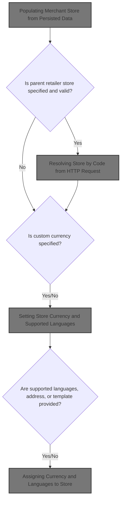
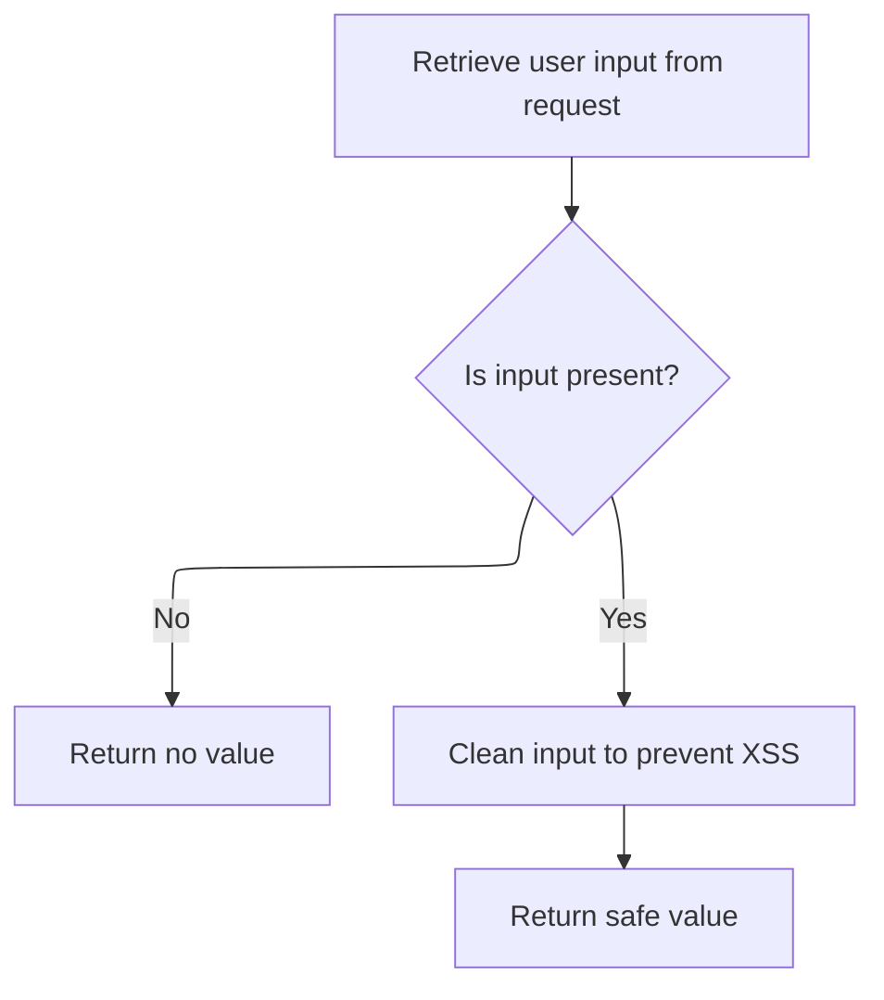
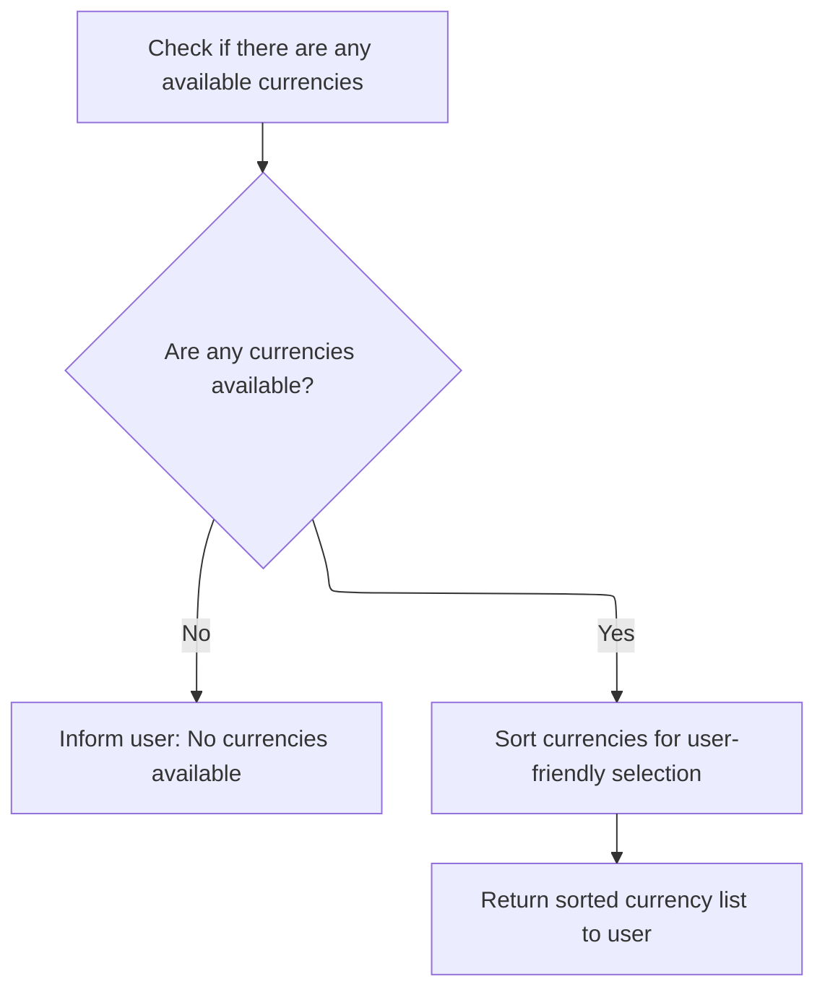

This document describes how merchant store data is transformed and validated to create or update a Merchant Store entity. The flow enforces business rules for parent store relationships, currency, supported languages, and address details, enabling reliable store management across the platform.



# Where is this flow used?

This flow is used multiple times in the codebase as represented in the following diagram:

(Note - these are only some of the entry points of this flow)

```mermaid
graph TD;
      8b2433ba72f6c9151ac72e8e6a08de4b5d1f45db9231820e7c4d97a57dc44e71(sm-shop/…/facade/ShoppingCartFacadeImpl.java::ShoppingCartFacadeImpl.addItemsToShoppingCart) --> cee5320beb629ffb04d09a44857e00481ccbfeb17bd8864b8cbb6454e3bdacc9(sm-shop/…/facade/ShoppingCartFacadeImpl.java::ShoppingCartFacadeImpl.createCartModel)

cee5320beb629ffb04d09a44857e00481ccbfeb17bd8864b8cbb6454e3bdacc9(sm-shop/…/facade/ShoppingCartFacadeImpl.java::ShoppingCartFacadeImpl.createCartModel) --> 5d7aa4b287366cdfd09ad5243c6758960940c33d414aaef77dbcf8d34d23b1d1(sm-shop/…/facade/StoreFacadeImpl.java::StoreFacadeImpl.create)

5d7aa4b287366cdfd09ad5243c6758960940c33d414aaef77dbcf8d34d23b1d1(sm-shop/…/facade/StoreFacadeImpl.java::StoreFacadeImpl.create) --> a845728dfb55481680a489f3e7c7fed4f734fb530a304d8e75c76b8c9b0d5741(sm-shop/…/facade/StoreFacadeImpl.java::StoreFacadeImpl.convertPersistableMerchantStoreToMerchantStore)

a845728dfb55481680a489f3e7c7fed4f734fb530a304d8e75c76b8c9b0d5741(sm-shop/…/facade/StoreFacadeImpl.java::StoreFacadeImpl.convertPersistableMerchantStoreToMerchantStore) --> d27ceee94a96210ed0fbf6c170d1e7b024d89a8fd0f1b3c80eb422a23637fc70(sm-shop/…/store/PersistableMerchantStorePopulator.java::PersistableMerchantStorePopulator.populate)

7486680dda4b0988f75fc50957d5750cba83981b3eddc398c498592f5ee54c2d(sm-core/…/configuration/DataConfiguration.java::DataConfiguration.entityManagerFactory) --> bb0b86db7733ba208ca53c3d76cffd1b0ca49472c1e4b7da3b21187d7a6a00a6(sm-core/…/configuration/DataConfiguration.java::DataConfiguration.dataSource)

bb0b86db7733ba208ca53c3d76cffd1b0ca49472c1e4b7da3b21187d7a6a00a6(sm-core/…/configuration/DataConfiguration.java::DataConfiguration.dataSource) --> 360a1cf8a46157629ed2c9f0ac1b2523ce786d67dde5c09d962edd0840a03024(sm-shop/…/user/UserApi.java::UserApi.password)

360a1cf8a46157629ed2c9f0ac1b2523ce786d67dde5c09d962edd0840a03024(sm-shop/…/user/UserApi.java::UserApi.password) --> 4d74529b105e6798535605cc86db49128e062bb403528ea6a70cd36716e354fe(sm-shop/…/user/UserFacadeImpl.java::UserFacadeImpl.changePassword)

4d74529b105e6798535605cc86db49128e062bb403528ea6a70cd36716e354fe(sm-shop/…/user/UserFacadeImpl.java::UserFacadeImpl.changePassword) --> 3ce22f5b4754adc6db8d77698611064906f51a7e7646d876918068164f3337f6(sm-shop/…/user/UserFacadeImpl.java::UserFacadeImpl.update)

3ce22f5b4754adc6db8d77698611064906f51a7e7646d876918068164f3337f6(sm-shop/…/user/UserFacadeImpl.java::UserFacadeImpl.update) --> f5f672ea90fd08f3d9a120c42570537ccbabe2aa361ee43e7fa852a816682c48(sm-shop/…/facade/StoreFacadeImpl.java::StoreFacadeImpl.update)

f5f672ea90fd08f3d9a120c42570537ccbabe2aa361ee43e7fa852a816682c48(sm-shop/…/facade/StoreFacadeImpl.java::StoreFacadeImpl.update) --> 6dbc9546c91c6febd48fa1898b880159054998a329d505255388850b6c313596(sm-shop/…/facade/StoreFacadeImpl.java::StoreFacadeImpl.mergePersistableMerchantStoreToMerchantStore)

f5f672ea90fd08f3d9a120c42570537ccbabe2aa361ee43e7fa852a816682c48(sm-shop/…/facade/StoreFacadeImpl.java::StoreFacadeImpl.update) --> 481cca43bfe994486408e13b8835dde99c0cfc5b26657de32c3b57e38dc6e20b(sm-shop/…/facade/StoreFacadeImpl.java::StoreFacadeImpl.updateMerchantStore)

6dbc9546c91c6febd48fa1898b880159054998a329d505255388850b6c313596(sm-shop/…/facade/StoreFacadeImpl.java::StoreFacadeImpl.mergePersistableMerchantStoreToMerchantStore) --> d27ceee94a96210ed0fbf6c170d1e7b024d89a8fd0f1b3c80eb422a23637fc70(sm-shop/…/store/PersistableMerchantStorePopulator.java::PersistableMerchantStorePopulator.populate)

481cca43bfe994486408e13b8835dde99c0cfc5b26657de32c3b57e38dc6e20b(sm-shop/…/facade/StoreFacadeImpl.java::StoreFacadeImpl.updateMerchantStore) --> f5f672ea90fd08f3d9a120c42570537ccbabe2aa361ee43e7fa852a816682c48(sm-shop/…/facade/StoreFacadeImpl.java::StoreFacadeImpl.update)

1b211bd42339385bb0bf9384e18093c06b0c190cb644a7afeda97893723a4d57(sm-shop/…/store/MerchantStoreApi.java::MerchantStoreApi.update) --> f5f672ea90fd08f3d9a120c42570537ccbabe2aa361ee43e7fa852a816682c48(sm-shop/…/facade/StoreFacadeImpl.java::StoreFacadeImpl.update)

17f96978c69568410f52fd7a504bc93dabb534b3df0c6c8c38296ef94fa289b2(sm-shop/…/shoppingCart/ShoppingCartModelPopulator.java::ShoppingCartModelPopulator.populate) --> f5f672ea90fd08f3d9a120c42570537ccbabe2aa361ee43e7fa852a816682c48(sm-shop/…/facade/StoreFacadeImpl.java::StoreFacadeImpl.update)

09ae55694dce6b8534bc5c6cfabbfec7082b0efcd463a2163d908315ba539943(sm-shop/…/product/ProductCommonFacadeImpl.java::ProductCommonFacadeImpl.saveOrUpdateReview) --> f5f672ea90fd08f3d9a120c42570537ccbabe2aa361ee43e7fa852a816682c48(sm-shop/…/facade/StoreFacadeImpl.java::StoreFacadeImpl.update)


classDef mainFlowStyle color:#000000,fill:#7CB9F4
classDef rootsStyle color:#000000,fill:#00FFF4
classDef Style1 color:#000000,fill:#00FFAA
classDef Style2 color:#000000,fill:#FFFF00
classDef Style3 color:#000000,fill:#AA7CB9

%% Swimm:
%% graph TD;
%%       8b2433ba72f6c9151ac72e8e6a08de4b5d1f45db9231820e7c4d97a57dc44e71(<SwmPath>[sm-shop/…/facade/ShoppingCartFacadeImpl.java](sm-shop/src/main/java/com/salesmanager/shop/store/controller/shoppingCart/facade/ShoppingCartFacadeImpl.java)</SwmPath>::ShoppingCartFacadeImpl.addItemsToShoppingCart) --> cee5320beb629ffb04d09a44857e00481ccbfeb17bd8864b8cbb6454e3bdacc9(<SwmPath>[sm-shop/…/facade/ShoppingCartFacadeImpl.java](sm-shop/src/main/java/com/salesmanager/shop/store/controller/shoppingCart/facade/ShoppingCartFacadeImpl.java)</SwmPath>::ShoppingCartFacadeImpl.createCartModel)
%% 
%% cee5320beb629ffb04d09a44857e00481ccbfeb17bd8864b8cbb6454e3bdacc9(<SwmPath>[sm-shop/…/facade/ShoppingCartFacadeImpl.java](sm-shop/src/main/java/com/salesmanager/shop/store/controller/shoppingCart/facade/ShoppingCartFacadeImpl.java)</SwmPath>::ShoppingCartFacadeImpl.createCartModel) --> 5d7aa4b287366cdfd09ad5243c6758960940c33d414aaef77dbcf8d34d23b1d1(<SwmPath>[sm-shop/…/facade/StoreFacadeImpl.java](sm-shop/src/main/java/com/salesmanager/shop/store/controller/store/facade/StoreFacadeImpl.java)</SwmPath>::StoreFacadeImpl.create)
%% 
%% 5d7aa4b287366cdfd09ad5243c6758960940c33d414aaef77dbcf8d34d23b1d1(<SwmPath>[sm-shop/…/facade/StoreFacadeImpl.java](sm-shop/src/main/java/com/salesmanager/shop/store/controller/store/facade/StoreFacadeImpl.java)</SwmPath>::StoreFacadeImpl.create) --> a845728dfb55481680a489f3e7c7fed4f734fb530a304d8e75c76b8c9b0d5741(<SwmPath>[sm-shop/…/facade/StoreFacadeImpl.java](sm-shop/src/main/java/com/salesmanager/shop/store/controller/store/facade/StoreFacadeImpl.java)</SwmPath>::StoreFacadeImpl.convertPersistableMerchantStoreToMerchantStore)
%% 
%% a845728dfb55481680a489f3e7c7fed4f734fb530a304d8e75c76b8c9b0d5741(<SwmPath>[sm-shop/…/facade/StoreFacadeImpl.java](sm-shop/src/main/java/com/salesmanager/shop/store/controller/store/facade/StoreFacadeImpl.java)</SwmPath>::StoreFacadeImpl.convertPersistableMerchantStoreToMerchantStore) --> d27ceee94a96210ed0fbf6c170d1e7b024d89a8fd0f1b3c80eb422a23637fc70(<SwmPath>[sm-shop/…/store/PersistableMerchantStorePopulator.java](sm-shop/src/main/java/com/salesmanager/shop/populator/store/PersistableMerchantStorePopulator.java)</SwmPath>::PersistableMerchantStorePopulator.populate)
%% 
%% 7486680dda4b0988f75fc50957d5750cba83981b3eddc398c498592f5ee54c2d(<SwmPath>[sm-core/…/configuration/DataConfiguration.java](sm-core/src/main/java/com/salesmanager/core/business/configuration/DataConfiguration.java)</SwmPath>::DataConfiguration.entityManagerFactory) --> bb0b86db7733ba208ca53c3d76cffd1b0ca49472c1e4b7da3b21187d7a6a00a6(<SwmPath>[sm-core/…/configuration/DataConfiguration.java](sm-core/src/main/java/com/salesmanager/core/business/configuration/DataConfiguration.java)</SwmPath>::DataConfiguration.dataSource)
%% 
%% bb0b86db7733ba208ca53c3d76cffd1b0ca49472c1e4b7da3b21187d7a6a00a6(<SwmPath>[sm-core/…/configuration/DataConfiguration.java](sm-core/src/main/java/com/salesmanager/core/business/configuration/DataConfiguration.java)</SwmPath>::DataConfiguration.dataSource) --> 360a1cf8a46157629ed2c9f0ac1b2523ce786d67dde5c09d962edd0840a03024(<SwmPath>[sm-shop/…/user/UserApi.java](sm-shop/src/main/java/com/salesmanager/shop/store/api/v1/user/UserApi.java)</SwmPath>::UserApi.password)
%% 
%% 360a1cf8a46157629ed2c9f0ac1b2523ce786d67dde5c09d962edd0840a03024(<SwmPath>[sm-shop/…/user/UserApi.java](sm-shop/src/main/java/com/salesmanager/shop/store/api/v1/user/UserApi.java)</SwmPath>::UserApi.password) --> 4d74529b105e6798535605cc86db49128e062bb403528ea6a70cd36716e354fe(<SwmPath>[sm-shop/…/user/UserFacadeImpl.java](sm-shop/src/main/java/com/salesmanager/shop/store/facade/user/UserFacadeImpl.java)</SwmPath>::UserFacadeImpl.changePassword)
%% 
%% 4d74529b105e6798535605cc86db49128e062bb403528ea6a70cd36716e354fe(<SwmPath>[sm-shop/…/user/UserFacadeImpl.java](sm-shop/src/main/java/com/salesmanager/shop/store/facade/user/UserFacadeImpl.java)</SwmPath>::UserFacadeImpl.changePassword) --> 3ce22f5b4754adc6db8d77698611064906f51a7e7646d876918068164f3337f6(<SwmPath>[sm-shop/…/user/UserFacadeImpl.java](sm-shop/src/main/java/com/salesmanager/shop/store/facade/user/UserFacadeImpl.java)</SwmPath>::UserFacadeImpl.update)
%% 
%% 3ce22f5b4754adc6db8d77698611064906f51a7e7646d876918068164f3337f6(<SwmPath>[sm-shop/…/user/UserFacadeImpl.java](sm-shop/src/main/java/com/salesmanager/shop/store/facade/user/UserFacadeImpl.java)</SwmPath>::UserFacadeImpl.update) --> f5f672ea90fd08f3d9a120c42570537ccbabe2aa361ee43e7fa852a816682c48(<SwmPath>[sm-shop/…/facade/StoreFacadeImpl.java](sm-shop/src/main/java/com/salesmanager/shop/store/controller/store/facade/StoreFacadeImpl.java)</SwmPath>::StoreFacadeImpl.update)
%% 
%% f5f672ea90fd08f3d9a120c42570537ccbabe2aa361ee43e7fa852a816682c48(<SwmPath>[sm-shop/…/facade/StoreFacadeImpl.java](sm-shop/src/main/java/com/salesmanager/shop/store/controller/store/facade/StoreFacadeImpl.java)</SwmPath>::StoreFacadeImpl.update) --> 6dbc9546c91c6febd48fa1898b880159054998a329d505255388850b6c313596(<SwmPath>[sm-shop/…/facade/StoreFacadeImpl.java](sm-shop/src/main/java/com/salesmanager/shop/store/controller/store/facade/StoreFacadeImpl.java)</SwmPath>::StoreFacadeImpl.mergePersistableMerchantStoreToMerchantStore)
%% 
%% f5f672ea90fd08f3d9a120c42570537ccbabe2aa361ee43e7fa852a816682c48(<SwmPath>[sm-shop/…/facade/StoreFacadeImpl.java](sm-shop/src/main/java/com/salesmanager/shop/store/controller/store/facade/StoreFacadeImpl.java)</SwmPath>::StoreFacadeImpl.update) --> 481cca43bfe994486408e13b8835dde99c0cfc5b26657de32c3b57e38dc6e20b(<SwmPath>[sm-shop/…/facade/StoreFacadeImpl.java](sm-shop/src/main/java/com/salesmanager/shop/store/controller/store/facade/StoreFacadeImpl.java)</SwmPath>::StoreFacadeImpl.updateMerchantStore)
%% 
%% 6dbc9546c91c6febd48fa1898b880159054998a329d505255388850b6c313596(<SwmPath>[sm-shop/…/facade/StoreFacadeImpl.java](sm-shop/src/main/java/com/salesmanager/shop/store/controller/store/facade/StoreFacadeImpl.java)</SwmPath>::StoreFacadeImpl.mergePersistableMerchantStoreToMerchantStore) --> d27ceee94a96210ed0fbf6c170d1e7b024d89a8fd0f1b3c80eb422a23637fc70(<SwmPath>[sm-shop/…/store/PersistableMerchantStorePopulator.java](sm-shop/src/main/java/com/salesmanager/shop/populator/store/PersistableMerchantStorePopulator.java)</SwmPath>::PersistableMerchantStorePopulator.populate)
%% 
%% 481cca43bfe994486408e13b8835dde99c0cfc5b26657de32c3b57e38dc6e20b(<SwmPath>[sm-shop/…/facade/StoreFacadeImpl.java](sm-shop/src/main/java/com/salesmanager/shop/store/controller/store/facade/StoreFacadeImpl.java)</SwmPath>::StoreFacadeImpl.updateMerchantStore) --> f5f672ea90fd08f3d9a120c42570537ccbabe2aa361ee43e7fa852a816682c48(<SwmPath>[sm-shop/…/facade/StoreFacadeImpl.java](sm-shop/src/main/java/com/salesmanager/shop/store/controller/store/facade/StoreFacadeImpl.java)</SwmPath>::StoreFacadeImpl.update)
%% 
%% 1b211bd42339385bb0bf9384e18093c06b0c190cb644a7afeda97893723a4d57(<SwmPath>[sm-shop/…/store/MerchantStoreApi.java](sm-shop/src/main/java/com/salesmanager/shop/store/api/v1/store/MerchantStoreApi.java)</SwmPath>::MerchantStoreApi.update) --> f5f672ea90fd08f3d9a120c42570537ccbabe2aa361ee43e7fa852a816682c48(<SwmPath>[sm-shop/…/facade/StoreFacadeImpl.java](sm-shop/src/main/java/com/salesmanager/shop/store/controller/store/facade/StoreFacadeImpl.java)</SwmPath>::StoreFacadeImpl.update)
%% 
%% 17f96978c69568410f52fd7a504bc93dabb534b3df0c6c8c38296ef94fa289b2(<SwmPath>[sm-shop/…/shoppingCart/ShoppingCartModelPopulator.java](sm-shop/src/main/java/com/salesmanager/shop/populator/shoppingCart/ShoppingCartModelPopulator.java)</SwmPath>::ShoppingCartModelPopulator.populate) --> f5f672ea90fd08f3d9a120c42570537ccbabe2aa361ee43e7fa852a816682c48(<SwmPath>[sm-shop/…/facade/StoreFacadeImpl.java](sm-shop/src/main/java/com/salesmanager/shop/store/controller/store/facade/StoreFacadeImpl.java)</SwmPath>::StoreFacadeImpl.update)
%% 
%% 09ae55694dce6b8534bc5c6cfabbfec7082b0efcd463a2163d908315ba539943(<SwmPath>[sm-shop/…/product/ProductCommonFacadeImpl.java](sm-shop/src/main/java/com/salesmanager/shop/store/facade/product/ProductCommonFacadeImpl.java)</SwmPath>::ProductCommonFacadeImpl.saveOrUpdateReview) --> f5f672ea90fd08f3d9a120c42570537ccbabe2aa361ee43e7fa852a816682c48(<SwmPath>[sm-shop/…/facade/StoreFacadeImpl.java](sm-shop/src/main/java/com/salesmanager/shop/store/controller/store/facade/StoreFacadeImpl.java)</SwmPath>::StoreFacadeImpl.update)
%% 
%% 
%% classDef mainFlowStyle color:#000000,fill:#7CB9F4
%% classDef rootsStyle color:#000000,fill:#00FFF4
%% classDef Style1 color:#000000,fill:#00FFAA
%% classDef Style2 color:#000000,fill:#FFFF00
%% classDef Style3 color:#000000,fill:#AA7CB9
```



# Populating Merchant Store from Persisted Data

```mermaid
%%{init: {"flowchart": {"defaultRenderer": "elk"}} }%%
flowchart TD
  node1["Start: Prepare or create Merchant Store entity"]
  click node1 openCode "sm-shop/src/main/java/com/salesmanager/shop/populator/store/PersistableMerchantStorePopulator.java:47:56"
  node1 --> node2{"Is parent retailer store specified and valid?"}
  click node2 openCode "sm-shop/src/main/java/com/salesmanager/shop/populator/store/PersistableMerchantStorePopulator.java:87:101"
  node2 -->|"Yes"| node3["Resolving Store by Code from HTTP Request"]
  
  node2 -->|"No"| node4{"Is custom currency specified?"}
  click node4 openCode "sm-shop/src/main/java/com/salesmanager/shop/populator/store/PersistableMerchantStorePopulator.java:111:116"
  node3 --> node4
  node4 -->|"Yes"| node5["Retrieving Currency List"]
  
  node4 -->|"No"| node6["Set store currency to default"]
  click node6 openCode "sm-shop/src/main/java/com/salesmanager/shop/store/controller/currency/facade/CurrencyFacadeImpl.java:21:116"
  node5 --> node6
  node6 --> node7["Set languages and address, return populated Merchant Store"]
  click node7 openCode "sm-shop/src/main/java/com/salesmanager/shop/populator/store/PersistableMerchantStorePopulator.java:117:158"
classDef HeadingStyle fill:#777777,stroke:#333,stroke-width:2px;
click node3 goToHeading "Resolving Store by Code from HTTP Request"
node3:::HeadingStyle
click node5 goToHeading "Retrieving Currency List"
node5:::HeadingStyle

%% Swimm:
%% %%{init: {"flowchart": {"defaultRenderer": "elk"}} }%%
%% flowchart TD
%%   node1["Start: Prepare or create Merchant Store entity"]
%%   click node1 openCode "<SwmPath>[sm-shop/…/store/PersistableMerchantStorePopulator.java](sm-shop/src/main/java/com/salesmanager/shop/populator/store/PersistableMerchantStorePopulator.java)</SwmPath>:47:56"
%%   node1 --> node2{"Is parent retailer store specified and valid?"}
%%   click node2 openCode "<SwmPath>[sm-shop/…/store/PersistableMerchantStorePopulator.java](sm-shop/src/main/java/com/salesmanager/shop/populator/store/PersistableMerchantStorePopulator.java)</SwmPath>:87:101"
%%   node2 -->|"Yes"| node3["Resolving Store by Code from HTTP Request"]
%%   
%%   node2 -->|"No"| node4{"Is custom currency specified?"}
%%   click node4 openCode "<SwmPath>[sm-shop/…/store/PersistableMerchantStorePopulator.java](sm-shop/src/main/java/com/salesmanager/shop/populator/store/PersistableMerchantStorePopulator.java)</SwmPath>:111:116"
%%   node3 --> node4
%%   node4 -->|"Yes"| node5["Retrieving Currency List"]
%%   
%%   node4 -->|"No"| node6["Set store currency to default"]
%%   click node6 openCode "<SwmPath>[sm-shop/…/facade/CurrencyFacadeImpl.java](sm-shop/src/main/java/com/salesmanager/shop/store/controller/currency/facade/CurrencyFacadeImpl.java)</SwmPath>:21:116"
%%   node5 --> node6
%%   node6 --> node7["Set languages and address, return populated Merchant Store"]
%%   click node7 openCode "<SwmPath>[sm-shop/…/store/PersistableMerchantStorePopulator.java](sm-shop/src/main/java/com/salesmanager/shop/populator/store/PersistableMerchantStorePopulator.java)</SwmPath>:117:158"
%% classDef HeadingStyle fill:#777777,stroke:#333,stroke-width:2px;
%% click node3 goToHeading "Resolving Store by Code from HTTP Request"
%% node3:::HeadingStyle
%% click node5 goToHeading "Retrieving Currency List"
%% node5:::HeadingStyle
```



This section governs how a Merchant Store is created or updated from persisted data, ensuring that all business rules for parent store relationships, currency, language, and basic store attributes are enforced.

| Category        | Rule Name                              | Description                                                                                                                                                                                 |
| --------------- | -------------------------------------- | ------------------------------------------------------------------------------------------------------------------------------------------------------------------------------------------- |
| Data validation | Parent Store Self-Reference Prevention | A Merchant Store must not have itself as its parent retailer store. If the parent retailer store code matches the store's own code, the operation must fail.                                |
| Data validation | Parent Store Existence Validation      | If a parent retailer store code is provided, it must correspond to an existing Merchant Store. If the code does not resolve to a valid store, the operation must fail.                      |
| Data validation | Business Since Date Validation         | If the 'inBusinessSince' field is provided, it must be a valid date. If the date cannot be parsed, the operation must fail.                                                                 |
| Data validation | Default Language Validation            | The store's default language must be set to a valid language code. If the code is invalid or missing, the operation must fail.                                                              |
| Business logic  | Store Currency Selection               | If a custom currency is specified for the store, it must be selected from the list of supported currencies. If not specified, the store's currency defaults to the system default currency. |
| Business logic  | Basic Store Attribute Population       | All basic store attributes (name, phone, email, cache usage, retailer flag, etc.) must be copied from the persisted data to the Merchant Store entity, handling nulls appropriately.        |

<SwmSnippet path="/sm-shop/src/main/java/com/salesmanager/shop/populator/store/PersistableMerchantStorePopulator.java" line="47">

---

In <SwmToken path="sm-shop/src/main/java/com/salesmanager/shop/populator/store/PersistableMerchantStorePopulator.java" pos="47:5:5" line-data="	public MerchantStore populate(PersistableMerchantStore source, MerchantStore target, MerchantStore store,">`populate`</SwmToken>, we start by copying basic fields from the source to the target <SwmToken path="sm-shop/src/main/java/com/salesmanager/shop/populator/store/PersistableMerchantStorePopulator.java" pos="47:3:3" line-data="	public MerchantStore populate(PersistableMerchantStore source, MerchantStore target, MerchantStore store,">`MerchantStore`</SwmToken>, handling nulls and parsing dates. If a parent store code is provided, we fetch the actual <SwmToken path="sm-shop/src/main/java/com/salesmanager/shop/populator/store/PersistableMerchantStorePopulator.java" pos="47:3:3" line-data="	public MerchantStore populate(PersistableMerchantStore source, MerchantStore target, MerchantStore store,">`MerchantStore`</SwmToken> object using <SwmToken path="sm-shop/src/main/java/com/salesmanager/shop/populator/store/PersistableMerchantStorePopulator.java" pos="93:7:9" line-data="            MerchantStore parent = merchantStoreService.getByCode(source.getRetailerStore());">`merchantStoreService.getByCode`</SwmToken>, which means we need to call <SwmToken path="sm-shop/src/main/java/com/salesmanager/shop/store/controller/store/facade/StoreFacadeImpl.java" pos="52:4:4" line-data="public class StoreFacadeImpl implements StoreFacade {">`StoreFacadeImpl`</SwmToken> next to resolve the parent store reference.

```java
	public MerchantStore populate(PersistableMerchantStore source, MerchantStore target, MerchantStore store,
			Language language) throws ConversionException {

		Validate.notNull(source, "PersistableMerchantStore mst not be null");
		
		if(target == null) {
			target = new MerchantStore();
		}
		
		target.setCode(source.getCode());
		if(source.getId()!=0) {
			target.setId(source.getId());
		}
		
		if(store.getStoreLogo()!=null) {
			target.setStoreLogo(store.getStoreLogo());
		}
		
		if(!StringUtils.isEmpty(source.getInBusinessSince())) {
			try {
				Date dt = DateUtil.getDate(source.getInBusinessSince());
				target.setInBusinessSince(dt);
			} catch(Exception e) {
				throw new ConversionException("Cannot parse date [" + source.getInBusinessSince() + "]",e);
			}
		}

		if(source.getDimension()!=null) {
		  target.setSeizeunitcode(source.getDimension().name());
		}
		if(source.getWeight()!=null) {
		  target.setWeightunitcode(source.getWeight().name());
		}
		target.setCurrencyFormatNational(source.isCurrencyFormatNational());
		target.setStorename(source.getName());
		target.setStorephone(source.getPhone());
		target.setStoreEmailAddress(source.getEmail());
		target.setUseCache(source.isUseCache());
		target.setRetailer(source.isRetailer());
		
		//get parent store
		if(!StringUtils.isBlank(source.getRetailerStore())) {
		  if(source.getRetailerStore().equals(source.getCode())) {
		    throw new ConversionException("Parent store [" + source.getRetailerStore() + "] cannot be parent of current store");
		  }
		  try {
            MerchantStore parent = merchantStoreService.getByCode(source.getRetailerStore());
            if(parent == null) {
              throw new ConversionException("Parent store [" + source.getRetailerStore() + "] does not exist");
            }
            target.setParent(parent);
          } catch (ServiceException e) {
              throw new ConversionException(e);
          }
		}
		
		
		try {
			
			if(!StringUtils.isEmpty(source.getDefaultLanguage())) {
				Language l = languageService.getByCode(source.getDefaultLanguage());
				target.setDefaultLanguage(l);
			}
			
```

---

</SwmSnippet>

## Resolving Store by Code from HTTP Request

This section ensures that the store code provided in an HTTP request is safely extracted and sanitized before being used to identify and retrieve merchant store information.

<SwmSnippet path="/sm-shop/src/main/java/com/salesmanager/shop/store/controller/store/facade/StoreFacadeImpl.java" line="82">

---

In <SwmToken path="sm-shop/src/main/java/com/salesmanager/shop/store/controller/store/facade/StoreFacadeImpl.java" pos="82:5:5" line-data="	public MerchantStore getByCode(HttpServletRequest request) {">`getByCode`</SwmToken>, we pull the store code from the HTTP request parameters. To make sure this value isn't malicious, we need to sanitize it, so next we call <SwmToken path="sm-shop/src/main/java/com/salesmanager/shop/filter/XssHttpServletRequestWrapper.java" pos="13:4:4" line-data="public class XssHttpServletRequestWrapper extends HttpServletRequestWrapper {">`XssHttpServletRequestWrapper`</SwmToken> to clean up the input.

```java
	public MerchantStore getByCode(HttpServletRequest request) {
		String code = request.getParameter("store");
```

---

</SwmSnippet>

### Sanitizing HTTP Request Parameters



This section ensures that all HTTP request parameters received from users are checked for presence and sanitized to prevent XSS vulnerabilities, thereby protecting the application and its users from malicious input.

| Category        | Rule Name                  | Description                                                                                                                                      |
| --------------- | -------------------------- | ------------------------------------------------------------------------------------------------------------------------------------------------ |
| Data validation | Missing Parameter Handling | If a request parameter is not present, no value should be returned for that parameter.                                                           |
| Data validation | Safe Value Enforcement     | Only sanitized values should be returned and used by the application, ensuring that no unsafe data is processed.                                 |
| Business logic  | XSS Protection             | All present request parameter values must be sanitized to remove or neutralize any potentially malicious content that could lead to XSS attacks. |

<SwmSnippet path="/sm-shop/src/main/java/com/salesmanager/shop/filter/XssHttpServletRequestWrapper.java" line="45">

---

<SwmToken path="sm-shop/src/main/java/com/salesmanager/shop/filter/XssHttpServletRequestWrapper.java" pos="45:5:5" line-data="	    public String getParameter(String parameter) {">`getParameter`</SwmToken> intercepts the request parameter and runs it through <SwmToken path="sm-shop/src/main/java/com/salesmanager/shop/filter/XssHttpServletRequestWrapper.java" pos="50:3:3" line-data="	        return cleanXSS(value);">`cleanXSS`</SwmToken> before returning, so every value is sanitized before use. Next, we call <SwmToken path="sm-shop/src/main/java/com/salesmanager/shop/filter/XssHttpServletRequestWrapper.java" pos="50:3:3" line-data="	        return cleanXSS(value);">`cleanXSS`</SwmToken> to actually perform the sanitization.

```java
	    public String getParameter(String parameter) {
	        String value = super.getParameter(parameter);
	        if (value == null) {
	            return null;
	        }
	        return cleanXSS(value);
	    }
```

---

</SwmSnippet>

### Applying XSS Sanitization Policy

This section ensures that all user-provided input is sanitized using a defined XSS policy before being processed or displayed, protecting the application and its users from XSS vulnerabilities.

| Category        | Rule Name                         | Description                                                                                                                  |
| --------------- | --------------------------------- | ---------------------------------------------------------------------------------------------------------------------------- |
| Data validation | Policy Initialization Requirement | If the XSS sanitization policy is not initialized, the system must not process the input and must raise an error.            |
| Business logic  | Mandatory XSS Sanitization        | All user input strings must be sanitized using the defined XSS policy before being processed or rendered in the application. |
| Business logic  | Static Policy Enforcement         | Sanitization must use a static, pre-defined policy to ensure consistent and predictable removal of unsafe content.           |

<SwmSnippet path="/sm-shop/src/main/java/com/salesmanager/shop/filter/XssHttpServletRequestWrapper.java" line="53">

---

<SwmToken path="sm-shop/src/main/java/com/salesmanager/shop/filter/XssHttpServletRequestWrapper.java" pos="53:5:5" line-data="	    private String cleanXSS(String value) {">`cleanXSS`</SwmToken> just delegates to <SwmToken path="sm-shop/src/main/java/com/salesmanager/shop/filter/XssHttpServletRequestWrapper.java" pos="55:3:5" line-data="	    	return SanitizeUtils.getSafeString(value);">`SanitizeUtils.getSafeString`</SwmToken>, which applies the actual sanitization rules. Next, we need to look at <SwmToken path="sm-shop/src/main/java/com/salesmanager/shop/filter/XssHttpServletRequestWrapper.java" pos="55:5:5" line-data="	    	return SanitizeUtils.getSafeString(value);">`getSafeString`</SwmToken> to see how the policy is enforced.

```java
	    private String cleanXSS(String value) {
	        // You'll need to remove the spaces from the html entities below
	    	return SanitizeUtils.getSafeString(value);
	    }
```

---

</SwmSnippet>

<SwmSnippet path="/sm-shop/src/main/java/com/salesmanager/shop/utils/SanitizeUtils.java" line="43">

---

<SwmToken path="sm-shop/src/main/java/com/salesmanager/shop/utils/SanitizeUtils.java" pos="43:7:7" line-data="    public static String getSafeString(String value) {">`getSafeString`</SwmToken> runs the input through <SwmToken path="sm-shop/src/main/java/com/salesmanager/shop/utils/SanitizeUtils.java" pos="50:1:1" line-data="	        AntiSamy as = new AntiSamy();">`AntiSamy`</SwmToken> using a static policy. If the policy isn't set, it throws an exception, so the repo needs to make sure the policy is initialized somewhere else. There's no null check on the input value, so that's assumed to be handled upstream or by <SwmToken path="sm-shop/src/main/java/com/salesmanager/shop/utils/SanitizeUtils.java" pos="50:1:1" line-data="	        AntiSamy as = new AntiSamy();">`AntiSamy`</SwmToken> itself.

```java
    public static String getSafeString(String value) {

		try {

			if(policy == null) {
				throw new ServiceRuntimeException("Error in " + SanitizeUtils.class.getName() + " html sanitize utils is null");		}

	        AntiSamy as = new AntiSamy();
	        CleanResults cr = as.scan(value, policy);
	        
	        return cr.getCleanHTML();
	        
		} catch (Exception e) {
			throw new ServiceRuntimeException(e);
		}


    	
    }
```

---

</SwmSnippet>

### Defaulting and Fetching Store Entity

<SwmSnippet path="/sm-shop/src/main/java/com/salesmanager/shop/store/controller/store/facade/StoreFacadeImpl.java" line="84">

---

We just got back from sanitizing the store code. If it's empty, we use a default code, then call the get function in <SwmToken path="sm-shop/src/main/java/com/salesmanager/shop/store/controller/store/facade/StoreFacadeImpl.java" pos="52:4:4" line-data="public class StoreFacadeImpl implements StoreFacade {">`StoreFacadeImpl`</SwmToken> to fetch the actual <SwmToken path="sm-shop/src/main/java/com/salesmanager/shop/populator/store/PersistableMerchantStorePopulator.java" pos="47:3:3" line-data="	public MerchantStore populate(PersistableMerchantStore source, MerchantStore target, MerchantStore store,">`MerchantStore`</SwmToken> entity.

```java
		if (StringUtils.isEmpty(code)) {
			code = com.salesmanager.core.business.constants.Constants.DEFAULT_STORE;
		}
		return get(code);
	}
```

---

</SwmSnippet>

<SwmSnippet path="/sm-shop/src/main/java/com/salesmanager/shop/store/controller/store/facade/StoreFacadeImpl.java" line="91">

---

<SwmToken path="sm-shop/src/main/java/com/salesmanager/shop/store/controller/store/facade/StoreFacadeImpl.java" pos="91:5:5" line-data="	public MerchantStore get(String code) {">`get`</SwmToken> fetches the <SwmToken path="sm-shop/src/main/java/com/salesmanager/shop/store/controller/store/facade/StoreFacadeImpl.java" pos="91:3:3" line-data="	public MerchantStore get(String code) {">`MerchantStore`</SwmToken> entity using <SwmToken path="sm-shop/src/main/java/com/salesmanager/shop/store/controller/store/facade/StoreFacadeImpl.java" pos="93:7:9" line-data="			MerchantStore store = merchantStoreService.getByCode(code);">`merchantStoreService.getByCode`</SwmToken>. If there's an error, it logs and throws a runtime exception. Next, we return to the populator to continue setting up the store.

```java
	public MerchantStore get(String code) {
		try {
			MerchantStore store = merchantStoreService.getByCode(code);
			return store;
		} catch (ServiceException e) {
			LOG.error("Error while getting MerchantStore", e);
			throw new ServiceRuntimeException(e);
		}

	}
```

---

</SwmSnippet>

## Setting Store Currency and Supported Languages

<SwmSnippet path="/sm-shop/src/main/java/com/salesmanager/shop/populator/store/PersistableMerchantStorePopulator.java" line="111">

---

Back in <SwmToken path="sm-shop/src/main/java/com/salesmanager/shop/populator/store/PersistableMerchantStorePopulator.java" pos="47:5:5" line-data="	public MerchantStore populate(PersistableMerchantStore source, MerchantStore target, MerchantStore store,">`populate`</SwmToken>, after setting up the store entity, we check if a currency code is provided and fetch the corresponding Currency object. To do this, we need to call <SwmToken path="sm-shop/src/main/java/com/salesmanager/shop/store/api/v1/references/ReferencesApi.java" pos="40:4:4" line-data="public class ReferencesApi {">`ReferencesApi`</SwmToken> to get the currency details.

```java
			if(!StringUtils.isEmpty(source.getCurrency())) {
				Currency c = currencyService.getByCode(source.getCurrency());
```

---

</SwmSnippet>

## Retrieving Currency List

This section enables business users and systems to obtain the complete list of currencies supported by the platform, which is essential for displaying currency options to customers and configuring store settings.

| Category        | Rule Name                     | Description                                                                                                                  |
| --------------- | ----------------------------- | ---------------------------------------------------------------------------------------------------------------------------- |
| Data validation | Currency details completeness | Each currency in the list must include a unique currency code and a human-readable name.                                     |
| Business logic  | Supported currency filter     | Only currencies that are officially supported by the platform are included in the returned list.                             |
| Business logic  | Currency list freshness       | The currency list must be up-to-date and reflect any changes made to the supported currencies in the platform configuration. |

<SwmSnippet path="/sm-shop/src/main/java/com/salesmanager/shop/store/api/v1/references/ReferencesApi.java" line="93">

---

<SwmToken path="sm-shop/src/main/java/com/salesmanager/shop/store/api/v1/references/ReferencesApi.java" pos="93:8:8" line-data="  public List&lt;Currency&gt; getCurrency() {">`getCurrency`</SwmToken> just delegates to <SwmToken path="sm-shop/src/main/java/com/salesmanager/shop/store/api/v1/references/ReferencesApi.java" pos="94:3:5" line-data="    return currencyFacade.getList();">`currencyFacade.getList`</SwmToken> to fetch all available currencies. Next, we call <SwmToken path="sm-shop/src/main/java/com/salesmanager/shop/store/controller/currency/facade/CurrencyFacadeImpl.java" pos="15:4:4" line-data="public class CurrencyFacadeImpl implements CurrencyFacade {">`CurrencyFacadeImpl`</SwmToken> to get the actual list.

```java
  public List<Currency> getCurrency() {
    return currencyFacade.getList();
  }
```

---

</SwmSnippet>

## Fetching Currency Entities from Service

This section is responsible for providing a comprehensive list of all currency entities available in the system, ensuring that users and other system components have access to up-to-date currency information for transactions and display purposes.

| Category        | Rule Name                       | Description                                                                                                 |
| --------------- | ------------------------------- | ----------------------------------------------------------------------------------------------------------- |
| Data validation | No duplicate currencies         | The list of currencies must not contain duplicate currency entities; each currency should appear only once. |
| Data validation | Currency attribute completeness | Each currency entity in the list must include all required attributes such as code, symbol, and name.       |
| Business logic  | Complete currency inclusion     | All supported currencies must be included in the returned list, ensuring no active currency is omitted.     |

<SwmSnippet path="/sm-shop/src/main/java/com/salesmanager/shop/store/controller/currency/facade/CurrencyFacadeImpl.java" line="21">

---

In <SwmToken path="sm-shop/src/main/java/com/salesmanager/shop/store/controller/currency/facade/CurrencyFacadeImpl.java" pos="21:8:8" line-data="  public List&lt;Currency&gt; getList() {">`getList`</SwmToken>, we call <SwmToken path="sm-shop/src/main/java/com/salesmanager/shop/store/controller/currency/facade/CurrencyFacadeImpl.java" pos="22:10:12" line-data="    List&lt;Currency&gt; currencyList = currencyService.list();">`currencyService.list`</SwmToken> to fetch all currency entities. Next, we need to look at <SwmToken path="sm-core/src/main/java/com/salesmanager/core/business/services/common/generic/SalesManagerEntityServiceImpl.java" pos="15:6:6" line-data="public abstract class SalesManagerEntityServiceImpl&lt;K extends Serializable &amp; Comparable&lt;K&gt;, E extends SalesManagerEntity&lt;K, ?&gt;&gt;">`SalesManagerEntityServiceImpl`</SwmToken> to see how the actual data is retrieved.

```java
  public List<Currency> getList() {
    List<Currency> currencyList = currencyService.list();
```

---

</SwmSnippet>

### Loading All Entities from Repository

This section describes the business rules governing the retrieval of all entities from the repository when a user requests a list of entities. The purpose is to ensure that the returned list accurately reflects the current state of the repository and meets business requirements for completeness and consistency.

| Category       | Rule Name                 | Description                                                                                                                                           |
| -------------- | ------------------------- | ----------------------------------------------------------------------------------------------------------------------------------------------------- |
| Business logic | Complete Entity Retrieval | All entities of the specified type must be included in the returned list, with no omissions.                                                          |
| Business logic | Current State Consistency | The returned list must reflect the current state of the repository at the time of the request, including any recent additions, updates, or deletions. |
| Business logic | Unfiltered Retrieval      | The retrieval operation must not apply any filters, sorting, or pagination; all entities must be returned as-is.                                      |

<SwmSnippet path="/sm-core/src/main/java/com/salesmanager/core/business/services/common/generic/SalesManagerEntityServiceImpl.java" line="74">

---

`list` just calls <SwmToken path="sm-core/src/main/java/com/salesmanager/core/business/services/common/generic/SalesManagerEntityServiceImpl.java" pos="75:3:5" line-data="		return repository.findAll();">`repository.findAll`</SwmToken> to load all entities. Next, we return to the facade to process the results.

```java
	public List<E> list() {
		return repository.findAll();
	}
```

---

</SwmSnippet>

### Listing All Stores by Group

This section provides the ability to retrieve a list of all stores that belong to a specific group. It is intended to help users or administrators view and manage stores organized under a common group identifier.

| Category        | Rule Name                  | Description                                                                                                                                                        |
| --------------- | -------------------------- | ------------------------------------------------------------------------------------------------------------------------------------------------------------------ |
| Data validation | Group identifier required  | The system must validate that a group identifier is provided in the request before attempting to list stores.                                                      |
| Business logic  | Group membership filtering | Only stores that are assigned to the specified group identifier are included in the listing. Stores outside the group are excluded.                                |
| Business logic  | Store detail completeness  | The list of stores returned must include all relevant store details such as store name, store code, and status, to enable effective management and identification. |

See <SwmLink doc-title="Filtering and Formatting Merchant Store Lists">[Filtering and Formatting Merchant Store Lists](/.swm/filtering-and-formatting-merchant-store-lists.x9v3iije.sw.md)</SwmLink>

### Sorting and Returning Currency List



<SwmSnippet path="/sm-shop/src/main/java/com/salesmanager/shop/store/controller/currency/facade/CurrencyFacadeImpl.java" line="23">

---

We just got the currency list from the entity service. If it's empty, we throw an exception. Otherwise, we sort the list by code and return it from CurrencyFacadeImpl.getList.

```java
    if (currencyList.isEmpty()){
      throw new ResourceNotFoundException("No languages found");
    }
    Collections.sort(currencyList, new Comparator<Currency>(){

    	  public int compare(Currency o1, Currency o2)
    	  {
    	     return o1.getCode().compareTo(o2.getCode());
    	  }
    	});
    return currencyList;
  }
```

---

</SwmSnippet>

## Assigning Currency and Languages to Store

```mermaid
%%{init: {"flowchart": {"defaultRenderer": "elk"}} }%%
flowchart TD
    node1["Start populating merchant store"] --> node2{"Is specific currency provided?"}
    click node1 openCode "sm-shop/src/main/java/com/salesmanager/shop/populator/store/PersistableMerchantStorePopulator.java:113:114"
    node2 -->|"Yes"| node3["Set store currency to provided currency"]
    click node2 openCode "sm-shop/src/main/java/com/salesmanager/shop/populator/store/PersistableMerchantStorePopulator.java:113:114"
    node2 -->|"No"| node4["Set store currency to default currency"]
    click node3 openCode "sm-shop/src/main/java/com/salesmanager/shop/populator/store/PersistableMerchantStorePopulator.java:113:114"
    click node4 openCode "sm-shop/src/main/java/com/salesmanager/shop/populator/store/PersistableMerchantStorePopulator.java:115:116"
    node3 --> node5{"Are supported languages specified?"}
    node4 --> node5
    click node5 openCode "sm-shop/src/main/java/com/salesmanager/shop/populator/store/PersistableMerchantStorePopulator.java:118:119"
    node5 -->|"Yes"| node6["Add supported languages to store"]
    node5 -->|"No"| node8{"Is address provided?"}
    
    subgraph loop1["For each supported language"]
        node6 --> node7["Add language to store"]
        click node7 openCode "sm-shop/src/main/java/com/salesmanager/shop/populator/store/PersistableMerchantStorePopulator.java:120:123"
    end
    node6 --> node8{"Is address provided?"}
    click node8 openCode "sm-shop/src/main/java/com/salesmanager/shop/populator/store/PersistableMerchantStorePopulator.java:131:132"
    node8 -->|"Yes"| node9["Populate address details"]
    node8 -->|"No"| node11{"Is store template specified?"}
    click node9 openCode "sm-shop/src/main/java/com/salesmanager/shop/populator/store/PersistableMerchantStorePopulator.java:133:147"
    node9 --> node10{"Is zone found for state/province?"}
    click node10 openCode "sm-shop/src/main/java/com/salesmanager/shop/populator/store/PersistableMerchantStorePopulator.java:138:142"
    node10 -->|"Yes"| node14["Set store zone"]
    click node14 openCode "sm-shop/src/main/java/com/salesmanager/shop/populator/store/PersistableMerchantStorePopulator.java:139:139"
    node10 -->|"No"| node15["Set store state/province"]
    click node15 openCode "sm-shop/src/main/java/com/salesmanager/shop/populator/store/PersistableMerchantStorePopulator.java:141:141"
    node14 --> node16["Set address, city, country, postal code"]
    node15 --> node16["Set address, city, country, postal code"]
    click node16 openCode "sm-shop/src/main/java/com/salesmanager/shop/populator/store/PersistableMerchantStorePopulator.java:144:147"
    node16 --> node11{"Is store template specified?"}
    click node11 openCode "sm-shop/src/main/java/com/salesmanager/shop/populator/store/PersistableMerchantStorePopulator.java:154:155"
    node11 -->|"Yes"| node12["Set store template"]
    node11 -->|"No"| node13["Return populated store"]
    click node12 openCode "sm-shop/src/main/java/com/salesmanager/shop/populator/store/PersistableMerchantStorePopulator.java:155:155"
    node12 --> node13["Return populated store"]
    click node13 openCode "sm-shop/src/main/java/com/salesmanager/shop/populator/store/PersistableMerchantStorePopulator.java:157:158"
classDef HeadingStyle fill:#777777,stroke:#333,stroke-width:2px;

%% Swimm:
%% %%{init: {"flowchart": {"defaultRenderer": "elk"}} }%%
%% flowchart TD
%%     node1["Start populating merchant store"] --> node2{"Is specific currency provided?"}
%%     click node1 openCode "<SwmPath>[sm-shop/…/store/PersistableMerchantStorePopulator.java](sm-shop/src/main/java/com/salesmanager/shop/populator/store/PersistableMerchantStorePopulator.java)</SwmPath>:113:114"
%%     node2 -->|"Yes"| node3["Set store currency to provided currency"]
%%     click node2 openCode "<SwmPath>[sm-shop/…/store/PersistableMerchantStorePopulator.java](sm-shop/src/main/java/com/salesmanager/shop/populator/store/PersistableMerchantStorePopulator.java)</SwmPath>:113:114"
%%     node2 -->|"No"| node4["Set store currency to default currency"]
%%     click node3 openCode "<SwmPath>[sm-shop/…/store/PersistableMerchantStorePopulator.java](sm-shop/src/main/java/com/salesmanager/shop/populator/store/PersistableMerchantStorePopulator.java)</SwmPath>:113:114"
%%     click node4 openCode "<SwmPath>[sm-shop/…/store/PersistableMerchantStorePopulator.java](sm-shop/src/main/java/com/salesmanager/shop/populator/store/PersistableMerchantStorePopulator.java)</SwmPath>:115:116"
%%     node3 --> node5{"Are supported languages specified?"}
%%     node4 --> node5
%%     click node5 openCode "<SwmPath>[sm-shop/…/store/PersistableMerchantStorePopulator.java](sm-shop/src/main/java/com/salesmanager/shop/populator/store/PersistableMerchantStorePopulator.java)</SwmPath>:118:119"
%%     node5 -->|"Yes"| node6["Add supported languages to store"]
%%     node5 -->|"No"| node8{"Is address provided?"}
%%     
%%     subgraph loop1["For each supported language"]
%%         node6 --> node7["Add language to store"]
%%         click node7 openCode "<SwmPath>[sm-shop/…/store/PersistableMerchantStorePopulator.java](sm-shop/src/main/java/com/salesmanager/shop/populator/store/PersistableMerchantStorePopulator.java)</SwmPath>:120:123"
%%     end
%%     node6 --> node8{"Is address provided?"}
%%     click node8 openCode "<SwmPath>[sm-shop/…/store/PersistableMerchantStorePopulator.java](sm-shop/src/main/java/com/salesmanager/shop/populator/store/PersistableMerchantStorePopulator.java)</SwmPath>:131:132"
%%     node8 -->|"Yes"| node9["Populate address details"]
%%     node8 -->|"No"| node11{"Is store template specified?"}
%%     click node9 openCode "<SwmPath>[sm-shop/…/store/PersistableMerchantStorePopulator.java](sm-shop/src/main/java/com/salesmanager/shop/populator/store/PersistableMerchantStorePopulator.java)</SwmPath>:133:147"
%%     node9 --> node10{"Is zone found for state/province?"}
%%     click node10 openCode "<SwmPath>[sm-shop/…/store/PersistableMerchantStorePopulator.java](sm-shop/src/main/java/com/salesmanager/shop/populator/store/PersistableMerchantStorePopulator.java)</SwmPath>:138:142"
%%     node10 -->|"Yes"| node14["Set store zone"]
%%     click node14 openCode "<SwmPath>[sm-shop/…/store/PersistableMerchantStorePopulator.java](sm-shop/src/main/java/com/salesmanager/shop/populator/store/PersistableMerchantStorePopulator.java)</SwmPath>:139:139"
%%     node10 -->|"No"| node15["Set store state/province"]
%%     click node15 openCode "<SwmPath>[sm-shop/…/store/PersistableMerchantStorePopulator.java](sm-shop/src/main/java/com/salesmanager/shop/populator/store/PersistableMerchantStorePopulator.java)</SwmPath>:141:141"
%%     node14 --> node16["Set address, city, country, postal code"]
%%     node15 --> node16["Set address, city, country, postal code"]
%%     click node16 openCode "<SwmPath>[sm-shop/…/store/PersistableMerchantStorePopulator.java](sm-shop/src/main/java/com/salesmanager/shop/populator/store/PersistableMerchantStorePopulator.java)</SwmPath>:144:147"
%%     node16 --> node11{"Is store template specified?"}
%%     click node11 openCode "<SwmPath>[sm-shop/…/store/PersistableMerchantStorePopulator.java](sm-shop/src/main/java/com/salesmanager/shop/populator/store/PersistableMerchantStorePopulator.java)</SwmPath>:154:155"
%%     node11 -->|"Yes"| node12["Set store template"]
%%     node11 -->|"No"| node13["Return populated store"]
%%     click node12 openCode "<SwmPath>[sm-shop/…/store/PersistableMerchantStorePopulator.java](sm-shop/src/main/java/com/salesmanager/shop/populator/store/PersistableMerchantStorePopulator.java)</SwmPath>:155:155"
%%     node12 --> node13["Return populated store"]
%%     click node13 openCode "<SwmPath>[sm-shop/…/store/PersistableMerchantStorePopulator.java](sm-shop/src/main/java/com/salesmanager/shop/populator/store/PersistableMerchantStorePopulator.java)</SwmPath>:157:158"
%% classDef HeadingStyle fill:#777777,stroke:#333,stroke-width:2px;
```



<SwmSnippet path="/sm-shop/src/main/java/com/salesmanager/shop/populator/store/PersistableMerchantStorePopulator.java" line="113">

---

Back in <SwmToken path="sm-shop/src/main/java/com/salesmanager/shop/populator/store/PersistableMerchantStorePopulator.java" pos="47:5:5" line-data="	public MerchantStore populate(PersistableMerchantStore source, MerchantStore target, MerchantStore store,">`populate`</SwmToken>, after getting the currency, we set it on the store. If no code is provided, we use the default. Then, we loop through supported language codes and fetch each Language object. Next, we need to call the language facade to resolve these codes.

```java
				target.setCurrency(c);
			} else {
				target.setCurrency(currencyService.getByCode(Constants.DEFAULT_CURRENCY.getCurrencyCode()));
			}
			
			List<String> languages = source.getSupportedLanguages();
			if(!CollectionUtils.isEmpty(languages)) {
				for(String lang : languages) {
					Language ll = languageService.getByCode(lang);
```

---

</SwmSnippet>

<SwmSnippet path="/sm-shop/src/main/java/com/salesmanager/shop/populator/store/PersistableMerchantStorePopulator.java" line="122">

---

We just finished fetching the store entity. Now, for each supported language code, we resolve it to a Language object and add it to the store's language list. Next, we need to call the language facade to get these Language entities.

```java
					target.getLanguages().add(ll);
				}
			}
			
		} catch(Exception e) {
			throw new ConversionException(e);
		}
		
```

---

</SwmSnippet>

<SwmSnippet path="/sm-shop/src/main/java/com/salesmanager/shop/populator/store/PersistableMerchantStorePopulator.java" line="130">

---

After resolving languages, we populate the address fields. We fetch the country and zone by code, and if the zone isn't found, we just set the state/province as a string. Next, we continue in the populator to finish setting up the store.

```java
		//address population
		PersistableAddress address = source.getAddress();
		if(address != null) {
			Country country;
			try {
				country = countryService.getByCode(address.getCountry());

				Zone zone = zoneService.getByCode(address.getStateProvince());
```

---

</SwmSnippet>

<SwmSnippet path="/sm-shop/src/main/java/com/salesmanager/shop/populator/store/PersistableMerchantStorePopulator.java" line="138">

---

At the end of <SwmToken path="sm-shop/src/main/java/com/salesmanager/shop/populator/store/PersistableMerchantStorePopulator.java" pos="47:5:5" line-data="	public MerchantStore populate(PersistableMerchantStore source, MerchantStore target, MerchantStore store,">`populate`</SwmToken>, we set the store template if provided and return the fully populated <SwmToken path="sm-shop/src/main/java/com/salesmanager/shop/populator/store/PersistableMerchantStorePopulator.java" pos="47:3:3" line-data="	public MerchantStore populate(PersistableMerchantStore source, MerchantStore target, MerchantStore store,">`MerchantStore`</SwmToken> object.

```java
				if(zone != null) {
					target.setZone(zone);
				} else {
					target.setStorestateprovince(address.getStateProvince());
				}
				
				target.setStoreaddress(address.getAddress());
				target.setStorecity(address.getCity());
				target.setCountry(country);
				target.setStorepostalcode(address.getPostalCode());
				
			} catch (ServiceException e) {
				throw new ConversionException(e);
			}
		}

		if (StringUtils.isNotEmpty(source.getTemplate()))
			target.setStoreTemplate(source.getTemplate());
		
		return target;
	}
```

---

</SwmSnippet>

&nbsp;

*This is an auto-generated document by Swimm 🌊 and has not yet been verified by a human*

<SwmMeta version="3.0.0" repo-id="Z2l0aHViJTNBJTNBc2hvcGl6ZXIlM0ElM0FTd2ltbS1EZW1v" repo-name="shopizer"><sup>Powered by [Swimm](https://app.swimm.io/)</sup></SwmMeta>
