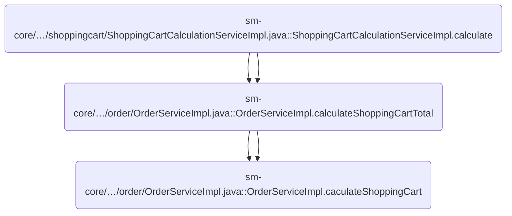
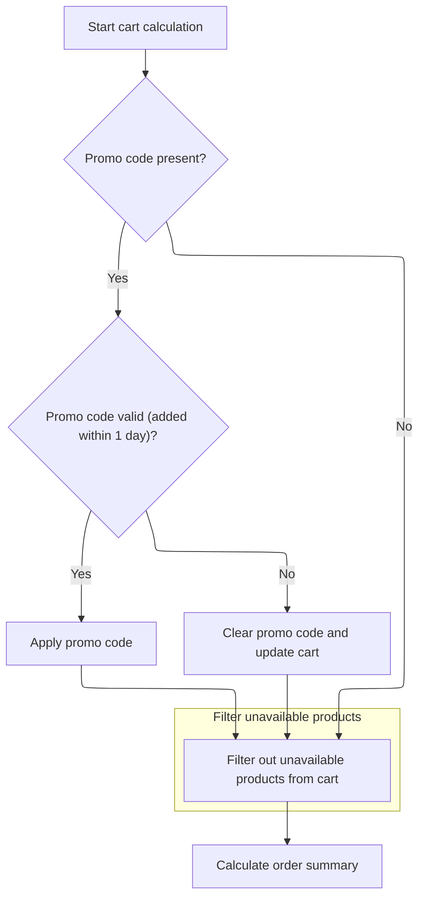

This document describes how shopping cart data is prepared for order calculation during checkout. The flow validates promo codes, removes expired codes, and filters out unavailable products, resulting in an order summary ready for final calculation.

# Where is this flow used?

This flow is used multiple times in the codebase as represented in the following diagram:



# Preparing Cart Data for Order Calculation



This section prepares the shopping cart data for order calculation by validating promo codes, removing expired codes, filtering out unavailable products, and assembling a cleaned order summary.

| Category        | Rule Name                     | Description                                                                                                                               |
| --------------- | ----------------------------- | ----------------------------------------------------------------------------------------------------------------------------------------- |
| Data validation | Promo code validity window    | If a promo code is present in the shopping cart, it must have been added within the last 1 day to be considered valid for the order.      |
| Data validation | Unavailable product exclusion | Only products marked as available are included in the order summary; unavailable products are filtered out and excluded from calculation. |
| Business logic  | Expired promo code removal    | If the promo code is expired (added more than 1 day ago), it must be cleared from the cart and not applied to the order.                  |
| Business logic  | Order summary preparation     | The cleaned order summary, containing only available products and a valid promo code, is passed to the order calculation process.         |

<SwmSnippet path="/sm-core/src/main/java/com/salesmanager/core/business/services/order/OrderServiceImpl.java" line="430">

---

CaculateShoppingCart validates the promo code's age, removes expired codes, filters out unavailable products, and hands off the cleaned order summary to <SwmToken path="sm-core/src/main/java/com/salesmanager/core/business/services/order/OrderServiceImpl.java" pos="461:3:3" line-data="    	return caculateOrder(orderSummary, customer, store, language);">`caculateOrder`</SwmToken> for the final calculation.

```java
    private OrderTotalSummary caculateShoppingCart( ShoppingCart shoppingCart, final Customer customer, final MerchantStore store, final Language language) throws Exception {


    	OrderSummary orderSummary = new OrderSummary();
    	orderSummary.setOrderSummaryType(OrderSummaryType.SHOPPINGCART);

    	if(!StringUtils.isBlank(shoppingCart.getPromoCode())) {
    		Date promoDateAdded = shoppingCart.getPromoAdded();//promo valid 1 day
    		if(promoDateAdded == null) {
    			promoDateAdded = new Date();
    		}
    		Instant instant = promoDateAdded.toInstant();
    		ZonedDateTime zdt = instant.atZone(ZoneId.systemDefault());
    		LocalDate date = zdt.toLocalDate();
    		//date added < date + 1 day
    		LocalDate tomorrow = LocalDate.now().plusDays(1);
    		if(date.isBefore(tomorrow)) {
    			orderSummary.setPromoCode(shoppingCart.getPromoCode());
    		} else {
    			//clear promo
    			shoppingCart.setPromoCode(null);
    			shoppingCartService.saveOrUpdate(shoppingCart);
    		}
    	}

    	List<ShoppingCartItem> itemList = new ArrayList<ShoppingCartItem>(shoppingCart.getLineItems());
    	//filter out unavailable
    	itemList = itemList.stream().filter(p -> p.getProduct().isAvailable()).collect(Collectors.toList());
    	orderSummary.setProducts(itemList);


    	return caculateOrder(orderSummary, customer, store, language);

    }
```

---

</SwmSnippet>

&nbsp;

*This is an auto-generated document by Swimm 🌊 and has not yet been verified by a human*

<SwmMeta version="3.0.0" repo-id="Z2l0aHViJTNBJTNBc2hvcGl6ZXIlM0ElM0FTd2ltbS1EZW1v" repo-name="shopizer"><sup>Powered by [Swimm](https://app.swimm.io/)</sup></SwmMeta>
