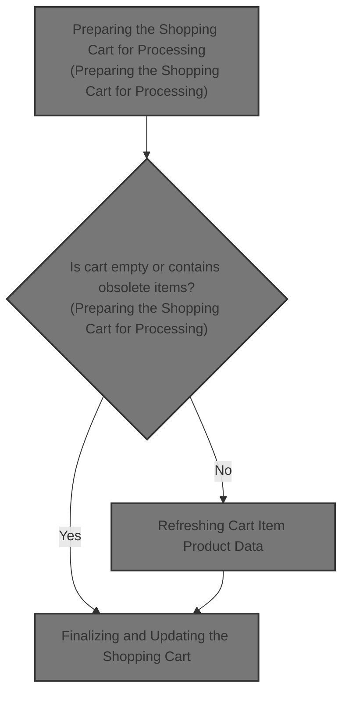
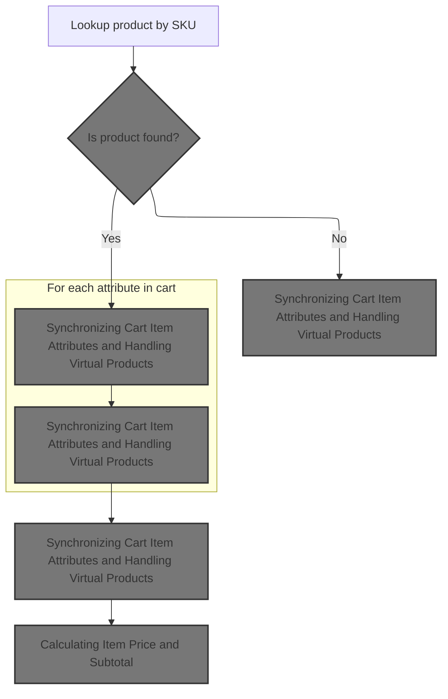
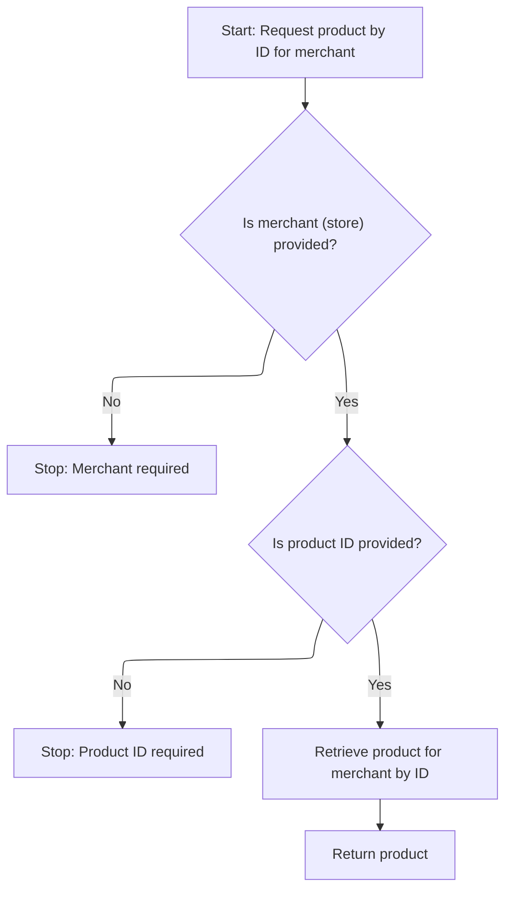
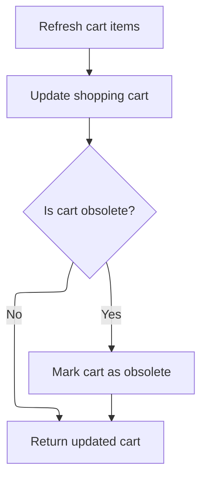

This document describes how the shopping cart is prepared for processing by validating its contents, refreshing each item's product data, and updating attributes to match the latest catalog. As part of the shopping cart management system, this flow ensures that users' carts reflect current product availability and pricing. The process receives a shopping cart and merchant store context as input, and outputs an updated cart with refreshed items, recalculated prices, and obsolete items removed.



# Where is this flow used?

This flow is used multiple times in the codebase as represented in the following diagram:

(Note - these are only some of the entry points of this flow)

```mermaid
graph TD;
      c0a99e606e09d952469eec1b4d687e4a7ab5eb8c82c335146cb683c826867f53(sm-shop/…/facade/ShoppingCartFacadeImpl.java::ShoppingCartFacadeImpl.addToCart) --> 3bc8c018566777045a66be72b39327410a131476d2cbebc79ee52c30579211a5(sm-core/…/shoppingcart/ShoppingCartServiceImpl.java::ShoppingCartServiceImpl.getShoppingCart)

3bc8c018566777045a66be72b39327410a131476d2cbebc79ee52c30579211a5(sm-core/…/shoppingcart/ShoppingCartServiceImpl.java::ShoppingCartServiceImpl.getShoppingCart) --> 6fffb0a079bd54ca9b6373138658858bfabd0850c47359cb75c791b69e3b3b4e(sm-core/…/shoppingcart/ShoppingCartServiceImpl.java::ShoppingCartServiceImpl.getPopulatedShoppingCart)

636e7002e9474508fa1947d31e270ce925f22c3025a6b7fb0ab030b10090a1e9(sm-shop/…/facade/ShoppingCartFacadeImpl.java::ShoppingCartFacadeImpl.getShoppingCartData) --> 3bc8c018566777045a66be72b39327410a131476d2cbebc79ee52c30579211a5(sm-core/…/shoppingcart/ShoppingCartServiceImpl.java::ShoppingCartServiceImpl.getShoppingCart)

8990376292224b4907884c9b59e03fc8c15aecd227b98968d70842ad5c60aa17(sm-shop/…/facade/ShoppingCartFacadeImpl.java::ShoppingCartFacadeImpl.get) --> 79de9e78e200b346ff92f301bfc6cfa8a863706c43bb001f03367efce8c7eda6(sm-shop/…/facade/CustomerFacadeImpl.java::CustomerFacadeImpl.mergeCart)

8990376292224b4907884c9b59e03fc8c15aecd227b98968d70842ad5c60aa17(sm-shop/…/facade/ShoppingCartFacadeImpl.java::ShoppingCartFacadeImpl.get) --> 3bc8c018566777045a66be72b39327410a131476d2cbebc79ee52c30579211a5(sm-core/…/shoppingcart/ShoppingCartServiceImpl.java::ShoppingCartServiceImpl.getShoppingCart)

79de9e78e200b346ff92f301bfc6cfa8a863706c43bb001f03367efce8c7eda6(sm-shop/…/facade/CustomerFacadeImpl.java::CustomerFacadeImpl.mergeCart) --> 3bc8c018566777045a66be72b39327410a131476d2cbebc79ee52c30579211a5(sm-core/…/shoppingcart/ShoppingCartServiceImpl.java::ShoppingCartServiceImpl.getShoppingCart)

793577fbd0a81f5f49feecccce7d9407f1ad055dad2dceba4ce00a69445b5e67(sm-shop/…/facade/ShoppingCartFacadeImpl.java::ShoppingCartFacadeImpl.deleteShoppingCart) --> 3e238d3dd6633ddfbab11fc223b25a5163aeb7837905884b564280d0cb1fb34a(sm-core/…/shoppingcart/ShoppingCartServiceImpl.java::ShoppingCartServiceImpl.deleteCart)

3e238d3dd6633ddfbab11fc223b25a5163aeb7837905884b564280d0cb1fb34a(sm-core/…/shoppingcart/ShoppingCartServiceImpl.java::ShoppingCartServiceImpl.deleteCart) --> d73ef36e9e78fc8fb642dcc5bd9550c4235da73e46882ba59c0b7ed53e4a53bf(sm-core/…/shoppingcart/ShoppingCartServiceImpl.java::ShoppingCartServiceImpl.getById)

d73ef36e9e78fc8fb642dcc5bd9550c4235da73e46882ba59c0b7ed53e4a53bf(sm-core/…/shoppingcart/ShoppingCartServiceImpl.java::ShoppingCartServiceImpl.getById) --> 6fffb0a079bd54ca9b6373138658858bfabd0850c47359cb75c791b69e3b3b4e(sm-core/…/shoppingcart/ShoppingCartServiceImpl.java::ShoppingCartServiceImpl.getPopulatedShoppingCart)

793577fbd0a81f5f49feecccce7d9407f1ad055dad2dceba4ce00a69445b5e67(sm-shop/…/facade/ShoppingCartFacadeImpl.java::ShoppingCartFacadeImpl.deleteShoppingCart) --> 3e238d3dd6633ddfbab11fc223b25a5163aeb7837905884b564280d0cb1fb34a(sm-core/…/shoppingcart/ShoppingCartServiceImpl.java::ShoppingCartServiceImpl.deleteCart)


classDef mainFlowStyle color:#000000,fill:#7CB9F4
classDef rootsStyle color:#000000,fill:#00FFF4
classDef Style1 color:#000000,fill:#00FFAA
classDef Style2 color:#000000,fill:#FFFF00
classDef Style3 color:#000000,fill:#AA7CB9

%% Swimm:
%% graph TD;
%%       c0a99e606e09d952469eec1b4d687e4a7ab5eb8c82c335146cb683c826867f53(<SwmPath>[sm-shop/…/facade/ShoppingCartFacadeImpl.java](sm-shop/src/main/java/com/salesmanager/shop/store/controller/shoppingCart/facade/ShoppingCartFacadeImpl.java)</SwmPath>::ShoppingCartFacadeImpl.addToCart) --> 3bc8c018566777045a66be72b39327410a131476d2cbebc79ee52c30579211a5(<SwmPath>[sm-core/…/shoppingcart/ShoppingCartServiceImpl.java](sm-core/src/main/java/com/salesmanager/core/business/services/shoppingcart/ShoppingCartServiceImpl.java)</SwmPath>::ShoppingCartServiceImpl.getShoppingCart)
%% 
%% 3bc8c018566777045a66be72b39327410a131476d2cbebc79ee52c30579211a5(<SwmPath>[sm-core/…/shoppingcart/ShoppingCartServiceImpl.java](sm-core/src/main/java/com/salesmanager/core/business/services/shoppingcart/ShoppingCartServiceImpl.java)</SwmPath>::ShoppingCartServiceImpl.getShoppingCart) --> 6fffb0a079bd54ca9b6373138658858bfabd0850c47359cb75c791b69e3b3b4e(<SwmPath>[sm-core/…/shoppingcart/ShoppingCartServiceImpl.java](sm-core/src/main/java/com/salesmanager/core/business/services/shoppingcart/ShoppingCartServiceImpl.java)</SwmPath>::ShoppingCartServiceImpl.getPopulatedShoppingCart)
%% 
%% 636e7002e9474508fa1947d31e270ce925f22c3025a6b7fb0ab030b10090a1e9(<SwmPath>[sm-shop/…/facade/ShoppingCartFacadeImpl.java](sm-shop/src/main/java/com/salesmanager/shop/store/controller/shoppingCart/facade/ShoppingCartFacadeImpl.java)</SwmPath>::ShoppingCartFacadeImpl.getShoppingCartData) --> 3bc8c018566777045a66be72b39327410a131476d2cbebc79ee52c30579211a5(<SwmPath>[sm-core/…/shoppingcart/ShoppingCartServiceImpl.java](sm-core/src/main/java/com/salesmanager/core/business/services/shoppingcart/ShoppingCartServiceImpl.java)</SwmPath>::ShoppingCartServiceImpl.getShoppingCart)
%% 
%% 8990376292224b4907884c9b59e03fc8c15aecd227b98968d70842ad5c60aa17(<SwmPath>[sm-shop/…/facade/ShoppingCartFacadeImpl.java](sm-shop/src/main/java/com/salesmanager/shop/store/controller/shoppingCart/facade/ShoppingCartFacadeImpl.java)</SwmPath>::ShoppingCartFacadeImpl.get) --> 79de9e78e200b346ff92f301bfc6cfa8a863706c43bb001f03367efce8c7eda6(<SwmPath>[sm-shop/…/facade/CustomerFacadeImpl.java](sm-shop/src/main/java/com/salesmanager/shop/store/controller/customer/facade/CustomerFacadeImpl.java)</SwmPath>::CustomerFacadeImpl.mergeCart)
%% 
%% 8990376292224b4907884c9b59e03fc8c15aecd227b98968d70842ad5c60aa17(<SwmPath>[sm-shop/…/facade/ShoppingCartFacadeImpl.java](sm-shop/src/main/java/com/salesmanager/shop/store/controller/shoppingCart/facade/ShoppingCartFacadeImpl.java)</SwmPath>::ShoppingCartFacadeImpl.get) --> 3bc8c018566777045a66be72b39327410a131476d2cbebc79ee52c30579211a5(<SwmPath>[sm-core/…/shoppingcart/ShoppingCartServiceImpl.java](sm-core/src/main/java/com/salesmanager/core/business/services/shoppingcart/ShoppingCartServiceImpl.java)</SwmPath>::ShoppingCartServiceImpl.getShoppingCart)
%% 
%% 79de9e78e200b346ff92f301bfc6cfa8a863706c43bb001f03367efce8c7eda6(<SwmPath>[sm-shop/…/facade/CustomerFacadeImpl.java](sm-shop/src/main/java/com/salesmanager/shop/store/controller/customer/facade/CustomerFacadeImpl.java)</SwmPath>::CustomerFacadeImpl.mergeCart) --> 3bc8c018566777045a66be72b39327410a131476d2cbebc79ee52c30579211a5(<SwmPath>[sm-core/…/shoppingcart/ShoppingCartServiceImpl.java](sm-core/src/main/java/com/salesmanager/core/business/services/shoppingcart/ShoppingCartServiceImpl.java)</SwmPath>::ShoppingCartServiceImpl.getShoppingCart)
%% 
%% 793577fbd0a81f5f49feecccce7d9407f1ad055dad2dceba4ce00a69445b5e67(<SwmPath>[sm-shop/…/facade/ShoppingCartFacadeImpl.java](sm-shop/src/main/java/com/salesmanager/shop/store/controller/shoppingCart/facade/ShoppingCartFacadeImpl.java)</SwmPath>::ShoppingCartFacadeImpl.deleteShoppingCart) --> 3e238d3dd6633ddfbab11fc223b25a5163aeb7837905884b564280d0cb1fb34a(<SwmPath>[sm-core/…/shoppingcart/ShoppingCartServiceImpl.java](sm-core/src/main/java/com/salesmanager/core/business/services/shoppingcart/ShoppingCartServiceImpl.java)</SwmPath>::ShoppingCartServiceImpl.deleteCart)
%% 
%% 3e238d3dd6633ddfbab11fc223b25a5163aeb7837905884b564280d0cb1fb34a(<SwmPath>[sm-core/…/shoppingcart/ShoppingCartServiceImpl.java](sm-core/src/main/java/com/salesmanager/core/business/services/shoppingcart/ShoppingCartServiceImpl.java)</SwmPath>::ShoppingCartServiceImpl.deleteCart) --> d73ef36e9e78fc8fb642dcc5bd9550c4235da73e46882ba59c0b7ed53e4a53bf(<SwmPath>[sm-core/…/shoppingcart/ShoppingCartServiceImpl.java](sm-core/src/main/java/com/salesmanager/core/business/services/shoppingcart/ShoppingCartServiceImpl.java)</SwmPath>::ShoppingCartServiceImpl.getById)
%% 
%% d73ef36e9e78fc8fb642dcc5bd9550c4235da73e46882ba59c0b7ed53e4a53bf(<SwmPath>[sm-core/…/shoppingcart/ShoppingCartServiceImpl.java](sm-core/src/main/java/com/salesmanager/core/business/services/shoppingcart/ShoppingCartServiceImpl.java)</SwmPath>::ShoppingCartServiceImpl.getById) --> 6fffb0a079bd54ca9b6373138658858bfabd0850c47359cb75c791b69e3b3b4e(<SwmPath>[sm-core/…/shoppingcart/ShoppingCartServiceImpl.java](sm-core/src/main/java/com/salesmanager/core/business/services/shoppingcart/ShoppingCartServiceImpl.java)</SwmPath>::ShoppingCartServiceImpl.getPopulatedShoppingCart)
%% 
%% 793577fbd0a81f5f49feecccce7d9407f1ad055dad2dceba4ce00a69445b5e67(<SwmPath>[sm-shop/…/facade/ShoppingCartFacadeImpl.java](sm-shop/src/main/java/com/salesmanager/shop/store/controller/shoppingCart/facade/ShoppingCartFacadeImpl.java)</SwmPath>::ShoppingCartFacadeImpl.deleteShoppingCart) --> 3e238d3dd6633ddfbab11fc223b25a5163aeb7837905884b564280d0cb1fb34a(<SwmPath>[sm-core/…/shoppingcart/ShoppingCartServiceImpl.java](sm-core/src/main/java/com/salesmanager/core/business/services/shoppingcart/ShoppingCartServiceImpl.java)</SwmPath>::ShoppingCartServiceImpl.deleteCart)
%% 
%% 
%% classDef mainFlowStyle color:#000000,fill:#7CB9F4
%% classDef rootsStyle color:#000000,fill:#00FFF4
%% classDef Style1 color:#000000,fill:#00FFAA
%% classDef Style2 color:#000000,fill:#FFFF00
%% classDef Style3 color:#000000,fill:#AA7CB9
```



# Preparing the Shopping Cart for Processing

This section ensures that the shopping cart is ready for processing by validating its contents and updating each item's product data to reflect the current catalog. The cart is marked obsolete if it contains no items or if any item is found to be obsolete.

| Category       | Rule Name                                | Description                                                                                                                                 |
| -------------- | ---------------------------------------- | ------------------------------------------------------------------------------------------------------------------------------------------- |
| Business logic | Empty cart obsolescence                  | If the shopping cart contains no items, the cart must be marked as obsolete and returned without further processing.                        |
| Business logic | Item data refresh                        | Each item in the shopping cart must be refreshed with the latest product data and attributes from the catalog before the cart is processed. |
| Business logic | Obsolete item triggers cart obsolescence | If any item in the shopping cart is found to be obsolete after refreshing its data, the cart must be marked as obsolete.                    |

<SwmSnippet path="/sm-core/src/main/java/com/salesmanager/core/business/services/shoppingcart/ShoppingCartServiceImpl.java" line="231">

---

In <SwmToken path="sm-core/src/main/java/com/salesmanager/core/business/services/shoppingcart/ShoppingCartServiceImpl.java" pos="231:5:5" line-data="	private ShoppingCart getPopulatedShoppingCart(final ShoppingCart shoppingCart, MerchantStore store) throws Exception {">`getPopulatedShoppingCart`</SwmToken>, we start by checking if the cart and its items are valid. If there are no items, the cart is marked obsolete and returned. For each item, we call <SwmToken path="sm-core/src/main/java/com/salesmanager/core/business/services/shoppingcart/ShoppingCartServiceImpl.java" pos="249:1:1" line-data="					getPopulatedItem(item, store);">`getPopulatedItem`</SwmToken> to refresh its product data and attributes, which is necessary to keep the cart consistent with the current catalog.

```java
	private ShoppingCart getPopulatedShoppingCart(final ShoppingCart shoppingCart, MerchantStore store) throws Exception {

		try {

			boolean cartIsObsolete = false;
			if (shoppingCart != null) {

				Set<ShoppingCartItem> items = shoppingCart.getLineItems();
				if (items == null || items.size() == 0) {
					shoppingCart.setObsolete(true);
					return shoppingCart;

				}

				// Set<ShoppingCartItem> shoppingCartItems = new
				// HashSet<ShoppingCartItem>();
				for (ShoppingCartItem item : items) {
					LOGGER.debug("Populate item " + item.getId());
					getPopulatedItem(item, store);
					LOGGER.debug("Obsolete item ? " + item.isObsolete());
					if (item.isObsolete()) {
						cartIsObsolete = true;
					}
				}

```

---

</SwmSnippet>

## Refreshing Cart Item Product Data



This section ensures that each item in the shopping cart accurately reflects the latest product data, removing obsolete items and updating valid ones with current attributes and pricing.

| Category       | Rule Name                           | Description                                                                                                                                                                      |
| -------------- | ----------------------------------- | -------------------------------------------------------------------------------------------------------------------------------------------------------------------------------- |
| Business logic | Obsolete Cart Item Removal          | If a product corresponding to a cart item's SKU cannot be found in the catalog, the cart item must be marked as obsolete and excluded from further processing.                   |
| Business logic | Cart Item Attribute Synchronization | For each cart item with a valid product, the cart item's attributes must be synchronized with the latest product data, including handling any changes to virtual product status. |
| Business logic | Cart Item Price Recalculation       | After synchronizing attributes, the cart item's price and subtotal must be recalculated based on the current product pricing and selected attributes.                            |

<SwmSnippet path="/sm-core/src/main/java/com/salesmanager/core/business/services/shoppingcart/ShoppingCartServiceImpl.java" line="293">

---

We look up the product by SKU, and if it's missing, we mark the cart item obsolete and stop processing it.

```java
	private void getPopulatedItem(final ShoppingCartItem item, MerchantStore store) throws Exception {

		Product product = productService.getBySku(item.getSku(), store, store.getDefaultLanguage());

```

---

</SwmSnippet>

### Resolving Product Entity from SKU

This section is responsible for resolving a Product entity based on a given SKU, ensuring that the product exists for the merchant, and handling any errors if the product cannot be found.

| Category        | Rule Name                     | Description                                                                                                                |
| --------------- | ----------------------------- | -------------------------------------------------------------------------------------------------------------------------- |
| Data validation | SKU existence validation      | If no product is found for the given SKU and merchant, an error must be raised indicating the product cannot be retrieved. |
| Business logic  | Primary product selection     | The Product entity returned must correspond to the first product ID found for the given SKU and merchant combination.      |
| Business logic  | Product option set resolution | The resolved Product entity must include all associated option sets relevant to the merchant and language context.         |

<SwmSnippet path="/sm-core/src/main/java/com/salesmanager/core/business/services/catalog/product/ProductServiceImpl.java" line="374">

---

<SwmToken path="sm-core/src/main/java/com/salesmanager/core/business/services/catalog/product/ProductServiceImpl.java" pos="374:5:5" line-data="	public Product getBySku(String productCode, MerchantStore merchant, Language language) throws ServiceException {">`getBySku`</SwmToken> grabs a list from the repository, expects the first element to be a product ID, and then fetches the full Product entity. Next, we need to resolve product option sets, which requires calling the option set service.

```java
	public Product getBySku(String productCode, MerchantStore merchant, Language language) throws ServiceException {

		try {
			List<Object> products = productRepository.findBySku(productCode, merchant.getId());
			if(products.isEmpty()) {
				throw new ServiceException("Cannot get product with sku [" + productCode + "]");
			}
			BigInteger id = (BigInteger) products.get(0);
			return productRepository.getById(id.longValue(), merchant, language);
		} catch (Exception e) {
			throw new ServiceException("Cannot get product with sku [" + productCode + "]", e);
		}
		


	}
```

---

</SwmSnippet>

### Fetching Product Option Set

This section governs the retrieval of a product option set for a specific store and language, ensuring that the correct option set is fetched for catalog operations and attribute resolution.

| Category        | Rule Name                  | Description                                                                                                                     |
| --------------- | -------------------------- | ------------------------------------------------------------------------------------------------------------------------------- |
| Data validation | Valid Option Set Retrieval | A product option set must be fetched only if the provided store, option set ID, and language are valid and exist in the system. |
| Data validation | Exact Match Requirement    | The product option set returned must correspond exactly to the store, option set ID, and language provided in the request.      |
| Business logic  | Single Result Guarantee    | Only one product option set should be returned for a given combination of store, option set ID, and language.                   |

<SwmSnippet path="/sm-core/src/main/java/com/salesmanager/core/business/services/catalog/product/attribute/ProductOptionSetServiceImpl.java" line="39">

---

<SwmToken path="sm-core/src/main/java/com/salesmanager/core/business/services/catalog/product/attribute/ProductOptionSetServiceImpl.java" pos="39:5:5" line-data="	public ProductOptionSet getById(MerchantStore store, Long optionSetId, Language lang) {">`getById`</SwmToken> fetches the product option set from the repository using store, option set ID, and language. Next, we need to get the full product entity for further attribute resolution.

```java
	public ProductOptionSet getById(MerchantStore store, Long optionSetId, Language lang) {
		return productOptionSetRepository.findOne(store.getId(), optionSetId, lang.getId());
	}
```

---

</SwmSnippet>

### Resolving Product and Option Values



This section ensures that when a product is requested for a merchant, all necessary validations are performed, and the product is returned with its associated option values for attributes, enabling accurate cart item representation.

| Category        | Rule Name              | Description                                                                                                                          |
| --------------- | ---------------------- | ------------------------------------------------------------------------------------------------------------------------------------ |
| Data validation | Merchant Required      | A merchant (store) must be specified when requesting a product. If no merchant is provided, the request is rejected.                 |
| Data validation | Product ID Required    | A product ID must be specified when requesting a product. If no product ID is provided, the request is rejected.                     |
| Business logic  | Merchant Product Scope | Only products associated with the specified merchant are returned. Products from other merchants are not accessible in the response. |
| Business logic  | Option Value Inclusion | Option values for product attributes must be fetched and included in the product data to support accurate cart item representation.  |

<SwmSnippet path="/sm-core/src/main/java/com/salesmanager/core/business/services/catalog/product/ProductServiceImpl.java" line="339">

---

<SwmToken path="sm-core/src/main/java/com/salesmanager/core/business/services/catalog/product/ProductServiceImpl.java" pos="339:5:5" line-data="	public Product findOne(Long id, MerchantStore merchant) {">`findOne`</SwmToken> gets the product entity by ID and merchant. Next, we need to fetch option values for product attributes to complete the cart item data.

```java
	public Product findOne(Long id, MerchantStore merchant) {
		Validate.notNull(merchant, "MerchantStore must not be null");
		Validate.notNull(id, "id must not be null");
		return productRepository.getById(id, merchant);
	}
```

---

</SwmSnippet>

<SwmSnippet path="/sm-core/src/main/java/com/salesmanager/core/business/services/catalog/product/attribute/ProductOptionValueServiceImpl.java" line="109">

---

We fetch the option value for a product attribute, then continue processing the product.

```java
	public ProductOptionValue getById(MerchantStore store, Long optionValueId) {
		return productOptionValueRepository.findOne(store.getId(), optionValueId);
	}
```

---

</SwmSnippet>

### Synchronizing Cart Item Attributes and Handling Virtual Products

```mermaid
%%{init: {"flowchart": {"defaultRenderer": "elk"}} }%%
flowchart TD
  node1{"Is product available?"}
  node1 -->|"No"| node2["Mark item as obsolete and exit"]
  click node1 openCode "sm-core/src/main/java/com/salesmanager/core/business/services/shoppingcart/ShoppingCartServiceImpl.java:297:300"
  click node2 openCode "sm-core/src/main/java/com/salesmanager/core/business/services/shoppingcart/ShoppingCartServiceImpl.java:298:299"
  node1 -->|"Yes"| node3["Set product info on item"]
  click node3 openCode "sm-core/src/main/java/com/salesmanager/core/business/services/shoppingcart/ShoppingCartServiceImpl.java:302:303"
  node3 --> node4{"Is product virtual?"}
  click node4 openCode "sm-core/src/main/java/com/salesmanager/core/business/services/shoppingcart/ShoppingCartServiceImpl.java:305:307"
  node4 -->|"Yes"| node5["Mark item as virtual"]
  click node5 openCode "sm-core/src/main/java/com/salesmanager/core/business/services/shoppingcart/ShoppingCartServiceImpl.java:306:307"
  node4 -->|"No"| node6["Proceed"]
  node5 --> node6
  node6 --> node7{"Are there cart or product attributes?"}
  click node7 openCode "sm-core/src/main/java/com/salesmanager/core/business/services/shoppingcart/ShoppingCartServiceImpl.java:309:316"
  node7 -->|"No"| node12["Done"]
  node7 -->|"Yes"| node8["Sync attributes"]
  
  subgraph loop1["For each attribute in cart"]
    node8 --> node9{"Does attribute match a product attribute?"}
    click node9 openCode "sm-core/src/main/java/com/salesmanager/core/business/services/shoppingcart/ShoppingCartServiceImpl.java:318:329"
    node9 -->|"Yes"| node10["Link attribute to product"]
    click node10 openCode "sm-core/src/main/java/com/salesmanager/core/business/services/shoppingcart/ShoppingCartServiceImpl.java:324:326"
    node9 -->|"No"| node11["Mark attribute for removal"]
    click node11 openCode "sm-core/src/main/java/com/salesmanager/core/business/services/shoppingcart/ShoppingCartServiceImpl.java:331:333"
  end
  node8 --> node13{"Are there orphaned attributes to remove?"}
  click node13 openCode "sm-core/src/main/java/com/salesmanager/core/business/services/shoppingcart/ShoppingCartServiceImpl.java:340:344"
  node13 -->|"No"| node12["Done"]
  node13 -->|"Yes"| node14["Remove orphaned attributes"]
  
  subgraph loop2["For each orphaned attribute"]
    node14 --> node15["Remove attribute from cart"]
    click node15 openCode "sm-core/src/main/java/com/salesmanager/core/business/services/shoppingcart/ShoppingCartServiceImpl.java:342:343"
  end
  node14 --> node12["Done"]
  click node12 openCode "sm-core/src/main/java/com/salesmanager/core/business/services/shoppingcart/ShoppingCartServiceImpl.java:344:344"

classDef HeadingStyle fill:#777777,stroke:#333,stroke-width:2px;

%% Swimm:
%% %%{init: {"flowchart": {"defaultRenderer": "elk"}} }%%
%% flowchart TD
%%   node1{"Is product available?"}
%%   node1 -->|"No"| node2["Mark item as obsolete and exit"]
%%   click node1 openCode "<SwmPath>[sm-core/…/shoppingcart/ShoppingCartServiceImpl.java](sm-core/src/main/java/com/salesmanager/core/business/services/shoppingcart/ShoppingCartServiceImpl.java)</SwmPath>:297:300"
%%   click node2 openCode "<SwmPath>[sm-core/…/shoppingcart/ShoppingCartServiceImpl.java](sm-core/src/main/java/com/salesmanager/core/business/services/shoppingcart/ShoppingCartServiceImpl.java)</SwmPath>:298:299"
%%   node1 -->|"Yes"| node3["Set product info on item"]
%%   click node3 openCode "<SwmPath>[sm-core/…/shoppingcart/ShoppingCartServiceImpl.java](sm-core/src/main/java/com/salesmanager/core/business/services/shoppingcart/ShoppingCartServiceImpl.java)</SwmPath>:302:303"
%%   node3 --> node4{"Is product virtual?"}
%%   click node4 openCode "<SwmPath>[sm-core/…/shoppingcart/ShoppingCartServiceImpl.java](sm-core/src/main/java/com/salesmanager/core/business/services/shoppingcart/ShoppingCartServiceImpl.java)</SwmPath>:305:307"
%%   node4 -->|"Yes"| node5["Mark item as virtual"]
%%   click node5 openCode "<SwmPath>[sm-core/…/shoppingcart/ShoppingCartServiceImpl.java](sm-core/src/main/java/com/salesmanager/core/business/services/shoppingcart/ShoppingCartServiceImpl.java)</SwmPath>:306:307"
%%   node4 -->|"No"| node6["Proceed"]
%%   node5 --> node6
%%   node6 --> node7{"Are there cart or product attributes?"}
%%   click node7 openCode "<SwmPath>[sm-core/…/shoppingcart/ShoppingCartServiceImpl.java](sm-core/src/main/java/com/salesmanager/core/business/services/shoppingcart/ShoppingCartServiceImpl.java)</SwmPath>:309:316"
%%   node7 -->|"No"| node12["Done"]
%%   node7 -->|"Yes"| node8["Sync attributes"]
%%   
%%   subgraph loop1["For each attribute in cart"]
%%     node8 --> node9{"Does attribute match a product attribute?"}
%%     click node9 openCode "<SwmPath>[sm-core/…/shoppingcart/ShoppingCartServiceImpl.java](sm-core/src/main/java/com/salesmanager/core/business/services/shoppingcart/ShoppingCartServiceImpl.java)</SwmPath>:318:329"
%%     node9 -->|"Yes"| node10["Link attribute to product"]
%%     click node10 openCode "<SwmPath>[sm-core/…/shoppingcart/ShoppingCartServiceImpl.java](sm-core/src/main/java/com/salesmanager/core/business/services/shoppingcart/ShoppingCartServiceImpl.java)</SwmPath>:324:326"
%%     node9 -->|"No"| node11["Mark attribute for removal"]
%%     click node11 openCode "<SwmPath>[sm-core/…/shoppingcart/ShoppingCartServiceImpl.java](sm-core/src/main/java/com/salesmanager/core/business/services/shoppingcart/ShoppingCartServiceImpl.java)</SwmPath>:331:333"
%%   end
%%   node8 --> node13{"Are there orphaned attributes to remove?"}
%%   click node13 openCode "<SwmPath>[sm-core/…/shoppingcart/ShoppingCartServiceImpl.java](sm-core/src/main/java/com/salesmanager/core/business/services/shoppingcart/ShoppingCartServiceImpl.java)</SwmPath>:340:344"
%%   node13 -->|"No"| node12["Done"]
%%   node13 -->|"Yes"| node14["Remove orphaned attributes"]
%%   
%%   subgraph loop2["For each orphaned attribute"]
%%     node14 --> node15["Remove attribute from cart"]
%%     click node15 openCode "<SwmPath>[sm-core/…/shoppingcart/ShoppingCartServiceImpl.java](sm-core/src/main/java/com/salesmanager/core/business/services/shoppingcart/ShoppingCartServiceImpl.java)</SwmPath>:342:343"
%%   end
%%   node14 --> node12["Done"]
%%   click node12 openCode "<SwmPath>[sm-core/…/shoppingcart/ShoppingCartServiceImpl.java](sm-core/src/main/java/com/salesmanager/core/business/services/shoppingcart/ShoppingCartServiceImpl.java)</SwmPath>:344:344"
%% 
%% classDef HeadingStyle fill:#777777,stroke:#333,stroke-width:2px;
```



<SwmSnippet path="/sm-core/src/main/java/com/salesmanager/core/business/services/shoppingcart/ShoppingCartServiceImpl.java" line="297">

---

Back in <SwmToken path="sm-core/src/main/java/com/salesmanager/core/business/services/shoppingcart/ShoppingCartServiceImpl.java" pos="249:1:1" line-data="					getPopulatedItem(item, store);">`getPopulatedItem`</SwmToken>, after fetching the product, we update the cart item with the product data and SKU. If the product is virtual, we flag the item as virtual. Then, we sync the cart item's attributes with the product's attributes, building lists of valid and orphaned attributes for cleanup.

```java
		if (product == null) {
			item.setObsolete(true);
			return;
		}

		item.setProduct(product);
		item.setSku(product.getSku());

		if (product.isProductVirtual()) {
			item.setProductVirtual(true);
		}

		Set<ShoppingCartAttributeItem> cartAttributes = item.getAttributes();
		Set<ProductAttribute> productAttributes = product.getAttributes();
		List<ProductAttribute> attributesList = new ArrayList<ProductAttribute>();// attributes maintained
		List<ShoppingCartAttributeItem> removeAttributesList = new ArrayList<ShoppingCartAttributeItem>();// attributes
																											// to remove
		// DELETE ORPHEANS MANUALLY
		if ((productAttributes != null && productAttributes.size() > 0)
				|| (cartAttributes != null && cartAttributes.size() > 0)) {
			if (cartAttributes != null) {
				for (ShoppingCartAttributeItem attribute : cartAttributes) {
					long attributeId = attribute.getProductAttributeId();
					boolean existingAttribute = false;
					for (ProductAttribute productAttribute : productAttributes) {

						if (productAttribute.getId().equals(attributeId)) {
							attribute.setProductAttribute(productAttribute);
							attributesList.add(productAttribute);
							existingAttribute = true;
							break;
						}
					}

					if (!existingAttribute) {
						removeAttributesList.add(attribute);
					}

				}
```

---

</SwmSnippet>

<SwmSnippet path="/sm-core/src/main/java/com/salesmanager/core/business/services/shoppingcart/ShoppingCartServiceImpl.java" line="339">

---

Here we loop through the orphan attribute list and delete each one from the repository. This keeps the cart item attributes in sync with the product definition before moving on to tax calculations.

```java
		// cleanup orphean item
		if (CollectionUtils.isNotEmpty(removeAttributesList)) {
			for (ShoppingCartAttributeItem attr : removeAttributesList) {
				shoppingCartAttributeItemRepository.delete(attr);
			}
		}

```

---

</SwmSnippet>

### Cleaning Up Tax Class References

The main product role of this section is to maintain data integrity and system clarity by ensuring that only current and necessary tax class references exist within the platform. This helps prevent errors and confusion related to tax calculations and management.

| Category        | Rule Name                            | Description                                                                                                                                              |
| --------------- | ------------------------------------ | -------------------------------------------------------------------------------------------------------------------------------------------------------- |
| Data validation | Preserve active tax class references | Any tax class reference that is linked to active products, orders, or catalog entries must be preserved to avoid disrupting ongoing business operations. |

See <SwmLink doc-title="Removing a Tax Class">[Removing a Tax Class](/.swm/removing-a-tax-class.ajgx2a4u.sw.md)</SwmLink>

### Calculating Item Price and Subtotal

<SwmSnippet path="/sm-core/src/main/java/com/salesmanager/core/business/services/shoppingcart/ShoppingCartServiceImpl.java" line="346">

---

Back in <SwmToken path="sm-core/src/main/java/com/salesmanager/core/business/services/shoppingcart/ShoppingCartServiceImpl.java" pos="249:1:1" line-data="					getPopulatedItem(item, store);">`getPopulatedItem`</SwmToken>, after cleaning up attributes and handling taxes, we calculate the final price using the pricing service and set the subtotal based on item quantity.

```java
		// cleanup detached attributes
		if (CollectionUtils.isEmpty(attributesList)) {
			item.setAttributes(null);
		}

		// set item price
		FinalPrice price = pricingService.calculateProductPrice(product, attributesList);
		item.setItemPrice(price.getFinalPrice());
		item.setFinalPrice(price);

		BigDecimal subTotal = item.getItemPrice().multiply(new BigDecimal(item.getQuantity()));
		item.setSubTotal(subTotal);

	}
```

---

</SwmSnippet>

## Finalizing and Updating the Shopping Cart



<SwmSnippet path="/sm-core/src/main/java/com/salesmanager/core/business/services/shoppingcart/ShoppingCartServiceImpl.java" line="256">

---

We update the cart with refreshed items and mark it obsolete if needed after processing all items.

```java
				Set<ShoppingCartItem> refreshedItems = new HashSet<>(items);

				shoppingCart.setLineItems(refreshedItems);
				update(shoppingCart);

				if (cartIsObsolete) {
					shoppingCart.setObsolete(true);
				}
				return shoppingCart;
			}

		} catch (Exception e) {
			LOGGER.error(e.getMessage());
			throw new ServiceException(e);
		}

		return shoppingCart;

	}
```

---

</SwmSnippet>

&nbsp;

*This is an auto-generated document by Swimm 🌊 and has not yet been verified by a human*

<SwmMeta version="3.0.0" repo-id="Z2l0aHViJTNBJTNBc2hvcGl6ZXIlM0ElM0FTd2ltbS1EZW1v" repo-name="shopizer"><sup>Powered by [Swimm](https://app.swimm.io/)</sup></SwmMeta>
